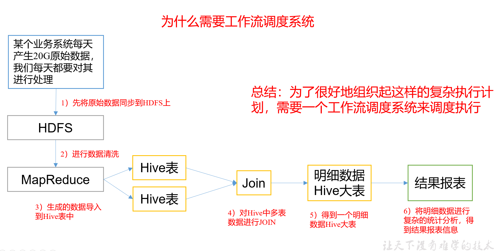
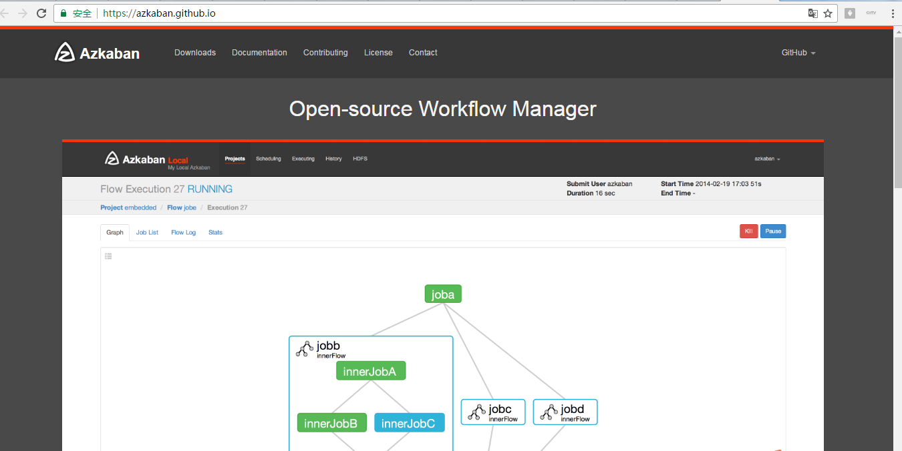
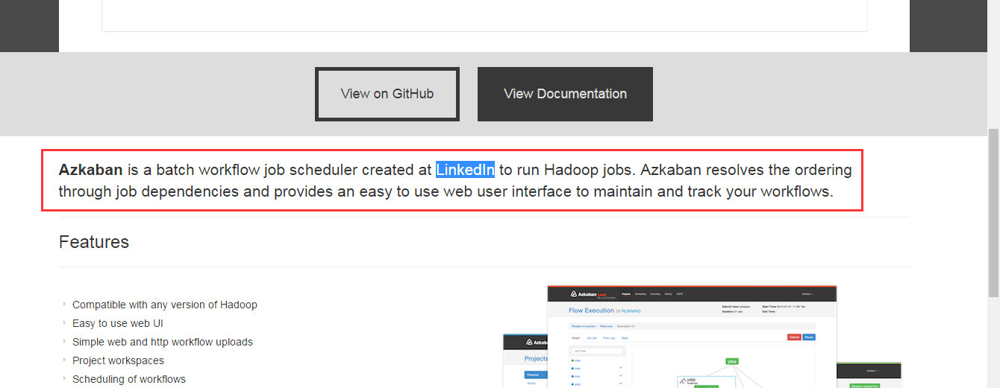
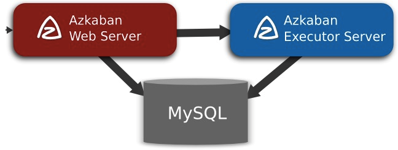

# azkaban概述
## 一、为什么需要工作流调度系统
* 1、一个完整的数据分析系统通常都是由大量任务单元组成： shell 脚本程序，java 程序，mapreduce 程序、hive 脚本等  
* 2、各任务单元之间存在时间先后及前后依赖关系  
* 3、为了很好地组织起这样的复杂执行计划，需要一个工作流调度系统来调度执行  

例如，我们可能有这样一个需求，某个业务系统每天产生 20G 原始数据，我们每天都要对其进行处理，处理步骤如下所示：

1. 通过 Hadoop 先将原始数据同步到 HDFS 上（HDFS的操作）；  
2. 借助 MapReduce 计算框架对原始数据进行清洗转换，生成的数据以分区表的形式存储 到多张 Hive 表中（MapReduce的操作,hive的导入操作）；  
3. 需要对 Hive 中多个表的数据进行 JOIN 处理，得到一个明细数据 Hive 大表（创建中间表）；  
4. 将明细数据进行各种统计分析，得到结果报表信息（hive的查询操作）；  
5. 需要将统计分析得到的结果数据同步到业务系统中，供业务调用使用（hive的查询操作）。  

## 二、工作流调度实现方式

1）简单的任务调度：直接使用 linux 的 crontab 来定义。
2）复杂的任务调度：开发调度平台或使用现成的开源调度系统，比如 Ooize、Azkaban、Cascading、Hamake 等。

## 三、常见工作流调度系统
市面上目前有许多工作流调度器 在 hadoop 领域，常见的工作流调度器有 Oozie, Azkaban,Cascading,Hamake 等

## 四、各种调度工具对比
下面的表格对上述四种 hadoop 工作流调度器的关键特性进行了比较，尽管这些工作流调度 器能够解决的需求场景基本一致，但在设计理念，目标用户，应用场景等方面还是存在显著 的区别，在做技术选型的时候，可以提供参考

| 特性               | Hamake               | Oozie                 | Azkaban                            | Cascading |
| ------------------ | -------------------- | --------------------- | ---------------------------------- | --------- |
| 工作流描述语言     | XML                  | **XML (xPDL based)**  | **text file with key/value pairs** | Java API  |
| 依赖机制           | data-driven          | **explicit**          | **explicit**                       | explicit  |
| 是否要web容器      | NO                   | **YES**               | **YES**                            | NO        |
| 进度跟踪           | console/log messages | **web page**          | **web page**                       | Java API  |
| Hadoop job调度支持 | no                   | **YES**               | **YES**                            | YES       |
| 运行模式           | command line utility | **daemon**            | **daemon**                         | API       |
| Pig支持            | yes                  | **yes**               | **yes**                            | yes       |
| 事件通知           | no                   | **no**                | **no**                             | yes       |
| 需要安装           | no                   | **yes**               | **yes**                            | no        |
| 支持的hadoop版本   | 0.18+                | **0.20+**             | **currently unknown**              | 0.18+     |
| 重试支持           | no                   | **workflownode evel** | **yes**                            | yes       |
| 运行任意命令       | yes                  | **yes**               | **yes**                            | yes       |
| Amazon EMR支持     | yes                  | **no**                | **currently unknown**              | yes       |

## 五、Azkaban 与 Oozie 对比
| 特性               | Oozie             | Azkaban                        |
| ------------------ | ----------------- | ------------------------------ |
| 工作流描述语言     | XML               | text file with key/value pairs |
| 是否要web容器      | Yes               | Yes                            |
| 进度跟踪           | web page          | web page                       |
| Hadoop job调度支持 | yes               | yes                            |
| 运行模式           | daemon            | daemon                         |
| 事件通知           | no                | Yes                            |
| 需要安装           | yes               | yes                            |
| 支持的hadoop版本   | 0.20+             | currently unknown              |
| 重试支持           | workflownode evel | yes                            |
| 运行任意命令       | yes               | yes                            |

对市面上最流行的两种调度器，给出以下详细对比，以供技术选型参考。总体来说，ooize相比azkaban是一个重量级的任务调度系统，功能全面，但配置使用也更复杂。如果可以不在意某些功能的缺失，轻量级调度器azkaban是很不错的候选对象。 
详情如下：

**功能**  
两者均可以调度mapreduce,pig,java,脚本工作流任务
两者均可以定时执行工作流任务

**工作流定义**  
Azkaban使用Properties文件定义工作流
Oozie使用XML文件定义工作流

**工作流传参**  
Azkaban支持直接传参，例如${input}
Oozie支持参数和EL表达式，例如${fs:dirSize(myInputDir)}

**定时执行**  
Azkaban的定时执行任务是基于时间的
Oozie的定时执行任务基于时间和输入数据

**资源管理**  
Azkaban有较严格的权限控制，如用户对工作流进行读/写/执行等操作
Oozie暂无严格的权限控制

**工作流执行**  
Azkaban有两种运行模式，分别是solo server mode(executor server和web server部署在同一台节点)和multi server mode(executor server和web server可以部署在不同节点)
Oozie作为工作流服务器运行，支持多用户和多工作流

**工作流管理**  
Azkaban支持浏览器以及ajax方式操作工作流
Oozie支持命令行、HTTP REST、Java API、浏览器操作工作流

## 六、Azkaban 介绍
Azkaban是由Linkedin公司推出的一个批量工作流任务调度器，主要用于在一个工作流内以一个特定的顺序运行一组工作和流程，它的配置是通过简单的key:value对的方式，通过配置中的dependencies 来设置依赖关系。Azkaban使用job配置文件建立任务之间的依赖关系，并提供一个易于使用的web用户界面维护和跟踪你的工作流。

* Azkaban是一套简单的任务调度服务，整体包括三部分webserver、dbserver、executorserver。  
* Azkaban是linkin的开源项目，开发语言为Java。  
* Azkaban是由Linkedin开源的一个批量工作流任务调度器。用于在一个工作流内以一个特定的顺序运行一组工作和流程。  
* Azkaban定义了一种KV文件格式来建立任务之间的依赖关系，并提供一个易于使用的web用户界面维护和跟踪你的工作流。  

它有如下功能特点： 
　　1、Web用户界面 
　　2、方便上传工作流 
　　3、方便设置任务之间的关系 
　　4、调度工作流 
　　5、认证/授权(权限的工作) 
　　6、能够杀死并重新启动工作流 
　　7、模块化和可插拔的插件机制 
　　8、项目工作区 
　　9、工作流和任务的日志记录和审计

下载地址：http://azkaban.github.io/downloads.html

## 七、Azkaban的适用场景
根据以上业务场景： （2）任务依赖（1）任务的结果，（3）任务依赖（2）任务的结果，（4）任务依赖（3）任务的结果，（5）任务依赖（4）任务的结果。一般的做法是，先执行完（1）再执行（2），再一次执行（3）（4）（5）。

这样的话，整个的执行过程都需要人工参加，并且得盯着各任务的进度。但是我们的很多任务都是在深更半夜执行的，通过写脚本设置crontab执行。其实，整个过程类似于一个有向无环图（DAG）。每个子任务相当于大任务中的一个节点，也就是，我们需要的就是一个工作流的调度器，而Azkaban就是能解决上述问题的一个调度器。

## 八、azkaban调度的任务有可能有那些类型
1、shell脚本

2、java程序

3、MR程序

4、spark程序

5、hive的sql

6、python脚本

7、sqoop任务

## 久、Azkaban典型使用场景
　　实际当中经常有这些场景：每天有一个大任务，这个大任务可以分成A,B,C,D四个小任务，A,B任务之间没有依赖关系，C任务依赖A,B任务的结果，D任务依赖C任务的结果。一般的做法是，开两个终端同时执行A,B，两个都执行完了再执行C，最后再执行D。这样的话，整个的执行过程都需要人工参加，并且得盯着各任务的进度。但是我们的很多任务都是在深更半夜执行的，通过写脚本设置crontab执行。其实，整个过程类似于一个有向无环图（DAG）。每个子任务相当于大任务中的一个流，任务的起点可以从没有度的节点开始执行，任何没有通路的节点之间可以同时执行，比如上述的A,B。总结起来的话，我们需要的就是一个工作流的调度器，而azkaban就是能解决上述问题的一个调度器。
## 十、Azkaban官网
https://azkaban.github.io/

### 十一、Azkaban的架构
Azkaban是一种类似于Oozie的工作流控制引擎，可以用来解决多个Hadoop（或Spark等）离线计算任务之间的依赖关系问题。也可以用其代替crontab来对周期性任务进行调度，并且更为直观，可靠，同时提供了美观的可视化管理界面。

Azkaban由三部分构成：

1、Relational Database(Mysql)
　　azkaban将大多数状态信息都存于MySQL中,Azkaban Web Server 和 Azkaban Executor Server也需要访问DB。
2、Azkaban Web Server
　　提供了Web UI，是azkaban的主要管理者，包括 project 的管理，认证，调度，对工作流执行过程的监控等。
3、Azkaban Executor Server
　　调度工作流和任务，纪录工作流活任务的日志，之所以将AzkabanWebServer和AzkabanExecutorServer分开，主要是因为在某个任务流失败后，可以更方便的将重新执行。而且也更有利于Azkaban系统的升级

MySQL实例：Azkaban使用MySQL来存储项目和执行。  
Azkaban Web服务器：Azkaban使用Jetty作为Web服务器，用作控制器以及提供Web界面  
Azkaban执行服务器：Azkaban执行服务器执行提交工作流。  

## Azkaban下载地址
下载地址:http://azkaban.github.io/downloads.html

