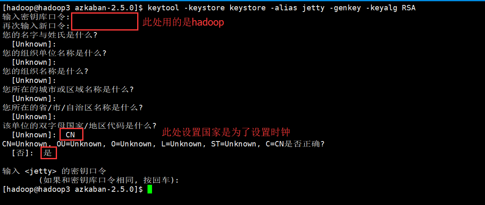
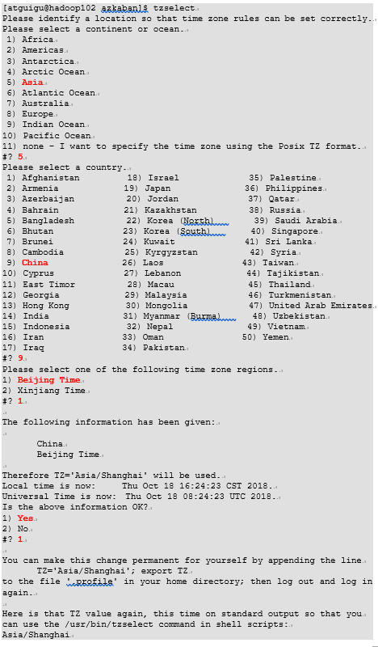
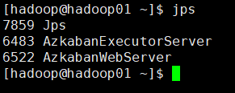
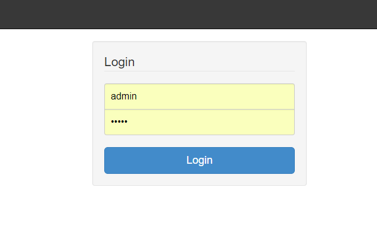
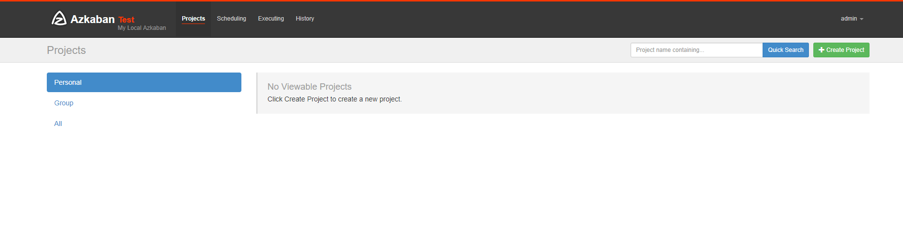
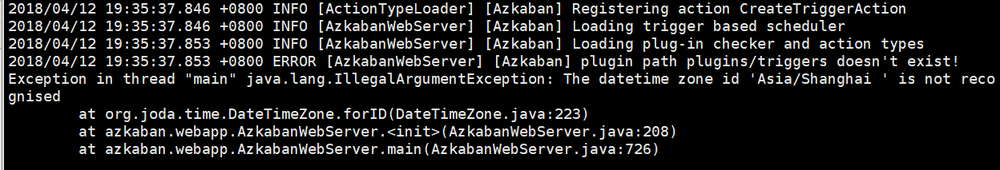

# azkaban的安装
## 一、安装前准备
### azkaban软件包准备
**软件**：  
Azkaban Web 服务器：azkaban-web-server-2.5.0.tar.gz  
Azkaban Excutor 执行服务器：azkaban-executor-server-2.5.0.tar.gz  
Azkaban 初始化sql脚本文件：azkaban-sql-script-2.5.0.tar.gz  

**软件下载**：
下载地址:http://azkaban.github.io/downloads.html

### Mysql安装
目前azkaban只支持 mysql,需安装mysql服务器,本文档中默认已安装好mysql服务器,并建立了 root用户,密码 123456.


## 二、安装部署
将安装文件上传到集群,最好上传到安装 hive、sqoop的机器上,方便命令的执行  
在当前用户目录下新建 azkabantools目录,用于存放源安装文件.新建azkaban目录,用于存放azkaban运行程序

### 1、安装
总的过程：

1)	在/opt/module/目录下创建azkaban目录
```
[atguigu@hadoop102 module]$ mkdir azkaban
```
2)	解压azkaban-web-server-2.5.0.tar.gz、azkaban-executor-server-2.5.0.tar.gz、azkaban-sql-script-2.5.0.tar.gz到/opt/module/azkaban目录下
```
[atguigu@hadoop102 software]$ tar -zxvf azkaban-web-server-2.5.0.tar.gz -C /opt/module/azkaban/
[atguigu@hadoop102 software]$ tar -zxvf azkaban-executor-server-2.5.0.tar.gz -C /opt/module/azkaban/
[atguigu@hadoop102 software]$ tar -zxvf azkaban-sql-script-2.5.0.tar.gz -C /opt/module/azkaban/
```
3)	对解压后的文件重新命名
```
[atguigu@hadoop102 azkaban]$ mv azkaban-web-2.5.0/ server
[atguigu@hadoop102 azkaban]$ mv azkaban-executor-2.5.0/ executor
```
4)	azkaban脚本导入
进入mysql，创建azkaban数据库，并将解压的脚本导入到azkaban数据库。
```
[atguigu@hadoop102 azkaban]$ mysql -uroot -p000000
mysql> create database azkaban;
mysql> use azkaban;
mysql> source /opt/module/azkaban/azkaban-2.5.0/create-all-sql-2.5.0.sql
```
注：source后跟.sql文件，用于批量处理.sql文件中的sql语句。


```shell
tar -zxvf azkaban-web-server-2.5.0.tar.gz -C ~/apps/azkaban
tar -zxvf azkaban-executor-server-2.5.0.tar.gz -C ~/apps/azkaban
tar -zxvf azkaban-sql-script-2.5.0.tar.gz -C ~/apps/azkaban

mv azkaban-web-2.5.0/ server
mv azkaban-executor-2.5.0/ executor
```
#### azkaban web服务器安装
```
解压azkaban-web-server-2.5.0.tar.gz
命令: tar –zxvf azkaban-web-server-2.5.0.tar.gz
将解压后的azkaban-web-server-2.5.0 移动到 azkaban目录中,并重新命名 server
命令: mv azkaban-web-server-2.5.0 ~/apps/azkaban
        cd ~/apps/azkaban
        mv azkaban-web-server-2.5.0  server
```

#### azkaban 执行服器安装
```
解压azkaban-executor-server-2.5.0.tar.gz
命令:tar –zxvf azkaban-executor-server-2.5.0.tar.gz
将解压后的azkaban-executor-server-2.5.0 移动到 azkaban目录中,并重新命名 executor
命令:mv azkaban-executor-server-2.5.0  ../azkaban
cd ../azkaban
mv azkaban-executor-server-2.5.0  executor
```

#### azkaban脚本导入
在MySQL中执行脚本create-all-sql-2.5.0.sql（在MySQL所在的服务器上执行）
```
解压: azkaban-sql-script-2.5.0.tar.gz
命令:tar –zxvf azkaban-sql-script-2.5.0.tar.gz
将解压后的mysql 脚本,导入到mysql中:
进入mysql
mysql> create database azkaban;
mysql> use azkaban;
Database changed
mysql> source /home/hadoop/apps/azkaban/azkaban-2.5.0/create-all-sql-2.5.0.sql;
```

<span style="color:#CC6666;font-weight:bold">注：source后跟.sql文件，用于批量处理.sql文件中的sql语句。</span>

### 2、创建SSL配置
Keytool是java数据证书的管理工具，使用户能够管理自己的公/私钥对及相关证书。

-keystore    指定密钥库的名称及位置(产生的各类信息将不在.keystore文件中)
-genkey      在用户主目录中创建一个默认文件".keystore" 
-alias  对我们生成的.keystore 进行指认别名；如果没有默认是mykey
-keyalg  指定密钥的算法 RSA/DSA 默认是DSA

#### 1）生成 keystore的密码及相应信息的密钥库
执行命令: keytool -keystore keystore -alias jetty -genkey -keyalg RSA
```
$ keytool -keystore keystore -alias jetty -genkey -keyalg RSA
```

下面除了设置密码意外一律空格即可，最后输入y。
```
输入密钥库口令:  
再次输入新口令: 
您的名字与姓氏是什么?
  [Unknown]:  
您的组织单位名称是什么?
  [Unknown]:  
您的组织名称是什么?
  [Unknown]:  
您所在的城市或区域名称是什么?
  [Unknown]:  
您所在的省/市/自治区名称是什么?
  [Unknown]:  
该单位的双字母国家/地区代码是什么?
  [Unknown]:  
CN=Unknown, OU=Unknown, O=Unknown, L=Unknown, ST=Unknown, C=Unknown是否正确?
  [否]:  y

输入 <jetty> 的密钥口令
        (如果和密钥库口令相同, 按回车):  
再次输入新口令:
```

注意：
密钥库的密码至少必须6个字符，可以是纯数字或者字母或者数字和字母的组合等等
密钥库的密码最好和`<jetty>` 的密钥相同，方便记忆

别人的配置，设置了国家，我暂时未设置：

#### 2）将keystore 拷贝到 azkaban web服务器根目录中
```
$ mv keystore server/
```

### 3、修改时区
注：先配置好服务器节点上的时区
1、先生成时区配置文件 Asia/Shanghai，用交互式命令 tzselect 即可
2、拷贝该时区文件，覆盖系统本地时区配置
···
sudo cp /usr/share/zoneinfo/Asia/Shanghai /etc/localtime
···

如果在/usr/share/zoneinfo/这个目录下不存在时区配置文件Asia/Shanghai，就要用 tzselect 生成。


### 4、配置文件
注意一下配置文件中的配置文件中的位置属性我配的都是相对位置，所以启动的时候只能在根目录下启动，若要在其他目录启动，请配置绝对路径。

#### 修改azkaban web 服务器配置
进入 azkaban web 服务器安装目录 conf 目录 
```
cd apps/azkaban/azkaban-web-2.5.0/conf/
```
修改 azkaban.properties 文件
```
vi azkaban.properties
```
我的配置文件：
```
#Azkaban Personalization Settings
azkaban.name=Test
azkaban.label=My Local Azkaban
azkaban.color=#FF3601
azkaban.default.servlet.path=/index
web.resource.dir=web/
default.timezone.id=Asia/Shanghai

#Azkaban UserManager class
user.manager.class=azkaban.user.XmlUserManager
user.manager.xml.file=conf/azkaban-users.xml

#Loader for projects
executor.global.properties=conf/global.properties
azkaban.project.dir=projects

database.type=mysql
mysql.port=3306
mysql.host=hadoop01
mysql.database=azkaban
mysql.user=root
mysql.password=123456
mysql.numconnections=100

# Velocity dev mode
velocity.dev.mode=false

# Azkaban Jetty server properties.
jetty.maxThreads=25
jetty.ssl.port=8443
jetty.port=8081
jetty.keystore=keystore
jetty.password=123456
jetty.keypassword=123456
jetty.truststore=keystore
jetty.trustpassword=123456

# Azkaban Executor settings
executor.port=12321

# mail settings
mail.sender=18638489474@163.com
mail.host=smtp.163.com
mail.user=lifengchao
mail.password=######
job.failure.email=18638489474@163.com
job.success.email=18638489474@163.com

lockdown.create.projects=false

cache.directory=cache
```

内容说明如下：
```
#Azkaban Personalization Settings
azkaban.name=Test                           #服务器UI名称，用于服务器上方显示的名字
azkaban.label=My Local Azkaban              #描述
azkaban.color=#FF3601                       #UI颜色
azkaban.default.servlet.path=/index         #
web.resource.dir=web/                       #默认根web目录
default.timezone.id=Asia/Shanghai           #默认时区,已改为亚洲/上海 默认为美国

#Azkaban UserManager class
user.manager.class=azkaban.user.XmlUserManager      #用户权限管理默认类
user.manager.xml.file=conf/azkaban-users.xml        #用户配置,具体配置参加下文

#Loader for projects
executor.global.properties=conf/global.properties   #global配置文件所在位置
azkaban.project.dir=projects                        #

database.type=mysql                                 #数据库类型
mysql.port=3306                                     #端口号
mysql.host=hadoop102                                #数据库连接IP
mysql.database=azkaban                              #数据库实例名
mysql.user=root                                     #数据库用户名
mysql.password=123456                               #数据库密码
mysql.numconnections=100                            #最大连接数

# Velocity dev mode
velocity.dev.mode=false
# Jetty服务器属性.
jetty.maxThreads=25                                 #最大线程数
jetty.ssl.port=8443                                 #Jetty SSL端口
jetty.port=8081                                     #Jetty端口
jetty.keystore=keystore                             #SSL文件名
jetty.password=000000                               #SSL文件密码
jetty.keypassword=000000                            #Jetty主密码 与 keystore文件相同
jetty.truststore=keystore                           #SSL文件名
jetty.trustpassword=000000                          #SSL文件密码

# 执行服务器属性
executor.port=12321                                 #执行服务器端口

# 邮件设置(可选项)
mail.sender=xxxxxxxx@163.com                        #发送邮箱
mail.host=smtp.163.com                              #发送邮箱smtp地址
mail.user=xxxxxxxx                                  #发送邮件时显示的名称
mail.password=**********                            #邮箱密码
job.failure.email=xxxxxxxx@163.com                  #任务失败时发送邮件的地址
job.success.email=xxxxxxxx@163.com                  #任务成功时发送邮件的地址
lockdown.create.projects=false                      #
cache.directory=cache                               #缓存目录
```

#### web服务器用户配置
在azkaban web服务器安装目录 conf目录，按照如下配置修改azkaban-users.xml 文件，增加管理员用户。
```
<azkaban-users>
	<user username="azkaban" password="azkaban" roles="admin" groups="azkaban" />
	<user username="metrics" password="metrics" roles="metrics"/>
	<user username="admin" password="admin" roles="admin,metrics" />
	<role name="admin" permissions="ADMIN" />
	<role name="metrics" permissions="METRICS"/>
</azkaban-users>
```

#### 修改azkaban executor服务器配置
 进入 azkaban executor 服务器安装目录 conf 目录 
```
cd apps/azkaban/executor/conf/
```
修改azkaban.properties文件
```
vi azkaban.properties 
```

我的配置文件：
```
#Azkaban
default.timezone.id=Asia/Shanghai

# Azkaban JobTypes Plugins
azkaban.jobtype.plugin.dir=plugins/jobtypes

#Loader for projects
executor.global.properties=conf/global.properties
azkaban.project.dir=projects

database.type=mysql
mysql.port=3306
mysql.host=hadoop01
mysql.database=azkaban
mysql.user=root
mysql.password=123456
mysql.numconnections=100

# Azkaban Executor settings
executor.maxThreads=50
executor.port=12321
executor.flow.threads=30
```

配置说明：
```
#Azkaban
default.timezone.id=Asia/Shanghai                       #时区

#Azkaban JobTypes 插件配置
azkaban.jobtype.plugin.dir=plugins/jobtypes             #jobtype 插件所在位置

#Loader for projects
executor.global.properties=conf/global.properties
azkaban.project.dir=projects

#数据库设置
database.type=mysql                                     #数据库类型(目前只支持mysql)
mysql.port=3306                                         #数据库端口号
mysql.host=192.168.25.102                               #数据库IP地址
mysql.database=azkaban                                  #数据库实例名
mysql.user=root                                         #数据库用户名
mysql.password=123456                                   #数据库密码
mysql.numconnections=100                                #最大连接数

#执行服务器配置
executor.maxThreads=50                                  #最大线程数
executor.port=12321                                     #端口号(如修改,请与web服务中一致)
executor.flow.threads=30                                #线程数
```

## 三、启动
注意：先执行executor，再执行web，避免Web Server会因为找不到执行器启动失败。

<span style="color:#CC6666;font-weight:bold">web服务器</span>
在azkaban web服务器目录下执行启动命令  
bin/azkaban-web-start.sh  
注:在web服务器根目录运行  

<span style="color:#CC6666;font-weight:bold">执行服务器</span>
在执行服务器目录下执行启动命令  
bin/azkaban-executor-start.sh  
注:只能要执行服务器根目录运行  



启动完成后,在浏览器(建议使用谷歌浏览器)中输入https://服务器IP地址:8443 ,即可访问azkaban服务了.在登录中输入刚才新的户用名及密码,点击 login.





## 四、启动报错


排查发现是Azkaban的配置文件azkaban-web-2.5.0/conf/azkaban.properties中的时区配置后面多了一个空格导致

注意：Azkaban的配置文件中不能有空格


