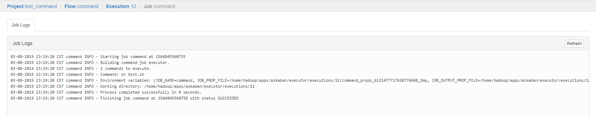
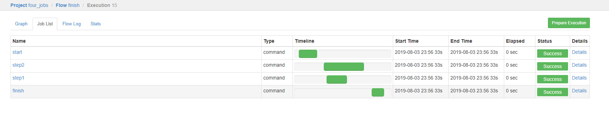
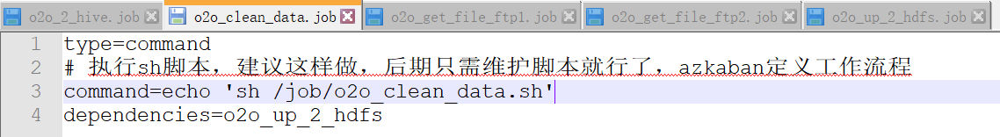

# azkaban的使用
## 一、界面介绍


首页有四个菜单

* projects：最重要的部分，创建一个工程，所有flows将在工程中运行。  
* scheduling:显示定时任务  
* executing:显示当前运行的任务  
* history:显示历史运行任务  

## 二、介绍projects部分
**概念介绍**

**创建工程**：创建之前我们先了解下之间的关系，一个工程包含一个或多个flows，一个flow包含多个job。job是你想在azkaban中运行的一个进程，可以是简单的linux命令，可是java程序，也可以是复杂的shell脚本，当然，如果你安装相关插件，也可以运行插件。一个job可以依赖于另一个job，这种多个job和它们的依赖组成的图表叫做flow。

点击创建项目就可以创建安新的项目，创建名称可以第一次命名之后不能再次改变，项目描述可以改变。创建好项目之后，就会进入项目界面，如果没有相关按钮，则说明用户没有相关权限，现在为一个空项目。

上传项目，点击Upload就可以上传项目，项目可以上zip文件，zip里需要包含*.job文件和其他需要运行的job。Job名称必须唯一。


### 1、Command 类型单一 job 示例
```
#command.job
type=command                                                    
command=echo 'hello'
```

<span style="color:#CC6666;font-weight:bold">1）创建job描述文件</span>
创建job很简单，只要创建一个以.job结尾的文本文件就行了,例如我们创建一个工作，用来打印hello，名字叫做command.job

vi command.job
```
#command.job
type=command                                                    
command=echo 'hello'
```

一个简单的job就创建好了，解释下，type的command，告诉azkaban用unix原生命令去运行，比如原生命令或者shell脚本，当然也有其他类型，后面说。

<span style="color:#CC6666;font-weight:bold">2) 将job资源文件打包成zip文件</span>
zip command.zip command.job 

注意：
目前，Azkaban上传的工作流文件只支持xxx.zip文件。zip应包含xxx.job运行作业所需的文件和任何文件（文件名后缀必须以.job结尾，否则无法识别）。作业名称在项目中必须是唯一的。


<span style="color:#CC6666;font-weight:bold">3）通过azkaban的web管理平台创建project并上传job的zip包</span>
首先创建project


点击创建之后

Flows：工作流程，有多个job组成
Permissions:权限管理
Project Logs:工程日志

上传zip包

 
<span style="color:#CC6666;font-weight:bold">4）启动执行该job</span>

点击执行工作流
 
点击继续


<span style="color:#CC6666;font-weight:bold">5）查看日志</span>
点Job List里的Details


<span style="color:#CC6666;font-weight:bold">6）一个任务里打包其他的文件</span>
command.job
```
#command.job
type=command
command=sh test.sh
```
**这里必须用sh test.sh用./test.sh不行**

test.sh
```
echo hello > /home/hadoop/apps/azkaban/jobs/test.log
```


查看日志：


运行成功了


### 2、Command 类型之多 job 工作流案例
#### 两个job
<span style="color:#CC6666;font-weight:bold">1）创建有依赖关系的多个 job 描述</span>
第一个 job：foo.job
```
# foo.job
type=command
command=echo foo
```

第二个job：bar.job 依赖 foo.job
```
# bar.job
type=command
dependencies=foo
command=echo bar
```

<span style="color:#CC6666;font-weight:bold">2）将所有 job 资源文件打到一个 zip 包中</span>


<span style="color:#CC6666;font-weight:bold">3）执行</span>


#### 四个job
<span style="color:#CC6666;font-weight:bold">1）创建有依赖关系的多个job描述</span>
第一个job：start.job
```
#start.job
type=command
command=echo "this is start job"
```

第二个job：step1.job依赖start.job
```
#step1.job
type=command
dependencies=start
command=echo "this is step1 job"
```

第三个job：step2.job依赖start.job
```
#step2.job
type=command
dependencies=start
command=echo "this is step2 job"
```

第四个job：finish.job依赖step1.job和step2.job
```
#finish.job
type=command
dependencies=step1,step2
command=echo "this is finish job"
```
<span style="color:#CC6666;font-weight:bold">2）将所有job资源文件打到一个zip包中</span>
```
zip jobs.zip start.job step1.job step2.job 
```

<span style="color:#CC6666;font-weight:bold">3）结果</span>




从各个job的执行时间，我们就可以看出来各个job的依赖关系。

### 4、调度java程序
<span style="color:#CC6666;font-weight:bold">1）编写java程序，打包</span>
```java
package com.azkaban;

import java.io.FileOutputStream;
import java.io.IOException;

public class AzkabanTest {
    public void run() throws IOException {
        // 根据需求编写具体代码
        FileOutputStream fos = new FileOutputStream("/home/hadoop/apps/azkaban/jobs/output.txt");
        fos.write("this is a java progress".getBytes());
        fos.close();
    }

    public static void main(String[] args) throws IOException {
        AzkabanTest azkabanTest = new AzkabanTest();
        azkabanTest.run();
    }

}
```
打包：


<span style="color:#CC6666;font-weight:bold">2）测试java程序</span>
```
java -classpath AzkabanJava-1.0-SNAPSHOT.jar com.azkaban.AzkabanTest
```
程序没问题


<span style="color:#CC6666;font-weight:bold">3）编写job文件</span>
vim azkabanJava.job
```
#azkabanJava.job
type=javaprocess
java.class=com.atguigu.azkaban.AzkabanTest
classpath=/home/hadoop/apps/azkaban/jobs/AzkabanJava-1.0-SNAPSHOT.jar
```

<span style="color:#CC6666;font-weight:bold">4）将job文件打成zip包</span>
```
zip azkabanJava.zip azkabanJava.job
```

<span style="color:#CC6666;font-weight:bold">5）通过azkaban的web管理平台创建project并上传job压缩包，启动执行该job</span>


Job Logs:
```
04-08-2019 13:39:04 CST azkabanJava INFO - Starting job azkabanJava at 1564897144375
04-08-2019 13:39:04 CST azkabanJava INFO - Building javaprocess job executor. 
04-08-2019 13:39:04 CST azkabanJava INFO - 1 commands to execute.
04-08-2019 13:39:04 CST azkabanJava INFO - Command: java  -Xms64M -Xmx256M -cp /home/hadoop/apps/azkaban/jobs/AzkabanJava-1.0-SNAPSHOT.jar com.azkaban.AzkabanTest 
04-08-2019 13:39:04 CST azkabanJava INFO - Environment variables: {JOB_NAME=azkabanJava, JOB_PROP_FILE=/home/hadoop/apps/azkaban/executor/executions/17/azkabanJava_props_8127881656584522982_tmp, JOB_OUTPUT_PROP_FILE=/home/hadoop/apps/azkaban/executor/executions/17/azkabanJava_output_1713302729779831153_tmp}
04-08-2019 13:39:04 CST azkabanJava INFO - Working directory: /home/hadoop/apps/azkaban/executor/executions/17
04-08-2019 13:39:04 CST azkabanJava INFO - Process completed successfully in 0 seconds.
04-08-2019 13:39:04 CST azkabanJava INFO - Finishing job azkabanJava at 1564897144892 with status SUCCEEDED
```
**分析一下这个日志**：
azkaban运行的命令应该是java  -Xms64M -Xmx256M -cp /home/hadoop/apps/azkaban/jobs/AzkabanJava-1.0-SNAPSHOT.jar com.azkaban.AzkabanTest 

这任务命令的工作目录应该是/home/hadoop/apps/azkaban/executor/executions/17

<span style="color:#CC6666;font-weight:bold">6）jar包一起打包到zip执行该job</span>
```
#azkabanJava.job
type=javaprocess
java.class=com.azkaban.AzkabanTest
classpath=AzkabanJava-1.0-SNAPSHOT.jar
```


上传覆盖之前的zip，执行任务：
```
04-08-2019 13:45:31 CST azkabanJava INFO - Starting job azkabanJava at 1564897531509
04-08-2019 13:45:31 CST azkabanJava INFO - Building javaprocess job executor. 
04-08-2019 13:45:31 CST azkabanJava INFO - 1 commands to execute.
04-08-2019 13:45:31 CST azkabanJava INFO - Command: java  -Xms64M -Xmx256M -cp AzkabanJava-1.0-SNAPSHOT.jar com.azkaban.AzkabanTest 
04-08-2019 13:45:31 CST azkabanJava INFO - Environment variables: {JOB_NAME=azkabanJava, JOB_PROP_FILE=/home/hadoop/apps/azkaban/executor/executions/18/azkabanJava_props_4216879588852375397_tmp, JOB_OUTPUT_PROP_FILE=/home/hadoop/apps/azkaban/executor/executions/18/azkabanJava_output_2993374622881965326_tmp}
04-08-2019 13:45:31 CST azkabanJava INFO - Working directory: /home/hadoop/apps/azkaban/executor/executions/18
04-08-2019 13:45:31 CST azkabanJava INFO - Process completed successfully in 0 seconds.
04-08-2019 13:45:31 CST azkabanJava INFO - Finishing job azkabanJava at 1564897531722 with status SUCCEEDED
```
**其实这个任务的配置和和日志都在/home/hadoop/apps/azkaban/executor/executions/18目录下，18是这个任务的id**


### 5、HDFS 操作任务
1）创建 job 描述文件
```
# fs.job
type=command
command=/home/hadoop/apps/hadoop-2.6.4/bin/hadoop fs -mkdir /azkaban
```
2）将 job 资源文件打包成 zip 文件

3）通过 azkaban 的 web 管理平台创建 project 并上传 job 压缩包

4）启动执行该 job

5）查看结果


### 6、mapreduce任务
mapreduce任务依然可以使用azkaban进行调度
1）创建job描述文件，及mr程序jar包
vim mapreduce.job
```
#mapreduce job
type=command
command=/home/hadoop/apps/hadoop-2.6.4/bin/hadoop jar /home/hadoop/apps/hadoop-2.6.4/share/hadoop/mapreduce/hadoop-mapreduce-examples-2.6.4.jar wordcount /wordcount/input /wordcount/output
```

2）将所有job资源文件打到一个zip包中
zip mapreduce.zip mapreduce.job 

3）在azkaban的web管理界面创建工程并上传zip包

4）启动job

5）查看结果

Job Logs:
```
04-08-2019 14:16:47 CST mapreduce INFO - Starting job mapreduce at 1564899407291
04-08-2019 14:16:47 CST mapreduce INFO - Building command job executor. 
04-08-2019 14:16:47 CST mapreduce INFO - 1 commands to execute.
04-08-2019 14:16:47 CST mapreduce INFO - Command: /home/hadoop/apps/hadoop-2.6.4/bin/hadoop jar /home/hadoop/apps/hadoop-2.6.4/share/hadoop/mapreduce/hadoop-mapreduce-examples-2.6.4.jar wordcount /wordcount/input /wordcount/output
04-08-2019 14:16:47 CST mapreduce INFO - Environment variables: {JOB_NAME=mapreduce, JOB_PROP_FILE=/home/hadoop/apps/azkaban/executor/executions/20/mapreduce_props_724321454140763688_tmp, JOB_OUTPUT_PROP_FILE=/home/hadoop/apps/azkaban/executor/executions/20/mapreduce_output_2704356389182532595_tmp}
04-08-2019 14:16:47 CST mapreduce INFO - Working directory: /home/hadoop/apps/azkaban/executor/executions/20
04-08-2019 14:16:49 CST mapreduce ERROR - SLF4J: Class path contains multiple SLF4J bindings.
04-08-2019 14:16:49 CST mapreduce ERROR - SLF4J: Found binding in [jar:file:/home/hadoop/apps/hadoop-2.6.4/share/hadoop/common/lib/slf4j-log4j12-1.7.5.jar!/org/slf4j/impl/StaticLoggerBinder.class]
04-08-2019 14:16:49 CST mapreduce ERROR - SLF4J: Found binding in [jar:file:/home/hadoop/apps/hbase-1.3.1/lib/slf4j-log4j12-1.7.5.jar!/org/slf4j/impl/StaticLoggerBinder.class]
04-08-2019 14:16:49 CST mapreduce ERROR - SLF4J: See http://www.slf4j.org/codes.html#multiple_bindings for an explanation.
04-08-2019 14:16:49 CST mapreduce ERROR - SLF4J: Actual binding is of type [org.slf4j.impl.Log4jLoggerFactory]
04-08-2019 14:16:50 CST mapreduce ERROR - 19/08/04 14:16:50 INFO client.RMProxy: Connecting to ResourceManager at hadoop02/192.168.216.112:8032
04-08-2019 14:16:51 CST mapreduce ERROR - 19/08/04 14:16:51 INFO input.FileInputFormat: Total input paths to process : 1
04-08-2019 14:16:51 CST mapreduce ERROR - 19/08/04 14:16:51 INFO mapreduce.JobSubmitter: number of splits:1
04-08-2019 14:16:52 CST mapreduce ERROR - 19/08/04 14:16:52 INFO mapreduce.JobSubmitter: Submitting tokens for job: job_1564898867320_0001
04-08-2019 14:16:54 CST mapreduce ERROR - 19/08/04 14:16:54 INFO impl.YarnClientImpl: Submitted application application_1564898867320_0001
04-08-2019 14:16:54 CST mapreduce ERROR - 19/08/04 14:16:54 INFO mapreduce.Job: The url to track the job: http://hadoop02:8088/proxy/application_1564898867320_0001/
04-08-2019 14:16:54 CST mapreduce ERROR - 19/08/04 14:16:54 INFO mapreduce.Job: Running job: job_1564898867320_0001
04-08-2019 14:17:07 CST mapreduce ERROR - 19/08/04 14:17:07 INFO mapreduce.Job: Job job_1564898867320_0001 running in uber mode : false
04-08-2019 14:17:07 CST mapreduce ERROR - 19/08/04 14:17:07 INFO mapreduce.Job:  map 0% reduce 0%
04-08-2019 14:17:18 CST mapreduce ERROR - 19/08/04 14:17:18 INFO mapreduce.Job:  map 100% reduce 0%
04-08-2019 14:17:25 CST mapreduce ERROR - 19/08/04 14:17:25 INFO mapreduce.Job:  map 100% reduce 100%
04-08-2019 14:17:25 CST mapreduce ERROR - 19/08/04 14:17:25 INFO mapreduce.Job: Job job_1564898867320_0001 completed successfully
04-08-2019 14:17:26 CST mapreduce ERROR - 19/08/04 14:17:26 INFO mapreduce.Job: Counters: 49
04-08-2019 14:17:26 CST mapreduce ERROR - 	File System Counters
04-08-2019 14:17:26 CST mapreduce ERROR - 		FILE: Number of bytes read=58
04-08-2019 14:17:26 CST mapreduce ERROR - 		FILE: Number of bytes written=214063
04-08-2019 14:17:26 CST mapreduce ERROR - 		FILE: Number of read operations=0
04-08-2019 14:17:26 CST mapreduce ERROR - 		FILE: Number of large read operations=0
04-08-2019 14:17:26 CST mapreduce ERROR - 		FILE: Number of write operations=0
04-08-2019 14:17:26 CST mapreduce ERROR - 		HDFS: Number of bytes read=150
04-08-2019 14:17:26 CST mapreduce ERROR - 		HDFS: Number of bytes written=32
04-08-2019 14:17:26 CST mapreduce ERROR - 		HDFS: Number of read operations=6
04-08-2019 14:17:26 CST mapreduce ERROR - 		HDFS: Number of large read operations=0
04-08-2019 14:17:26 CST mapreduce ERROR - 		HDFS: Number of write operations=2
04-08-2019 14:17:26 CST mapreduce ERROR - 	Job Counters 
04-08-2019 14:17:26 CST mapreduce ERROR - 		Launched map tasks=1
04-08-2019 14:17:26 CST mapreduce ERROR - 		Launched reduce tasks=1
04-08-2019 14:17:26 CST mapreduce ERROR - 		Data-local map tasks=1
04-08-2019 14:17:26 CST mapreduce ERROR - 		Total time spent by all maps in occupied slots (ms)=9470
04-08-2019 14:17:26 CST mapreduce ERROR - 		Total time spent by all reduces in occupied slots (ms)=3184
04-08-2019 14:17:26 CST mapreduce ERROR - 		Total time spent by all map tasks (ms)=9470
04-08-2019 14:17:26 CST mapreduce ERROR - 		Total time spent by all reduce tasks (ms)=3184
04-08-2019 14:17:26 CST mapreduce ERROR - 		Total vcore-milliseconds taken by all map tasks=9470
04-08-2019 14:17:26 CST mapreduce ERROR - 		Total vcore-milliseconds taken by all reduce tasks=3184
04-08-2019 14:17:26 CST mapreduce ERROR - 		Total megabyte-milliseconds taken by all map tasks=9697280
04-08-2019 14:17:26 CST mapreduce ERROR - 		Total megabyte-milliseconds taken by all reduce tasks=3260416
04-08-2019 14:17:26 CST mapreduce ERROR - 	Map-Reduce Framework
04-08-2019 14:17:26 CST mapreduce ERROR - 		Map input records=3
04-08-2019 14:17:26 CST mapreduce ERROR - 		Map output records=9
04-08-2019 14:17:26 CST mapreduce ERROR - 		Map output bytes=75
04-08-2019 14:17:26 CST mapreduce ERROR - 		Map output materialized bytes=58
04-08-2019 14:17:26 CST mapreduce ERROR - 		Input split bytes=111
04-08-2019 14:17:26 CST mapreduce ERROR - 		Combine input records=9
04-08-2019 14:17:26 CST mapreduce ERROR - 		Combine output records=5
04-08-2019 14:17:26 CST mapreduce ERROR - 		Reduce input groups=5
04-08-2019 14:17:26 CST mapreduce ERROR - 		Reduce shuffle bytes=58
04-08-2019 14:17:26 CST mapreduce ERROR - 		Reduce input records=5
04-08-2019 14:17:26 CST mapreduce ERROR - 		Reduce output records=5
04-08-2019 14:17:26 CST mapreduce ERROR - 		Spilled Records=10
04-08-2019 14:17:26 CST mapreduce ERROR - 		Shuffled Maps =1
04-08-2019 14:17:26 CST mapreduce ERROR - 		Failed Shuffles=0
04-08-2019 14:17:26 CST mapreduce ERROR - 		Merged Map outputs=1
04-08-2019 14:17:26 CST mapreduce ERROR - 		GC time elapsed (ms)=215
04-08-2019 14:17:26 CST mapreduce ERROR - 		CPU time spent (ms)=2880
04-08-2019 14:17:26 CST mapreduce ERROR - 		Physical memory (bytes) snapshot=455782400
04-08-2019 14:17:26 CST mapreduce ERROR - 		Virtual memory (bytes) snapshot=3554181120
04-08-2019 14:17:26 CST mapreduce ERROR - 		Total committed heap usage (bytes)=287834112
04-08-2019 14:17:26 CST mapreduce ERROR - 	Shuffle Errors
04-08-2019 14:17:26 CST mapreduce ERROR - 		BAD_ID=0
04-08-2019 14:17:26 CST mapreduce ERROR - 		CONNECTION=0
04-08-2019 14:17:26 CST mapreduce ERROR - 		IO_ERROR=0
04-08-2019 14:17:26 CST mapreduce ERROR - 		WRONG_LENGTH=0
04-08-2019 14:17:26 CST mapreduce ERROR - 		WRONG_MAP=0
04-08-2019 14:17:26 CST mapreduce ERROR - 		WRONG_REDUCE=0
04-08-2019 14:17:26 CST mapreduce ERROR - 	File Input Format Counters 
04-08-2019 14:17:26 CST mapreduce ERROR - 		Bytes Read=39
04-08-2019 14:17:26 CST mapreduce ERROR - 	File Output Format Counters 
04-08-2019 14:17:26 CST mapreduce ERROR - 		Bytes Written=32
04-08-2019 14:17:26 CST mapreduce INFO - Process completed successfully in 39 seconds.
04-08-2019 14:17:26 CST mapreduce INFO - Finishing job mapreduce at 1564899446524 with status SUCCEEDED
```

查看hdfs结果
```
[hadoop@hadoop01 jobs]$ hadoop fs -cat /wordcount/output/p*
aaaa	2
bbb	3
cccc	1
ddd	2
eee	1
```

### 7、Hive脚本任务
1）创建job描述文件和hive脚本
（1）Hive脚本：student.sql
```sql
use default;
drop table student;
create table student(id int, name string)
row format delimited fields terminated by '\t';

load data local inpath '/home/hadoop/hivetables/student.txt' into table student;

insert overwrite local directory '/home/hadoop/apps/azkaban/jobs/hivestudent'
row format delimited fields terminated by '\t'
select * from student;
```
（2）Job描述文件：hive.job
```
#hive job
type=command
command=/home/hadoop/apps/hive-1.2.1/bin/hive -f /home/hadoop/apps/azkaban/jobs/student.sql
```
2）	将所有job资源文件打到一个zip包中
zip hive.zip hive.job 

3）在azkaban的web管理界面创建工程并上传zip包

4）启动job

5）查看结果


### 8、Command 类型多 job 工作流 flow
<span style="color:#CC6666;font-weight:bold">（1）创建项目</span>

我们说过多个jobs和它们的依赖组成flow。怎么创建依赖，只要指定dependencies参数就行了。比如导入hive前，需要进行数据清洗，数据清洗前需要上传，上传之前需要从ftp获取日志。
定义5个job：
```
1、o2o_2_hive.job：将清洗完的数据入hive库
2、o2o_clean_data.job：调用mr清洗hdfs数据
3、o2o_up_2_hdfs.job：将文件上传至hdfs
4、o2o_get_file_ftp1.job：从ftp1获取日志
5、o2o_get_file_fip2.job：从ftp2获取日志
```

依赖关系：
3依赖4和5，2依赖3，1依赖2，4和5没有依赖关系。

o2o_2_hive.job
```
type=command
# 执行sh脚本，建议这样做，后期只需维护脚本就行了，azkaban定义工作流程
command=sh /job/o2o_2_hive.sh
dependencies=o2o_clean_data
```

o2o_clean_data.job
```
type=command
# 执行sh脚本，建议这样做，后期只需维护脚本就行了，azkaban定义工作流程
command=sh /job/o2o_clean_data.sh
dependencies=o2o_up_2_hdfs
```

o2o_up_2_hdfs.job
```
type=command
#需要配置好hadoop命令，建议编写到shell中，可以后期维护
command=hadoop fs -put /data/*
#多个依赖用逗号隔开
dependencies=o2o_get_file_ftp1,o2o_get_file_ftp2
```

o2o_get_file_ftp1.job
```
type=command
command=wget "ftp://file1" -O /data/file1
```

o2o_get_file_ftp2.job
```
type=command
command=wget "ftp:file2" -O /data/file2
```

可以运行unix命令，也可以运行python脚本（强烈推荐）。将上述job打成zip包。
ps：为了测试流程，我将上述command都改为echo ＋相应命令





<span style="color:#CC6666;font-weight:bold">（2）上传执行</span>


点击o2o_2_hive进入流程，azkaban流程名称以最后一个没有依赖的job定义的。


右上方是配置执行当前流程或者执行定时流程。


说明
```
Flow view：流程视图。可以禁用，启用某些job
Notification:定义任务成功或者失败是否发送邮件
Failure Options:定义一个job失败，剩下的job怎么执行
Concurrent：并行任务执行设置
Flow Parametters：参数设置。
```

设置好上述参数，点击execute。


绿色代表成功，蓝色是运行，红色是失败。可以查看job运行时间，依赖和日志，点击details可以查看各个job运行情况。


<span style="color:#CC6666;font-weight:bold">（3）执行定时任务</span>


这时候注意到cst了吧，之前需要将配置中时区改为Asia/shanghai。
可以选择"天/时/分/月/周"等执行频率。


可以查看下次执行时间。

