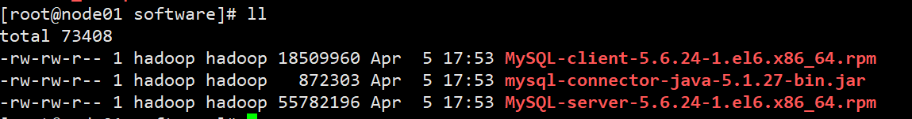
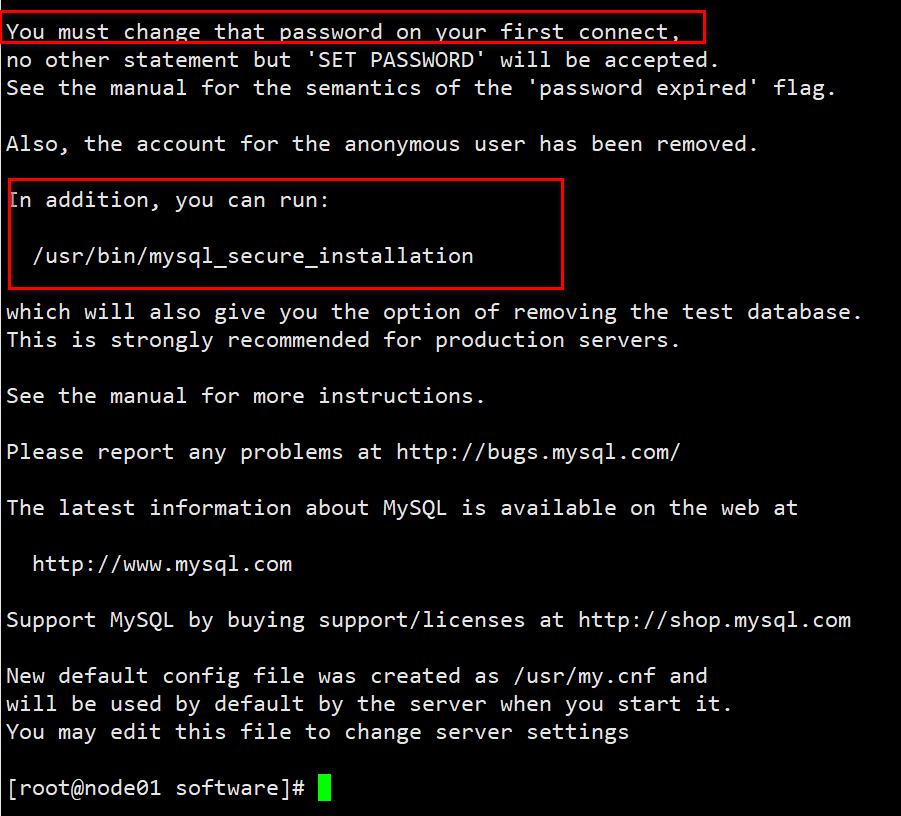
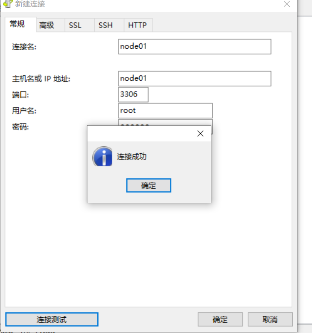

# 安装环境准备

## 虚拟机准备
克隆三台虚拟机（node01、node02、node03），配置好对应主机的网络IP、主机名称、关闭防火墙、关闭 Selinux、hadoop用户具有sudo权限。

设置node01、node02、node03的主机对应内存分别是：14G、4G、4G

## 安装配置mysql
**注意：一定要用root用户操作如下步骤；先卸载MySQL再安装**

### 安装包准备

查看MySQL是否安装
```
[root@node01 software]# rpm -qa|grep mysql
mysql-libs-5.1.71-1.el6.x86_64
```

如果安装了MySQL，就先卸载
```
[root@node01 software]# rpm -e --nodeps mysql-libs-5.1.71-1.el6.x86_64
[root@node01 software]# rpm -qa|grep mysql
```

上传mysql相关文件到node01的/opt/software目录


```
[hadoop@node01 ~]$ su
Password: 
[root@node01 hadoop]# cd ~
[root@node01 ~]# mkdir /opt/software
[root@node01 ~]# chmod 777 /opt/software
[root@node01 ~]# 
```

### 安装MySQL服务器
安装MySQL服务端
```
[root@node01 software]# rpm -ivh MySQL-server-5.6.24-1.el6.x86_64.rpm 
error: Failed dependencies:
	/usr/bin/perl is needed by MySQL-server-5.6.24-1.el6.x86_64
```

缺少依赖，执行下面这条命令，安装perl依赖
```
yum install -y perl-Module-Install.noarch
```

然后就安装成功了，结尾


查看MySQL状态
```
[root@node01 software]# service mysql status
 ERROR! MySQL is not running
```
启动MySQL
```
[root@node01 software]# service mysql start
Starting MySQL....... SUCCESS!
```


mysql_secure_installation命令是用于设置root密码的，没有密码才能直接回车，我这个生成了密码
```
[root@node01 software]# /usr/bin/mysql_secure_installation
Can't find a 'mysql' client in PATH or ./bin
Cleaning up...
Warning: Could not unlink .my.cnf.1350: No such file or directory
Warning: Could not unlink .mysql.1350: No such file or directory
```

**查看产生的随机密码**
```
[root@node01 software]# cat /root/.mysql_secret
# The random password set for the root user at Sun Apr  5 18:01:32 2020 (local time): t6cfDnSx7OksiAYC
```


### 安装MySQL客户端
安装MySQL客户端
```
[root@node01 software]# rpm -ivh MySQL-client-5.6.24-1.el6.x86_64.rpm 
Preparing...                ########################################### [100%]
   1:MySQL-client           ########################################### [100%]
[root@node01 software]# 
```

链接MySQL（密码替换成产生的随机密码）
```
[root@node01 software]# mysql -uroot -pt6cfDnSx7OksiAYC
```

修改密码，退出
```
mysql> SET PASSWORD=PASSWORD('123456');
Query OK, 0 rows affected (0.00 sec)

mysql> exit
Bye
[root@node01 software]# 
```

看是否改密码成功
```
[root@node01 software]# mysql -uroot -p123456
```

**MySQL中user表中主机配置**。
配置只要是root用户+密码，在任何主机上都能登录MySQL数据库。

```
mysql> show databases;
+--------------------+
| Database           |
+--------------------+
| information_schema |
| mysql              |
| performance_schema |
| test               |
+--------------------+
4 rows in set (0.00 sec)

mysql> use mysql;
Reading table information for completion of table and column names
You can turn off this feature to get a quicker startup with -A

Database changed
mysql> select User, Host, Password from user;
+------+-----------+-------------------------------------------+
| User | Host      | Password                                  |
+------+-----------+-------------------------------------------+
| root | localhost | *6BB4837EB74329105EE4568DDA7DC67ED2CA2AD9 |
| root | node01    | *E4FFD5A08B6D29239DB41BB83B854B182AFFE01B |
| root | 127.0.0.1 | *E4FFD5A08B6D29239DB41BB83B854B182AFFE01B |
| root | ::1       | *E4FFD5A08B6D29239DB41BB83B854B182AFFE01B |
+------+-----------+-------------------------------------------+
4 rows in set (0.00 sec)

mysql> update user set host='%' where host='localhost';
Query OK, 1 row affected (0.00 sec)
Rows matched: 1  Changed: 1  Warnings: 0

mysql> use mysql;
Database changed
mysql> select User, Host, Password from user;
+------+-----------+-------------------------------------------+
| User | Host      | Password                                  |
+------+-----------+-------------------------------------------+
| root | %         | *6BB4837EB74329105EE4568DDA7DC67ED2CA2AD9 |
| root | node01    | *E4FFD5A08B6D29239DB41BB83B854B182AFFE01B |
| root | 127.0.0.1 | *E4FFD5A08B6D29239DB41BB83B854B182AFFE01B |
| root | ::1       | *E4FFD5A08B6D29239DB41BB83B854B182AFFE01B |
+------+-----------+-------------------------------------------+
4 rows in set (0.00 sec)

mysql> delete from user where Host!='%';
Query OK, 3 rows affected (0.00 sec)

mysql> select User, Host, Password from user;
+------+------+-------------------------------------------+
| User | Host | Password                                  |
+------+------+-------------------------------------------+
| root | %    | *6BB4837EB74329105EE4568DDA7DC67ED2CA2AD9 |
+------+------+-------------------------------------------+
1 row in set (0.00 sec)

mysql> 
```

**刷新才生效**
```
mysql> flush privileges;
Query OK, 0 rows affected (0.00 sec)

mysql> quit;
Bye
[root@node01 software]# 
```

window连接测试：



##  SSH免密登录配置(hadoop用户)
配置node01对node01、node02、node03三台服务器免密登录(hadoop用户)。

生成公钥和私钥，然后敲（三个回车），就会生成两个文件id_rsa（私钥）、id_rsa.pub（公钥）
```
[hadoop@node01 ~]$ ssh-keygen -t rsa
Generating public/private rsa key pair.
Enter file in which to save the key (/home/hadoop/.ssh/id_rsa): 
Created directory '/home/hadoop/.ssh'.
Enter passphrase (empty for no passphrase): 
Enter same passphrase again: 
Your identification has been saved in /home/hadoop/.ssh/id_rsa.
Your public key has been saved in /home/hadoop/.ssh/id_rsa.pub.
The key fingerprint is:
b6:10:ca:af:2a:10:44:b5:d6:11:d8:28:a3:10:b4:1e hadoop@node01
The key's randomart image is:
+--[ RSA 2048]----+
|++..+o.          |
|.+.oo..          |
|+Eoo ..          |
|+ o. . .         |
| o  o . S        |
|.    . o .       |
|.     . .        |
|.    .           |
| ....            |
+-----------------+
[hadoop@node01 ~]$ ll .ssh/
total 8
-rw------- 1 hadoop hadoop 1675 Apr  5 18:32 id_rsa
-rw-r--r-- 1 hadoop hadoop  395 Apr  5 18:32 id_rsa.pub
```

将公钥拷贝到要免密登录的目标机器上
```
ssh-copy-id node01
ssh-copy-id node02
ssh-copy-id node03
```

可以免密登录：
```
[hadoop@node01 ~]$ ssh hadoop@node01
Last login: Sun Apr  5 18:09:34 2020 from 192.168.216.1
[hadoop@node01 ~]$ exit
logout
Connection to node01 closed.
[hadoop@node01 ~]$ ssh hadoop@node02
Last login: Sun Apr  5 17:43:57 2020 from 192.168.216.1
[hadoop@node02 ~]$ exit
logout
Connection to node02 closed.
[hadoop@node01 ~]$ ssh hadoop@node03
Last login: Sun Apr  5 17:43:57 2020 from 192.168.216.1
[hadoop@node03 ~]$ exit
logout
Connection to node03 closed.
[hadoop@node01 ~]$ 
```

重复对node02、node03配置，实现node01、node02、node03能够两辆免密登录。

## 集群同步脚本
在/bin目录下创建文件xsync，文件内容如下：
```
#!/bin/bash
#1 获取输入参数个数，如果没有参数，直接退出
pcount=$#
if((pcount==0)); then
        echo no args;
        exit;
fi

#2 获取文件名称
p1=$1
fname=`basename $p1`
echo fname=$fname

#3 获取上级目录到绝对路径
pdir=`cd -P $(dirname $p1); pwd`
echo pdir=$pdir

#4 获取当前用户名称
user=`whoami`

#5 循环
for host in "02" "03"
do
        echo ------------------- hadoop$host --------------
        rsync -rvl $pdir/$fname $user@node$host:$pdir
done
```

修改脚本 xsync 具有执行权限
```
[hadoop@node01 ~]$ ll /bin/xsync
-rw-r--r-- 1 root root 500 Apr  5 18:48 /bin/xsync
[hadoop@node01 ~]$ sudo chmod 777 /bin/xsync
[hadoop@node01 ~]$ ll /bin/xsync
-rwxrwxrwx 1 root root 500 Apr  5 18:48 /bin/xsync
```

## 安装JDK（三台）
/opt目录下创建module

解压JDK到/opt/module目录下
```
[hadoop@node01 software]$ tar -zxf jdk-8u181-linux-x64.tar.gz -C /opt/module/
[hadoop@node01 software]$ cd /opt/module/jdk1.8.0_181/
[hadoop@node01 jdk1.8.0_181]$ pwd
/opt/module/jdk1.8.0_181
```

配置JDK环境变量,在profile文件末尾添加JDK路径
```
#JAVA_HOME
export JAVA_HOME=/opt/module/jdk1.8.0_181
export PATH=$PATH:$JAVA_HOME/bin
```

让修改后的文件生效
```
[hadoop@node01 jdk1.8.0_181]$ source /etc/profile
[hadoop@node01 jdk1.8.0_181]$ java -version
java version "1.8.0_181"
Java(TM) SE Runtime Environment (build 1.8.0_181-b13)
Java HotSpot(TM) 64-Bit Server VM (build 25.181-b13, mixed mode)
[hadoop@node01 jdk1.8.0_181]$ 
```

分发jdk到其他的节点上：
```
[hadoop@node01 module]$ scp -r jdk1.8.0_181/ hadoop@node02:`pwd`
[hadoop@node01 module]$ scp -r jdk1.8.0_181/ hadoop@node03:`pwd`
```

同样配置JDK环境变量,让修改后的文件生效。

## 集群整体操作脚本
在/bin目录下创建文件xcall，文件内容如下：
```
#!/bin/bash

for i in node01 node02 node03
do
        echo --------- $i ----------
        ssh $i "$*"
done
```
修改脚本 xcall 具有执行权限
```
sudo chmod 777 /bin/xcall
```

测试
```
[hadoop@node01 module]$ sudo chmod 777 /bin/xcall
[hadoop@node01 module]$ ls /bin/xcall
/bin/xcall
[hadoop@node01 module]$ xcall jps
--------- node01 ----------
bash: jps: command not found
--------- node02 ----------
bash: jps: command not found
--------- node03 ----------
bash: jps: command not found
[hadoop@node01 module]$ 
```

将/etc/profile文件追加到~/.bashrc后面
```
[hadoop@node01 module]$ cat /etc/profile >> ~/.bashrc
[hadoop@node02 module]$ cat /etc/profile >> ~/.bashrc
[hadoop@node03 module]$ cat /etc/profile >> ~/.bashrc
```

再次测试
```
[hadoop@node01 module]$ xcall jps
--------- node01 ----------
1857 Jps
--------- node02 ----------
1367 Jps
--------- node03 ----------
1333 Jps
[hadoop@node01 module]$
```

## 下载第三方依赖
依次在三台节点（所有Agent的节点）上执行下载第三方依赖（注意：需要联网）
```
yum -y install chkconfig python bind-utils psmisc libxslt zlib sqlite cyrus-sasl-plain cyrus-sasl-gssapi fuse fuse-libs redhat-lsb
```


```

```