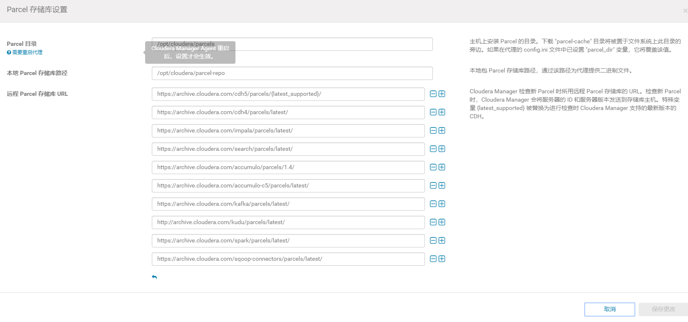
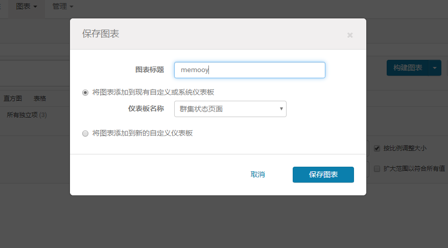

# CDH安装

## 创建CM用的数据库
在MySQL中依次创建监控数据库、Hive数据库、Oozie数据库、Hue数据库

一般测试的代码(这次不用这个)
```
1）启动数据库
[root@hadoop102 ~]# mysql -uroot -p123456
2）集群监控数据库
mysql> create database amon DEFAULT CHARSET utf8 COLLATE utf8_general_ci;
3）Hive数据库 
mysql> create database hive DEFAULT CHARSET utf8 COLLATE utf8_general_ci;
4）Oozie数据库
mysql> create database oozie DEFAULT CHARSET utf8 COLLATE utf8_general_ci;
5）Hue数据库
mysql> create database hue DEFAULT CHARSET utf8 COLLATE utf8_general_ci;
6）关闭数据库
mysql> quit;
```

使用权限授权的：
```
##amon
create database amon DEFAULT CHARACTER SET utf8 COLLATE utf8_general_ci;
grant all on amon.* TO 'amon'@'%' IDENTIFIED BY '123456';

##hive
create database hive DEFAULT CHARACTER SET utf8 COLLATE utf8_general_ci;
grant all on hive.* TO 'hive'@'%' IDENTIFIED BY '123456';

##oozie
create database oozie  DEFAULT CHARACTER SET utf8 COLLATE utf8_general_ci;
grant all on oozie.* TO 'oozie'@'%' IDENTIFIED BY '123456';

##hue
create database hue  DEFAULT CHARACTER SET utf8 COLLATE utf8_general_ci;
grant all on hue.* TO 'hue'@'%' IDENTIFIED BY '123456';
```


```
[hadoop@node01 module]$  mysql -uroot -p123456
mysql> create database amon DEFAULT CHARACTER SET utf8 COLLATE utf8_general_ci;
Query OK, 1 row affected (0.00 sec)

mysql> grant all on amon.* TO 'amon'@'%' IDENTIFIED BY '123456';
Query OK, 0 rows affected (0.00 sec)

mysql> create database hive DEFAULT CHARACTER SET utf8 COLLATE utf8_general_ci;
Query OK, 1 row affected (0.00 sec)

mysql> grant all on hive.* TO 'hive'@'%' IDENTIFIED BY '123456';
Query OK, 0 rows affected (0.00 sec)

mysql> create database oozie  DEFAULT CHARACTER SET utf8 COLLATE utf8_general_ci;
Query OK, 1 row affected (0.00 sec)

mysql> grant all on oozie.* TO 'oozie'@'%' IDENTIFIED BY '123456';
Query OK, 0 rows affected (0.00 sec)

mysql> create database hue  DEFAULT CHARACTER SET utf8 COLLATE utf8_general_ci;
Query OK, 1 row affected (0.00 sec)

mysql> grant all on hue.* TO 'hue'@'%' IDENTIFIED BY '123456';
Query OK, 0 rows affected (0.00 sec)

mysql> use mysql;
Reading table information for completion of table and column names
You can turn off this feature to get a quicker startup with -A

Database changed
mysql> select user,host from user;
+-------+------+
| user  | host |
+-------+------+
| amon  | %    |
| hive  | %    |
| hue   | %    |
| oozie | %    |
| root  | %    |
+-------+------+
5 rows in set (0.00 sec)
```

## CM下载地址
1）CM下载地址：http://archive.cloudera.com/cm5/cm/5/
2）离线库下载地址：http://archive.cloudera.com/cdh5/parcels

## CM安装
**注：以下所有操作均使用root用户**

创建/opt/module/cm目录
```
[root@node01 module]# mkdir /opt/module/cm
[root@node01 module]# ll
total 8
drwxr-xr-x 2 root   root   4096 Apr  5 19:52 cm
drwxr-xr-x 7 hadoop hadoop 4096 Apr  5 19:01 jdk1.8.0_181
[root@node01 module]# cd cm/
```

上传cloudera-manager-el6-cm5.12.1_x86_64.tar.gz到node01的/opt/software目录，并解压到/opt/module/cm目录
```
[root@node01 software]# ll
total 2307152
-rw-rw-r-- 1 hadoop hadoop 1620405492 Apr  5 19:58 CDH-5.12.1-1.cdh5.12.1.p0.3-el6.parcel
-rw-rw-r-- 1 hadoop hadoop         41 Apr  5 19:56 CDH-5.12.1-1.cdh5.12.1.p0.3-el6.parcel.sha
-rw-rw-r-- 1 hadoop hadoop  742029734 Apr  5 19:58 cloudera-manager-el6-cm5.12.1_x86_64.tar.gz
-rw-rw-r-- 1 hadoop hadoop      72312 Apr  5 19:56 manifest.json
[root@node01 software]# tar -zxf cloudera-manager-el6-cm5.12.1_x86_64.tar.gz -C /opt/module/cm
[root@node01 software]# 
```

分别在node01、node02、node03创建用户cloudera-scm
```
useradd \
--system \
--home=/opt/module/cm/cm-5.12.1/run/cloudera-scm-server \
--no-create-home \
--shell=/bin/false \
--comment "Cloudera SCM User" cloudera-scm
```

参数说明：
```
--system 创建一个系统账户
--home 指定用户登入时的主目录，替换系统默认值/home/<用户名>
--no-create-home 不要创建用户的主目录
--shell 用户的登录 shell 名
--comment 用户的描述信息
```
注意：Cloudera Manager默认去找用户cloudera-scm，创建完该用户后，将自动使用此用户。

修改CM Agent配置，修改文件/opt/module/cm/cm-5.12.1/etc/cloudera-scm-agent/ config.ini的主机名称
```
vi /opt/module/cm/cm-5.12.1/etc/cloudera-scm-agent/config.ini
```


配置CM的数据库：
拷贝mysql-connector-java-5.1.27-bin.jar文件到目录 /usr/share/java/。
**注意jar包名称要修改为mysql-connector-java.jar**
```
[root@node01 software]# cp mysql-connector-java-5.1.27-bin.jar /usr/share/java/
[root@node01 software]# cd /usr/share/java/
[root@node01 java]# ll
total 852
-rw-r--r-- 1 root root 872303 Apr  5 20:16 mysql-connector-java-5.1.27-bin.jar
[root@node01 java]# mv mysql-connector-java-5.1.27-bin.jar mysql-connector-java.jar 
[root@node01 java]# ll
total 852
-rw-r--r-- 1 root root 872303 Apr  5 20:16 mysql-connector-java.jar
[root@node01 java]# 
```

使用CM自带的脚本，在MySQL中创建CM库
```
/opt/module/cm/cm-5.12.1/share/cmf/schema/scm_prepare_database.sh mysql cm -node01 -uroot -p123456 --scm-host hnode01 scm scm scm
格式：数据库类型、数据库、数据库服务器、用户名、密码、cm server服务器
参数说明
-h：Database host
-u：Database username
-p：Database Password
--scm-host：SCM server's hostname
```

```
[root@node01 cm]# cm-5.12.1/share/cmf/schema/scm_prepare_database.sh mysql cm -node01 -uroot -p123456 --scm-host hnode01 scm scm scm
```

创建parcel-repo目录(**这里一定要是/opt/cloudera/parcel-repo，不是/opt/module/cm/cloudera/parcel-repo(**)，把下载的离线包复制到这个文件夹，将CDH-5.12.1-1.cdh5.12.1.p0.3-el6.parcel.sha1：需改名为CDH-5.12.1-1.cdh5.12.1.p0.3-el6.parcel.sha。下载的文件多了一个1.修改cloudera文件夹的权限所有人
```
[root@node01 software]# mkdir -p /opt/cloudera/parcel-repo
[root@node01 software]# mv CDH* /opt/cloudera/parcel-repo
[root@node01 software]# mv manifest.json opt/cloudera/parcel-repo
[root@node01 software]# ll /opt/module/cm/cloudera/parcel-repo
total 1582508
-rw-rw-r-- 1 hadoop hadoop 1620405492 Apr  5 19:58 CDH-5.12.1-1.cdh5.12.1.p0.3-el6.parcel
-rw-rw-r-- 1 hadoop hadoop         41 Apr  5 20:07 CDH-5.12.1-1.cdh5.12.1.p0.3-el6.parcel.sha
-rw-rw-r-- 1 hadoop hadoop      72312 Apr  5 19:56 manifest.json
[root@node01 software]# chown -R cloudera-scm:cloudera-scm /opt/cloudera/
```

原来可以在这里配置、修改需要重启好像


创建parcels目录
```
[root@node01 cloudera]# mkdir parcels
[root@node01 cloudera]# ll
total 12
drwxr-xr-x 2 1106 4001 4096 Aug 19  2017 csd
drwxr-xr-x 2 1106 4001 4096 Apr  5 20:34 parcel-repo
drwxr-xr-x 2 root root 4096 Apr  5 20:37 parcels
[root@node01 cloudera]# 
```

修改/opt/module/cm目录的所属用户及用户组为cloudera-scm
```
[root@node01 module]# chown -R cloudera-scm:cloudera-scm /opt/module/cm/
```

分发cloudera-manager,安装 rsync：**yum install rsync**，最小版的没有这个，每个节点都需要安装(需要server和client)。
修改xsync脚本，改成`rsync -av`，这样同步过去的权限和此台电脑的一样。
```
[root@node01 cm]# yum install rsync
xsync cm-5.12.1/
```


实际上;
```
Server节点
mkdir -p /opt/cloudera/parcel-repo
chown cloudera-scm:cloudera-scm /opt/cloudera/parcel-repo

Agent节点
mkdir -p /opt/cloudera/parcels
chown cloudera-scm:cloudera-scm /opt/cloudera/parcels
```

启动CM Server、Agent。Sever首次启动会自动创建表以及数据，不要立即关闭或重启，否则需要删除所有表及数据重新安装
```
cd cm-5.12.1/etc/init.d
./cloudera-scm-server start
./cloudera-scm-agent start
```

发现server没起来
```
[root@node01 init.d]# netstat -anp | grep 7180
[root@node01 init.d]# netstat -tunpl | grep 7180
[root@node01 init.d]# 
```

看日志都是mysql开启权限的原因
```
java.sql.SQLException: Access denied for user 'scm'@'localhost' (using password: YES)
```

增加权限：
```
grant all on cm.* TO 'scm'@'%' IDENTIFIED BY 'scm';
```
又把这两个表清空了，才能访问，早知道，不设置权限了。


```
[root@node01 init.d]# netstat -tunpl | grep 7180
tcp        0      0 0.0.0.0:7180                0.0.0.0:*                   LISTEN      3610/java           
[root@node01 init.d]# netstat -anp | grep 7180
tcp        0      0 0.0.0.0:7180                0.0.0.0:*                   LISTEN      3610/java           
[root@node01 init.d]# 
```

访问http://hadoop102:7180，（用户名、密码：admin）


少了一个


查看agent的日志
```
[05/Apr/2020 22:24:27 +0000] 3406 Monitor-HostMonitor throttling_logger ERROR    Failed to collect NTP metrics
Traceback (most recent call last):
  File "/opt/module/cm/cm-5.12.1/lib64/cmf/agent/build/env/lib/python2.6/site-packages/cmf-5.12.1-py2.6.egg/cmf/monitor/host/ntp_monitor.py", line 48, in collect
    self.collect_ntpd()
  File "/opt/module/cm/cm-5.12.1/lib64/cmf/agent/build/env/lib/python2.6/site-packages/cmf-5.12.1-py2.6.egg/cmf/monitor/host/ntp_monitor.py", line 66, in collect_ntpd
    result, stdout, stderr = self._subprocess_with_timeout(args, self._timeout)
  File "/opt/module/cm/cm-5.12.1/lib64/cmf/agent/build/env/lib/python2.6/site-packages/cmf-5.12.1-py2.6.egg/cmf/monitor/host/ntp_monitor.py", line 38, in _subprocess_with_timeout
    return subprocess_with_timeout(args, timeout)
  File "/opt/module/cm/cm-5.12.1/lib64/cmf/agent/build/env/lib/python2.6/site-packages/cmf-5.12.1-py2.6.egg/cmf/subprocess_timeout.py", line 49, in subprocess_with_timeout
    p = subprocess.Popen(**kwargs)
  File "/usr/lib64/python2.6/subprocess.py", line 642, in __init__
    errread, errwrite)
  File "/usr/lib64/python2.6/subprocess.py", line 1238, in _execute_child
    raise child_exception
```

**安装ntp**

安装后发现当前管理的主机一直是2，而且node01和node03一直在切换，但不会同时出现，猜想可能是id冲突了，应该是拷贝文件的时候，程序启动过了。

确实是id冲突了，把node03的agent停了，uuid文件删了，启动让他自己生成一个

```
[root@node03 init.d]# /opt/module/cm/cm-5.12.1/etc/init.d/cloudera-scm-agent stop
Stopping cloudera-scm-agent:                               [  OK  ]
[root@node03 init.d]# rm -f /opt/module/cm/cm-5.12.1/lib/cloudera-scm-agent/uuid 
[root@node03 init.d]# /opt/module/cm/cm-5.12.1/etc/init.d/cloudera-scm-agent start
Starting cloudera-scm-agent:                               [  OK  ]
[root@node03 init.d]# 
```
好了


更多选项可以配置


每个agent可以从server的parcel-repo拉取安装包，不用我们自己分发。


也可以自定义安装，无所谓以后也可以加


集群要少了，改了2nn，rm，zk


把这个也选上，监控服务器


5.10.0 和之前版本不一样，hue要存元数据库， CM的服务端是用Java编写的，而CM的客户端是Python编写的，这里测试连接时是用Python去连接数据库  ，而python是默认的2.6.6， 这里没有关系。 这里也是cm一大败笔，增加了复杂度。

找到安装包
```
[root@node01 software]# ll
total 729380
-rw-rw-r-- 1 hadoop hadoop 742029734 Apr  5  2020 cloudera-manager-el6-cm5.12.1_x86_64.tar.gz
-rw-rw-r-- 1 hadoop hadoop    872303 Apr  5  2020 mysql-connector-java-5.1.27-bin.jar
-rw-rw-r-- 1 hadoop hadoop   3969752 Apr  5 16:47 MySQL-shared-compat-5.6.41-1.el6.x86_64.rpm
drwxr-xr-x 2 root   root        4096 Apr  5  2020 –p
[root@node01 software]# rpm -ivh MySQL-shared-compat-5.6.41-1.el6.x86_64.rpm
```

再测试就好了，卧槽


配置默认继续


太费内存了




然后这里就有了


## 集群时间同步
时间同步的方式：找一个机器，作为时间服务器，所有的机器与这台集群时间进行定时的同步，比如，每隔十分钟，同步一次时间。

### 时间服务器配置（必须root用户）
（1）检查ntp是否安装
```
[root@node01 cm]# rpm -qa|grep ntp
[root@node01 cm]# yum -y install ntp
[root@node01 cm]# rpm -qa|grep ntp
ntpdate-4.2.6p5-15.el6.centos.x86_64
ntp-4.2.6p5-15.el6.centos.x86_64
[root@node01 cm]# service ntpd status
ntpd is stopped
```


```
# 放开
restrict 192.168.216.0 mask 255.255.255.0 nomodify notrap

# Use public servers from the pool.ntp.org project.
# Please consider joining the pool (http://www.pool.ntp.org/join.html).

# 注释掉这四行
#server 0.centos.pool.ntp.org iburst
#server 1.centos.pool.ntp.org iburst
#server 2.centos.pool.ntp.org iburst
#server 3.centos.pool.ntp.org iburst

# 同步当前节点的时间
server 127.127.1.0
fudge 127.127.1.0 stratum 10

```

修改/etc/sysconfig/ntpd 文件
增加内容如下（让硬件时间与系统时间一起同步）
```
SYNC_HWCLOCK=yes
```


重新启动ntpd服务
```
service ntpd start
```

设置ntpd服务开机启动
```
chkconfig ntpd on
```

### 其他机器配置（必须root用户）
在其他机器配置10分钟与时间服务器同步一次
```
crontab -e
```
编写定时任务如下：
```
*/10 * * * * /usr/sbin/ntpdate node01
```


```

```