# CDH的基本使用

启动
```
[root@node01 init.d]# ./cloudera-scm-server start
Starting cloudera-scm-server:                              [  OK  ]
[root@node01 init.d]# ./cloudera-scm-agent start
Starting cloudera-scm-agent:                               [  OK  ]
[root@node01 init.d]# pwd
/opt/module/cm/cm-5.12.1/etc/init.d
[root@node01 init.d]# 
```


关闭，记得先停止集群，要不然hadoop等进程还是在的。
```
[root@node01 init.d]# ./cloudera-scm-agent stop
Stopping cloudera-scm-agent:                               [  OK  ]
[root@node01 init.d]# ./cloudera-scm-server stop
Stopping cloudera-scm-server:                              [  OK  ]
[root@node01 init.d]# pwd
/opt/module/cm/cm-5.12.1/etc/init.d
[root@node01 init.d]# 
```


## 图表
创建一个仪表盘，用于展示自己想看的数据
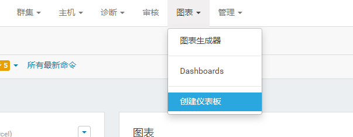

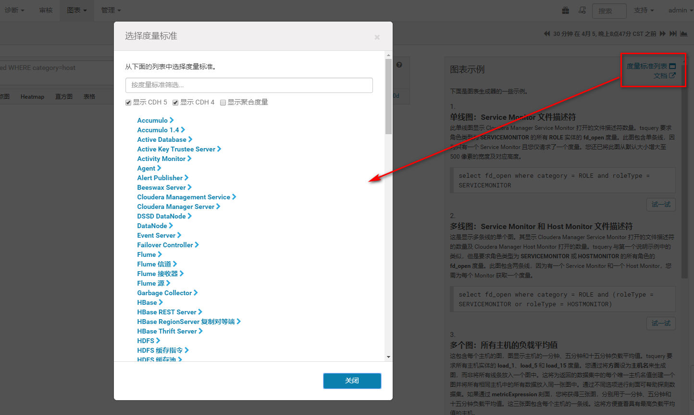

可以选择重要的信息显示
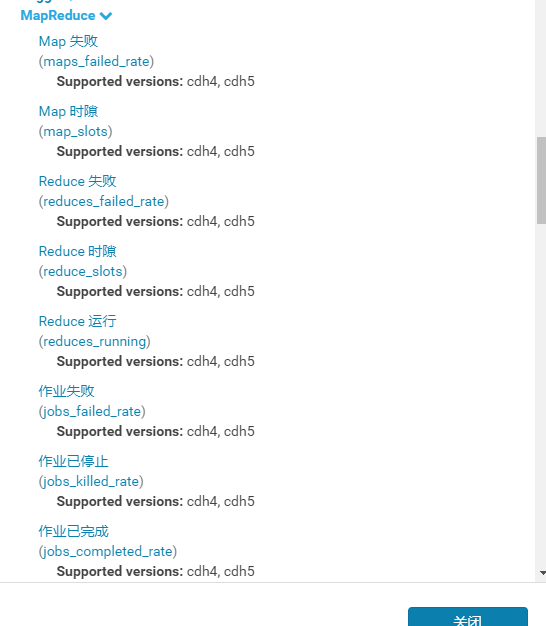

然后就可以查看了
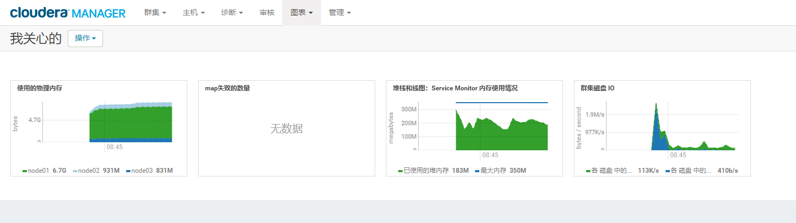

## 参数配置
以hdfs为例
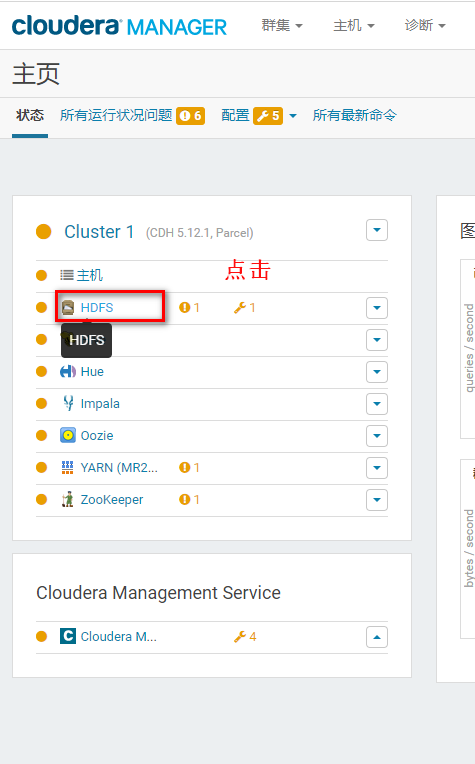

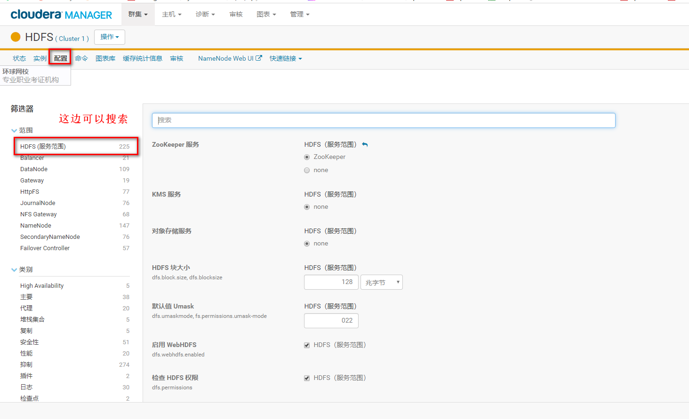

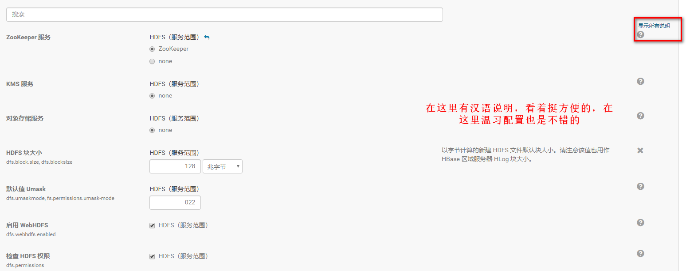

直接在页面上就行了，不要试图在配置文件中配置。

## webui
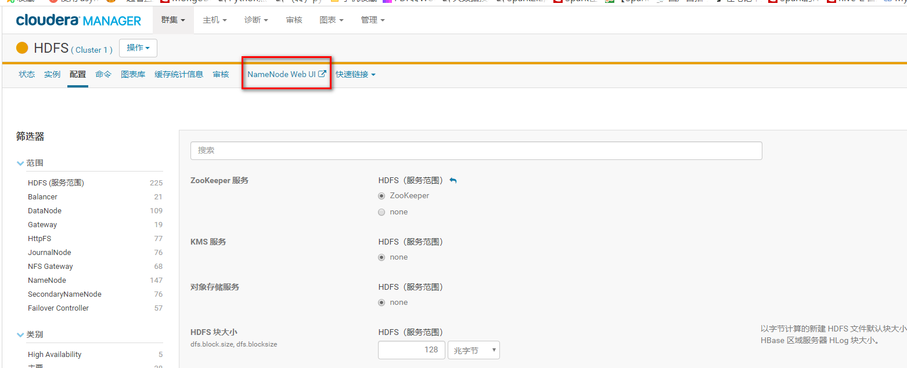

点击就打开一个tab页面：
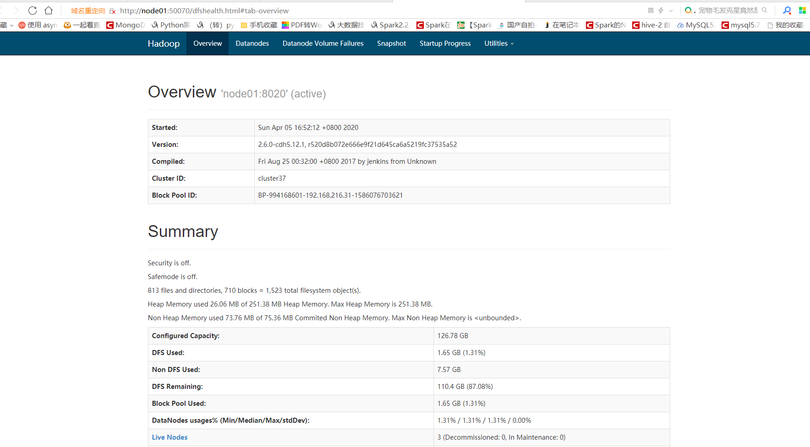

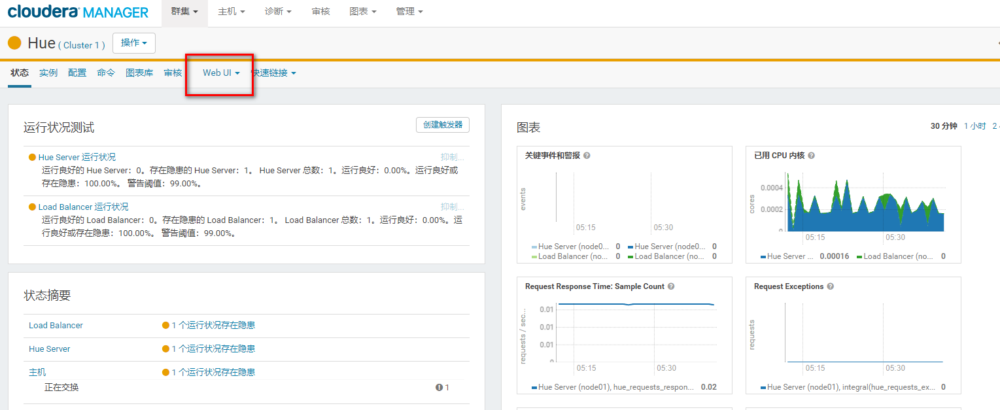

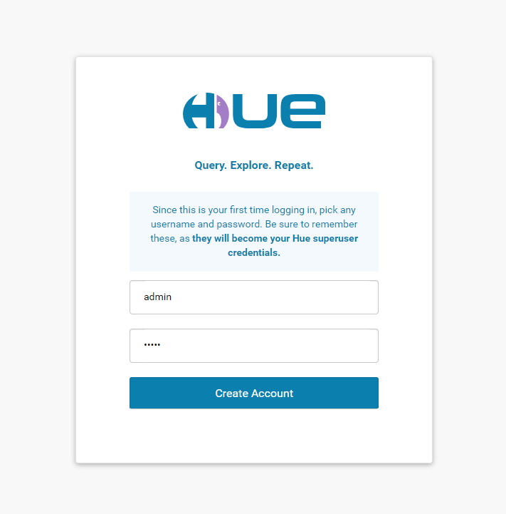

## 集群的停止与启动
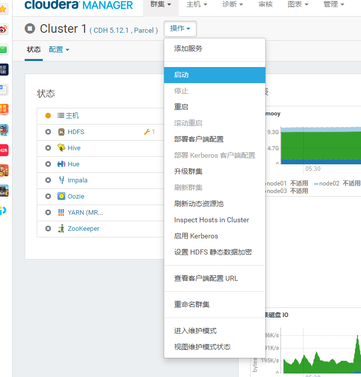

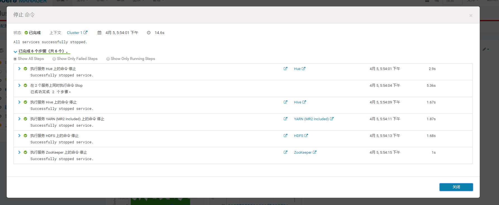

## 各个节点的信息
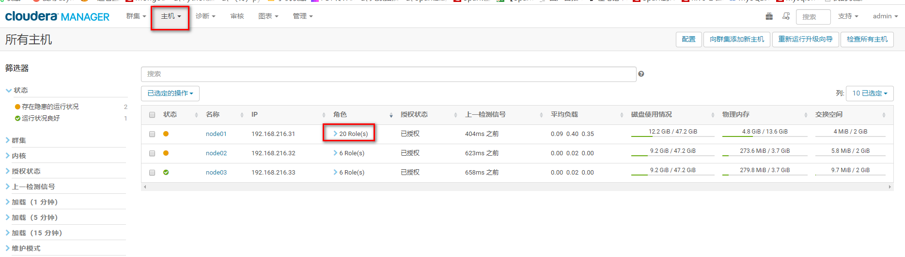

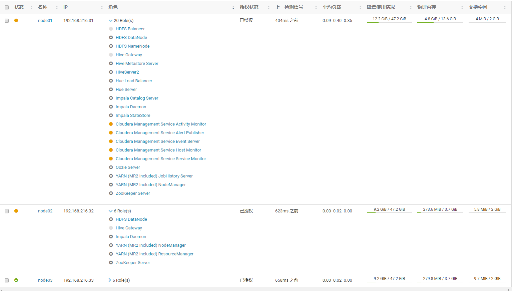


