# CDH hue的使用

## hdfs
用hdfs登录就进入了hdfs的家目录，hue只是对hadoop做了一层包装(把api变成了页面可视化操作)。

hdfs用户就是cdh中最大的用户，就是hdfs这个用户启动的hdfs进程。

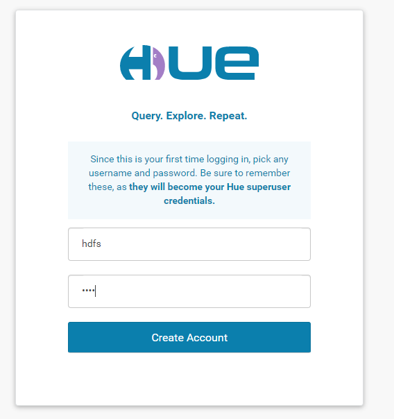

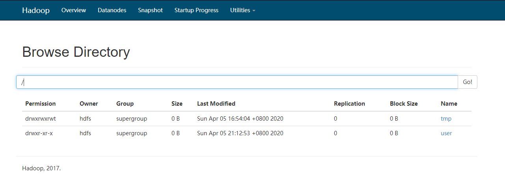

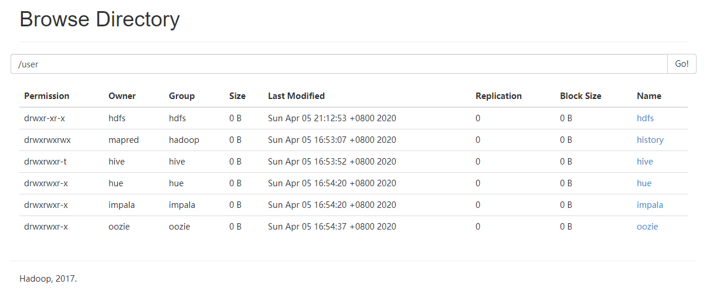

在页面上可以直接新建，重命名，修改小文件的内容(其实就是删除之后在添加，hue不不会修改hadoop的api，只是包装api)。
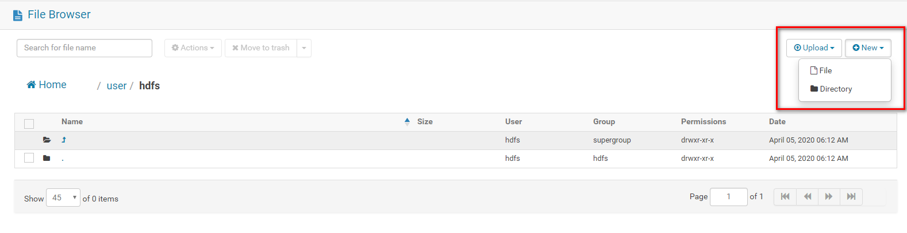

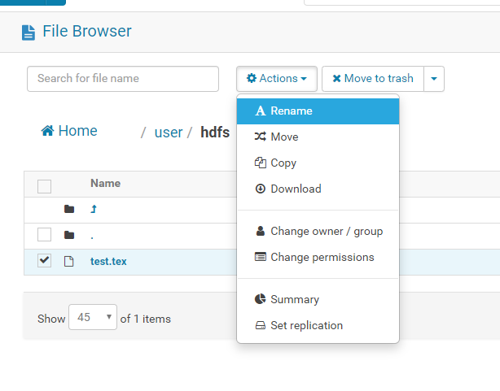

有中文版
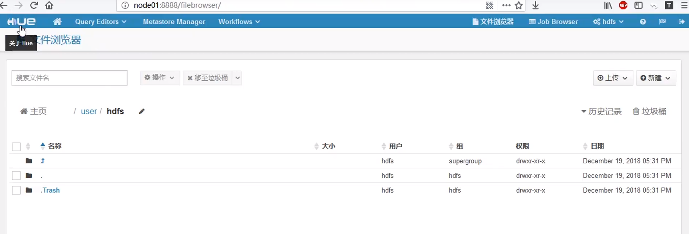

## Job Browser
类似于hadoop yarn的8088

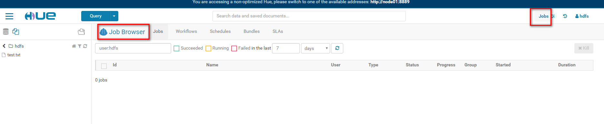

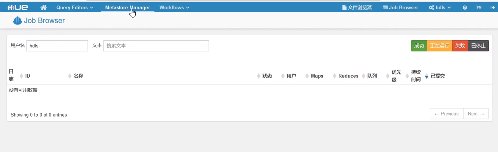

## query
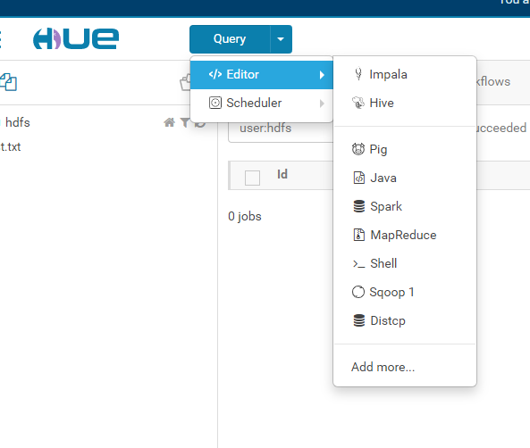

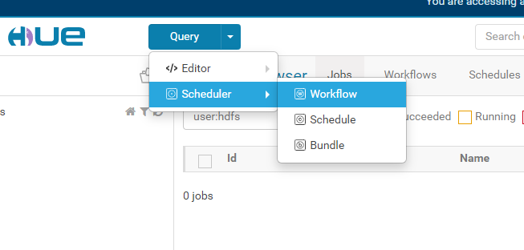

## workflow
包装了oozie可以直接拖拽，比直接用oozie方便好用太多

现在这边编写保存了，就可以在任务那引用了。
 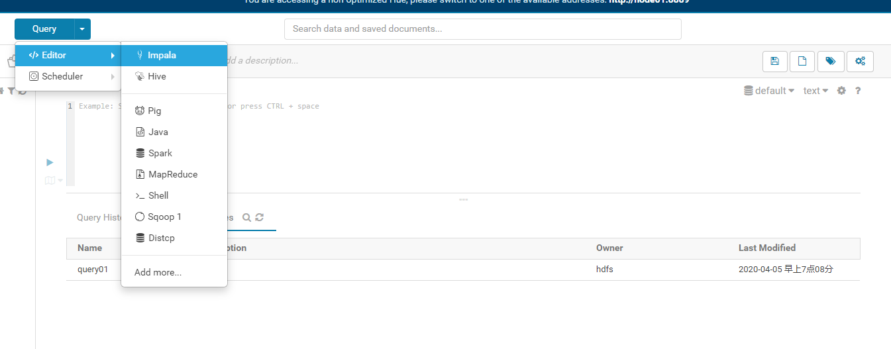
 
 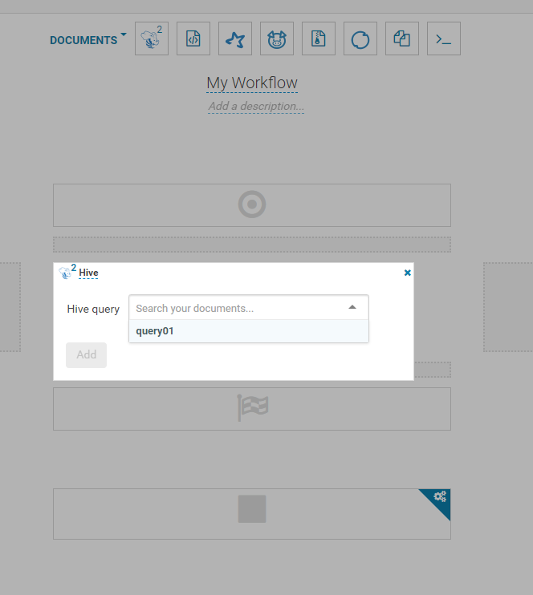
 
 ## hive 查询
 在这里可以直接执行hive语句
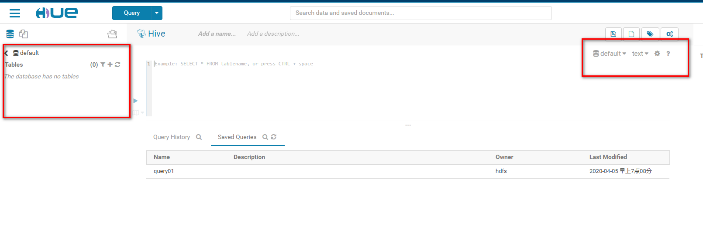
 
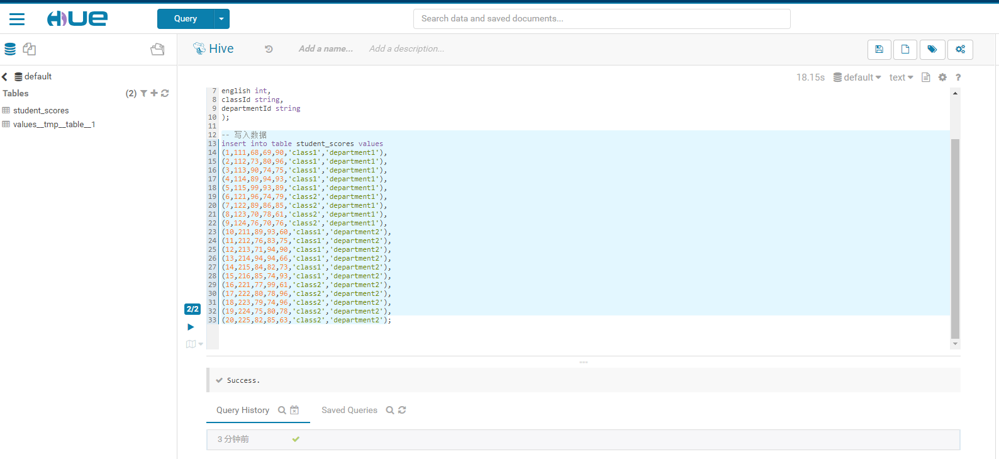
 
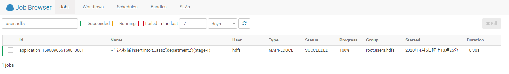

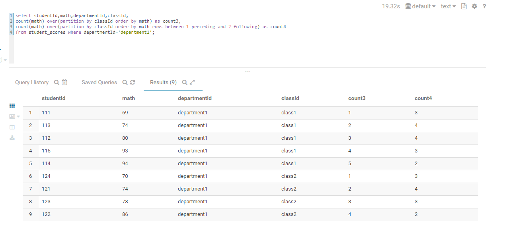

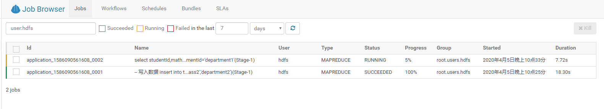

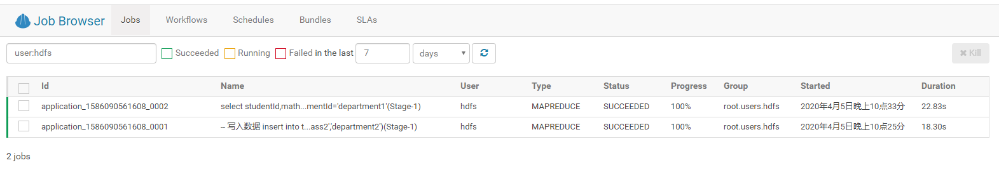

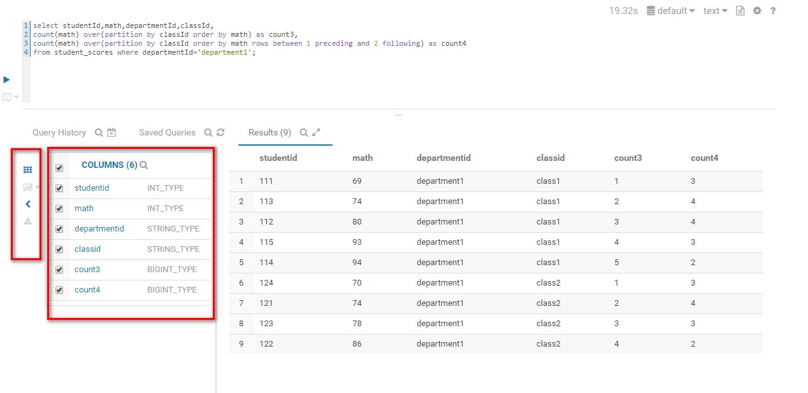

可以查看MapReduce的日志，还是比较好用的
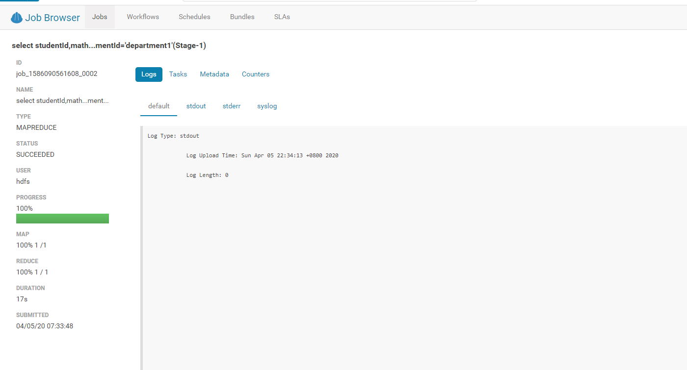

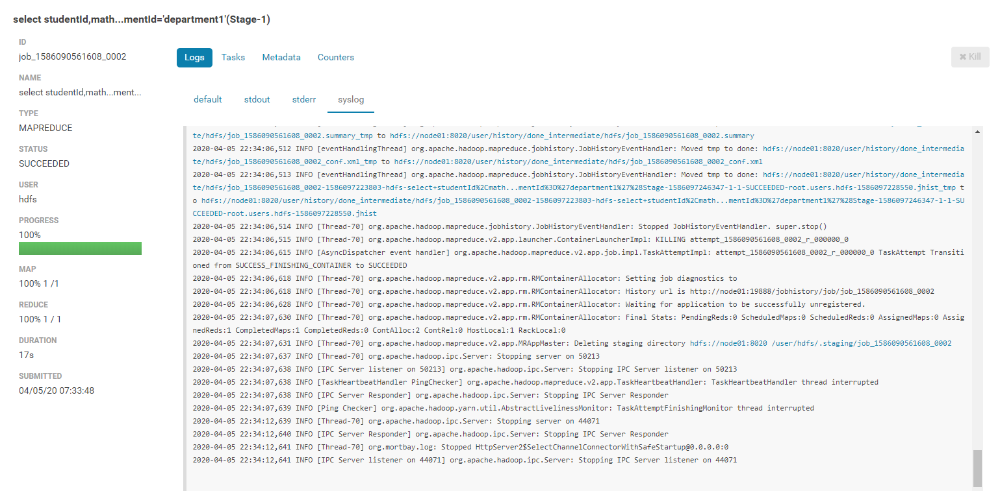

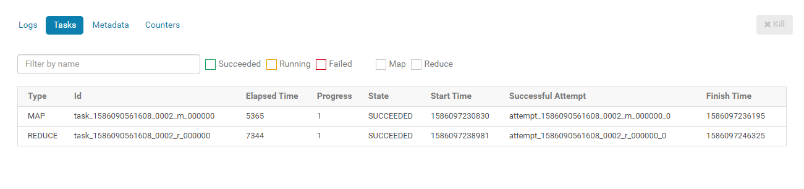
 
 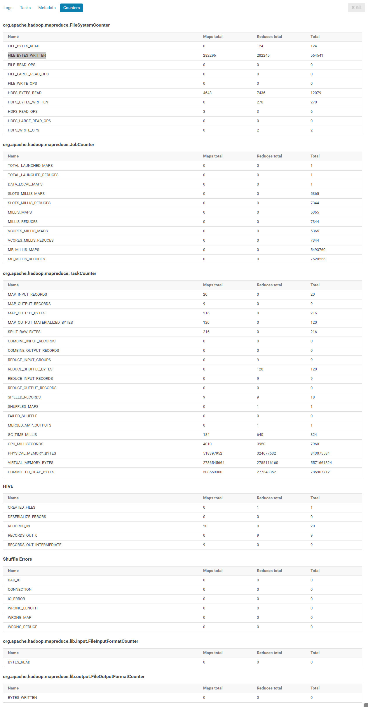
 
 cm中也可以监控到任务的运行：
 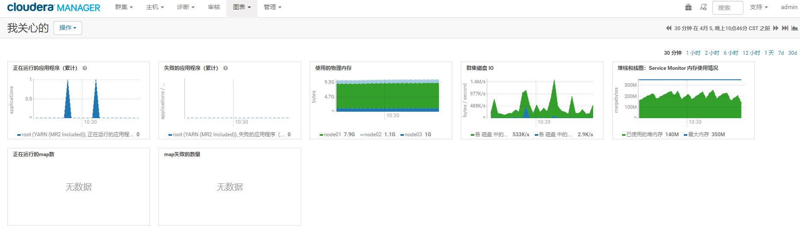
 
 
 