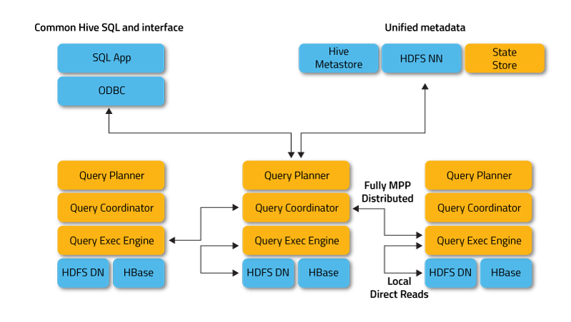
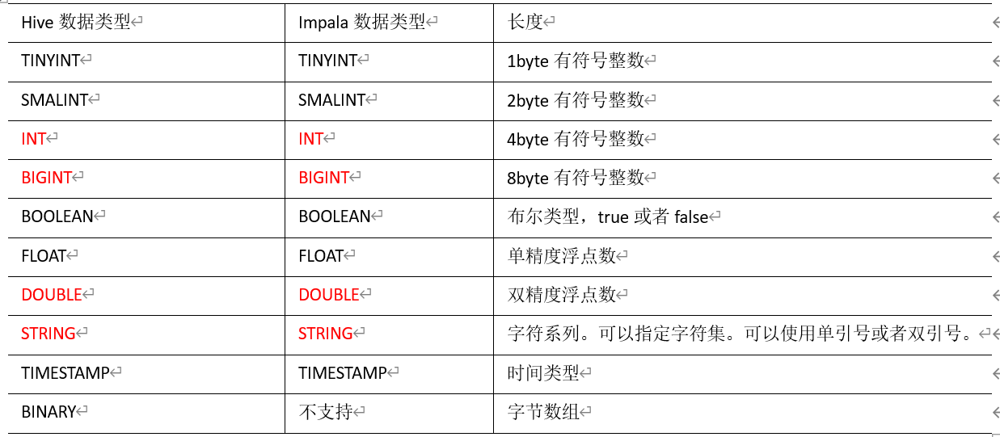

# Impala的基本概念与架构

## 什么是Impala
Cloudera公司推出，提供对HDFS、Hbase数据的高性能、低延迟的交互式SQL查询功能。

基于Hive，使用**内存计算**，兼顾数据仓库、具有实时、批处理、多并发等优点。

是**CDH平台首选**的PB级大数据实时查询分析引擎。


 Impala是用于处理存储在Hadoop集群中的大量数据的SQL查询引擎。它是一个用C ++和Java编写的开源软件。换句话说，Impala是性能最高的SQL引擎，它提供了访问存储在Hadoop分布式文件系统中的数据的最快方法。

impala使用hive的元数据, **完全在内存中计算**。impala完全依赖于hive。

Impala只是提供另一种查询方式而已，**并不是取代MapReduce或者Hive，而是对hive的一个补充**。相反的，Hive和其他构建在MapReduce上的框架，更多适用于批量的数据抽取，转换，ETL工作。

Impala的目的不在于替换现有的MapReduce工具。

把Hive与Impala配合使用效果最佳。

可以先使用Hive进行数据转换处理，之后再使用Impala在Hive处理后的结果数据集上进行快速的数据分析

## Impala的优缺点

### 优点
基于内存运算，不需要把中间结果写入磁盘，省掉了大量的I/O开销。能够对PB级数据进行交互式实时查询、分析。

无需转换为Mapreduce，直接访问存储在HDFS，HBase中的数据进行作业调度，速度快。
```
Impala没有MapReduce批处理，而是通过使用与商用并行关系数据库中类似的分布式查询引擎（由Query Planner、Query Coordinator和Query Exec Engine三部分组成
```
C++编写，LLVM统一编译运行
```
在底层对硬件进行优化， LLVM：编译器，比较稳定，效率高
```
兼容HiveSQL
```
支持hive基本的一些查询等，hive中的一些复杂结构是不支持的
```
使用了支持Data locality的I/O调度机制，尽可能地将数据和计算分配在同一台机器上进行，减少了网络开销。

支持各种文件格式，如TEXTFILE 、SEQUENCEFILE 、RCFile、**Parquet**。

可以访问hive的metastore，对hive数据直接做数据分析。

支持JDBC/ODBC远程访问


### 缺点
对内存的依赖大(没有内存溢出写入外存的机制)，且完全依赖于hive。
```
只在内存中计算，官方建议128G(一般64G基本满足)，可优化: 各个节点汇总的节点(服务器)内存选用大的，不汇总节点可小点
```

C++编写 开源 ？
```
对于java, C++可能不是很了解
```

实践中，分区超过1万，性能严重下降。
```
定期删除没有必要的分区，保证分区的个数不要太大
```

只能读取文本文件，而不能直接读取自定义二进制文件。

每当新的记录/文件被添加到HDFS中的数据目录时，该表需要被刷新。

稳定性不如hive
```
因完全在内存中计算，内存不够，会出现问题, hive内存不够，可使用外存
```

## Impala的组成部分
Impala由以下的组件组成：

1、Clients – Hue、ODBC clients、JDBC clients、和Impala Shell都可以与Impala进行交互，这些接口都可以用在Impala的数据查询以及对Impala的管理。

2、Hive Metastore（元数据） 存储Impala可访问数据的元数据。例如，这些元数据可以让Impala知道哪些数据库以及数据库的结构是可以访问的，当你**在Impala中**创建、删除、修改数据库对象或者加载数据到数据表里面，相关的元数据变化会自动通过广播的形式通知所有的Impala节点，这个通知过程由catalog service完成(在hive中新建的表，增加的分区等需要手动刷新)。

3、Cloudera Impala – Impala的进程运行在各个数据节点（Datanode）上面。每一个Impala的实例都可以从Impala client端接收查询，进而产生执行计划、协调执行任务。数据查询分布在各个Impala节点上，这些节点作为worker（工作者），并行执行查询。

4、HBase和HDFS – 存储用于查询的数据。


## Impala的架构

从上图可以看出，Impala自身包含三个模块：Impalad、Statestore和Catalog，除此之外它还依赖Hive Metastore和HDFS。

### Impala各进程角色


* State Store Daemon    
    * 负责收集分布在各个ImpalaD进程的资源信息、各节点健康状况，同步节点信息    
    * 负责调度Query    
* Catalog Daemon    
    * 主要跟踪各个节点上对元数据的变更操作，并且通知到每个ImpalaD。    
    * 接受来自StateStore的所有请求    
* Impala Daemon    
    * Query Planner接收来自SQL APP和ODBC的查询，然后将查询转换为许多子查询    
    * Query Coordinator将这些子查询分发到各个节点上    
    * 各个节点上的Query Exec Engine负责子查询的执行，然后返回子查询的结果，这些中间结果经过聚集之后最终返回给用户。


### Impala的核心组件

#### Impala Daemon
核心的Impala组件，在每个DataNode中都可以运行改组件，物理上就是一个Impalad进程，负责读写数据，接受来自impala-shell，Hue，JDBC或者ODBC的查询请求，数据的查询分布在集群中执行，查询的中间结果返回给coordinator节点。

**查询可以提交任何一个impala daemon** ，并且其会作为这个查询的coordinator，其他的impalad将部分查询结果返回给coordinator，coordinator负责整理成最终的结果，

impala-shell命令提交的查询功能，会直接连接命令所在机器的impala，而，对于生产环境的负载下，为了load-balance，可以借助round-robin随机方式，将每次查询请求发送不同的impalad，

impala daemon通过statestore 进行通信，来确保彼此哪个节点是健康的，能够接受新的工作。

当集群中，任何节点，create，alter，drop任何类型的数据，或者，当insert，load data语句被执行时候，impalad都会接受来自catelogd daemon（下文介绍，Impala 1.2之后引入）的消息，而在impala 1.2之前，需要使用refresh或者invalidate metadata语句完成节点之间的元数据同步。

Impala 2.9以后，可以控制哪些主机的impalad作为coordinators，哪些主机的impalad作为查询的executors，以此，针对高并发的负载，来提高集群的稳定性。

**coordinator**：

coordinator相当于中央协调器。负责调度、监控任务执行状态，对结果做最后的汇总计算。从impalad中指定（或分配）产生。

#### Impala Statestore
statestore用下检查所有impalad进程的健康状态，不断的将这些信息发送给所监控的每个impalad进程，物理上，是一个后台进程，叫做statestored，在集群中，只能在一个机器上启动一个statestored进程，如果任何一个impalad因为各种问题失去联系，statestore都会发现，并告诉每一个impalad，后续的查询任何不要发给这个不可到达的节点，

statestore的作用，出现错误的时候，提供帮助以及传递元数据在coordinators之间，因此，对impala集群的正常操作，不是一直很重要。如果statestore没有运行或者不可访问，impalad仍然能够运行，并且任务也能够正常分布运行，仅仅，结果只是当其他impalad失败后，集群变得不健壮而已，元数据变得不一致而已，但是，当statestore恢复后，impalad能够重新和其建立连接，statestore也能重新恢复监控和信息传递功能。

我们跟多考虑的是impalad的高可用性，statestored和catelogd并没有这样的需求，因此他们不会影响到数据丢失。当他们不可用的时候，可以停止impala服务，将对应机器上的impala statestored角色删除，并在新的机器上启动statestored服务，启动impalad服务即可。

#### mpala Catalog Service
**同statestore一样，一个集群只能有一个catelog服务，一个进程**，catelogd，作用在于，在impalad之间同步元数据的改变。另外，因为请求是通过statestored完成传递的，因此，**将catelogd和statestored放在同一个host机器中最好**。

当元数据因为操作语句发生改变，catelog避免使用refresh和invalidate metadata命令。当我们通过hive创建表，load data，等等，需要使用refresh和invalidate metadata同步下元数据，在任何执行查询之前。

**当通过impala执行create table，insert或则其他table改变，数据改变时候，不需要执行refresh和invalidate metadata，但是通过hive执行时候或者直接操作hdfs，就需要执行refresh和invalidate metadata了，并且，只需要在一个impala节点上执行即可。**


Impala采用cloudera manager安装，可以看到几个组件的安装情况如下，


## 整体架构流程 


1、客户端向某一个Impalad发送一个query(SQL)客户端向某一个Impalad发送一个query(SQL)    
```
Impalad会与StateStore保持连接(通信)，确定impala集群哪写Impalad是否健康可工作，与NameNode得到数据元数据信息(数据的位置等)；每个Impalad通过Catalog可知表元数据据信息；
```
2、Impalad将query解析为具体的执行计划Planner, 交给当前机器Coordinator即为中心协调节点Impalad将query解析为具体的执行计划Planner, 交给当前机器Coordinator即为中心协调节点    
```
Impalad通过jni，将query传送给java前端，由java前端完成语法分析和生成执行计划(Planner)，并将执行计划封装成thrift格式返回执行计划分为多个阶段，每一个阶段叫做一个（计划片段）PlanFragment，每一个PlanFragment在执行时可以由多个Impalad实例并行执行(有些PlanFragment只能由一个Impalad实例执行),
```
3、Coordinator(中心协调节点)根据执行计划Planner，通过本机Executor执行，并转发给其它有数据的impalad用Executor进行执行Coordinator(中心协调节点)根据执行计划Planner，通过本机Executor执行，并转发给其它有数据的impalad用Executor进行执行    
4、impalad的Executor之间可进行通信，可能需要一些数据的处理impalad的Executor之间可进行通信，可能需要一些数据的处理    
5、各个impalad的Executor执行完成后，将结果返回给中心协调节点各个impalad的Executor执行完成后，将结果返回给中心协调节点    
```
用户调用GetNext()方法获取计算结果，如果是insert语句，则将计算结果写回hdfs
当所有输入数据被消耗光，执行结束(完成)。
在执行过程中，如果有任何故障发生，则整个执行失败
```
6、有中心节点Coordinator将汇聚的查询结果返回给客户端有中心节点Coordinator将汇聚的查询结果返回给客户端
```
所以有大量数据返回时，中心节点Coordinator需要的内存比较多，因为把所有分区的数据都放在这
```

## Impala查询数据流程


* 1、注册&订阅：当Impala启动时，所有Impalad节点会在Impala State Store中注册并订阅各个节点最新的健康信息以及负载情况。注册&订阅：当Impala启动时，所有Impalad节点会在Impala State Store中注册并订阅各个节点最新的健康信息以及负载情况。    
* 2、提交查询：接受此次查询的ImpalaD作为此次的Coordinator，对查询的SQL语句进行分析，生成并执行任务树，不同的操作对应不同的PlanNode，如：SelectNode、 ScanNode、 SortNode、AggregationNode、HashJoinNode等等。提交查询：接受此次查询的ImpalaD作为此次的Coordinator，对查询的SQL语句进行分析，生成并执行任务树，不同的操作对应不同的PlanNode，如：SelectNode、 ScanNode、 SortNode、AggregationNode、HashJoinNode等等。    
* 3、获取元数据与数据地址：Coordinator通过查询数据库，或者HDFS文件获取到此次查询的数据库所在的具体位置，以及存储方式的信息获取元数据与数据地址：Coordinator通过查询数据库，或者HDFS文件获取到此次查询的数据库所在的具体位置，以及存储方式的信息    
* 4、分发查询任务：执行计划树里的每个原子操作由Plan Fragment组成，通常一句SQL由多个Fragment组成。Coordinator节点根据执行计划以及获取到的数据存储信息，通过调度器将Plan Fragment分发给各个Impalad实例并行执行。分发查询任务：执行计划树里的每个原子操作由Plan Fragment组成，通常一句SQL由多个Fragment组成。Coordinator节点根据执行计划以及获取到的数据存储信息，通过调度器将Plan Fragment分发给各个Impalad实例并行执行。    
* 5、汇聚结果：Coordinator节点会不断向各个Impalad执行子节点获取计算结果，直到所有执行计划树的叶子节点执行完毕，并向父节点返回计算结果集。汇聚结果：Coordinator节点会不断向各个Impalad执行子节点获取计算结果，直到所有执行计划树的叶子节点执行完毕，并向父节点返回计算结果集。    
* 6、Coordinator节点即执行计划数的根节点，汇聚所有查询结果后返回给用户。查询执行结束，注销此次查询服务。Coordinator节点即执行计划数的根节点，汇聚所有查询结果后返回给用户。查询执行结束，注销此次查询服务。

## 元数据缓存
- impala集群中的元数据是保存在hive的metastore中的（mysql数据库中）

- 当impala集群启动之后，catalogd会从hive的metastore中把元数据信息同步过来，然后通过Statestore分发元数据信息到impala daemon中进行缓存。

- 如果在impala deamon中产生的元数据变更（创建库、创建表、修改表）操作。，Catalog服务通知所有Impala daemons来更新缓存。这些都会缓存下来，然后通过catalog持久化这些信息到hive的metastore中.

- 如果是hive的客户端进行了元数据的变更操作，这个时候对于impala来说是不知道的，这里就需要impala去手动同步刷新.

  - **refresh**命令手动同步

    - 用于刷新某个表或者某个分区的数据信息，它会重用之前的表元数据，仅仅执行文件刷新操作
    - 例如insert into、load data、alter table add partition、alter table drop partition等。

    ```
    REFRESH [table]                             //刷新某个表
    REFRESH [table] PARTITION [partition]       //刷新某个表的某个分区
    ```

  - **imvalidate metadata**命令手动同步

    - 用于刷新全库或者某个表的元数据，包括表的元数据和表内的文件数据.
    - 例如hive中create table/drop table/alter table add columns等操作。

    ```
    INVALIDATE METADATA;                   //重新加载所有库中的所有表
    INVALIDATE METADATA [table]            //重新加载指定的某个表
    ```

## Impala Join操作

### Broadcast Join


* Impala将较小的表通过网络分发到执行任务的Impala后台进程中    
* 小表数据分发并缓存完成后，大表的数据就流式地通过内存中小表的哈希表。每个Impala进程负责大表的一部分数据，扫面读入，并用哈希连接的函数计算值。    
* 大表的数据一般由Impala进程从本地磁盘读入从而减少网络开销。由于小表的数据已经缓存在每个节点中，因此在此阶段唯一可能的网络传输就是将结果发送给查询计划中的另一个连接节点。

### Partitioned Hash Join


分区哈希连接需要更多的网络开销，但可以允许大表的连接而不要求整个表的数据都能放到一个节点的内存中。当统计数据显示表太大而无法放到一个节点的内存中或者有查询提示时就会使用分区哈希连接。

进行分区哈希连接时（也称为shuffle join），每个Impala进程读取两个表的本地数据，使用一个哈希函数进行分区并把每个分区分发到不同的Impala进程。

正如上图所示，大表的数据也通过相同的哈希函数就行分区并把分区发送能和小表相应数据进行连接的结点。注意，和广播连接不同的是，广播连接只有小表的数据需要通过网络分发，而分区哈希连接需要通过网络分发大表和小表的数据，因此需要更高的网络开销。

```
 Impala有两种连接策略：广播连接，需要更多的内存并只适用于大小表连接。分区连接，需要更多的网络资源，性能比较低，但是能进行大表之间的连接。
```

## Impala与Hive的异同


Hive适合于长时间的批处理查询分析，而Impala适合于实时交互式SQL查询。

**数据存储**

使用相同的存储数据池都支持把数据存储于HDFS, HBase。

**元数据**：

两者使用相同的元数据

**SQL解释处理**：

比较相似都是通过词法分析生成执行计划。

**执行计划**：

Hive: 依赖于MapReduce执行框架，执行计划分成 map->shuffle->reduce->map->shuffle->reduce…的模型。如果一个Query会 被编译成多轮MapReduce，则会有更多的写中间结果。由于MapReduce执行框架本身的特点，过多的中间过程会增加整个Query的执行时间。

Impala: 把执行计划表现为一棵完整的执行计划树，可以更自然地分发执行计划到各个Impalad执行查询，而不用像Hive那样把它组合成管道型的 map->reduce模式，以此保证Impala有更好的并发性和避免不必要的中间sort与shuffle。

**数据流**：

Hive: 采用推的方式，每一个计算节点计算完成后将数据主动推给后续节点。

Impala: 采用拉的方式，后续节点通过getNext主动向前面节点要数据，以此方式数据可以流式的返回给客户端，且只要有1条数据被处理完，就可以立即展现出来，而不用等到全部处理完成，更符合SQL交互式查询使用。

**内存使用**：

Hive: 在执行过程中如果内存放不下所有数据，则会使用外存，以保证Query能顺序执行完。每一轮MapReduce结束，中间结果也会写入HDFS中，同样由于MapReduce执行架构的特性，shuffle过程也会有写本地磁盘的操作。

Impala: 在遇到内存放不下数据时，当前版本1.0.1是直接返回错误，而不会利用外存，以后版本应该会进行改进。这使用得Impala目前处理Query会受到一 定的限制，最好还是与Hive配合使用。Impala在多个阶段之间利用网络传输数据，在执行过程不会有写磁盘的操作（insert除外）

**调度**

Hive任务的调度依赖于Hadoop的调度策略。

Impala的调度由自己完成，目前的调度算法会尽量满足数据的局部性，即扫描数据的进程应尽量靠近数据本身所在的物理机器。但目前调度暂时还没有考虑负载均衡的问题。从Cloudera的资料看，Impala程序的瓶颈是网络IO，目前Impala中已经存在对Impalad机器网络吞吐进行统计，但目前还没有利用统计结果进行调度。

**容错**

Hive任务依赖于Hadoop框架的容错能力，可以做到很好的failover

Impala中不存在任何容错逻辑，如果执行过程中发生故障，则直接返回错误。当一个Impalad失败时，在这个Impalad上正在运行的所有query都将失败。但由于Impalad是对等的，用户可以向其他Impalad提交query，不影响服务。当StateStore失败时，也不会影响服务，但由于Impalad已经不能再更新集群状态，如果此时有其他Impalad失败，则无法及时发现。这样调度时，如果谓一个已经失效的Impalad调度了一个任务，则整个query无法执行。

**Hive与Impala的不同点总结如下**：

* Hive适合于长时间的批处理查询分析，而Impala适合于实时交互式SQL查询。    
* Hive依赖于MapReduce计算框架，Impala把执行计划表现为一棵完整的执行计划树，直接分发执行计划到各个Impalad执行查询。    
* Hive在执行过程中，如果内存放不下所有数据，则会使用外存，以保证查询能顺序执行完成，而Impala在遇到内存放不下数据时，不会利用外存，所以Impala目前处理查询时会受到一定的限制。


**Hive与Impala的相同点总结如下**：

* Hive与Impala使用相同的存储数据池，都支持把数据存储于HDFS和HBase中。    
* Hive与Impala使用相同的元数据。    
* Hive与Impala中对SQL的解释处理比较相似，都是通过词法分析生成执行计划。


## Impala的数据类型

| Hive数据类型 | Impala数据类型 | 长度                                                 |
| ------------ | -------------- | ---------------------------------------------------- |
| TINYINT      | TINYINT        | 1byte有符号整数                                      |
| SMALINT      | SMALINT        | 2byte有符号整数                                      |
| INT          | INT            | 4byte有符号整数                                      |
| BIGINT       | BIGINT         | 8byte有符号整数                                      |
| BOOLEAN      | BOOLEAN        | 布尔类型，true或者false                              |
| FLOAT        | FLOAT          | 单精度浮点数                                         |
| DOUBLE       | DOUBLE         | 双精度浮点数                                         |
| STRING       | STRING         | 字符系列。可以指定字符集。可以使用单引号或者双引号。 |
| TIMESTAMP    | TIMESTAMP      | 时间类型                                             |
| BINARY       | 不支持         | 字节数组                                             |



注意：Impala虽然支持array，map，struct复杂数据类型，但是支持并不完全，一般处理方法，将复杂类型转化为基本类型，通过hive创建表。


```

```