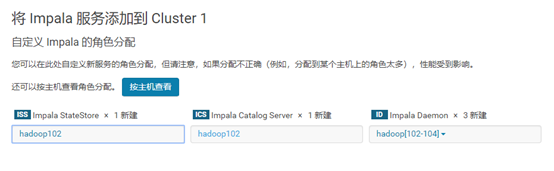

# Impala的安装

## Impala的地址
1.	Impala的官网
http://impala.apache.org/

2.	Impala文档查看
http://impala.apache.org/impala-docs.html

3.	下载地址
http://impala.apache.org/downloads.html

## Impala的安装方式
* Cloudera Manager（CDH首推）    
* 手动安装  

下面我们使用Cloudera Manager安装Impala

1.在主页中点击添加服务


2.选择Impala服务


3.进行角色分配

**注意：最好将StateStore和CataLog Sever单独部署在同一节点上。**

4.配置Impala

 
5.启动Impala

 
6.安装成功


##  Impala 的监护管理
可以通过下面的链接来访问Impala的监护管理页面：

• 查看StateStore

http://hadoop102:25020/

• 查看Catalog

http://hadoop102:25010/

## Impala的初体验
1.启动Impala
```
[root@hadoop102 ~]# impala-shell
```
2.查看数据库
```
[hadoop102:21000] > show databases;
```
3.打开默认数据库
```
[hadoop102:21000] > use default;
```
4.显示数据库中的表
```
[hadoop102:21000] > show tables;
```
5.创建一张student表
```
[hadoop102:21000] > create table student(id int, name string)
                  > row format delimited
                  > fields terminated by '\t';
```
6.向表中导入数据
```
[hadoop103:21000] > load data inpath '/student.txt' into table student;
```

注意：
```
1)	关闭（修改hdfs的配置dfs.permissions为false）或修改hdfs的权限，否则impala没有写的权限
[hdfs@hadoop103 ~]$ hadoop fs -chmod -R 777 /
2)	Impala不支持将本地文件导入到表中
```

7.查询
```
[hadoop103:21000] > select * from student;
```
8.退出impala
```
[hadoop103:21000] > quit;
```

## impala分页
impala中的分页是通过limit和offset实现，例如页大小为4，按id升序，我们要取user_info中第三页的数据，分页语句为select * from user_info order by id asc limit 2 offset 4;


也就是limit后面为pageSize，offset后面为（currentPage-1）*pageSize。

## 使用java连接impala进行基本的操作
`https://blog.csdn.net/qiyongkang520/article/details/51067803`

pom依赖：由于impala使用的就是hive的元数据，因此直接可以通过连接thrift server进行相关操作。故使用hive的依赖即可。

首先，直接贴出代码如下：
```java
package org.impala.demo;

import java.sql.Connection;
import java.sql.DriverManager;
import java.sql.ResultSet;
import java.sql.SQLException;
import java.sql.Statement;

import org.apache.log4j.Logger;

public class ImpalaJdbcClient {
    private static String driverName = "org.apache.hive.jdbc.HiveDriver";
    private static String url = "jdbc:hive2://172.31.25.8:21050/qyk_test;auth=noSasl";
    private static String user = "impala";
    private static String password = "";
    private static final Logger log = Logger.getLogger(ImpalaJdbcClient.class);

    public static void main(String[] args) {
        try {
            Class.forName(driverName);
            Connection conn = DriverManager.getConnection(url, user, password);
            Statement stmt = conn.createStatement();

            // 创建的表名
            String tableName = "user";
            stmt.execute("drop table if exists " + tableName);
            stmt.execute("create table " + tableName
                    + " (key int, value string) row format delimited fields terminated by '\t'");
            // show tables
            String sql = "show tables '" + tableName + "'";
            System.out.println("Running: " + sql);
            ResultSet res = stmt.executeQuery(sql);
            if (res.next()) {
                System.out.println(res.getString(1));
            }
            // describe table
            sql = "describe " + tableName;
            System.out.println("Running: " + sql);
            res = stmt.executeQuery(sql);
            while (res.next()) {
                System.out.println(res.getString(1) + "\t" + res.getString(2));
            }

            // load data into table
            // NOTE: filepath has to be local to the hive server
            // NOTE: /tmp/a.txt is a ctrl-A separated file with two fields per
            // line
            String filepath = "/tmp/userinfo.txt";
            sql = "load data inpath '" + filepath + "' into table " + tableName;
            System.out.println("Running: " + sql);
            stmt.execute(sql);

            // select * query
            sql = "select * from " + tableName;
            System.out.println("Running: " + sql);
            res = stmt.executeQuery(sql);
            while (res.next()) {
                System.out.println(String.valueOf(res.getInt(1)) + "\t" + res.getString(2));
            }

            // regular hive query
            sql = "select count(1) from " + tableName;
            System.out.println("Running: " + sql);
            res = stmt.executeQuery(sql);
            while (res.next()) {
                System.out.println(res.getString(1));
            }
        } catch (ClassNotFoundException e) {
            e.printStackTrace();
            log.error(driverName + " not found!", e);
            System.exit(1);
        } catch (SQLException e) {
            e.printStackTrace();
            log.error("Connection error!", e);
            System.exit(1);
        }

    }
}
```
然后，准备一个userinfo.txt如下，放在hdfs上的/tmp目录下：
```
1   zhangshan
2   lisi
3   wangwu
5   baidu
```

然后，执行可以看到控制台输出如下：


然后，我们在impala命令行执行select * from user，可以看到：


```

```


