# 篇四|ClickHouse的可视化界面与集群状态监控
摘抄自：`https://www.cnblogs.com/jmx-bigdata/p/14021185.html`


## 介绍


tabix支持通过浏览器直接连接 ClickHouse，不需要安装其他软件，就可以访问ClickHouse，具有以下特点：


* ⾼亮语法的编辑器。    
* ⾃动命令补全。    
* 查询命令执⾏的图形分析⼯具。    
* 配⾊⽅案选项。


除此之外，还可以使用DBeaver连接ClickHouse，本文主要介绍这两种工具的使用方式。


## 方式1：不安装，直接使用浏览器访问


地址为：https://github.com/tabixio/tabix。在浏览器打开下面链接

```sql
http://ui.tabix.io/

```

进入该链接后，界面如下：


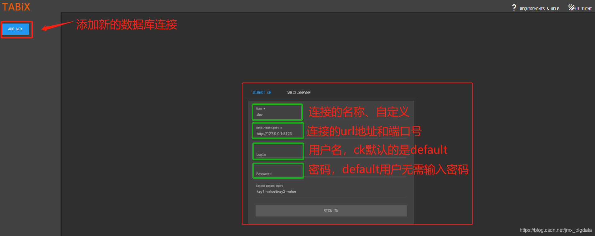


在这里，使用默认的用户名:**default**，密码不用填写，登录的url即是要访问的ClickHouse Server的地址，默认端口号为8123。登录之后，界面如下：


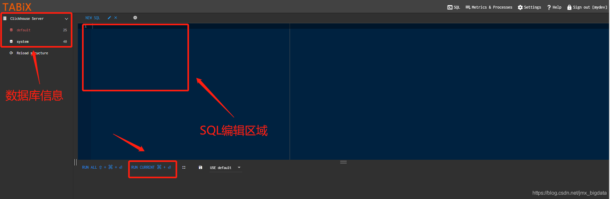


执行查询语句：


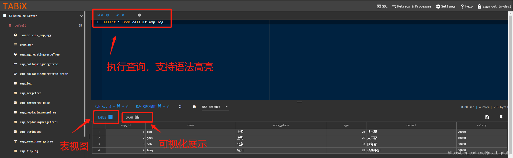


点击**DRAW**按钮，可以进行可视化展示：


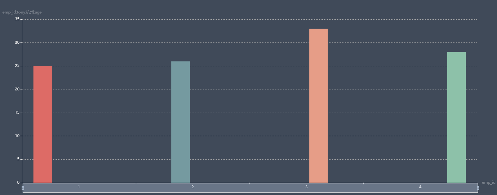


点击右上方的**Metrics&Processes**可以查看查询进程与集群状况：


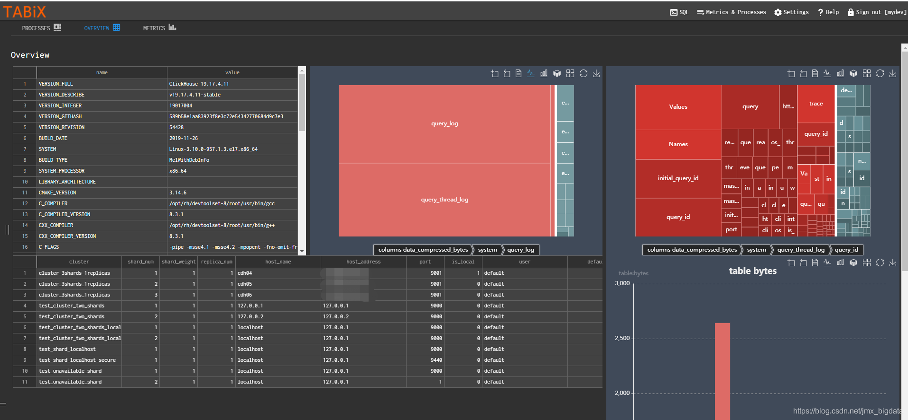


## 方式2：内嵌方式


修改配置文件：`/etc/clickhouse-server/config.xml`:


原配置文件该段配置被注释掉了，释放掉注释即可：

```sql
<!-- Default root page on http[s] server. For example load UI from https://tabix.io/ when opening http://localhost:8123 -->
<http_server_default_response><![CDATA[<html ng-app="SMI2"><head><base href="http://ui.tabix.io/"></head><body><div ui-view="" class="content-ui"></div><script src="http://loader.tabix.io/master.js"></script></body></html>]]></http_server_default_response>

```

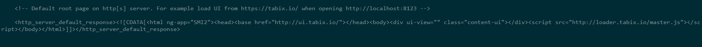


然后重启server，浏览器访问：`http://ckserverhost:8123`，地址即为ClickHouse Server的地址。


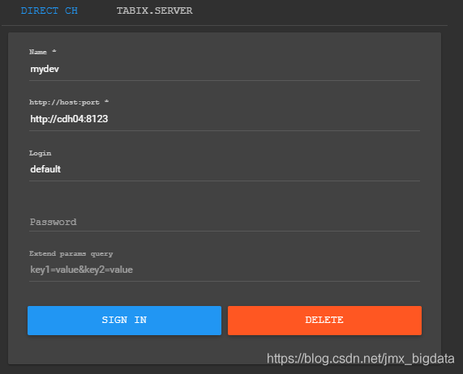


登录之后，与之前的操作类似。


关于tabix的安装，官网给出了多种方式，感兴趣的可以参见官网`https://tabix.io/doc/Install/`


下面介绍一种IDE工具，连接ClickHouse。


## 方式3：使用DBeaver


在[一统江湖的数仓开发辅助神器–DBeaver](https://mp.weixin.qq.com/s/7mtKxik_Ir00SPhSbfS28A "一统江湖的数仓开发辅助神器–DBeaver")这篇文章中介绍了DBeaver的基本使用，感兴趣的可以在回过去看一下。使用DBeaver连接ClickHouse非常简单，但是注意ClickHouse-jdbc的驱动，最好不要使用默认下载的驱动。关于驱动的下载，见下面的地址：

```sql
https://jar-download.com/?search_box=clickhouse-jdbc

```

打开DBeaver，新建连接，选择ClickHouse。


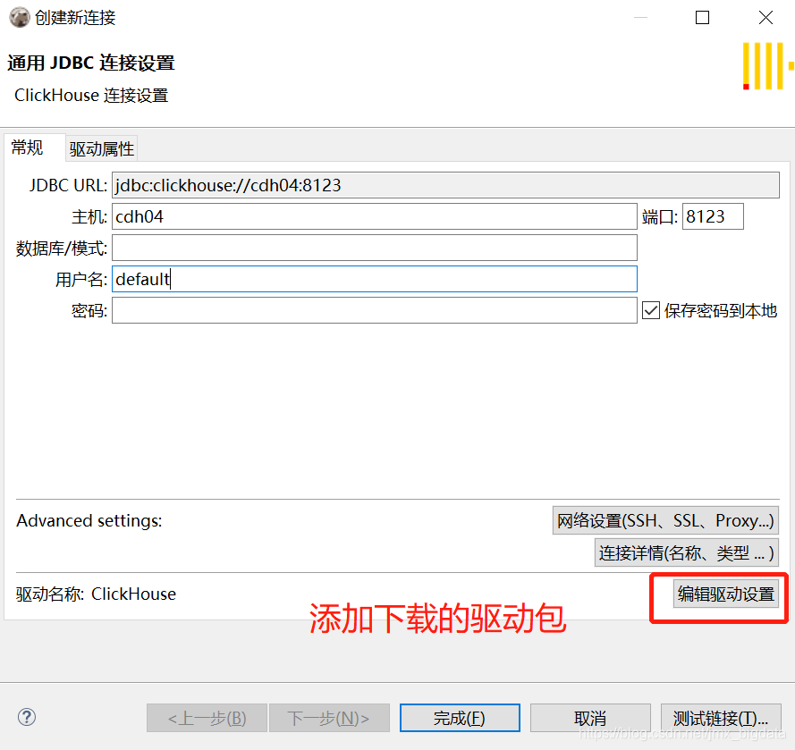


点击**编辑驱动设置**，添加驱动


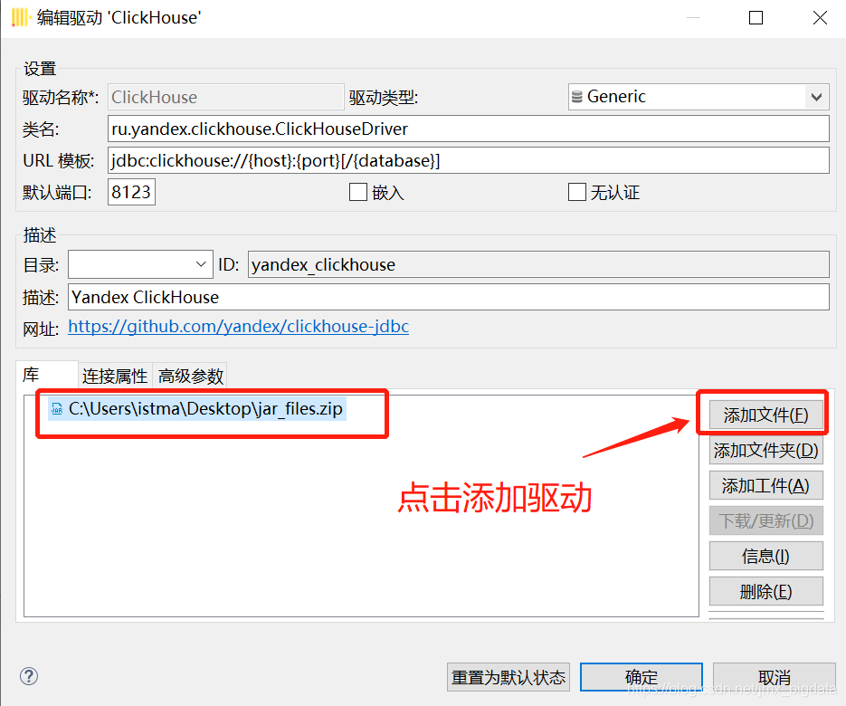


**测试连接**


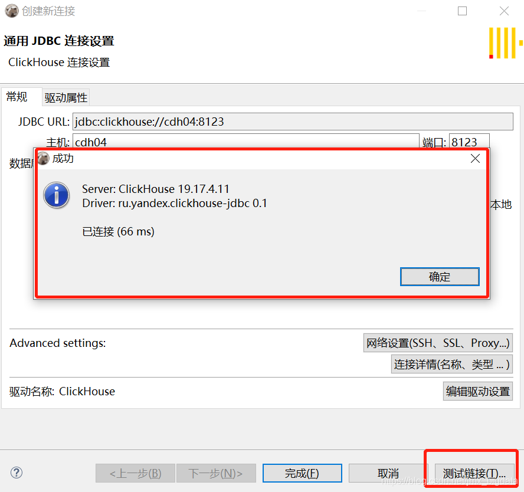


连接成功之后，界面如下，可以进行查询测试


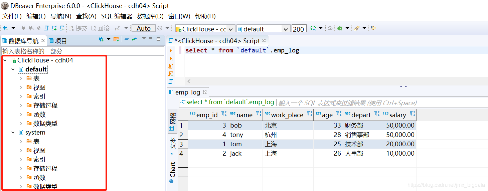

