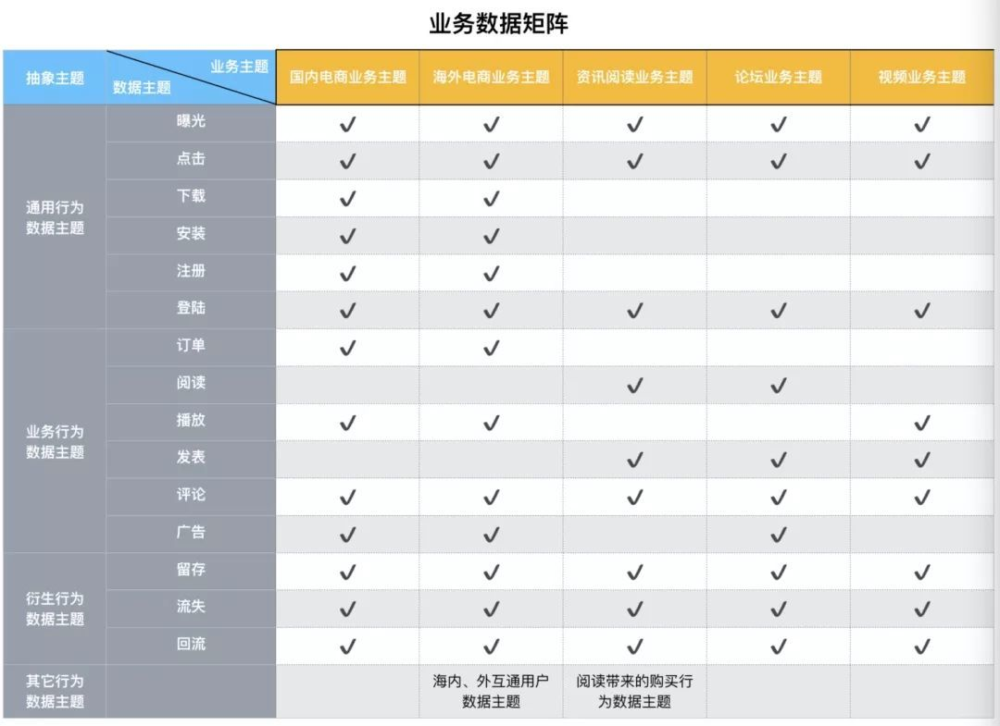
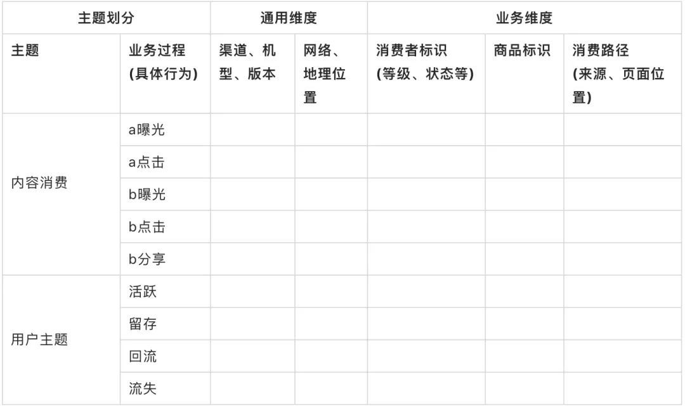
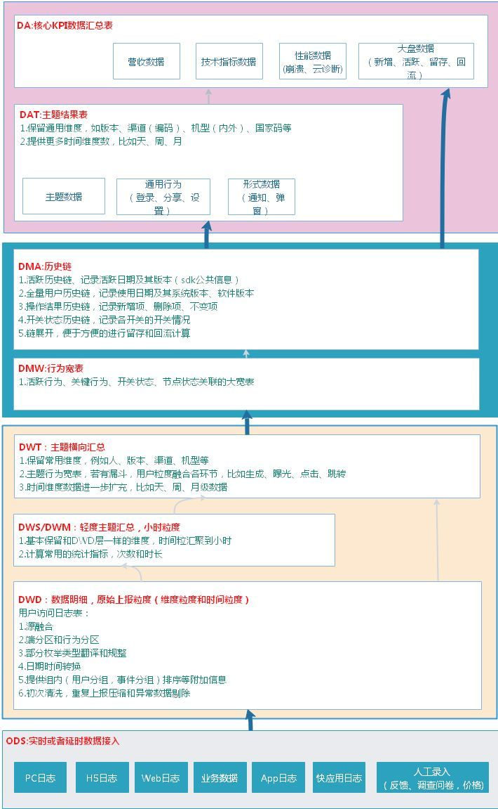
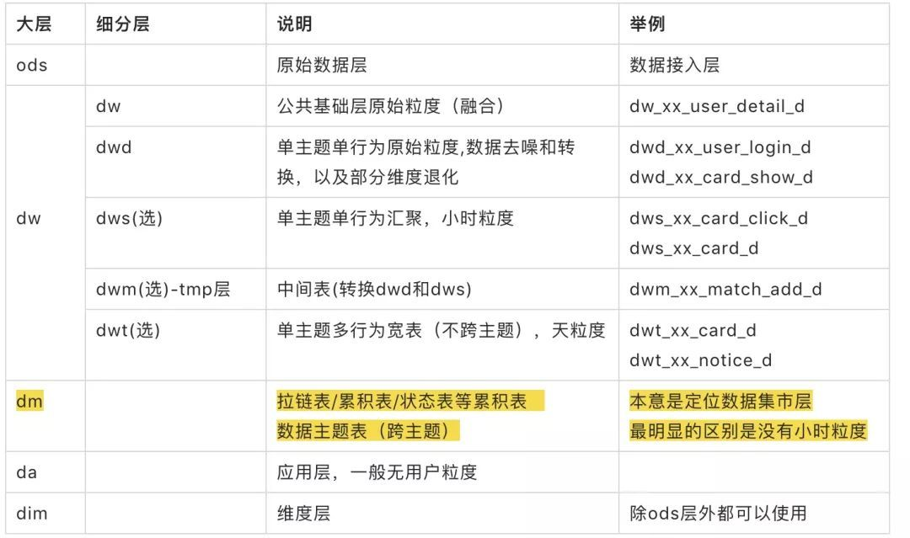
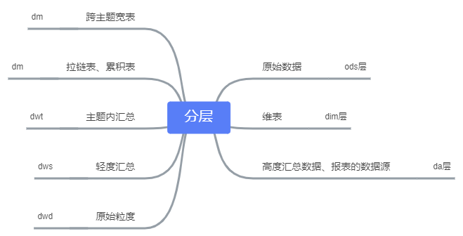
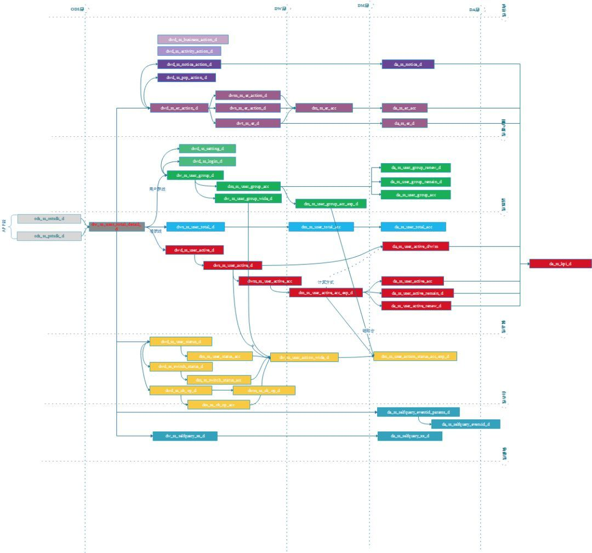
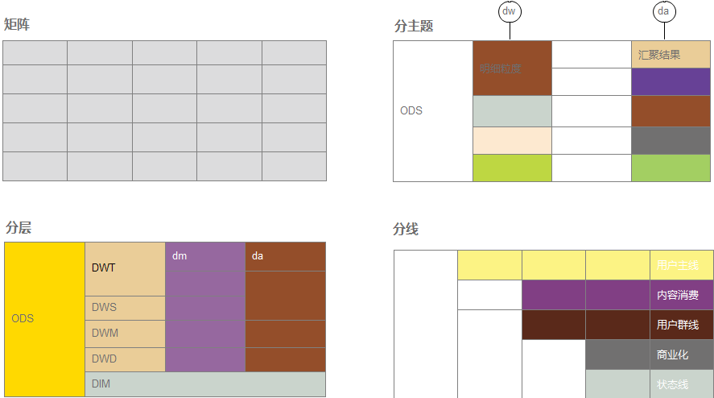

[toc]

# 数据仓库系列：如何优雅地规划数仓体系
摘抄自：`https://cloud.tencent.com/developer/article/1551875`

## 0x00 前言

**数仓规划是数仓建设的蓝图，涵盖从需求分析开始到最终的数仓评估验收整个环境**；数仓规划之所以**重要**，是因为它是描述了**数据流动的概念性框架**，**为元数据管理奠定了基础**，**对数据加工过程的理解、数仓建设的交流分享、数据的使用和问题排查、数仓健康度的评估都提供了极大的帮助**。

需要强调的是本节是从宏观上描述数仓的框架，具体到数据模型的细节对比、存储选型和管理、接入数据源管理等数仓建设的周边在本节不涉及。通过本节的阅读，你将了解到以下知识：

* 从业务矩阵的设计（宏观、微观）、横向的分层、纵向的分线到主题划分等角度解构数仓    
* 数仓建设的实施流程

## 0x01 规划

### 矩阵

分宏观和微观来看，宏观的是公司的整体业务布局，微观的是产品的业务过程布局和业务过程的维度分解交叉信息。

#### 宏观矩阵

宏观矩阵描述的是公司的业务线和对应的数据状况，其行和列一般分别对应着业务主题和数据主题。

* 业务主题对应着公司的业务线布局，比如电商、游戏、视频、应用商店、新闻资讯、浏览器等    
* 数据主题根据抽象的程度和视角有不同的取法：一般取业务线中用户对内容的消费或者相关行为，比如曝光、点击、消费、播放、分享等，对这些行为的划分又可分为原生行为主题（通用和业务相关）、衍生行为主题（留存、活跃、流失等），这种划分方法更多的取自数据的底层和公共层，因为高层的数据都是多行为的汇总。对数据主题的另外划分方式参加分主题部分，这种划分方法更多的取自数据的高层

引自《数据仓库实践之业务数据矩阵的设计-木东居士》

#### 微观矩阵

微观矩阵描述的是主题和对应的维度关系，下面以常见的内容消费和用户主题两个维度来看微观矩阵的规划

-w698

业务过程描述的一般是对内容的消费抽象，可以是原子的，也可以是抽象的，比如卡片曝光维度的划分可以从以下两个大方向入手：

* 通用标识维度（版本、机型、渠道、网络、时间等）    
* 业务过程维度：消费者等级、消费位置、消费路径、其它等

### 分层

ODS->DW->DM->DA（ADS）层是如何划分的，分层的原因（引自《一种通用的数据仓库分层方法-木东居士》）：

* 清晰数据结构：每一个数据分层都有它的作用域和职责，在使用表的时候能更方便地定位和理解    
* 减少重复开发：规范数据分层，开发一些通用的中间层数据，能够减少极大的重复计算    
* 统一数据口径：通过数据分层，提供统一的数据出口，统一对外输出的数据口径    
* 复杂问题简单化：将一个复杂的任务分解成多个步骤来完成，每一层解决特定的问题

#### 层划分

一个完整数仓分层演示图如下：

一个典型的数仓分层样例：

-w730

#### 分层依据

分层的依据在ods、da、dim层一般无歧义，关键在dw层的分层依据，也是数据仓库分层建设的核心。

每层划分的依据如下：

* ods层：存放原始数据信息，原则上不进行任何的数据清晰，和数据源保持一致。    
* dw层：数据公共层，是数仓建设的重点，一般是日志子表和一些宽表，主要完成数据的清洗、转换等    
* dm层：数据集市层，是最直接体系数据资产的层，一般是汇总数据，现在已经逐步弱化，面向挖掘、数据分析等    
* da层：数据应用层，高度汇总数据，主要用于报表展示。

### 分线

分线也分宏观和微观，宏观的是整体的业务线，比如应用分发线、商业智能线、游戏运营线、广告流量线等；微观的是某个app或者某个具体的线，本节介绍的是app的数据线。分线和分主题有很多相似的地方，只是看待数据的角度不同，分主题是从数据内容分类和对外服务的角度看，类似商品分类；而分线是从数据生产加工过程的角度来看，类似业务生产流水线。

#### 用户主线

反映整个app的用户规模，比如整个app的活跃、累积活跃、新增、留存、回流、流失

#### 用户群线

满足某些行为的用户群的追踪，目的是为了进行个性化的运营等活动，该线的升华扩展是用户画像

#### 内容消费

提供的消费实体的曝光、点击、生成、转化等，以及内容的累积消费、消费排行等都属于内容线

#### 状态线

一般会作为辅线存在，相当于维表的存在，状态线一般又分为以下几种：

* 天表全量用户状态，会加入一些修正，以及基于天全量的累积表的快照

全量用户信息维表

* 开关操作状态线

记录开关状态变更记录，得到当前用户的开关状态快照，是多态记录的一种特殊情况

* 添加删除状态线

记录用户的添加删除等操作，得到当前用户操作结果的保有快照

* 其它，比如登录状态、用户等级等

#### 商业化线

商业化线相关的与收入相关的，比如cp合作、广告位、推广位、订单、会员充值等；

需要说明的是本系列的数仓的主要介绍的是流量型产品形态、更多的是关注用户规模，所以主线是是关于用户的，而对于其它的产品形态，比如购物类、充值消费类的则主线可能是商业化线等。此外作为用户流量型产品，还隐藏着另外一个更加常用的线：自查线，每个主题的自查明细表，基于event_id或者参数的展开，但是没有参数值的组合过滤。（自查线这个似乎没有必要）

下图是一张数仓的分线演示图，每个框是一张表，不同颜色的框串联成各自的数仓线。

### 分主题

在进行分矩阵设计的时候牵涉到分行和列的业务主题，此处详细介绍下数据主题的设计，本部分的设计是从高层次上的。

主题划分的一些依据：业务过程（或子过程，比如订单）、ER中的E(或者R，比如商品主题)、数据服务的对象（运营主题）、数据的用途（比如商业）;分主题也即数据集市，根据业务形态的不同，会衍生出不同的主题，但以下主题在app中广泛存在：

* 用户主题（也即大盘：新增活跃、留存）    
* 内容主题（具体提供的服务形式，也可以理解为产品主题，含曝光、点击、分享等用户消费传播行为）    
* 运营主题（可能合并到某个内容主题上，比如活动、通知、弹窗、授权、分享等）    
* 商业化主题（广告、订单等通常用于结算）    
* 技术主题（故障率、崩溃率、准确率等衡量技术指标）

备注：

* 社交主题可以合并到内容主题也可以合并到运营主题，需要视app的具体特性和重视程度确定    
* 数仓的分主题主要体现在数据集市层，而数据集市层可能会因为使用比如kylin等多维分析工具被弱化。

#### 用户主题

用户主题是产品的盘子，就像家店铺，多少人使用就像多少顾客。基于用户主题的常见统计有整体的新增、活跃、累积活跃、新增留存、活跃留存等大盘数据，以及对某些关键行为的用户的后续追踪，还有某些核心过程的PUV、转化漏斗等

#### 内容主题

内容主题是盘子里东西的消费状况，就像提供的菜单，每个菜被多少人点了。基于内容主题的常见统计有针对内容（文章、视频、商品等）的各种消费行为（曝光、点击、购买、下载等）的次数、人数、时长、金额等按不同维度的度量统计。常见的维度拆分有时间拆分、地域拆分、位置（人货场模型中的场）拆分、画像拆分、渠道拆分等，对度量的统计又有累积、非累积、TopN等。

#### 运营主题

广告、促销、活动等一切由于运营活动相关本身的数据统计，以及运营活动对其它主题数据的影响衡量。

#### 营收主题

营收的来源主要分为以下几种：

* 流量广告商务合作优惠券    
* 充值消费会员充值订单、打赏等

流量广告的数据主要产生于用户行为，而充值消费的数据主要来自业务库相关。

以上四个主题是在常见应用上通用的主题，其它的主题比如技术主题，在某些有明显的技术指标对比的产品上会占主要的地位，比如[文字识别](https://cloud.tencent.com/product/ocr?from=10680 "文字识别")类应用的识别准确率、搜索类产品的搜索满意度、语音智能助理类的会话完成率等。这些产品上技术指标和用户的体验密切相关，是产品未来发展重要的参考方向，因此会强化出来做数据主题。另外如引流类或者与其他app有频繁的引流拉起等应用的数据体系建设上，也会单独拿出跳转对接数据做主题分析。总之，主题的划分并不是确定不变的，需要根据业务的具体形态和重点度量的指标等进行建设。

**以上的矩阵、分层、分线、分主题的规划只是从不同的角度来看数据框架，本质都是对数据流图的一种拆解，差异在拆解的数据视角**。

## 0x02 实施

### 需求分析

了解业务过程，每个业务过程的参与实体和各实体可能的分析维度等信息; 了解数据源组成，有哪些数据源、数据的更新周期；预构建指标体系，了解指标的分类，分析维度、时效性要求；了解可能的扩展需求，比如画像宽表。需求分析阶段是建立数仓的概念模型，明白数仓要支持的大致需求，虽然数仓建设并不要完全满足业务需求，在建设的过程中肯定要有取舍，但第一步进行需求分析能保证在数仓建设过程中不致于偏离目标太多，避免建设烂尾或者好看不好用的绣花枕头。

#### 指标体系

此部分会另外开专题介绍，指标体系一般分为三类：

* 用户增长体系    
* 流量体系    
* 营收体系

每个体系内分析数据的维度、更新周期等。指标体系的建立是需求分析环节需要重点完成的一步。

### 模型选择

模型选择环节要根据需求分析阶段的结论，在ER模型、维度建模等基本的建模思想中选择一种建模思想，比如说选择了维度建模，要进一步根据需求分析中相关的业务过程和维度视角，在星型模型、雪花模型、星座模型中选择一种模式。这个过程要充分的结合业务的实际状况、开发人力和成本、各模型的优缺点等因素进行综合分析，是关系到建模是否成功的关键环节。需要说明的是，在快速迭代的互联网行业，业务规则可能经常变化，而对于不同粒度水平进行度量和监控，进而快速响应的需求却基本保持不变，比如层级的时间粒度（年、月、周、日、小时）、层级的地理粒度（大区、省、市、区县、商圈）以及基于产品自身属性的层级粒度（大类、子类）。基于这种特性，互联网行业中广泛采用维度建模的思想，同时为了使用的方便，又以星型模型和雪花模型较多。

### 标准规划

标准规划是对数仓建设过程各阶段中涉及的对象、属性、关系、键、交付物等进行规范定义，同时制定标准落地方式或者检查的方式。比如表命名规范、字段命名规范、任务命名规范、调度依赖规范、代码开发规范等。需求强调的是，这一步看似无关紧要，也往往直接被忽略跳过，但好的标准规划能为建设高质量数仓的保驾护航，对数仓质量、健康度的保持都大有裨益。

### 开发部署

包含表设计、代码开发、调度开发和告警开发等，对应本系列的第三节和第四节。

* 事实表和维表设计维表设计    
* 代码开发流程、审核机制、回退机制    
* 调度开发依赖任务的配置回跑机制任务权限管理    
* 告警开发：数据量异常，某些细分维度、字段值、计算指标异常的告警措施任务失败、等待超时、执行超时、上下线、上游重跑等告警措施

开发部署阶段完成了数仓建设的逻辑模型和物理模型设计阶段，是数仓建设的主要工作内容。

### 评估验收

对应的问题包含在相关问题介绍部分，需要进一步思考数仓开发的交付物是什么。

* 数据字典    
* 指标口径的定义    
* 核心表和其用途    
* 数据流图和重要指标的出口    
* 业务变动对数仓的影响，比如某些手工维护的维表需要根据业务变动进行相应的更新

## 0xFF 总结

本篇从业务矩阵、分层、分线和分主题等方面对数仓的规划做了简要的描述。这些方面的差异只在于剖析数仓的角度，其目的是一致的，即为了清晰地梳理数据体系、洞察数据状态、以及更好地规划未来数据地图，从而更好的服务于各个业务需求方（BI报表、数据分析、用户画像等）；本节最后简要的介绍了数仓开发的基本流程。

进一步思考：

* 数仓规划带来的好处，方便传承和交流，便于快速洞察数仓的健康状态。    
* 数仓健康度的概念和计算方式

参考：

* 一种通用的数仓分层方法-数据茶水间    
* 业务数据矩阵的设计-数据茶水间

水大人，数据开发小哥，爱折腾、爱记笔记，热衷方法论提炼和效率提升。虽然半路出家，但致力于全栈远景。《七天数据埋点之旅》系列作者。

