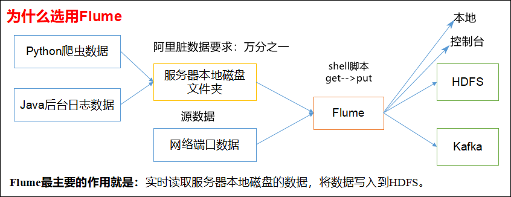
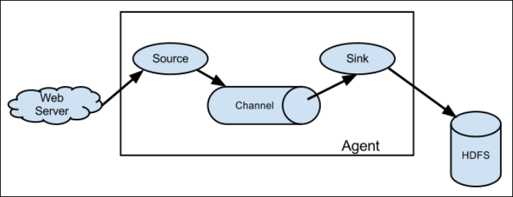
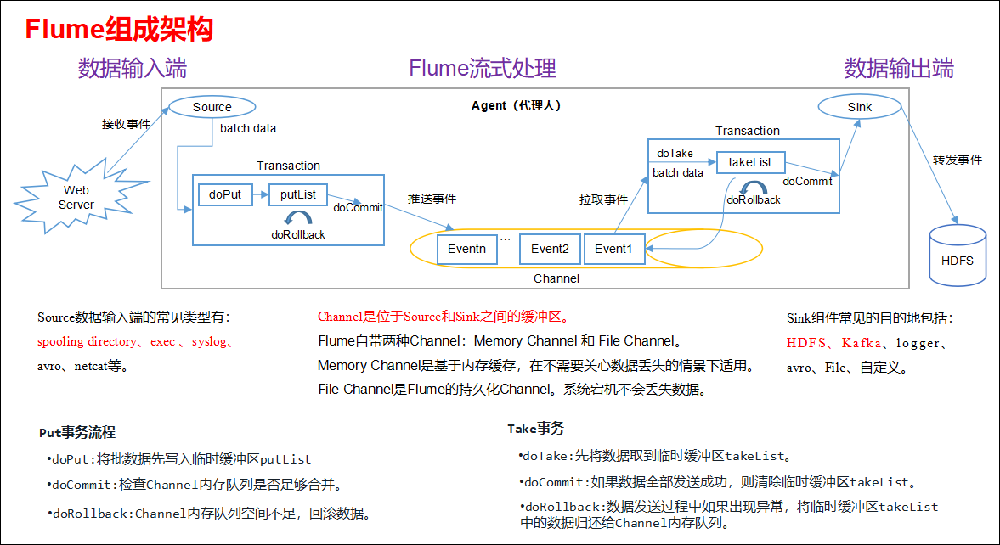
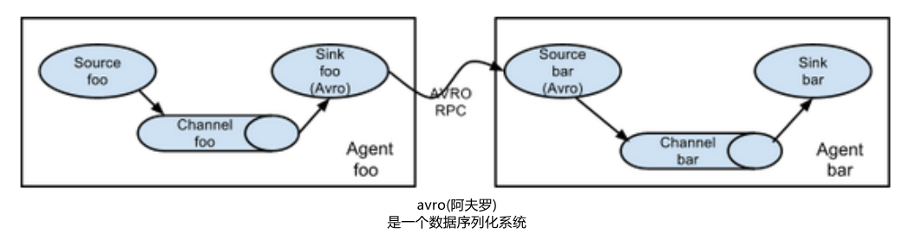
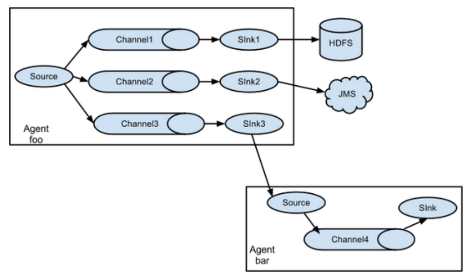
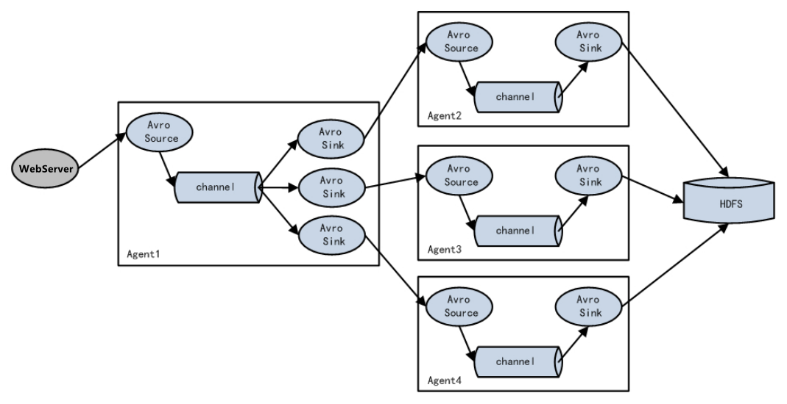
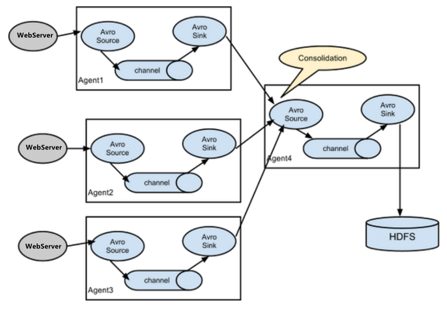
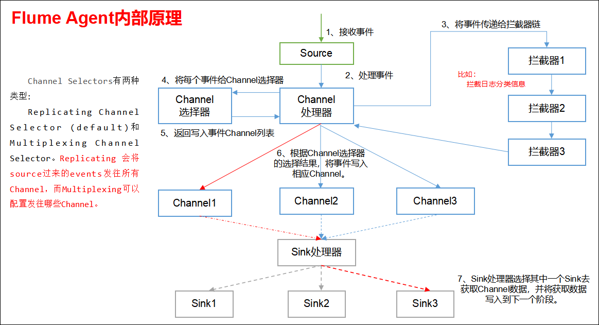

## Flume概述
### Flume定义
Flume是 Cloudera 提供的一个高可用的，高可靠的，分布式的海量日志采集、聚合和传输的系统。Flume基于流式架构，灵活简单。

在2009年Flume被捐赠了apache软件基金会，为hadoop相关组件之一。尤其近几年随着flume的不断被完善以及升级版本的逐一推出，特别是flume-ng;，同时flume内部的各种组件不断丰富，用户在开发的过程中使用的便利性得到很大的改善，现已成为apache top项目之一。

**Flume最主要的作用就是，实时读取服务器本地磁盘的数据，将数据写入到HDFS。**

### Flume组成架构
Flume组成架构如下图所示：

Flume组成架构

下面我们来详细介绍一下Flume架构中的组件。

#### Agent
Agent是一个JVM进程，它以事件的形式将数据从源头送至目的地，是Flume数据传输的基本单元。

Agent主要有3个部分组成，Source、Channel、Sink。

#### Source
Source是负责接收数据到Flume Agent的组件。Source组件可以处理各种类型、各种格式的日志数据，包括avro、thrift、exec(Linux命令)、jms、spooling directory、netcat、sequence generator、syslog、http、legacy。

#### Channel
Channel是位于Source和Sink之间的缓冲区。因此，Channel允许Source和Sink运作在不同的速率上。Channel是线程安全的，可以同时处理几个Source的写入操作和几个Sink的读取操作。

Flume自带两种Channel：Memory Channel 和 File Channel。

Memory Channel是内存中的队列。Memory Channel 在不需要关心数据丢失的情景下适用。如果需要关心数据丢失，那么Memory Channel就不应该使用，因为程序死亡、机器宕机或者重启都会导致数据丢失。

File Channel将所有事件写到磁盘。因此在程序关闭或机器宕机的情况下不会丢失数据。

#### Sink
Sink不断地轮询Channel中的事件且批量地移除它们，并将这些事件批量写入到存储或索引系统、或者被发送到另一个Flume Agent。

Sink是完全事务性的。在从Channel批量删除数据之前，每个Sink用Channel启动一个事务。批量事件一旦成功写出到存储系统或下一个Flume Agent，Sink就利用Channel提交事务。事务一旦被提交，该Channel从自己的内部缓冲区删除事件。

Sink组件目的地包括hdfs、logger、avro、thrift、ipc、file、null、HBase、solr、自定义。

#### Event
传输单元，Flume数据传输的基本单元，以事件的形式将数据从源头送至目的地。

### Flume拓扑结构
Flume的拓扑结构如下图所示：

Flume Agent连接

单source，多channel、sink

Flume负载均衡

**Flume Agent聚合**

### Flume Agent内部原理

