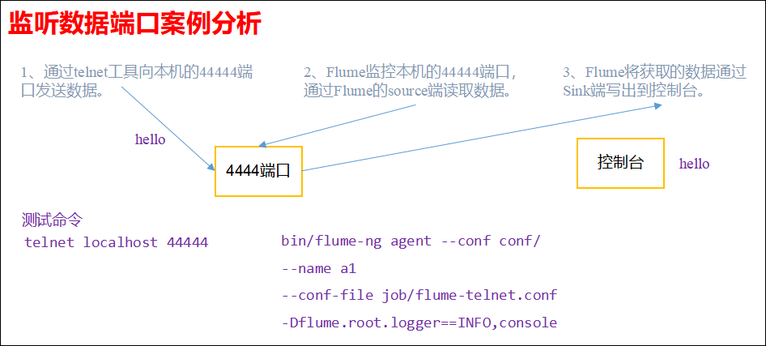
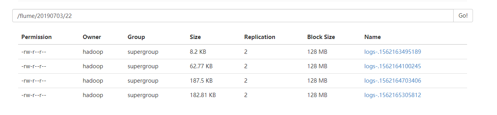
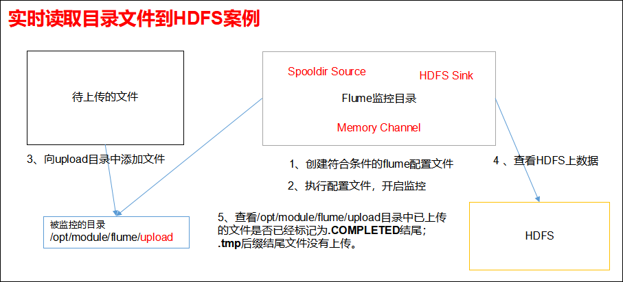
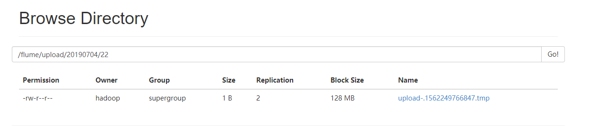

## Flume使用开发案例

### 监控端口数据官方案例
1）案例需求：首先，Flume监控本机44444端口，然后通过telnet工具向本机44444端口发送消息，最后Flume将监听的数据实时显示在控制台。

2）需求分析：


#### 判断44444端口是否被占用
```
sudo netstat -tunlp | grep 44444
```
功能描述：netstat命令是一个监控TCP/IP网络的非常有用的工具，它可以显示路由表、实际的网络连接以及每一个网络接口设备的状态信息。 

基本语法：netstat [选项]

选项参数：
  -t或--tcp：显示TCP传输协议的连线状况； 
  -u或--udp：显示UDP传输协议的连线状况；
  -n或--numeric：直接使用ip地址，而不通过域名服务器； 
  -l或--listening：显示监控中的服务器的Socket； 
  -p或--programs：显示正在使用Socket的程序识别码和程序名称；

#### 实现步骤
在flume目录下创建job文件夹并进入job文件夹。
```
mkdir job
cd job
```

在job文件夹下创建Flume Agent配置文件flume-telnet-logger.conf
```
touch flume-telnet-logger.conf
vi flume-telnet-logger.conf
```

在flume-telnet-logger.conf文件中添加如下内容：
```
# example.conf: A single-node Flume configuration

# Name the components on this agent
a1.sources = r1
a1.sinks = k1
a1.channels = c1

# Describe/configure the source
a1.sources.r1.type = netcat
a1.sources.r1.bind = localhost
a1.sources.r1.port = 44444

# Describe the sink
a1.sinks.k1.type = logger

# Use a channel which buffers events in memory
a1.channels.c1.type = memory
a1.channels.c1.capacity = 1000
a1.channels.c1.transactionCapacity = 100

# Bind the source and sink to the channel
a1.sources.r1.channels = c1
a1.sinks.k1.channel = c1

```
注：配置文件来源于官方手册：http://flume.apache.org/FlumeUserGuide.html


启动agent去采集数据,开启flume监听端口:
```
bin/flume-ng agent --conf conf/ --conf-file job/flume-telnet-logger.conf --name a1 -Dflume.root.logger=INFO,console
```
参数说明：
  --conf conf/ ：表示配置文件存储在conf/目录
  --name a1 ：表示给agent起名为a1（要与配置文件一致）
  --conf-file job/flume-telnet.conf ：flume本次启动读取的配置文件是在job文件夹下的flume-telnet.conf文件
  -Dflume.root.logger==INFO,console ：-D表示flume运行时动态修改flume.root.logger参数属性值，并将控制台日志打印级别设置为INFO级别。日志级别包括:log、info、warn、error


使用telnet工具向本机的44444端口发送内容:
```
telnet localhost 44444
```


配置文件解析:
```
# Name the components on this agent
a1.sources = r1         #a1:表示agent的名称
a1.sinks = k1        #k1:表示a1的输出目的地
a1.channels = c1        #c1:表示a1的缓冲区

# Describe/configure the source
a1.sources.r1.type = netcat        #表示a1的输入源类型为netcat端口类型
a1.sources.r1.bind = localhost        #表示a1的监听的主机
a1.sources.r1.port = 44444        #表示a1的监听的端口号

# Describe the sink
a1.sinks.k1.type = logger        #表示a1的输出目的地是控制台logger类型

# Use a channel which buffers events in memory
a1.channels.c1.type = memory        # 表示a1的channel类型是memory内存型
a1.channels.c1.capacity = 1000        #表示a1的channel总容量1000个event
a1.channels.c1.transactionCapacity = 100        #表示a1的channel传输时收集到了100条event以后再去提交事务

# Bind the source and sink to the channel
a1.sources.r1.channels = c1        #表示将r1和c1连接起来
a1.sinks.k1.channel = c1        #表示将k1和c1连接起来
```

### 实时读取本地文件到HDFS案例
采集需求：比如业务系统使用log4j生成的日志，日志内容不断增加，需要把追加到日志文件中的数据实时采集到hdfs

根据需求，首先定义以下3大要素: 
* 采集源，即source——监控文件内容更新 :  exec  ‘tail -F file’  
* 下沉目标，即sink——HDFS文件系统  :  hdfs sink  
* Source和sink之间的传递通道——channel，可用file channel 也可以用 内存channel  

#### 实现步骤
Flume要想将数据输出到HDFS，必须持有Hadoop相关jar包将
```
commons-configuration-1.6.jar
hadoop-auth-2.7.2.jar
hadoop-common-2.7.2.jar
hadoop-hdfs-2.7.2.jar
commons-io-2.4.jar
htrace-core-3.1.0-incubating.jar
```
拷贝到/opt/module/flume/lib文件夹下。

**我配置了hadoop的环境变量，没配也可以**

在job文件夹下创建Flume Agent配置文件flume-file-hdfs.conf
```
touch flume-file-hdfs.conf
vi flume-file-hdfs.conf
```

在flume-file-hdfs.conf文件中添加如下内容：
```
# Name the components on this agent
a2.sources = r2
a2.sinks = k2
a2.channels = c2

# Describe/configure the source
a2.sources.r2.type = exec
a2.sources.r2.command = tail -F /home/hadoop/log.txt
a2.sources.r2.shell = /bin/bash -c

# Describe the sink
a2.sinks.k2.type = hdfs
a2.sinks.k2.hdfs.path = hdfs://hadoop01:9000/flume/%Y%m%d/%H
#上传文件的前缀
a2.sinks.k2.hdfs.filePrefix = logs-
#是否按照时间滚动文件夹
a2.sinks.k2.hdfs.round = true
#多少时间单位创建一个新的文件夹
a2.sinks.k2.hdfs.roundValue = 1
#重新定义时间单位
a2.sinks.k2.hdfs.roundUnit = hour
#是否使用本地时间戳
a2.sinks.k2.hdfs.useLocalTimeStamp = true
#积攒多少个 Event 才 flush 到 HDFS 一次
a2.sinks.k2.hdfs.batchSize = 1000
#设置文件类型，可支持压缩
a2.sinks.k2.hdfs.fileType = DataStream
#多久生成一个新的文件
a2.sinks.k2.hdfs.rollInterval = 600
#设置每个文件的滚动大小
a2.sinks.k2.hdfs.rollSize = 134217700
#文件的滚动与 Event 数量无关
a2.sinks.k2.hdfs.rollCount = 0
#最小冗余数
a2.sinks.k2.hdfs.minBlockReplicas = 1

# Use a channel which buffers events in memory
a2.channels.c2.type = memory
a2.channels.c2.capacity = 1000
a2.channels.c2.transactionCapacity = 100

# Bind the source and sink to the channel
a2.sources.r2.channels = c2
a2.sinks.k2.channel = c2

```

启动agent去采集数据
```
bin/flume-ng agent --conf conf/ --name a2 --conf-file job/flume-file-hdfs.conf
```


模拟日志数据的产生：
```scala
val f = new java.io.File("/home/hadoop/log.txt")
val fw = new java.io.FileWriter(f, true)
val pw = new java.io.PrintWriter(fw)

var i = 0
while(i < 1000){
    pw.println(s"hellow word $i");
    pw.flush();
    Thread.sleep(1000)
    i += 1
}

pw.close();
println("close")
```

查看hadoop目录：http://hadoop01:50070



### 实时读取目录文件到HDFS案例
1）案例需求：使用Flume监听整个目录的文件。
2）需求分析：


说明： 在使用Spooling Directory Source时
1) 不要在监控目录中创建并持续修改文件
2) 上传完成的文件会以.COMPLETED结尾
3) 被监控文件夹每500毫秒扫描一次文件变动

#### 实现步骤
创建配置文件flume-dir-hdfs.conf
```
touch flume-dir-hdfs.conf
```

配置文件
```
vi flume-dir-hdfs.conf
```

添加如下内容：
```
# Name the components on this agent
a3.sources = r3
a3.sinks = k3
a3.channels = c3

# Describe/configure the source
a3.sources.r3.type = spooldir
a3.sources.r3.spoolDir = /home/hadoop/spooldirtest/upload
a3.sources.r3.fileSuffix = .COMPLETED
a3.sources.r3.fileHeader = true
#忽略所有以.tmp结尾的文件，不上传
a3.sources.r3.ignorePattern = ([^ ]*\.tmp)

# Describe the sink
a3.sinks.k3.type = hdfs
a3.sinks.k3.hdfs.path = hdfs://hadoop01:9000/flume/upload/%Y%m%d/%H
#上传文件的前缀
a3.sinks.k3.hdfs.filePrefix = upload-
#是否按照时间滚动文件夹
a3.sinks.k3.hdfs.round = true
#多少时间单位创建一个新的文件夹
a3.sinks.k3.hdfs.roundValue = 1
#重新定义时间单位
a3.sinks.k3.hdfs.roundUnit = hour
#是否使用本地时间戳
a3.sinks.k3.hdfs.useLocalTimeStamp = true
#积攒多少个Event才flush到HDFS一次
a3.sinks.k3.hdfs.batchSize = 100
#设置文件类型，可支持压缩
a3.sinks.k3.hdfs.fileType = DataStream
#多久生成一个新的文件
a3.sinks.k3.hdfs.rollInterval = 600
#设置每个文件的滚动大小大概是128M
a3.sinks.k3.hdfs.rollSize = 134217700
#文件的滚动与Event数量无关
a3.sinks.k3.hdfs.rollCount = 0
#最小冗余数
a3.sinks.k3.hdfs.minBlockReplicas = 1

# Use a channel which buffers events in memory
a3.channels.c3.type = memory
a3.channels.c3.capacity = 1000
a3.channels.c3.transactionCapacity = 100

# Bind the source and sink to the channel
a3.sources.r3.channels = c3
a3.sinks.k3.channel = c3
```

启动agent去采集数据
```
bin/flume-ng agent --conf conf/ --name a3 --conf-file job/flume-dir-hdfs.conf
```


向upload文件夹中添加文件
```
touch atguigu.txt
touch atguigu.tmp
touch atguigu.log
```

查看HDFS上的数据



等待1s，再次查询upload文件夹
```
[hadoop@hadoop01 upload]$ ll
total 0
-rw-rw-r--. 1 hadoop hadoop 0 Jul  4 22:16 atguigu.log.COMPLETED
-rw-rw-r--. 1 hadoop hadoop 0 Jul  4 22:16 atguigu.tmp
-rw-rw-r--. 1 hadoop hadoop 0 Jul  4 22:16 atguigu.txt.COMPLETED
```


