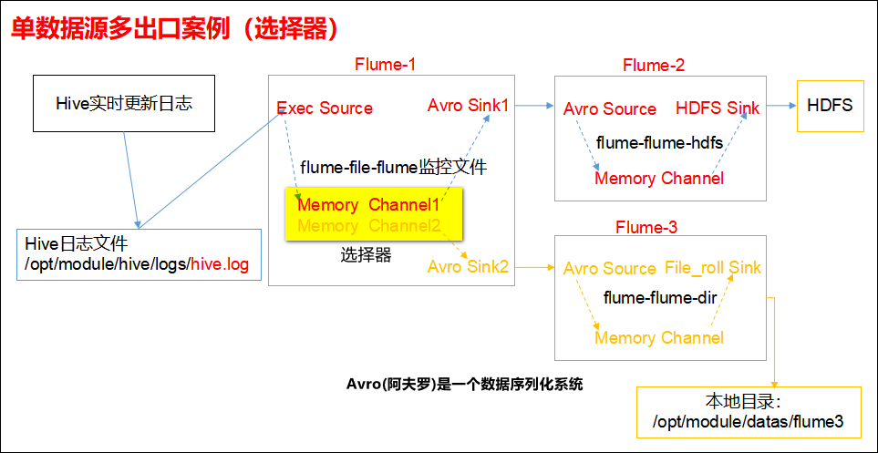

## Flume使用开发案例

### 监控端口数据官方案例
1）案例需求：首先，Flume监控本机44444端口，然后通过telnet工具向本机44444端口发送消息，最后Flume将监听的数据实时显示在控制台。

2）需求分析：


#### 判断44444端口是否被占用
```
sudo netstat -tunlp | grep 44444
```
功能描述：netstat命令是一个监控TCP/IP网络的非常有用的工具，它可以显示路由表、实际的网络连接以及每一个网络接口设备的状态信息。 

基本语法：netstat [选项]

选项参数：
  -t或--tcp：显示TCP传输协议的连线状况； 
  -u或--udp：显示UDP传输协议的连线状况；
  -n或--numeric：直接使用ip地址，而不通过域名服务器； 
  -l或--listening：显示监控中的服务器的Socket； 
  -p或--programs：显示正在使用Socket的程序识别码和程序名称；

#### 实现步骤
在flume目录下创建job文件夹并进入job文件夹。
```
mkdir job
cd job
```

在job文件夹下创建Flume Agent配置文件flume-telnet-logger.conf
```
touch flume-telnet-logger.conf
vi flume-telnet-logger.conf
```

在flume-telnet-logger.conf文件中添加如下内容：
```
# example.conf: A single-node Flume configuration

# Name the components on this agent
a1.sources = r1
a1.sinks = k1
a1.channels = c1

# Describe/configure the source
a1.sources.r1.type = netcat
a1.sources.r1.bind = localhost
a1.sources.r1.port = 44444

# Describe the sink
a1.sinks.k1.type = logger

# Use a channel which buffers events in memory
a1.channels.c1.type = memory
a1.channels.c1.capacity = 1000
a1.channels.c1.transactionCapacity = 100

# Bind the source and sink to the channel
a1.sources.r1.channels = c1
a1.sinks.k1.channel = c1

```
注：配置文件来源于官方手册：http://flume.apache.org/FlumeUserGuide.html


启动agent去采集数据,开启flume监听端口:
```
bin/flume-ng agent --conf conf/ --conf-file job/flume-telnet-logger.conf --name a1 -Dflume.root.logger=INFO,console
```
参数说明：
  --conf conf/ ：表示配置文件存储在conf/目录
  --name a1 ：表示给agent起名为a1（要与配置文件一致）
  --conf-file job/flume-telnet.conf ：flume本次启动读取的配置文件是在job文件夹下的flume-telnet.conf文件
  -Dflume.root.logger==INFO,console ：-D表示flume运行时动态修改flume.root.logger参数属性值，并将控制台日志打印级别设置为INFO级别。日志级别包括:log、info、warn、error


使用telnet工具向本机的44444端口发送内容:
```
telnet localhost 44444
```


配置文件解析:
```
# Name the components on this agent
a1.sources = r1         #a1:表示agent的名称
a1.sinks = k1        #k1:表示a1的输出目的地
a1.channels = c1        #c1:表示a1的缓冲区

# Describe/configure the source
a1.sources.r1.type = netcat        #表示a1的输入源类型为netcat端口类型
a1.sources.r1.bind = localhost        #表示a1的监听的主机
a1.sources.r1.port = 44444        #表示a1的监听的端口号

# Describe the sink
a1.sinks.k1.type = logger        #表示a1的输出目的地是控制台logger类型

# Use a channel which buffers events in memory
a1.channels.c1.type = memory        # 表示a1的channel类型是memory内存型
a1.channels.c1.capacity = 1000        #表示a1的channel总容量1000个event
a1.channels.c1.transactionCapacity = 100        #表示a1的channel传输时收集到了100条event以后再去提交事务

# Bind the source and sink to the channel
a1.sources.r1.channels = c1        #表示将r1和c1连接起来
a1.sinks.k1.channel = c1        #表示将k1和c1连接起来
```

### 实时读取本地文件到HDFS案例
采集需求：比如业务系统使用log4j生成的日志，日志内容不断增加，需要把追加到日志文件中的数据实时采集到hdfs

根据需求，首先定义以下3大要素: 
* 采集源，即source——监控文件内容更新 :  exec  ‘tail -F file’  
* 下沉目标，即sink——HDFS文件系统  :  hdfs sink  
* Source和sink之间的传递通道——channel，可用file channel 也可以用 内存channel  

#### 实现步骤
Flume要想将数据输出到HDFS，必须持有Hadoop相关jar包将
```
commons-configuration-1.6.jar
hadoop-auth-2.7.2.jar
hadoop-common-2.7.2.jar
hadoop-hdfs-2.7.2.jar
commons-io-2.4.jar
htrace-core-3.1.0-incubating.jar
```
拷贝到/opt/module/flume/lib文件夹下。

**我配置了hadoop的环境变量，没配也可以**

在job文件夹下创建Flume Agent配置文件flume-file-hdfs.conf
```
touch flume-file-hdfs.conf
vi flume-file-hdfs.conf
```

在flume-file-hdfs.conf文件中添加如下内容：
```
# Name the components on this agent
a2.sources = r2
a2.sinks = k2
a2.channels = c2

# Describe/configure the source
a2.sources.r2.type = exec
a2.sources.r2.command = tail -F /home/hadoop/log.txt
a2.sources.r2.shell = /bin/bash -c

# Describe the sink
a2.sinks.k2.type = hdfs
a2.sinks.k2.hdfs.path = hdfs://hadoop01:9000/flume/%Y%m%d/%H
#上传文件的前缀
a2.sinks.k2.hdfs.filePrefix = logs-
#是否按照时间滚动文件夹
a2.sinks.k2.hdfs.round = true
#多少时间单位创建一个新的文件夹
a2.sinks.k2.hdfs.roundValue = 1
#重新定义时间单位
a2.sinks.k2.hdfs.roundUnit = hour
#是否使用本地时间戳
a2.sinks.k2.hdfs.useLocalTimeStamp = true
#积攒多少个 Event 才 flush 到 HDFS 一次
a2.sinks.k2.hdfs.batchSize = 1000
#设置文件类型，可支持压缩
a2.sinks.k2.hdfs.fileType = DataStream
#多久生成一个新的文件
a2.sinks.k2.hdfs.rollInterval = 600
#设置每个文件的滚动大小
a2.sinks.k2.hdfs.rollSize = 134217700
#文件的滚动与 Event 数量无关
a2.sinks.k2.hdfs.rollCount = 0
#最小冗余数
a2.sinks.k2.hdfs.minBlockReplicas = 1

# Use a channel which buffers events in memory
a2.channels.c2.type = memory
a2.channels.c2.capacity = 1000
a2.channels.c2.transactionCapacity = 100

# Bind the source and sink to the channel
a2.sources.r2.channels = c2
a2.sinks.k2.channel = c2

```

启动agent去采集数据
```
bin/flume-ng agent --conf conf/ --name a2 --conf-file job/flume-file-hdfs.conf
```

配置文件解析：


模拟日志数据的产生：
```scala
val f = new java.io.File("/home/hadoop/log.txt")
val fw = new java.io.FileWriter(f, true)
val pw = new java.io.PrintWriter(fw)

var i = 0
while(i < 1000){
    pw.println(s"hellow word $i");
    pw.flush();
    Thread.sleep(1000)
    i += 1
}

pw.close();
println("close")
```

查看hadoop目录：http://hadoop01:50070


### 实时读取目录文件到HDFS案例
1）案例需求：使用Flume监听整个目录的文件。
2）需求分析：


说明： 在使用Spooling Directory Source时
1) 不要在监控目录中创建并持续修改文件
2) 上传完成的文件会以.COMPLETED结尾
3) 被监控文件夹每500毫秒扫描一次文件变动

#### 实现步骤
创建配置文件flume-dir-hdfs.conf
```
touch flume-dir-hdfs.conf
```

配置文件
```
vi flume-dir-hdfs.conf
```

添加如下内容：
```
# Name the components on this agent
a3.sources = r3
a3.sinks = k3
a3.channels = c3

# Describe/configure the source
a3.sources.r3.type = spooldir
a3.sources.r3.spoolDir = /home/hadoop/spooldirtest/upload
a3.sources.r3.fileSuffix = .COMPLETED
a3.sources.r3.fileHeader = true
#忽略所有以.tmp结尾的文件，不上传
a3.sources.r3.ignorePattern = ([^ ]*\.tmp)

# Describe the sink
a3.sinks.k3.type = hdfs
a3.sinks.k3.hdfs.path = hdfs://hadoop01:9000/flume/upload/%Y%m%d/%H
#上传文件的前缀
a3.sinks.k3.hdfs.filePrefix = upload-
#是否按照时间滚动文件夹
a3.sinks.k3.hdfs.round = true
#多少时间单位创建一个新的文件夹
a3.sinks.k3.hdfs.roundValue = 1
#重新定义时间单位
a3.sinks.k3.hdfs.roundUnit = hour
#是否使用本地时间戳
a3.sinks.k3.hdfs.useLocalTimeStamp = true
#积攒多少个Event才flush到HDFS一次
a3.sinks.k3.hdfs.batchSize = 100
#设置文件类型，可支持压缩
a3.sinks.k3.hdfs.fileType = DataStream
#多久生成一个新的文件
a3.sinks.k3.hdfs.rollInterval = 600
#设置每个文件的滚动大小大概是128M
a3.sinks.k3.hdfs.rollSize = 134217700
#文件的滚动与Event数量无关
a3.sinks.k3.hdfs.rollCount = 0
#最小冗余数
a3.sinks.k3.hdfs.minBlockReplicas = 1

# Use a channel which buffers events in memory
a3.channels.c3.type = memory
a3.channels.c3.capacity = 1000
a3.channels.c3.transactionCapacity = 100

# Bind the source and sink to the channel
a3.sources.r3.channels = c3
a3.sinks.k3.channel = c3
```

启动agent去采集数据
```
bin/flume-ng agent --conf conf/ --name a3 --conf-file job/flume-dir-hdfs.conf
```

配置文件解析：


向upload文件夹中添加文件
```
touch atguigu.txt
touch atguigu.tmp
touch atguigu.log
```

查看HDFS上的数据


等待1s，再次查询upload文件夹
```
[hadoop@hadoop01 upload]$ ll
total 0
-rw-rw-r--. 1 hadoop hadoop 0 Jul  4 22:16 atguigu.log.COMPLETED
-rw-rw-r--. 1 hadoop hadoop 0 Jul  4 22:16 atguigu.tmp
-rw-rw-r--. 1 hadoop hadoop 0 Jul  4 22:16 atguigu.txt.COMPLETED
```

### 单数据源多出口案例(选择器)
单Source多Channel、Sink，如下图所示：


1）案例需求：使用Flume-1监控文件变动，Flume-1将变动内容传递给Flume-2，Flume-2负责存储到HDFS。同时Flume-1将变动内容传递给Flume-3，Flume-3负责输出到Local FileSystem。

2）需求分析


#### 实现步骤
准备工作，在flume/job目录下创建group1文件夹
```
mkdir group1
cd group1
```

##### 创建flume-file-flume.conf
配置1个接收日志文件的source和2个channel、2个sink，分别输送给flume-flume-hdfs和flume-flume-dir。
创建配置文件并打开：
```
touch flume-file-flume.conf
vim flume-file-flume.conf
```

添加如下内容：
```
# Name the components on this agent
a1.sources = r1
a1.sinks = k1 k2
a1.channels = c1 c2
# 将数据流复制给所有channel
a1.sources.r1.selector.type = replicating

# Describe/configure the source
a1.sources.r1.type = exec
a1.sources.r1.command = tail -F /home/hadoop/log.txt
a1.sources.r1.shell = /bin/bash -c

# Describe the sink
a1.sinks.k1.type = avro
a1.sinks.k1.hostname = hadoop01 
a1.sinks.k1.port = 4141

a1.sinks.k2.type = avro
a1.sinks.k2.hostname = hadoop01
a1.sinks.k2.port = 4142

# Describe the channel
a1.channels.c1.type = memory
a1.channels.c1.capacity = 1000
a1.channels.c1.transactionCapacity = 100

a1.channels.c2.type = memory
a1.channels.c2.capacity = 1000
a1.channels.c2.transactionCapacity = 100

# Bind the source and sink to the channel
a1.sources.r1.channels = c1 c2
a1.sinks.k1.channel = c1
a1.sinks.k2.channel = c2
```

注：Avro是由Hadoop创始人Doug Cutting创建的一种跟语言无关的数据序列化和RPC框架。
注：RPC（Remote Procedure Call）—远程过程调用，它是一种通过网络从远程计算机程序上请求服务，而不需要了解底层网络技术的协议。

##### 创建flume-flume-hdfs.conf
配置上级Flume输出的Source，输出是到HDFS的Sink。
创建配置文件并打开
```
touch flume-flume-hdfs.conf
vim flume-flume-hdfs.conf
```

添加如下内容：
```
# Name the components on this agent
a2.sources = r1
a2.sinks = k1
a2.channels = c1

# Describe/configure the source
a2.sources.r1.type = avro
a2.sources.r1.bind = hadoop01
a2.sources.r1.port = 4141

# Describe the sink
a2.sinks.k1.type = hdfs
a2.sinks.k1.hdfs.path = hdfs://hadoop01:9000/flume/group1/%Y%m%d/%H
#上传文件的前缀
a2.sinks.k1.hdfs.filePrefix = flume2-
#是否按照时间滚动文件夹
a2.sinks.k1.hdfs.round = true
#多少时间单位创建一个新的文件夹
a2.sinks.k1.hdfs.roundValue = 1
#重新定义时间单位
a2.sinks.k1.hdfs.roundUnit = hour
#是否使用本地时间戳
a2.sinks.k1.hdfs.useLocalTimeStamp = true
#积攒多少个Event才flush到HDFS一次
a2.sinks.k1.hdfs.batchSize = 100
#设置文件类型，可支持压缩
a2.sinks.k1.hdfs.fileType = DataStream
#多久生成一个新的文件
a2.sinks.k1.hdfs.rollInterval = 600
#设置每个文件的滚动大小大概是128M
a2.sinks.k1.hdfs.rollSize = 134217700
#文件的滚动与Event数量无关
a2.sinks.k1.hdfs.rollCount = 0
#最小冗余数
a2.sinks.k1.hdfs.minBlockReplicas = 1

# Describe the channel
a2.channels.c1.type = memory
a2.channels.c1.capacity = 1000
a2.channels.c1.transactionCapacity = 100

# Bind the source and sink to the channel
a2.sources.r1.channels = c1
a2.sinks.k1.channel = c1
```

##### 创建flume-flume-dir.conf
配置上级Flume输出的Source，输出是到本地目录的Sink。
创建配置文件并打开
```
touch flume-flume-dir.conf
vim flume-flume-dir.conf
```

添加如下内容：
```
# Name the components on this agent
a3.sources = r1
a3.sinks = k1
a3.channels = c2

# Describe/configure the source
a3.sources.r1.type = avro
a3.sources.r1.bind = hadoop01
a3.sources.r1.port = 4142

# Describe the sink
a3.sinks.k1.type = file_roll
a3.sinks.k1.sink.directory = /home/hadoop/flumedatas

# Describe the channel
a3.channels.c2.type = memory
a3.channels.c2.capacity = 1000
a3.channels.c2.transactionCapacity = 100

# Bind the source and sink to the channel
a3.sources.r1.channels = c2
a3.sinks.k1.channel = c2
```

**提示：输出的本地目录必须是已经存在的目录，如果该目录不存在，并不会创建新的目录。输出是到HDFS的不用手动创建，不存在会自动创建。**

##### 执行配置文件
分别开启对应配置文件：flume-flume-dir，flume-flume-hdfs，flume-file-flume。

```
bin/flume-ng agent --conf conf/ --name a3 --conf-file job/group1/flume-flume-dir.conf
bin/flume-ng agent --conf conf/ --name a2 --conf-file job/group1/flume-flume-hdfs.conf
bin/flume-ng agent --conf conf/ --name a1 --conf-file job/group1/flume-file-flume.conf
```

模拟日志数据的产生：
```scala
val f = new java.io.File("/home/hadoop/log.txt")
val fw = new java.io.FileWriter(f, true)
val pw = new java.io.PrintWriter(fw)

var i = 0
while(i < 1000){
    pw.println(s"hellow word $i");
    pw.flush();
    Thread.sleep(1000)
    i += 1
}

pw.close();
println("close")
```

查看hadoop目录：http://hadoop01:50070


检查/home/hadoop/flumedatas目录中数据
```
[hadoop@hadoop01 flumedatas]$ pwd
/home/hadoop/flumedatas
[hadoop@hadoop01 flumedatas]$ ll
total 28
-rw-rw-r--. 1 hadoop hadoop   0 Jul  6 16:25 1562401501419-1
-rw-rw-r--. 1 hadoop hadoop 405 Jul  6 16:29 1562401501419-10
-rw-rw-r--. 1 hadoop hadoop 450 Jul  6 16:30 1562401501419-11
-rw-rw-r--. 1 hadoop hadoop 555 Jul  6 16:31 1562401501419-12
-rw-rw-r--. 1 hadoop hadoop 448 Jul  6 16:31 1562401501419-13
-rw-rw-r--. 1 hadoop hadoop 432 Jul  6 16:31 1562401501419-14
-rw-rw-r--. 1 hadoop hadoop   0 Jul  6 16:32 1562401501419-15
-rw-rw-r--. 1 hadoop hadoop   0 Jul  6 16:32 1562401501419-16
-rw-rw-r--. 1 hadoop hadoop   0 Jul  6 16:33 1562401501419-17
-rw-rw-r--. 1 hadoop hadoop   0 Jul  6 16:33 1562401501419-18
-rw-rw-r--. 1 hadoop hadoop   0 Jul  6 16:34 1562401501419-19
-rw-rw-r--. 1 hadoop hadoop   0 Jul  6 16:25 1562401501419-2
-rw-rw-r--. 1 hadoop hadoop   0 Jul  6 16:34 1562401501419-20
-rw-rw-r--. 1 hadoop hadoop 160 Jul  6 16:26 1562401501419-3
-rw-rw-r--. 1 hadoop hadoop   0 Jul  6 16:26 1562401501419-4
-rw-rw-r--. 1 hadoop hadoop   0 Jul  6 16:27 1562401501419-5
-rw-rw-r--. 1 hadoop hadoop   0 Jul  6 16:27 1562401501419-6
-rw-rw-r--. 1 hadoop hadoop   0 Jul  6 16:28 1562401501419-7
-rw-rw-r--. 1 hadoop hadoop   0 Jul  6 16:28 1562401501419-8
-rw-rw-r--. 1 hadoop hadoop 320 Jul  6 16:29 1562401501419-9
```

两个输出的内容完全相同

### 单数据源多出口案例(Sink组)
单Source、Channel多Sink(负载均衡)，如下图所示。


1）案例需求：使用Flume-1监控文件变动，Flume-1将变动内容传递给Flume-2，Flume-2负责存储到HDFS。同时Flume-1将变动内容传递给Flume-3，Flume-3也负责存储到HDFS 
2）需求分析：


#### 实现步骤
准备工作，在flume/job目录下创建group2文件夹
```
mkdir group2
cd group2
```

##### 创建flume-netcat-flume.conf
配置1个接收日志文件的source和1个channel、2个sink，分别输送给flume-flume-console1和flume-flume-console2。
创建配置文件并打开
```
touch flume-netcat-flume.conf
vim flume-netcat-flume.conf
```

添加如下内容：
```
# Name the components on this agent
a1.sources = r1
a1.channels = c1
a1.sinkgroups = g1
a1.sinks = k1 k2

# Describe/configure the source
a1.sources.r1.type = netcat
a1.sources.r1.bind = localhost
a1.sources.r1.port = 44444

# 配置sink组相关信息
a1.sinkgroups.g1.processor.type = load_balance
a1.sinkgroups.g1.processor.backoff = true
a1.sinkgroups.g1.processor.selector = round_robin
a1.sinkgroups.g1.processor.selector.maxTimeOut=10000

# Describe the sink
a1.sinks.k1.type = avro
a1.sinks.k1.hostname = hadoop01
a1.sinks.k1.port = 4141

a1.sinks.k2.type = avro
a1.sinks.k2.hostname = hadoop01
a1.sinks.k2.port = 4142

# Describe the channel
a1.channels.c1.type = memory
a1.channels.c1.capacity = 1000
a1.channels.c1.transactionCapacity = 100

# Bind the source and sink to the channel
a1.sources.r1.channels = c1
a1.sinkgroups.g1.sinks = k1 k2
a1.sinks.k1.channel = c1
a1.sinks.k2.channel = c1
```

##### 创建flume-flume-console1.conf
配置上级Flume输出的Source，输出是到本地控制台。
创建配置文件并打开
```
touch flume-flume-console1.conf
vim flume-flume-console1.conf
```

添加如下内容：
```
# Name the components on this agent
a2.sources = r1
a2.sinks = k1
a2.channels = c1

# Describe/configure the source
a2.sources.r1.type = avro
a2.sources.r1.bind = hadoop01
a2.sources.r1.port = 4141

# Describe the sink
a2.sinks.k1.type = logger

# Describe the channel
a2.channels.c1.type = memory
a2.channels.c1.capacity = 1000
a2.channels.c1.transactionCapacity = 100

# Bind the source and sink to the channel
a2.sources.r1.channels = c1
a2.sinks.k1.channel = c1
```

##### 创建flume-flume-console2.conf
配置上级Flume输出的Source，输出是到本地控制台。
创建配置文件并打开
```
touch flume-flume-console2.conf
vim flume-flume-console2.conf
```

添加如下内容：
```
# Name the components on this agent
a3.sources = r1
a3.sinks = k1
a3.channels = c2

# Describe/configure the source
a3.sources.r1.type = avro
a3.sources.r1.bind = hadoop01
a3.sources.r1.port = 4142

# Describe the sink
a3.sinks.k1.type = logger

# Describe the channel
a3.channels.c2.type = memory
a3.channels.c2.capacity = 1000
a3.channels.c2.transactionCapacity = 100

# Bind the source and sink to the channel
a3.sources.r1.channels = c2
a3.sinks.k1.channel = c2
```

##### 执行配置文件
分别开启对应配置文件：flume-flume-console2，flume-flume-console1，flume-netcat-flume。
```
bin/flume-ng agent --conf conf/ --name a3 --conf-file job/group2/flume-flume-console2.conf -Dflume.root.logger=INFO,console

bin/flume-ng agent --conf conf/ --name a2 --conf-file job/group2/flume-flume-console1.conf -Dflume.root.logger=INFO,console

bin/flume-ng agent --conf conf/ --name a1 --conf-file job/group2/flume-netcat-flume.conf
```

使用telnet工具向本机的44444端口发送内容
```
telnet localhost 44444
```

查看Flume2及Flume3的控制台打印日志：可以看到Flume2及Flume3的日志是交叉输出的，而上一个例子中两个输出的内容完全相同。


### 多数据源汇总案例
多Source汇总数据到单Flume，如下图所示。


1）案例需求：
hadoop01上的Flume-1监控文件/home/hadoop/log.txt，
hadoop02上的Flume-2监控某一个端口的数据流，
Flume-1与Flume-2将数据发送给hadoop03上的Flume-3，Flume-3将最终数据打印到控制台。

2）需求分析：


#### 实现步骤
准备工作，在flume/job目录下创建group3文件夹
```
mkdir group3
```

分发Flume到hadoop02、hadoop03
```
scp -r flume-1.7.0/ hadoop@hadoop02:`pwd`
scp -r flume-1.7.0/ hadoop@hadoop03:`pwd`
```

##### 创建flume1-logger-flume.conf
配置Source用于监控log文件，配置Sink输出数据到下一级Flume。
在hadoop01上创建配置文件并打开
```
touch flume1-logger-flume.conf
vim flume1-logger-flume.conf
```

添加如下内容：
```
# Name the components on this agent
a1.sources = r1
a1.sinks = k1
a1.channels = c1

# Describe/configure the source
a1.sources.r1.type = exec
a1.sources.r1.command = tail -F /home/hadoop/log.txt
a1.sources.r1.shell = /bin/bash -c

# Describe the sink
a1.sinks.k1.type = avro
a1.sinks.k1.hostname = hadoop03
a1.sinks.k1.port = 4141

# Describe the channel
a1.channels.c1.type = memory
a1.channels.c1.capacity = 1000
a1.channels.c1.transactionCapacity = 100

# Bind the source and sink to the channel
a1.sources.r1.channels = c1
a1.sinks.k1.channel = c1
```

##### 创建flume2-netcat-flume.conf
配置Source监控端口44444数据流，配置Sink数据到下一级Flume：
在hadoop02上创建配置文件并打开
```
touch flume2-netcat-flume.conf
vim flume2-netcat-flume.conf
```

添加如下内容：
```
# Name the components on this agent
a2.sources = r1
a2.sinks = k1
a2.channels = c1

# Describe/configure the source
a2.sources.r1.type = netcat
a2.sources.r1.bind = hadoop02
a2.sources.r1.port = 44444

# Describe the sink
a2.sinks.k1.type = avro
a2.sinks.k1.hostname = hadoop03
a2.sinks.k1.port = 4141

# Use a channel which buffers events in memory
a2.channels.c1.type = memory
a2.channels.c1.capacity = 1000
a2.channels.c1.transactionCapacity = 100

# Bind the source and sink to the channel
a2.sources.r1.channels = c1
a2.sinks.k1.channel = c1
```

##### 创建flume3-flume-logger.conf
配置source用于接收flume1与flume2发送过来的数据流，最终合并后sink到控制台。
在hadoop03上创建配置文件并打开
```
touch flume3-flume-logger.conf
vim flume3-flume-logger.conf
```

添加如下内容：
```
# Name the components on this agent
a3.sources = r1
a3.sinks = k1
a3.channels = c1

# Describe/configure the source
a3.sources.r1.type = avro
a3.sources.r1.bind = hadoop03
a3.sources.r1.port = 4141

# Describe the sink
# Describe the sink
a3.sinks.k1.type = logger

# Describe the channel
a3.channels.c1.type = memory
a3.channels.c1.capacity = 1000
a3.channels.c1.transactionCapacity = 100

# Bind the source and sink to the channel
a3.sources.r1.channels = c1
a3.sinks.k1.channel = c1
```

##### 执行配置文件
分别开启对应配置文件：flume3-flume-logger.conf，flume2-netcat-flume.conf，flume1-logger-flume.conf。
```
[hadoop@hadoop03 flume-1.7.0]$ bin/flume-ng agent --conf conf/ --name a3 --conf-file job/group3/flume3-flume-logger.conf -Dflume.root.logger=INFO,console

[hadoop@hadoop02 flume-1.7.0]$ bin/flume-ng agent --conf conf/ --name a2 --conf-file job/group3/flume2-netcat-flume.conf

[hadoop@hadoop01 flume-1.7.0]$ bin/flume-ng agent --conf conf/ --name a1 --conf-file job/group3/flume1-logger-flume.conf
```

在hadoop01上向/home/hadoop/log.txt追加内容
```
echo 'hello' > /home/hadoop/log.txt
```

在hadoop02上向44444端口发送数据
```
telnet hadoop02 44444
```

查看hadoop03上的数据。


