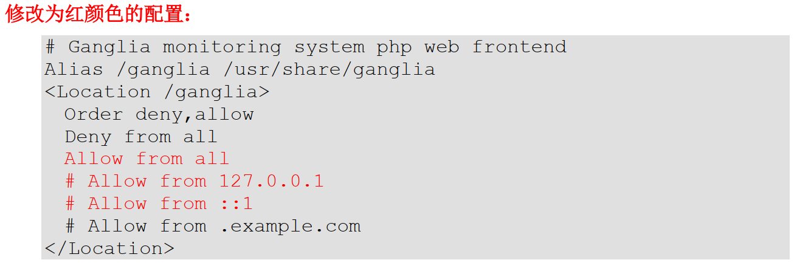
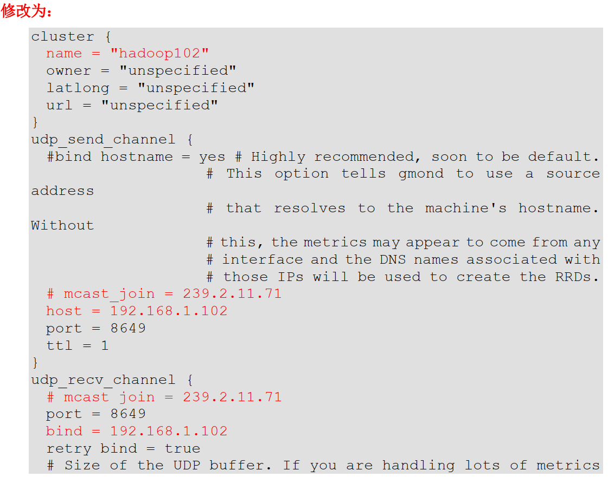
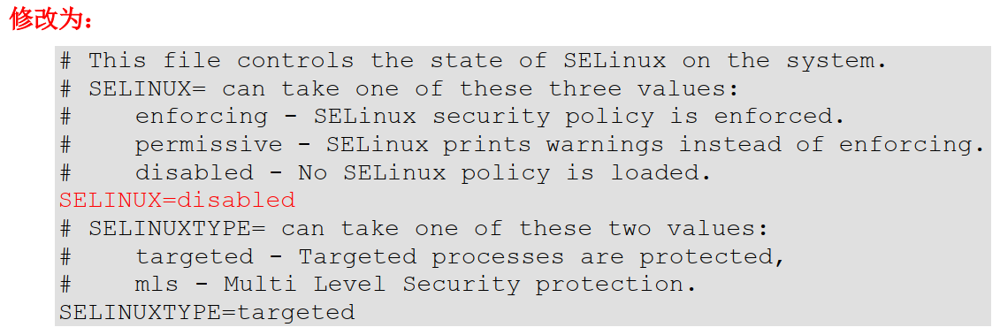
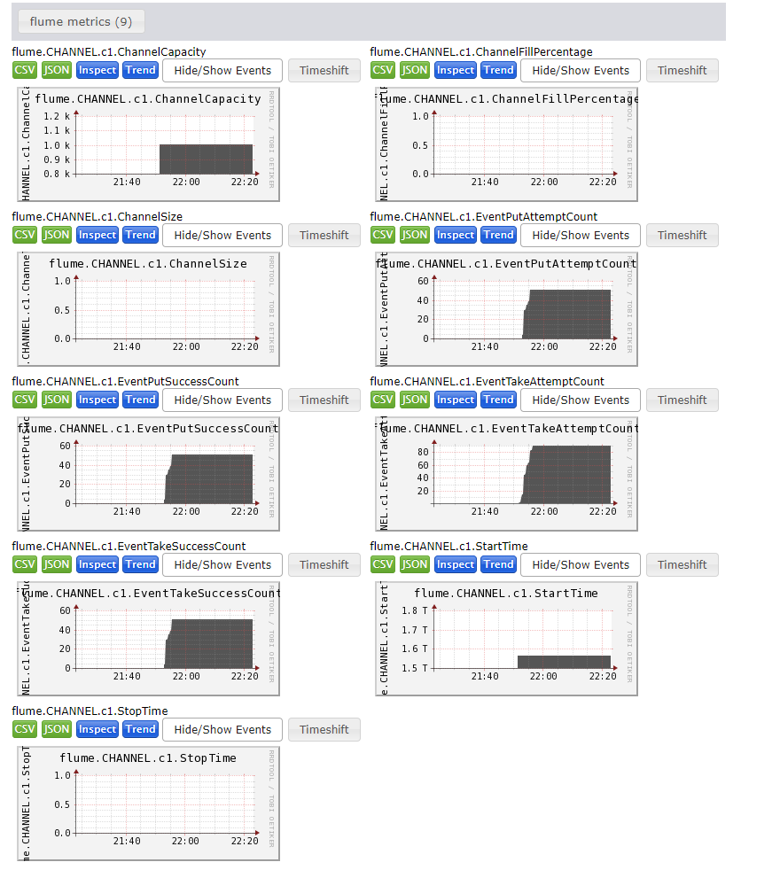
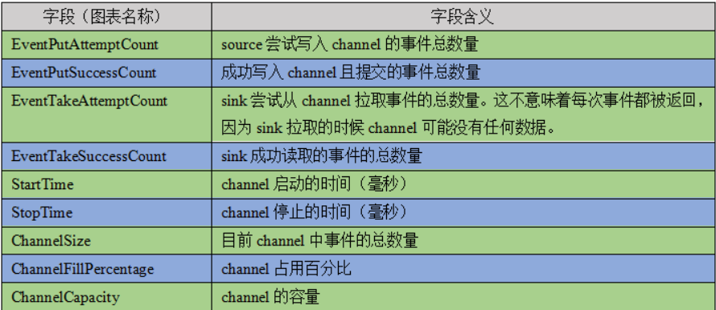

## Flume监控之Ganglia
### Ganglia的安装与部署
1) 安装httpd服务与php
```
sudo yum -y install httpd php
```
2) 安装其他依赖
```
sudo yum -y install rrdtool perl-rrdtool rrdtool-devel
sudo yum -y install apr-devel
```
3) 安装ganglia
```
sudo rpm -Uvh http://dl.fedoraproject.org/pub/epel/6/x86_64/epel-release-6-8.noarch.rpm
sudo yum -y install ganglia-gmetad
sudo yum -y install ganglia-web
sudo yum install -y ganglia-gmond
```

4) 修改配置文件/etc/httpd/conf.d/ganglia.conf
```
sudo vim /etc/httpd/conf.d/ganglia.conf
```
修改为如下的配置：
```
# Ganglia monitoring system php web frontend
Alias /ganglia /usr/share/ganglia
<Location /ganglia>
  Order deny,allow
  Deny from all
  Allow from all
  # Allow from 127.0.0.1
  # Allow from ::1
  # Allow from .example.com
</Location>
```



5) 修改配置文件/etc/ganglia/gmetad.conf
```
sudo vim /etc/ganglia/gmetad.conf
```
修改为：
```
data_source "hadoop01" 192.168.216.111
```


6) 修改配置文件/etc/ganglia/gmond.conf
```
sudo vim /etc/ganglia/gmond.conf
```
修改为：
```
cluster {
  name = "hadoop01"
  owner = "unspecified"
  latlong = "unspecified"
  url = "unspecified"
}

udp_send_channel {
  #bind_hostname = yes # Highly recommended, soon to be default.
                       # This option tells gmond to use a source address
                       # that resolves to the machine's hostname.  Without
                       # this, the metrics may appear to come from any
                       # interface and the DNS names associated with
                       # those IPs will be used to create the RRDs.
  # mcast_join = 239.2.11.71
  host = 192.168.216.111
  port = 8649
  ttl = 1
}

udp_recv_channel {
  # mcast_join = 239.2.11.71
  port = 8649
  # bind = 239.2.11.71
  bind = 192.168.216.111
  retry_bind = true
  # Size of the UDP buffer. If you are handling lots of metrics you really
  # should bump it up to e.g. 10MB or even higher.
  # buffer = 10485760
}
```


7) 修改配置文件/etc/selinux/config
```
sudo vim /etc/selinux/config
```
修改为：
```
# This file controls the state of SELinux on the system.
# SELINUX= can take one of these three values:
#     enforcing - SELinux security policy is enforced.
#     permissive - SELinux prints warnings instead of enforcing.
#     disabled - No SELinux policy is loaded.
# SELINUX=enforcing
SELINUX=disabled
# SELINUXTYPE= can take one of these two values:
#     targeted - Targeted processes are protected,
#     mls - Multi Level Security protection.
SELINUXTYPE=targeted
```


提示：selinux本次生效关闭必须重启，如果此时不想重启，可以临时生效之：
```
sudo setenforce 0
```

8) 启动ganglia
```
sudo service httpd start
sudo service gmetad start
sudo service gmond start
```

9) 打开网页浏览ganglia页面
http://hadoop01/ganglia
提示：如果完成以上操作依然出现权限不足错误，请修改/var/lib/ganglia目录的权限：
```
sudo chmod -R 777 /var/lib/ganglia
```

### 操作Flume测试监控
1) 修改flume/conf目录下的flume-env.sh配置：
```
JAVA_OPTS="-Dflume.monitoring.type=ganglia
-Dflume.monitoring.hosts=192.168.216.111:8649
-Xms100m
-Xmx200m"
```

2) 启动Flume任务
```
bin/flume-ng agent \
--conf conf/ \
--name a1 \
--conf-file job/flume-telnet-logger.conf \
-Dflume.root.logger==INFO,console \
-Dflume.monitoring.type=ganglia \
-Dflume.monitoring.hosts=192.168.216.111:8649
```

3) 发送数据观察ganglia监测图
```
telnet localhost 44444
```
样式如图：


图例说明：
| 字段（图表名称）      | 字段含义                                                                                                          |
| --------------------- | ----------------------------------------------------------------------------------------------------------------- |
| EventPutAttemptCount  | source 尝试写入 channel 的事件总数量                                                                              |
| EventPutSuccessCount  | 成功写入 channel 且提交的事件总数量                                                                               |
| EventTakeAttemptCount | sink 尝试从 channel 拉取事件的总数量。这不意味着每次事件都被返回，因为 sink 拉取的时候 channel 可能没有任何数据。 |
| EventTakeSuccessCount | sink 成功读取的事件的总数量                                                                                       |
| StartTime             | channel 启动的时间（毫秒）                                                                                        |
| StopTime              | channel 停止的时间（毫秒）                                                                                        |
| ChannelSize           | 目前 channel 中事件的总数量                                                                                       |
| ChannelFillPercentage | channel 占用百分比                                                                                                |
| ChannelCapacity       | channel 的容量                                                                                                    |




