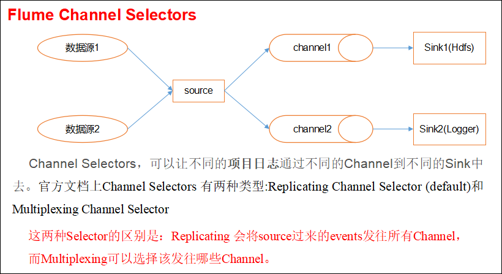
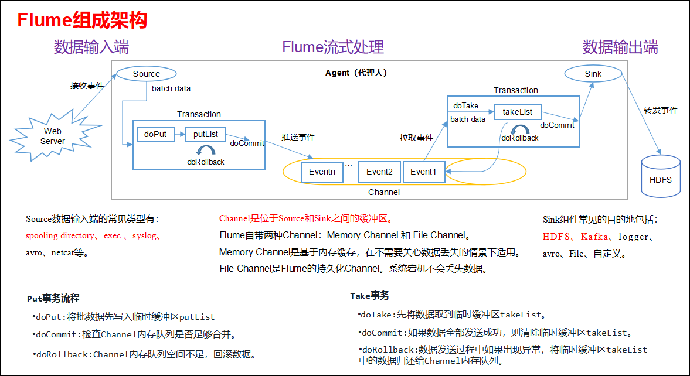

## Flume企业真实面试题（重点）
### 你是如何实现Flume数据传输的监控的？
使用第三方框架Ganglia实时监控Flume。

### Flume的Source，Sink，Channel的作用？你们Source是什么类型？
1、作用
（1）Source组件是专门用来收集数据的，可以处理各种类型、各种格式的日志数据，包括avro、thrift、exec、jms、spooling directory、netcat、sequence generator、syslog、http、legacy。  
（2）Channel组件对采集到的数据进行缓存，可以存放在Memory或File中。  
（3）Sink组件是用于把数据发送到目的地的组件，目的地包括Hdfs、Logger、avro、thrift、ipc、file、Hbase、solr、自定义。

2、我公司采用的Source类型为：
（1）监控后台日志：exec
（2）监控目录：spooldir

### Flume的Channel Selectors

### Flume参数调优
#### 1. Source
增加 Source 个数（使用 Tair Dir Source 时可增加 FileGroups 个数）可以增大 Source 的读取数据的能力。例如：当某一个目录产生的文件过多时需要将这个文件目录拆分成多个文件目录，同时配置好多个 Source 以保证 Source 有足够的能力获取到新产生的数据。

batchSize 参数决定 Source 一次批量运输到 Channel 的 Event 条数，适当调大这个参数可以提高 Source 搬运 Event 到 Channel 时的性能。

#### 2. Channel 
type 选择 memory 时 Channel 的性能最好，但是如果 Flume 进程意外挂掉可能会丢失数据。type 选择 file 时 Channel 的容错性更好，但是性能上会比 memory Channel 差。

使用 file Channel 时 dataDirs 配置多个不同盘下的目录可以提高性能。

Capacity 参数决定 Channel 可容纳最大的 Event 条数。transactionCapacity 参数决定每次 Source 往 Channel 里面写的最大 Event 条数和每次 Sink 从 Channel 里面读的最大 Event 条数。transactionCapacity 需要大于 Source 和 Sink 的 batchSize 参数。

#### 3. Sink 
增加 Sink 的个数可以增加 Sink 消费 Event 的能力。Sink 也不是越多越好够用就行，过多的 Sink 会占用系统资源，造成系统资源不必要的浪费。

batchSize 参数决定 Sink 一次批量从 Channel 读取的 Event 条数，适当调大这个参数可以提高 Sink 从 Channel 搬出 Event 的性能。

### Flume的事务机制
Flume的事务机制（类似数据库的事务机制）：Flume 使用两个独立的事务分别负责从 Soucrce 到 Channel，以及从 Channel 到 Sink 的事件传递。比如 spooling directory source 为文件的每一行创建一个事件，一旦事务中所有的事件全部传递到 Channel 且提交成功，那么 Soucrce 就将该文件标记为完成。同理，事务以类似的方式处理从 Channel 到 Sink 的传递过程，如果因为某种原因使得事件无法记录，那么事务将会回滚。且所有的事件都会保持到 Channel 中，等待重新传递。

如下图所示：

### Flume采集数据会丢失吗？
不会，Channel存储可以存储在File中，数据传输自身有事务。

但是如果使用内存存储的话，掉电可能会丢失数据。

