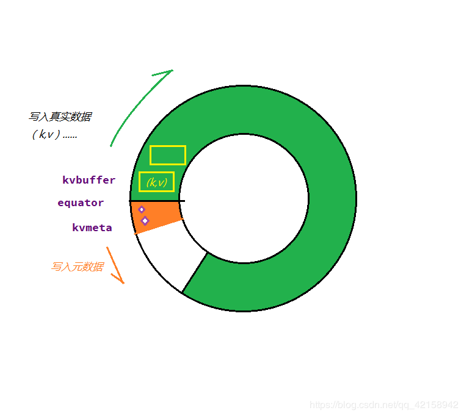
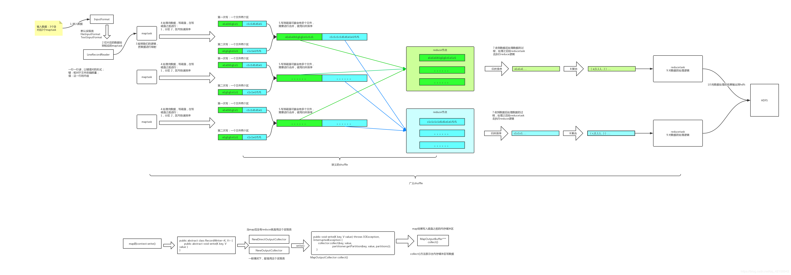

## MapTask
我们自定义的Mapper是由MapTask调用的mapper的run方法

### run
我们自定义的Mapper是由MapTask调用的mapper的run方法
```java
  @Override
  public void run(final JobConf job, final TaskUmbilicalProtocol umbilical)
    throws IOException, ClassNotFoundException, InterruptedException {
    this.umbilical = umbilical;

    //返回的就是true
    if (isMapTask()) {
      // If there are no reducers then there won't be any sort. Hence the map 
      // phase will govern the entire attempt's progress.
      //如果reduce个数为0，map占整个进度的100%
      if (conf.getNumReduceTasks() == 0) {
        mapPhase = getProgress().addPhase("map", 1.0f);
      } else {
        // If there are reducers then the entire attempt's progress will be 
        // split between the map phase (67%) and the sort phase (33%).
        // 如果有reduce，就有排序，排序占33%，map占66%
        mapPhase = getProgress().addPhase("map", 0.667f);
        sortPhase  = getProgress().addPhase("sort", 0.333f);
      }
    }
    TaskReporter reporter = startReporter(umbilical);
 
    boolean useNewApi = job.getUseNewMapper();
    initialize(job, getJobID(), reporter, useNewApi);

    // check if it is a cleanupJobTask
    if (jobCleanup) {
      runJobCleanupTask(umbilical, reporter);
      return;
    }
    if (jobSetup) {
      runJobSetupTask(umbilical, reporter);
      return;
    }
    if (taskCleanup) {
      runTaskCleanupTask(umbilical, reporter);
      return;
    }

    if (useNewApi) {
      //据新旧api选择执行的Mapper函数，Mapper的run方法在这里调用
      runNewMapper(job, splitMetaInfo, umbilical, reporter);
    } else {
      runOldMapper(job, splitMetaInfo, umbilical, reporter);
    }
    done(umbilical, reporter);
  }
```

### runNewMapper
```java
  @SuppressWarnings("unchecked")
  private <INKEY,INVALUE,OUTKEY,OUTVALUE>
  void runNewMapper(final JobConf job,
                    final TaskSplitIndex splitIndex,
                    final TaskUmbilicalProtocol umbilical,
                    TaskReporter reporter
                    ) throws IOException, ClassNotFoundException,
                             InterruptedException {
    // make a task context so we can get the classes
    org.apache.hadoop.mapreduce.TaskAttemptContext taskContext =
      new org.apache.hadoop.mapreduce.task.TaskAttemptContextImpl(job, 
                                                                  getTaskID(),
                                                                  reporter);
    // make a mapper
    // 通过反射实例化mapper，根据我们设置的Mapper（job.setMapperClass）来创建mapper类
    org.apache.hadoop.mapreduce.Mapper<INKEY,INVALUE,OUTKEY,OUTVALUE> mapper =
      (org.apache.hadoop.mapreduce.Mapper<INKEY,INVALUE,OUTKEY,OUTVALUE>)
        ReflectionUtils.newInstance(taskContext.getMapperClass(), job);
    // make the input format
    // 实例化 InputFormat，根据设置的InputFormart来创建类 (job.setInputFormatClass)  
    org.apache.hadoop.mapreduce.InputFormat<INKEY,INVALUE> inputFormat =
      (org.apache.hadoop.mapreduce.InputFormat<INKEY,INVALUE>)
        ReflectionUtils.newInstance(taskContext.getInputFormatClass(), job);
    // rebuild the input split
    // 根据前面拿到的splitinfo 创建InputSplit
    org.apache.hadoop.mapreduce.InputSplit split = null;
    split = getSplitDetails(new Path(splitIndex.getSplitLocation()),
        splitIndex.getStartOffset());
    LOG.info("Processing split: " + split);

    //创建RecordReader， 用来读数据。
    //实际读取数据的是NewTrackingRecordReader的real属性：this.real = inputFormat.createRecordReader(split, taskContext);
    //TextInputFormat的RecordReader方法返回LineRecordReader，所以实际读取数据的是LineRecordReader  
    org.apache.hadoop.mapreduce.RecordReader<INKEY,INVALUE> input =
      new NewTrackingRecordReader<INKEY,INVALUE>
        (split, inputFormat, reporter, taskContext);
    
    job.setBoolean(JobContext.SKIP_RECORDS, isSkipping());
    // RecordWriter output用来写数据
    org.apache.hadoop.mapreduce.RecordWriter output = null;
    
    // get an output object
    // 创建输出类， 在context.write的时候会调用，正常情况下就是NewOutputCollector
    if (job.getNumReduceTasks() == 0) {
      //reduce数量为0时，不需要suffer
      output = 
        new NewDirectOutputCollector(taskContext, job, umbilical, reporter);
    } else {
      output = new NewOutputCollector(taskContext, job, umbilical, reporter);
    }

    //对mapContent进行赋值。mapContext里面封装了各种属性，mapper的run和map方法都会传入mapperContext
    org.apache.hadoop.mapreduce.MapContext<INKEY, INVALUE, OUTKEY, OUTVALUE> 
    mapContext = 
      new MapContextImpl<INKEY, INVALUE, OUTKEY, OUTVALUE>(job, getTaskID(), 
          input, output, 
          committer, 
          reporter, split);

    //mapContent进行包装
    org.apache.hadoop.mapreduce.Mapper<INKEY,INVALUE,OUTKEY,OUTVALUE>.Context 
        mapperContext = 
          new WrappedMapper<INKEY, INVALUE, OUTKEY, OUTVALUE>().getMapContext(
              mapContext);

    try {
      //NewTrackingRecordReader初始化 ，主要是调用real.initialize，也就是调用LineRecordReader的initialize方法
      input.initialize(split, mapperContext);
      //运行mapper的run方法
      mapper.run(mapperContext);
      mapPhase.complete();
      setPhase(TaskStatus.Phase.SORT);
      statusUpdate(umbilical);
      input.close();
      input = null;
      output.close(mapperContext);
      output = null;
    } finally {
      closeQuietly(input);
      closeQuietly(output, mapperContext);
    }
  }
```

## map端文件的读取
先来看看文件的读取，InputFormat只有两个抽象方法，getSplits方法返回切片列表，createRecordReader创建读取器。一个用于切片，一个用于读取切片。

### InputFormat
InputFormat只有两个抽象方法，getSplits方法返回切片列表，createRecordReader创建读取器。一个用于切片，一个用于读取切片。
```java
public abstract class InputFormat<K, V> {
  public abstract 
    List<InputSplit> getSplits(JobContext context
                               ) throws IOException, InterruptedException;
  
  public abstract 
    RecordReader<K,V> createRecordReader(InputSplit split,
                                         TaskAttemptContext context
                                        ) throws IOException, 
                                                 InterruptedException;
}
```

### TextInputFormat
主要是使用TextInputFormat
```java
/** An {@link InputFormat} for plain text files.  Files are broken into lines.
 * Either linefeed or carriage-return are used to signal end of line.  Keys are
 * the position in the file, and values are the line of text.. */
//用于读取纯文本，key是该行在整个文件中的字节偏移量（不是行数），value是这行的内容，为一个Text对象
@InterfaceAudience.Public
@InterfaceStability.Stable
public class TextInputFormat extends FileInputFormat<LongWritable, Text> {

  @Override
  public RecordReader<LongWritable, Text> 
    createRecordReader(InputSplit split,
                       TaskAttemptContext context) {
    String delimiter = context.getConfiguration().get(
        "textinputformat.record.delimiter");
    byte[] recordDelimiterBytes = null;
    if (null != delimiter)
      recordDelimiterBytes = delimiter.getBytes(Charsets.UTF_8);
    //LineRecordReader用于一行一行的读取文件
    return new LineRecordReader(recordDelimiterBytes);
  }

  @Override
  protected boolean isSplitable(JobContext context, Path file) {
    final CompressionCodec codec =
      new CompressionCodecFactory(context.getConfiguration()).getCodec(file);
    if (null == codec) {
      //没压缩，能切片
      return true;
    }
    //看压缩是否支持切片
    return codec instanceof SplittableCompressionCodec;
  }

}
```

### LineRecordReader

主要功能：读取split内容，通过next方法将每一行内容赋值给value，行坐标赋值给key，给调用方。这里面解决了一个行切分的问题，一行记录被切分到两个split中，解决办法是，每次不读取split的第一行，在读取到spli末尾时 多读一行，这样就解决了切分的问题
在构造方法中有下面一段代码，就是将游标跳过第一行
```java
    // If this is not the first split, we always throw away first record
    // because we always (except the last split) read one extra line in
    // next() method.
    if (start != 0) {
      start += in.readLine(new Text(), 0, maxBytesToConsume(start));
    }
    this.pos = start;
```


```java
/**
 * Treats keys as offset in file and value as line. 
 */
@InterfaceAudience.LimitedPrivate({"MapReduce", "Pig"})
@InterfaceStability.Evolving
public class LineRecordReader extends RecordReader<LongWritable, Text> {
  private static final Log LOG = LogFactory.getLog(LineRecordReader.class);
  public static final String MAX_LINE_LENGTH = 
    "mapreduce.input.linerecordreader.line.maxlength";

  private long start;
  private long pos;
  private long end;
  private SplitLineReader in;
  private FSDataInputStream fileIn;
  private Seekable filePosition;
  private int maxLineLength;
  private LongWritable key;
  private Text value;
  private boolean isCompressedInput;
  private Decompressor decompressor;
  private byte[] recordDelimiterBytes;

  public LineRecordReader() {
  }

  public LineRecordReader(byte[] recordDelimiter) {
    this.recordDelimiterBytes = recordDelimiter;
  }

  public void initialize(InputSplit genericSplit,
                         TaskAttemptContext context) throws IOException {
    FileSplit split = (FileSplit) genericSplit;
    Configuration job = context.getConfiguration();
    this.maxLineLength = job.getInt(MAX_LINE_LENGTH, Integer.MAX_VALUE);
    start = split.getStart();//读取开始位置
    end = start + split.getLength();//读取结束位置
    final Path file = split.getPath();

    // open the file and seek to the start of the split
    final FileSystem fs = file.getFileSystem(job);
    fileIn = fs.open(file);
    
    CompressionCodec codec = new CompressionCodecFactory(job).getCodec(file);
    if (null!=codec) {
      isCompressedInput = true; 
      decompressor = CodecPool.getDecompressor(codec);
      if (codec instanceof SplittableCompressionCodec) {
        final SplitCompressionInputStream cIn =
          ((SplittableCompressionCodec)codec).createInputStream(
            fileIn, decompressor, start, end,
            SplittableCompressionCodec.READ_MODE.BYBLOCK);
        in = new CompressedSplitLineReader(cIn, job,
            this.recordDelimiterBytes);
        start = cIn.getAdjustedStart();
        end = cIn.getAdjustedEnd();
        filePosition = cIn;
      } else {
        in = new SplitLineReader(codec.createInputStream(fileIn,
            decompressor), job, this.recordDelimiterBytes);
        filePosition = fileIn;
      }
    } else {
      //直接定位到文件开始读取的位置
      fileIn.seek(start);
      in = new UncompressedSplitLineReader(
          fileIn, job, this.recordDelimiterBytes, split.getLength());
      filePosition = fileIn;
    }
    // If this is not the first split, we always throw away first record
    // because we always (except the last split) read one extra line in
    // next() method.
    // 不是文件的第一个切片从第二行读取，非最后一个切片都会多读取一行。这个解决了切片跨行的问题。
    if (start != 0) {
      start += in.readLine(new Text(), 0, maxBytesToConsume(start));
    }
    //读取的偏移指针指向开始位置
    this.pos = start;
  }
  

  private int maxBytesToConsume(long pos) {
    return isCompressedInput
      ? Integer.MAX_VALUE
      : (int) Math.max(Math.min(Integer.MAX_VALUE, end - pos), maxLineLength);
  }

  private long getFilePosition() throws IOException {
    long retVal;
    if (isCompressedInput && null != filePosition) {
      retVal = filePosition.getPos();
    } else {
      retVal = pos;
    }
    return retVal;
  }

  private int skipUtfByteOrderMark() throws IOException {
    // Strip BOM(Byte Order Mark)
    // Text only support UTF-8, we only need to check UTF-8 BOM
    // (0xEF,0xBB,0xBF) at the start of the text stream.
    int newMaxLineLength = (int) Math.min(3L + (long) maxLineLength,
        Integer.MAX_VALUE);
    int newSize = in.readLine(value, newMaxLineLength, maxBytesToConsume(pos));
    // Even we read 3 extra bytes for the first line,
    // we won't alter existing behavior (no backwards incompat issue).
    // Because the newSize is less than maxLineLength and
    // the number of bytes copied to Text is always no more than newSize.
    // If the return size from readLine is not less than maxLineLength,
    // we will discard the current line and read the next line.
    pos += newSize;
    int textLength = value.getLength();
    byte[] textBytes = value.getBytes();
    if ((textLength >= 3) && (textBytes[0] == (byte)0xEF) &&
        (textBytes[1] == (byte)0xBB) && (textBytes[2] == (byte)0xBF)) {
      // find UTF-8 BOM, strip it.
      LOG.info("Found UTF-8 BOM and skipped it");
      textLength -= 3;
      newSize -= 3;
      if (textLength > 0) {
        // It may work to use the same buffer and not do the copyBytes
        textBytes = value.copyBytes();
        value.set(textBytes, 3, textLength);
      } else {
        value.clear();
      }
    }
    return newSize;
  }

  //读取每一行数据的时候，都会执行nextKeyValue()方法。  
  //返回为true的时候，就会再调用getCurrentKey和getCurrentValue方法获取，key，value值
  public boolean nextKeyValue() throws IOException {
    if (key == null) {
      key = new LongWritable();
    }
    //看到key就是读取行的偏移量
    key.set(pos);
    if (value == null) {
      value = new Text();
    }
    int newSize = 0;
    // We always read one extra line, which lies outside the upper
    // split limit i.e. (end - 1)
    while (getFilePosition() <= end || in.needAdditionalRecordAfterSplit()) {
      if (pos == 0) {
        newSize = skipUtfByteOrderMark();
      } else {
        newSize = in.readLine(value, maxLineLength, maxBytesToConsume(pos));
        pos += newSize;
      }

      if ((newSize == 0) || (newSize < maxLineLength)) {
        break;
      }

      // line too long. try again
      LOG.info("Skipped line of size " + newSize + " at pos " + 
               (pos - newSize));
    }
    if (newSize == 0) {
      key = null;
      value = null;
      return false;
    } else {
      return true;
    }
  }

  @Override
  public LongWritable getCurrentKey() {
    return key;
  }

  @Override
  public Text getCurrentValue() {
    return value;
  }

  /**
   * Get the progress within the split
   */
  public float getProgress() throws IOException {
    if (start == end) {
      return 0.0f;
    } else {
      return Math.min(1.0f, (getFilePosition() - start) / (float)(end - start));
    }
  }
  
  public synchronized void close() throws IOException {
    try {
      if (in != null) {
        in.close();
      }
    } finally {
      if (decompressor != null) {
        CodecPool.returnDecompressor(decompressor);
        decompressor = null;
      }
    }
  }
}
```

## 默认的Mapper
看一下默认的Mapper
```java
public class Mapper<KEYIN, VALUEIN, KEYOUT, VALUEOUT> {

  /**
   * The <code>Context</code> passed on to the {@link Mapper} implementations.
   */
  public abstract class Context
    implements MapContext<KEYIN,VALUEIN,KEYOUT,VALUEOUT> {
  }
  
  /**
   * Called once at the beginning of the task.
   */
  //在task开始的时候调用一次
  protected void setup(Context context
                       ) throws IOException, InterruptedException {
    // NOTHING
  }

  /**
   * Called once for each key/value pair in the input split. Most applications
   * should override this, but the default is the identity function.
   */
  @SuppressWarnings("unchecked")
  //我们主要重写的就是这个方法，默认直接把key和value输出了
  protected void map(KEYIN key, VALUEIN value, 
                     Context context) throws IOException, InterruptedException {
    context.write((KEYOUT) key, (VALUEOUT) value);
  }

  /**
   * Called once at the end of the task.
   */
  //在task结束的时候调用一次
  protected void cleanup(Context context
                         ) throws IOException, InterruptedException {
    // NOTHING
  }
  
  /**
   * Expert users can override this method for more complete control over the
   * execution of the Mapper.
   * @param context
   * @throws IOException
   */
  //run方法被mapTask调用，此方法中调用了setup、map、cleanup方法
  public void run(Context context) throws IOException, InterruptedException {
    setup(context);
    try {
      while (context.nextKeyValue()) {
        map(context.getCurrentKey(), context.getCurrentValue(), context);
      }
    } finally {
      cleanup(context);
    }
  }
}
```

## map端的输出
看一下map端的输出，输出实际上调用的是NewOutputCollector的write方法，最终调用的collector.collect(key, value,partitione)。

NewOutputCollector的collector属性默认是mapOutputBuffer类，这个类十分复杂。收集器虽然也是可以自定义的，但是很少有人自定义，通常只会调节参数。听说hadoop3.x版本mapOutputBuffer收集器是由c语言实现的native方法，这也是hadoop声称比spark还要快的原因之一。

### NewOutputCollector
NewOutputCollector是在MapTask类中定义的。

最终调用的collector.collect(key, value,partitione)。
```java
  private class NewOutputCollector<K,V>
    extends org.apache.hadoop.mapreduce.RecordWriter<K,V> {
    private final MapOutputCollector<K,V> collector;
    private final org.apache.hadoop.mapreduce.Partitioner<K,V> partitioner;
    private final int partitions;

    @SuppressWarnings("unchecked")
    NewOutputCollector(org.apache.hadoop.mapreduce.JobContext jobContext,
                       JobConf job,
                       TaskUmbilicalProtocol umbilical,
                       TaskReporter reporter
                       ) throws IOException, ClassNotFoundException {
      //map输出的收集器
      collector = createSortingCollector(job, reporter);
      partitions = jobContext.getNumReduceTasks();
      if (partitions > 1) {
        //reduce的个数大于1，创建分区器，默认是HashPartitioner，使用的key的hash取模：return (key.hashCode() & Integer.MAX_VALUE) % numReduceTasks;
        partitioner = (org.apache.hadoop.mapreduce.Partitioner<K,V>)
          ReflectionUtils.newInstance(jobContext.getPartitionerClass(), job);
      } else {
        //reduce的个数等于1，就用这个分区器，返回0号分区。
        partitioner = new org.apache.hadoop.mapreduce.Partitioner<K,V>() {
          @Override
          public int getPartition(K key, V value, int numPartitions) {
            return partitions - 1;
          }
        };
      }
    }

    @Override
    public void write(K key, V value) throws IOException, InterruptedException {
      //输出实际上调用的是collector.collect(key, value,partitione)
      collector.collect(key, value,
                        partitioner.getPartition(key, value, partitions));
    }

    @Override
    public void close(TaskAttemptContext context
                      ) throws IOException,InterruptedException {
      try {
        collector.flush();
      } catch (ClassNotFoundException cnf) {
        throw new IOException("can't find class ", cnf);
      }
      collector.close();
    }
  }
```

从createSortingCollector方法可以看到默认的收集器类就是MapOutputBuffer
```java
@SuppressWarnings("unchecked")
private <KEY, VALUE> MapOutputCollector<KEY, VALUE>
        createSortingCollector(JobConf job, TaskReporter reporter)
  throws IOException, ClassNotFoundException {
  MapOutputCollector.Context context =
    new MapOutputCollector.Context(this, job, reporter);

  Class<?>[] collectorClasses = job.getClasses(
    JobContext.MAP_OUTPUT_COLLECTOR_CLASS_ATTR, MapOutputBuffer.class);
  int remainingCollectors = collectorClasses.length;
  Exception lastException = null;
  for (Class clazz : collectorClasses) {
    try {
      if (!MapOutputCollector.class.isAssignableFrom(clazz)) {
        throw new IOException("Invalid output collector class: " + clazz.getName() +
          " (does not implement MapOutputCollector)");
      }
      Class<? extends MapOutputCollector> subclazz =
        clazz.asSubclass(MapOutputCollector.class);
      LOG.debug("Trying map output collector class: " + subclazz.getName());
      MapOutputCollector<KEY, VALUE> collector =
        ReflectionUtils.newInstance(subclazz, job);
      //先调用MapOutputBuffer的init方法，然后返回。
      collector.init(context);
      LOG.info("Map output collector class = " + collector.getClass().getName());
      return collector;
    } catch (Exception e) {
      String msg = "Unable to initialize MapOutputCollector " + clazz.getName();
      if (--remainingCollectors > 0) {
        msg += " (" + remainingCollectors + " more collector(s) to try)";
      }
      lastException = e;
      LOG.warn(msg, e);
    }
  }
  throw new IOException("Initialization of all the collectors failed. " +
    "Error in last collector was :" + lastException.getMessage(), lastException);
}
```

### MapOutputBuffer
这个类比较复杂，这里只看一下MapOutputBuffer用到了什么。

#### init方法
可以看到

spillper默认为0.8。spiller:当数据占用超过这个比例时，就溢出.=。
sortmb缓冲区的大小，默认100M。mapreduce.task.io.sort.mb。
排序器，默认是QuickSort快速排序。如果是我们自定义排序器，需要实现IndexedSorter接口。
combiner也在里面定义了，用于实现map端的reduce。

```java
@SuppressWarnings("unchecked")
public void init(MapOutputCollector.Context context
                ) throws IOException, ClassNotFoundException {
  job = context.getJobConf();
  reporter = context.getReporter();
  mapTask = context.getMapTask();
  mapOutputFile = mapTask.getMapOutputFile();
  sortPhase = mapTask.getSortPhase();
  spilledRecordsCounter = reporter.getCounter(TaskCounter.SPILLED_RECORDS);
  partitions = job.getNumReduceTasks();
  rfs = ((LocalFileSystem)FileSystem.getLocal(job)).getRaw();

  //sanity checks
  //spiller，默认0.8(80%)溢写。mapreduce.map.sort.spill.percent
  final float spillper =
    job.getFloat(JobContext.MAP_SORT_SPILL_PERCENT, (float)0.8);
  //缓冲区的大小，默认100M。mapreduce.task.io.sort.mb
  final int sortmb = job.getInt(JobContext.IO_SORT_MB, 100);
  indexCacheMemoryLimit = job.getInt(JobContext.INDEX_CACHE_MEMORY_LIMIT,
                                     INDEX_CACHE_MEMORY_LIMIT_DEFAULT);
  if (spillper > (float)1.0 || spillper <= (float)0.0) {
    throw new IOException("Invalid \"" + JobContext.MAP_SORT_SPILL_PERCENT +
        "\": " + spillper);
  }
  if ((sortmb & 0x7FF) != sortmb) {
    throw new IOException(
        "Invalid \"" + JobContext.IO_SORT_MB + "\": " + sortmb);
  }
  //排序器，默认是QuickSort快速排序。如果是我们自定义排序器，需要实现IndexedSorter接口。
  sorter = ReflectionUtils.newInstance(job.getClass("map.sort.class",
        QuickSort.class, IndexedSorter.class), job);
  // buffers and accounting
  ////将mb转化成byte，sortmb<<20就是sortmb*1024*1024
  int maxMemUsage = sortmb << 20;
  //METASIZE为元数据长度，为16。maxMemUsage是16的倍数。NMETA = 4;num meta ints。METASIZE = NMETA * 4; size in bytes
  maxMemUsage -= maxMemUsage % METASIZE;
  kvbuffer = new byte[maxMemUsage];
  bufvoid = kvbuffer.length;
  kvmeta = ByteBuffer.wrap(kvbuffer)
     .order(ByteOrder.nativeOrder())
     .asIntBuffer();
  setEquator(0);
  bufstart = bufend = bufindex = equator;
  kvstart = kvend = kvindex;

  maxRec = kvmeta.capacity() / NMETA;
  softLimit = (int)(kvbuffer.length * spillper);
  bufferRemaining = softLimit;
  LOG.info(JobContext.IO_SORT_MB + ": " + sortmb);
  LOG.info("soft limit at " + softLimit);
  LOG.info("bufstart = " + bufstart + "; bufvoid = " + bufvoid);
  LOG.info("kvstart = " + kvstart + "; length = " + maxRec);

  // k/v serialization
  comparator = job.getOutputKeyComparator();
  keyClass = (Class<K>)job.getMapOutputKeyClass();
  valClass = (Class<V>)job.getMapOutputValueClass();
  serializationFactory = new SerializationFactory(job);
  keySerializer = serializationFactory.getSerializer(keyClass);
  keySerializer.open(bb);
  valSerializer = serializationFactory.getSerializer(valClass);
  valSerializer.open(bb);

  // output counters
  mapOutputByteCounter = reporter.getCounter(TaskCounter.MAP_OUTPUT_BYTES);
  mapOutputRecordCounter =
    reporter.getCounter(TaskCounter.MAP_OUTPUT_RECORDS);
  fileOutputByteCounter = reporter
      .getCounter(TaskCounter.MAP_OUTPUT_MATERIALIZED_BYTES);

  // compression
  if (job.getCompressMapOutput()) {
    Class<? extends CompressionCodec> codecClass =
      job.getMapOutputCompressorClass(DefaultCodec.class);
    codec = ReflectionUtils.newInstance(codecClass, job);
  } else {
    codec = null;
  }

  // combiner
  final Counters.Counter combineInputCounter =
    reporter.getCounter(TaskCounter.COMBINE_INPUT_RECORDS);
  //combiner是一个NewCombinerRunner类型，调用Job的reducer来对map的输出在map端进行combine。
  combinerRunner = CombinerRunner.create(job, getTaskID(), 
                                         combineInputCounter,
                                         reporter, null);
  if (combinerRunner != null) {
    final Counters.Counter combineOutputCounter =
      reporter.getCounter(TaskCounter.COMBINE_OUTPUT_RECORDS);
    combineCollector= new CombineOutputCollector<K,V>(combineOutputCounter, reporter, job);
  } else {
    combineCollector = null;
  }
  spillInProgress = false;
  minSpillsForCombine = job.getInt(JobContext.MAP_COMBINE_MIN_SPILLS, 3);
  //启动一个SpillThread线程
  spillThread.setDaemon(true);
  spillThread.setName("SpillThread");
  spillLock.lock();
  try {
    spillThread.start();
    while (!spillThreadRunning) {
      spillDone.await();
    }
  } catch (InterruptedException e) {
    throw new IOException("Spill thread failed to initialize", e);
  } finally {
    spillLock.unlock();
  }
  if (sortSpillException != null) {
    throw new IOException("Spill thread failed to initialize",
        sortSpillException);
  }
}
```

#### 环形缓冲区kvbuffer工作原理
1.为什么要环形缓冲区？
答：使用环形缓冲区，便于写入缓冲区和写出缓冲区同时进行。

2.为什么不等缓冲区满了再spill?
答：会出现阻塞。

3.数据的分区和排序是在哪完成的？
答：分区是根据元数据meta中的分区号partition来分区的，排序是在spill的时候排序。

缓冲区的工作机制很简单，逐次将输出数据写入缓冲区，当缓冲区中的剩余空间已不足以容纳本次输出时，就将整个缓冲区的内容Spill到文件中，腾出缓冲区空间，再继续往里面写。但是，在将缓冲区内容Spill到文件中的过程中，对于缓冲区的写入就被阻塞了，会导致Mapper只能工作一段时间，停顿一段时间。

为了避免这样的全同步方式，另外有一个Spill线程。Mapper线程源源不断地往缓冲区中写，Spill线程把缓冲区的内容写入文件。这样Mapper的输出就编程了不阻塞的异步方式。但是为了不让Mapper对缓冲区的写入与Spill线程从缓冲区的读出互相干扰。所以，一般缓冲区都是环形缓冲区，让写入者在前面跑，读出者在后面追，如果写入者跑得太快，跑了一圈追上了读者者，就让写入者停一下；如果读出者追得太快，追上了写入者就让读出者停一下。



mapreduce过程解析



```java

```


