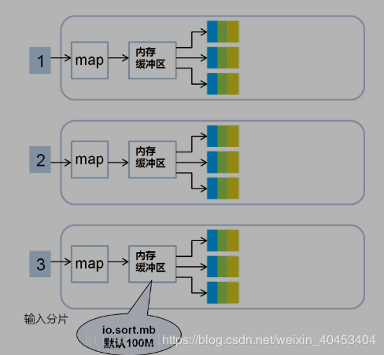

# MapReduce详解与源码分析
`https://www.cnblogs.com/victordata/p/12112498.html`

[toc]

## Split阶段
首先，接到hdf文件输入,在mapreduce中的map task开始之前，将文件按照指定的大小切割成若干个部分，每一部分称为一个split，默认是split的大小与block的大小相等，均为128MB。split大小由minSize、maxSize、blocksize决定，以wordcount代码为例，以下是main()方法

进入waitForCompletion(true)方法，进入submit()方法

找到 return submitter .submitJobInternal(Job.this, cluster);
进入，找到 int maps = writeSplits(job, submitJobDir);

进入writeNewSplits()方法

进入writeNewSplits()方法，可以看出该方法首先获取splits数组信息后，排序，将会优先处理大文件。最终返回mapper数量。这其中又分为两部分：确定切片数量 和 写入切片信息。确定切片数量的任务交由FileInputFormat的getSplits(job)完成，写入切片信息的任务交由JobSplitWriter.createSplitFiles(jobSubmitDir, conf, jobSubmitDir.getFileSystem(conf), array)方法，该方法会将切片信息和SplitMetaInfo都写入HDFS中，return array.length;返回的是map任务数，默认map的数量是： default_num = total_size / block_size;

实际的mapper数量就是输入切片的数量，而切片的数量又由使用的输入格式决定，默认为TextInputFormat，该类为FileInputFormat的子类。确定切片数量的任务交由FileInputFormat的getSplits(job)完成。FileInputFormat继承自抽象类InputFormat，该类定义了MapReduce作业的输入规范，其中的抽象方法List getSplits(JobContext context)定义了如何将输入分割为InputSplit，不同的输入有不同的分隔逻辑，而分隔得到的每个InputSplit交由不同的mapper处理，因此该方法的返回值确定了mapper的数量。

## Map阶段
每个map task都有一个内存缓冲区， map的输出结果先写到内存中的环形缓冲区，缓冲区为100M,不断的向缓冲区力写数据，当达到80M时，需要将缓冲区中的数据以一个临时文件的方式存到磁盘，当整个map task结束后再对磁盘中这个map task所产生的所有临时文件做合并，生成最终的输出文件。最后，等待reduce task来拉取数据。当然，如果map task的结果不大，能够完全存储到内存缓冲区，且未达到内存缓冲区的阀值，那么就不会有写临时文件到磁盘的操作，也不会有后面的合并。在写入的过程中会进行分区、排序、combine操作。

环形缓冲区：是使用指针机制把内存中的地址首尾相接形成一个存储中间数据的缓存区域，默认100MB;80M阈值,20M缓冲区,是为了解决写入环形缓冲区数据的速度大于写出到spill文件的速度是数据的不丢失;Spill文件：spill文件是环形缓冲区到达阈值后写入到磁盘的单个文件.这些文件在map阶段计算结束时,会合成分好区的一个merge文件供给给reduce任务抓取;spill文件过小的时候,就不会浪费io资源合并merge;默认情况下3个以下spill文件不合并;对于在环形缓冲区中的数据,最终达不到80m但是数据已经计算完毕的情况,map任务将会调用flush将缓冲区中的数据强行写出spill文件。

经过map类处理后，输出到内存缓冲区(默认大小100M)，超过一定大小后，文件溢写到磁盘上，按照key分类

按照key合并成大文件，减少网络开销

### 分区
看一下MapReduce自带的分区器HashPartitioner

假设有听个reduce任务，则分区的计算如下：

### 排序
在对map结果进行分区之后，对于落在相同的分区中的键值对，要进行排序。

## Shuffle阶段
Shuffle过程是MapReduce的核心，描述着数据从map task输出到reduce task输入的这段过程。reducetask根据自己的分区号，去各个maptask分区机器上取相应的结果分区数据，reducetask会将这些文件再进行合并（归并排序)。

所有相同key的数据汇集到一个partition

将相同的key value汇聚到一起， 但不计算

## Reduce阶段
reduce阶段分三个步骤：
抓取，合并，排序

1 reduce 任务会创建并行的抓取线程（fetcher）负责从完成的map任务中获取结果文件，是否完成是通过rpc心跳监听，通过http协议抓取；默认是5个抓取线程，可调，为了是整体并行，在map任务量大，分区多的时候，抓取线程调大；

2 抓取过来的数据会先保存在内存中，如果内存过大也溢出，不可见，不可调，但是单位是每个merge文件，不会切分数据；每个merge文件都会被封装成一个segment的对象，这个对象控制着这个merge文件的读取记录操作，有两种情况出现：在内存中有merge数据 •在溢写之后存到磁盘上的数据 •通过构造函数的区分，来分别创建对应的segment对象

3 这种segment对象会放到一个内存队列中MergerQueue，对内存和磁盘上的数据分别进行合并，内存中的merge对应的segment直接合并，磁盘中的合并与一个叫做合并因子的factor有关（默认是10）

4 排序问题，MergerQueue继承轮换排序的接口，每一个segment 是排好序的，而且按照key的值大小逻辑（和真的大小没关系）；每一个segment的第一个key都是逻辑最小，而所有的segment的排序是按照第一个key大小排序的，最小的在前面，这种逻辑总能保证第一个segment的第一个key值是所有key的逻辑最小文件合并之后，最终交给reduce函数计算的，是MergeQueue队列，每次计算的提取数据逻辑都是提取第一个segment的第一个key和value数据，一旦segment被调用了提取key的方法，MergeQueue队列将会整体重新按照最小key对segment排序，最终形成整体有序的计算结果；

partition 、Reduce、输出文件数量相等（这里应该是3个reduce，这里画错了）

### Reduce任务数量
在大数据量的情况下，如果只设置1个Reduce任务，其他节点将被闲置，效率底下 所以将Reduce设置成一个较大的值（max：72）.调节Reduce任务数量的方法 一个节点的Reduce任务数并不像Map任务数那样受多个因素制约

通过参数调节mapred.reduce.tasks（在配置文件中）

在代码中调用job.setNumReduceTasks(int n)方法（在code中）
