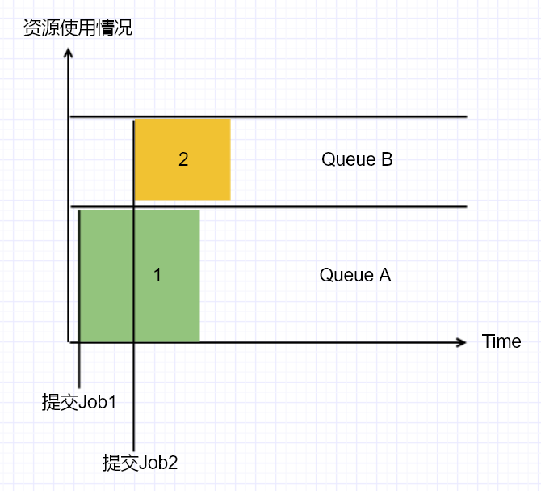

[toc]

# [hadoop-2.9.2] Capacity Scheduler
摘抄自：`https://cloud.tencent.com/developer/article/1428734`

## 1. Capacity Scheduler 原理

Capacity Scheduler 为支持多租户在共享集群上运行程序，为最大程度地提高应用程序的吞吐量，为实现集群的高利用率而生。

Capacity Scheduler允许多个用户共享一个hadoop集群，通过为每个用户分配一个专门的队列，可以使得该用户分配到全部资源的一部分资源，一个队列还可以进一步划分子队列，这样的机制使得不同的用户使用不同的队列，从而多个用户共享集群的资源。在一个队列内，使用FIFO的调度策略来调度各个Job。



单个作业使用的资源不会超过其队列的容量，遇到本队列资源不够用的情况，如果其他队列的资源空闲，那么可以使用其他队列的空闲资源，哪怕使用的总资源已经超过了本队列的容量，这种特性称为**弹性队列**。

可以为队列配置其最多使用的资源量，这样就不会过多侵占其他队列的资源，但这样也就牺牲了弹性队列的特性。这些配置需要根据实际情况找到一个合适的折中。

## 2. Capacity Scheduler 配置

### (1) 开启 Capacity Scheduler

yarn-site.xml：

```xml
<property>
    <name>yarn.resourcemanager.scheduler.class</name>
    <value>org.apache.hadoop.yarn.server.resourcemanager.scheduler.capacity.CapacityScheduler</value>
</property>
```

### (2) capacity-scheduler.xml

#### <1> 全局配置

```xml
<property>
    <name>yarn.scheduler.capacity.maximum-applications</name>
    <value>10000</value>
    <description>yarn集群(全部队列)中最多可以运行的app个数</description>
    <default>10000</default>
</property>

<property>
    <name>yarn.scheduler.capacity.maximum-am-resource-percent</name>
    <value>0.1</value>
    <description>ApplicationMaster可以使用的最多的集群资源比例</description>
    <default>0.1</default>
</property>

<property>
    <name>yarn.scheduler.capacity.resource-calculator</name>
    <value>org.apache.hadoop.yarn.util.resource.DominantResourceCalculator</value>
    <description>
    资源计算器的实现类，DefaultResourceCalculator只能计算内存资源；
    DominantResourceCalculator可以计算内存和core的个数。
    </description>
    <default>org.apache.hadoop.yarn.util.resource.DefaultResourceCalculator</default>
</property>
```

#### <2> 定义队列

假设某公司旗下有两个部门ui和co，ui部门有两个小组，group1和group2，公司的层级结构如下：

```
ui
——group1
——group2
co
```

根据以上层级结构定义yarn的队列

```xml
<property>
    <name>yarn.scheduler.capacity.root.queues</name>
    <value>ui,co</value>
    <description>定义一级队列（root为根队列）</description>
</property>

<property>
    <name>yarn.scheduler.capacity.root.ui.queues</name>
    <value>group1,group2</value>
    <description>定义二级队列（ui为父队列）</description>
</property>
```

#### <3> 队列容量配置

定义ui队列使用70%的资源，co队列使用30%的资源，ui队列的group1子队列和group2子队列各使用该队列的50%资源（即集群的35%资源）

```
<property>
    <name>yarn.scheduler.capacity.root.ui.capacity</name>
    <value>70</value>
</property>

<property>
    <name>yarn.scheduler.capacity.root.co.capacity</name>
    <value>30</value>
</property>

<property>
    <name>yarn.scheduler.capacity.root.ui.group1.capacity</name>
    <value>50</value>
</property>

<property>
    <name>yarn.scheduler.capacity.root.ui.group2.capacity</name>
    <value>50</value>
</property>
```

当某队列的资源不足，而其他队列有空闲资源可用时，Capacity Scheduler允许队列之间抢占资源，例如ui队列某时刻调度一个Job需要的资源不足时，而此时co队列有空闲的资源，那么ui队列可以使用co队列的资源，当co队列需要这些资源时，ui队列会释放（归还）这些资源，为了避免某队列抢占其他队列过多的资源，可以设置队列最多使用集群资源的百分比，即一个可以抢占其他队列的资源，但它总共占有的资源量不可以超过这个百分比。

```xml
<property>
    <name>yarn.scheduler.capacity.root.ui.maximum-capacity</name>
    <value>80</value>
    <description>ui队列最多可以使用集群资源的80%</description>
</property>

<property>
    <name>yarn.scheduler.capacity.root.co.maximum-capacity</name>
    <value>40</value>
    <description>co队列最多可以使用集群资源的40%</description>
</property>

<property>
    <name>yarn.scheduler.capacity.root.ui.group1.maximum-capacity</name>
    <value>70</value>
    <description>group1队列最多可以使用ui队列资源的70%</description>
</property>

<property>
    <name>yarn.scheduler.capacity.root.ui.group2.maximum-capacity</name>
    <value>70</value>
    <description>group2队列最多可以使用ui队列资源的70%</description>
</property>
```

#### <4> 队列权限控制

* 队列提交任务权限

```xml
<!-- 以下两个设置root队列（超级管理员）的权限，必须配置，否则子队列的权限无法生效 -->
 <property>
    <name>yarn.scheduler.capacity.root.acl_administer_queue</name>
    <value>hadoop</value>
  </property>

 <property>
    <name>yarn.scheduler.capacity.root.acl_submit_applications</name>
    <value>hadoop</value>
  </property>

<property>
    <name>yarn.scheduler.capacity.root.ui.acl_submit_applications</name>
    <value>ui</value>
    <description>
        设置谁可以向ui队列中提交任务，设置方法如下(实际配置不需要双引号)：
        "*" : 全部的用户、全部的组都允许
        " " : 不允许向该队列提交任务，这里是一个空格
        "user1" : 用户user1可以向ui队列提交任务
        "user1 group1" : 用户user1, 组group1可以向ui队列提交任务
        "user1, user2 group1, group2" : 用户user1, 用户user2、组group1、组group2可以向ui队列提交任务
    </description>
</property>

<property>
    <name>yarn.scheduler.capacity.root.co.acl_submit_applications</name>
    <value>co</value>
</property>
```

ui的两个子队列group1和group2将会继承ui队列的权限控制，即用户ui可以向队列group1和group2中提交任务，当然，可以为这两个队列具体的设置权限，使用`yarn.scheduler.capacity.root.ui.group1.acl_submit_applications`和`yarn.scheduler.capacity.root.ui.group2.acl_submit_applications`配置即可。

* 队列管理权限

```xml
<property>
    <name>yarn.scheduler.capacity.root.ui.acl_administer_queue</name>
    <value>ui</value>
    <description>ui用户可以管理ui队列中的任务</description>
</property>

<property>
    <name>yarn.scheduler.capacity.root.co.acl_administer_queue</name>
    <description>co用户可以管理co队列中的任务</description>
</property>
```

#### <5> 用户级别的资源限制

假设总共有5个用户可以向A队列中提交任务，首先用户1提交了一个任务，需要使用全部的队列资源，那么就会使用100%的队列资源，然后用户2提交了一个任务，也需要使用100%的队列资源，此时需要释放用户1的50%资源来给用户2使用，假如调度器允许抢占（可配置，默认开启），那么用户1的50%的资源会立即释放，否则只能等待使用那50%资源的Container使用完这些资源（task运行完成）才会释放，总之当用户1和用户2都提交了任务，那么各使用50%的资源。这里可能会有一个疑问，同一个队列之中，不是FIFO调度策略吗？这种好像是Fair Scheduler。实际上，一个队列中，同一个用户提交的任务的调度策略为FIFO，而不同用户间的调度策略为Fair。

当用户3提交了一个任务，那么现在3个用户平分队列资源，即每个用户33.3%，假设总共10个用户提交了任务，那么每个用户使用10%，这样是有问题的，10%的资源可能导致无论哪个用户的任务都需要等待很长时间才能执行完，这样显然是不合适的，Capacity Scheduler在用户级别也设置了资源的限制：

```xml
<property>
    <name>yarn.scheduler.capacity.root.ui.minimum-user-limit-percent</name>
    <value>20</value>
    <description>ui队列中的每个用户最少分配的资源量为队列资源的20%</description>
</property>

<property>
    <name>yarn.scheduler.capacity.root.ui.user-limit-factor</name>
    <value>1</value>
    <description>ui队列中的每个用户最多使用该队列的资源量（默认1代表使用100%）</description>
</property>
```

有了`yarn.scheduler.capacity.root.ui.minimum-user-limit-percent`配置后，假如5个用户提交到ui队列中，那么每个用户占用20%的队列资源，当第6个用户再提交一个任务后，它必须等待，因为假如再给它平分资源，就不满足此处的配置了。而`yarn.scheduler.capacity.root.ui.user-limit-factor`则决定用户是否可以使用其他队列的资源，默认值1代表某用户最多使用队列的100%资源，设置为0.5代表最多使用50%，而设置为2则代表最多使用2倍的队列资源，即允许使用其他队列的资源。

#### <6> 其他

```xml
<property>
    <name>yarn.scheduler.capacity.root.ui.state</name>
    <value>RUNNING</value>
    <description>
        设置队列的状态
        RUNNING：可以提交任务
        STOPPED：队列关闭，拒绝一切请求
    </description>
</property>

<property>
    <name>yarn.scheduler.capacity.root.ui.maximum-applications</name>
    <value>1000</value>
    <description>ui队列中最多可以运行的app个数</description>
</property>

<property>
    <name>yarn.scheduler.capacity.root.ui.maximum-am-resource-percent</name>
    <value>0.1</value>
    <description>ui队列中ApplicationMaster可以使用的最多的队列资源比例</description>
</property>
```

### (3) yarn-site.xml

在capacity-scheduler.xml配置的参数，在yarn-site.xml中也可以配置，但是推荐使用capacity-scheduler.xml来配置（别让yarn-site.xml管这么多事，好不容易有个专门的配置文件来搞Capacity Scheduler的配置，就让yarn-site歇一歇吧），如果同样的配置项在yarn-site.xml和capacity-scheduler.xml都存在，那么优先级。。。无从考证，官网没说，所以就在一个文件中配置吧。

`yarn.scheduler.capacity.<queue-path>.capacity`

* Description：配置队列容量，是一个浮点数，例如12.5

`yarn.scheduler.capacity.<queue-path>.maximum-capacity`

* Description：配置队列最大容量，是一个浮点数，例如30，设置-1代表最大容量无限制，即集群的全部资源

`yarn.scheduler.capacity.<queue-path>.user-limit-factor`

* Description：队列用户级别的资源限制，是一个浮点数，默认为1，代表某用户最多使用的100%的队列资源

`yarn.scheduler.capacity.<queue-path>.maximum-allocation-mb`

* Description：设置队列最多使用的内存

`yarn.scheduler.capacity.<queue-path>.maximum-allocation-vcores`

* Description：设置队列最多使用的虚拟核

`yarn.scheduler.capacity.<queue-path>.user-settings.<user-name>.weight`

* Description：设置用户的权重，默认为1，如果两个用户都为1，那么各自可以分配到50%的队列资源，而A用户为1，B用户为1.5，则B用户可以比A用户多分配到50%的队列资源。    

`yarn.scheduler.capacity.maximum-applications / yarn.scheduler.capacity.<queue-path>.maximum-applications`

* Description：配置yarn集群中/某队列中可以运行的app的最大个数。默认10000

`yarn.scheduler.capacity.maximum-am-resource-percent / yarn.scheduler.capacity.<queue-path>.maximum-am-resource-percent`

* Description：配置yarn集群中/某队列中ApplicationMaster最多使用的资源比例，默认0.1（10%）

`yarn.scheduler.capacity.<queue-path>.state`

* Description：队列状态：RUNNING/STOPPED

`yarn.scheduler.capacity.root.<queue-path>.acl_submit_applications`

* Description：设置队列的提交任务的权限

`yarn.scheduler.capacity.root.<queue-path>.acl_administer_queue`

* Description：设置队列的管理任务权限

`yarn.scheduler.capacity.<queue-path>.disable_preemption`

* Description：设置队列是否允许抢占资源，默认为false，代表开启抢占机制

## 3. 刷新配置

Capacity Scheduler支持热部署，这意味当你修改capacity-scheduler.xml文件后不需要重启yarn集群，执行以下命令刷新队列信息即可：

```
yarn rmadmin -refreshQueues
```


