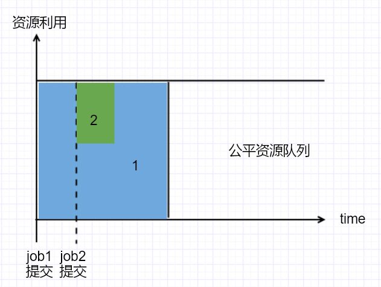
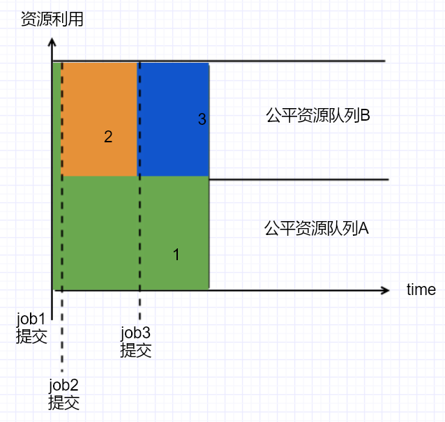

[toc]

# [hadoop-2.9.2] Fair Scheduler
摘抄自：`https://cloud.tencent.com/developer/article/1426492`

## 1. Fair Scheduler 原理

Fair Scheduler会在所有运行的作业之间动态地平衡资源，第一个（大）作业启动时，它是唯一运行的作业，因而可以获得集群中的全部资源，当第二个（小）作业启动时，它可以分配到集群的一半资源，这样每个作业都能公平共享资源。



第二个作业不会马上获得需要的资源，因为它必须等待第一个作业使用的容器释放资源。当小作业结束且不再申请资源后，大作业将再次使用全部的集群资源，最终，集群可以保持较高的资源利用率，又能保证小作业可以及时完成。

以上是在单个队列中使用Fair Scheduler的资源分配方式，下图则说明了Fair Scheduler在多个队列之间是如何调度的。



两个用户A和B，分别拥有自己的队列，A启动一个作业，在B没有需求的时候A会分配到全部可用的资源，当A的作业仍在运行时B启动一个作业，一段时间后，每个作业都会拥有集群的一半资源，这时如果B启动第二个作业且其他作业扔在运行，那么B的第二个作业将和B的第一个作业共享资源，因此B的两个作业分别占集群的1/4资源，而A仍然占集群的一半资源，最终资源在用户之间实现了公平共享。

## 2. Fair Scheduler 高级工作机制

### (1) 抢占(preemption)

在一个繁忙的集群中，当提交一个job到一个空队列中，job不会立即启动，而是需要等待已经运行的job释放资源，为了使job从提交到执行所需的时间可预测，Fair Scheduler支持抢占(preemption)功能。

所谓抢占，就是允许调度器终止那些占用资源超过了其公平共享份额的Container，例如，有两个队列，每个队列的公平份额是50%的资源，单个队列中的全部job也是公平使用队列中的资源，两个job应该各自拥有50%的队列中的资源，3个job应该各自拥有33%的队列资源...资源分配以Container为单位，如果某个Container占用太多资源(超过它的公平份额)，那么抢占机制就会终止这个Container，该Container释放的资源分配给那些拥有资源数量小于公平份额的队列。**抢占机制会降低整个集群的效率，因为被终止的Container需要重新执行**。

抢占机制有4个相关的超时时间配置：`minSharePreemptionTimeout`、`fairSharePreemptionTimeout`、`defaultMinSharePreemptionTimeout`和`defaultFairSharePreemptionTimeout`

`minSharePreemptionTimeout`：如果队列在这个配置指定的时间内（单位s）还未获得最小的共享资源（可以通过`minResources`参数为队列配置最小的共享资源），调度器就会抢占其他Container的资源。

`defaultMinSharePreemptionTimeout`：与`minSharePreemptionTimeout`的作用一样，只不过`minSharePreemptionTimeout`作用与单个队列，`defaultMinSharePreemptionTimeout`是一个全局配置，作用于全部队列。

`fairSharePreemptionTimeout`：如果队列在该配置指定的时间内（单位s）内获得的资源还小于其公平份额的一半（通过配置`fairSharePreemptionThreshold`设置，默认为0.5，另外`defaultFairSharePreemptionThreshold`与`fairSharePreemptionThreshold`作用相同，但它是一个全局的配置，作用与全部队列），那么调度器会抢占其他Container的资源。

`defaultFairSharePreemptionTimeout`：与`fairSharePreemptionTimeout`的作用一样，`fairSharePreemptionTimeout`作用与单个队列，而`defaultFairSharePreemptionTimeout`作用于全部的队列。

### (2) 延迟调度(delay scheduling)

所有的YARN调度器都试图以本地请求为重。在一个繁忙的集群中，如果一个应用程序请求在某个节点上执行task（因为数据就在该节点上），此时极有可能该节点的资源是不够的，显然此时应该放宽数据本地化需求，在同一机架的其他节点启动Container。

但是并不是发现请求的节点繁忙后就立即去请求其他节点，而是需要等待一段时间（不超过几秒），如果可以在这个时间内等到请求节点释放资源，那么在请求节点上启动Container是性能最佳的。

Yarn认为花费一些等待时间（不超过几秒）去满足数据本地化是可以接受的，这个特性被称为延迟调度。

NodeManager 与 ResourceManager周期性（默认1s）地发送心跳请求，心跳信息中携带了正运行的容器、可用的资源等信息，于是对于一个准备申请资源的应用程序来说，每次心跳就是一个调度机会。

当开启延迟调度后，调度器不会简单的处理资源请求，假如已经接收了一个请求，但是此时无法为其满足数据本地化的需求，那么调度器将放弃此次调度机会，而是为当前已经接收的请求等待一段时间，这段时间过后，如果无法满足数据本地化需求，那么就放宽限制，将Container启动在其他节点。

`yarn.scheduler.fair.locality.threshold.node`参数决定延迟时间，可以配置为正整数，例如5，这代表着错过5次调度机会后，如果还无法为当前请求满足数据本地化的需求，那么就在同机架的其他节点上启动Container。可以配置为[0, 1]之间的浮点数，例如0.5，这意味着需要错过集群中节点数量的一半次调度机会后，才将当前请求的Container启动在同机架的其他节点上。这个配置默认值为-1.0，代表同机架内不开启延迟调度。

`yarn.scheduler.fair.locality.threshold.rack`参数决定延迟时间，可以配置为正整数，例如5，这代表着错过5次调度机会后，如果还无法为当前请求在同机架的节点上开启Container（整个机架可能都是繁忙的），那么就在跨机架的其他节点上启动Container。可以配置为[0, 1]之间的浮点数，例如0.5，这意味着需要错过集群中节点数量的一半次调度机会后，如果无法在同机架的节点上开启Container，才将当前请求的Container启动在跨机架的其他节点上。这个配置默认值为-1.0，代表不开启跨机架不启动延迟调度。

## 3. 配置

Fair Scheduler 的配置涉及到两个文件，一个是`yarn-site.xml`，一个是自定以的xml文件，该xml文件的名称可以配置（默认为fair-scheduler.xml），yarn会每10s重新加载一次该配置文件，所以在yarn运行期间修改该文件也会起作用。

### (1) 开启方法

在`yarn-site.xml`中配置：

```xml
<property>
  <name>yarn.resourcemanager.scheduler.class</name>
  <value>org.apache.hadoop.yarn.server.resourcemanager.scheduler.fair.FairScheduler</value>
</property>
```

### (2) yarn-site.xml

`yarn.scheduler.fair.allocation.file`

* Description：定义外部配置文件的名称，该配置文件必须为xml格式的文件，放置在$HADOOP_HOME/etc/hadoop目录下    
* Default：fair-scheduler.xml

`yarn.scheduler.fair.user-as-default-queue`

* Description：是否使用用户名作为队列名，默认情况下，所有的job共享一个叫做default的队列，如果这个配置设置为fals或着不配置这个配置项，将使用默认的default队列，如果在指定的外部配置文件中配置了队列相关的信息，这个配置将会被忽略。    
* Default：true

`yarn.scheduler.fair.preemption`

* Description：是否开启抢占机制，详见本文”抢占“一节    
* Default：true

`yarn.scheduler.fair.preemption.cluster-utilization-threshold`

* Description：开启抢占机制后，集群资源的最大使用率，使用率 = 已经使用的资源 / 集群可用的全部资源    
* Default：0.8f

`yarn.scheduler.fair.sizebasedweight`

* Description：是否根据应用程序的权重来分配资源，而不是为每个应用程序平均分配资源，应用程序的权重= (ln1 + $应用程序请求的内存(字节数)) / ln2 ≈ (0 + 申请内存) / 0.7 ≈ 申请内存 * 1.4    
* Default：false

`yarn.scheduler.fair.assignmultiple`

* Description：是否允许单次心跳分配多个Container    
* Default：false

`yarn.scheduler.fair.dynamic.max.assign`

* Description：此配置生效前提，yarn.scheduler.fair.assignmultiple=true，是否动态地决定在一次心跳中可以分配的资源量，如果开启，在一次心跳中，每个节点可以分配的资源为该节点可用资源的一半    
* Default：true

`yarn.scheduler.fair.max.assign`

* Description：此配置生效前提，yarn.scheduler.fair.assignmultiple=true并且yarn.scheduler.fair.dynamic.max.assign=false，此配置设置一次心跳中最多可以分配的资源量。    
* Default：-1（无限制）

`yarn.scheduler.fair.locality.threshold.node`

见本文”延迟调度“的详细解释

`yarn.scheduler.fair.locality.threshold.rack`

见本文”延迟调度“的详细解释

`yarn.scheduler.fair.allow-undeclared-pools`

* Description：是否允许在提交程序的时候创建队列，如果设置为true，当应用程序指定了一个不存在队列时，会自动创建该队列，或者当yarn.scheduler.fair.user-as-default-queue=true时，如果与用户名相同的队列不存在，也会自动创建。如果设置为false，当应用程序需要提交到不存在的队列中时，统一提交到default队列中。如果在外部配置文件中设置了应用程序提交的队列的规则，那么这个配置就会被忽略。    
* Default：true

`yarn.scheduler.fair.update-interval-ms`

* Description：重新计算公平配额，计算资源需求和检查是否需要抢占的时间间隔。    
* Default：500ms

### (3) fair-scheduler.xml

```xml
<?xml version="1.0"?>
<!-- allocations标签是根标签 -->
<allocations>

    <!-- 以下3项见本文”抢占“一节的详细解释 -->
    <defaultFairSharePreemptionTimeout>10</defaultFairSharePreemptionTimeout>
    <defaultMinSharePreemptionTimeout>10</defaultMinSharePreemptionTimeout>
    <defaultFairSharePreemptionThreshold>0.5</defaultFairSharePreemptionThreshold>
    
    <!-- 每个队列最多运行的app数 -->
    <queueMaxAppsDefault>20</queueMaxAppsDefault>
    <!-- 每个队列最多使用的资源： (X mb, Y vcores) or (X% memory, Y% cpu) -->
    <queueMaxResourcesDefault>X mb, Y vcores</queueMaxResourcesDefault>
    <!-- 每个队列的ApplicationMaster可以使用的最大资源，1.0代表可以使用集群所有资源，-1.0代表不做检查，默认0.5 -->
    <queueMaxAMShareDefault>0.5</queueMaxAMShareDefault>
    <!-- 每个队列的调度策略，默认为fair，可选：fifo，drf -->
    <!-- drf的资源维度包括内存和core，而其他的只能计算内存 -->
    <defaultQueueSchedulingPolicy>fair</defaultQueueSchedulingPolicy>
    
    <!-- 全局配置：所有user最多可以同时运行的app数 -->
    <userMaxAppsDefault>5</userMaxAppsDefault>
    
    <!-- queue标签用于定义队列、配置队列属性 -->
    <queue name="q1">
        <minResources>10000 mb,0vcores</minResources><!-- 队列最小可用资源 -->
        <maxResources>90000 mb,0vcores</maxResources><!-- 队列最大可用资源 -->
        <maxRunningApps>50</maxRunningApps><!-- 队列最多运行app数 -->
        <maxAMShare>0.1</maxAMShare><!-- 队列AM使用资源最大占比 -->
        <weight>2.0</weight><!-- 队列权重, 假设另一个队列权重为3.0，那么q1分配到40%的资源是公平的 -->
        <schedulingPolicy>fair</schedulingPolicy><!-- 队列调度策略:fifo/fair/drf -->
        <maxChildResources>10000 mb,0vcores</maxChildResources><!-- 子队列最多可以使用的资源 -->
        <!-- 定义了1个子队列 -->
        <queue name="q1_1">
            <minResources>5000 mb,0vcores</minResources>
        </queue>
    </queue>
    
    <queue name="q2">
        <aclSubmitApps>u2,g2</aclSubmitApps><!-- 用户u2和组g2下的所有用户提交任务到这个队列 -->
        <aclAdministerApps>u1,g1</aclAdministerApps><!-- 用户u1和组g1下的所有用户可以管理这个队列 -->
        <!-- 以下3项见本文”抢占“一节的详细解释 -->
        <minSharePreemptionTimeout></minSharePreemptionTimeout>
        <fairSharePreemptionTimeout></fairSharePreemptionTimeout>
        <fairSharePreemptionThreshold></fairSharePreemptionThreshold>
        <allowPreemptionFrom>true</allowPreemptionFrom><!-- 是否允许其他队列抢占此队列中的资源 -->
    </queue>
    
    <!--设置app提交到队列中的规则 -->
    <queuePlacementPolicy>
        <!-- 如果提交命令时指定了队列，那么提交到指定队列中 -->
        <rule name="specified" />
        <!-- 提交到与用户名相同的队列中，队列不存在就创建 -->
        <rule name="user" create="true"/>
        <!-- 提交到与primaryGroup名相同的队列中 -->
        <rule name="primaryGroup" create="false"/>
        <!-- 提交到固定的队列q1中，不存在则提交到default队列中 -->
        <rule name="default" queue="q1"/>
    </queuePlacementPolicy>
    
    <!-- user标签为指定的用户做特别的配置 -->
    <user name="u1">
        <!-- u1用户最多可以同时运行的App数量 -->
        <maxRunningApps>30</maxRunningApps>
    </user>
  
</allocations>
```


