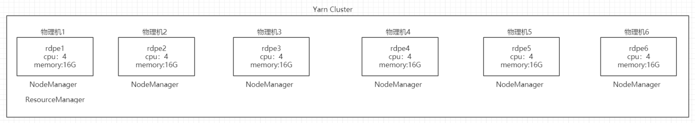
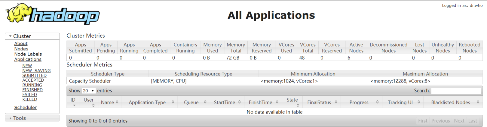
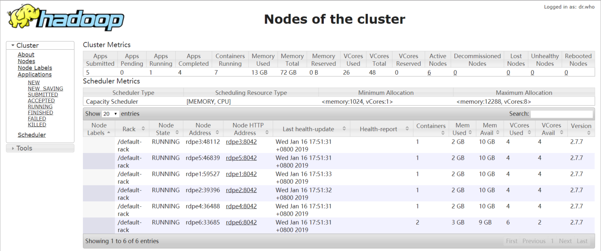
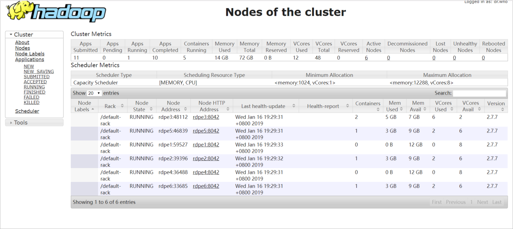

[toc]

# Spark on Yarn资源配置
摘抄自：`https://cloud.tencent.com/developer/article/1426273`

工作期间，我提交spark任务到yarn上，发现指定的资源（使用内存大小。使用core的个数）总是与yarn的UI页面显示的资源使用量不一致，写本文说明一下这个问题，以及介绍一下spark on yarn的资源配置。

以下是我的yarn集群各节点的物理资源：



总共6个节点，每个节点的物理内存为16G、物理core个数为4个，考虑到要给其他应用或者系统进程预留一些资源，所以我设置yarn集群的每个节点使用12GB物理内存和8个虚拟核。

这里有虚拟核的概念，我个人的理解是，yarn集群默认可以使用集群中的全部物理核，每个节点有4个物理核，而我配置每个NodeManager节点可以使用8个虚拟核，这就说明在我的集群上，一个物理核=两个虚拟核，而假如我设置一个节点可以使用12个虚拟核，则在我的集群中，一个物理核=三个虚拟核。

配置如下：

capacity-scheduler.xml

```xml
<property>
    <name>yarn.scheduler.capacity.resource-calculator</name>
    <value>org.apache.hadoop.yarn.util.resource.DominantResourceCalculator</value>
    <description>DefaultResourceCalculator只能计算内存相关的信息，DominantResourceCalculator可以统计core和内存的信息</description>
</property>
```

yarn-site.xml

```xml
<property>
    <name>yarn.nodemanager.resource.memory-mb</name>
    <value>12288</value>
    <description>每个NodeManager可以使用的物理内存为12G</description>
</property>

<property>
    <name>yarn.nodemanager.resource.cpu-vcores</name>
    <value>8</value>
    <description>每个NodeManager可以使用的虚拟CPU为8</description>
</property>
```

以上配置生效后，yarn集群可用的内存为12GB * 6 = 72GB，可用虚拟core个数为 8 * 6 = 48，重启yarn集群查看资源：



这里与我的预期一致。

下面配置一些Container相关的资源：

yarn-site.xml

```xml
<property>
    <name>yarn.scheduler.minimum-allocation-mb</name>
    <value>1024</value>
    <description>每个Container最少可以都要分配1G内存</description>
</property>

<property>
    <name>yarn.scheduler.maximum-allocation-mb</name>
    <value>12288</value>
    <description>每个Container最多可以使用12G内存，这意味着如果某个Container启动后占用了12G即NodeManager可以使用的全部内存后，在该NodeManager上将无法再启动任何一个Container</description>
</property>

<property>
    <name>yarn.scheduler.minimum-allocation-vcores</name>
    <value>1</value>
    <description>每个Container最少可以使用1个虚拟CPU</description>
</property>

<property>
    <name>yarn.scheduler.maximum-allocation-vcores</name>
    <value>8</value>
    <description>每个Container最多可以使用8个虚拟CPU</description>
</property>

<property>
    <name>yarn.scheduler.increment-allocation-mb</name>
    <value>1024</value>
    <description>内存规整化单位，意味着分配给某个Container的内存一定是1024即1G的倍数，例如某个Container实际需要1.5G内存，那么就给它2G</description>
</property>

<property>
    <name>yarn.nodemanager.vmem-pmem-ratio</name>
    <value>2.1</value>
    <description>NodeManager每使用1单位的物理内存，就会使用2.1倍的虚拟内存，例如NodeManager使用了1G物理内存，那么表现为虚拟内存是2.1G，当分配的虚拟内存大于的物理内存的2.1倍后，抛出异常</description>
</property>
```

配置好yarn的基本资源使用信息后，我尝试提交了一个spark任务：

```xml
$SPARK_HOME/bin/spark-submit \
--class com.bonc.rdpe.spark.test.yarn.WordCount \
--master yarn \
--deploy-mode client \
--conf spark.yarn.am.memory=512m \ # ApplicationMaster可以使用的内存
--conf spark.yarn.am.cores=2 \ # ApplicationMaster可以使用的虚拟CPU
--conf spark.executor.memory=1g \ # 每个executor可以使用的内存
--conf spark.executor.cores=4 \ # 每个executor可以使用的虚拟CPU
--conf spark.executor.instances=6 \ # 启动Executor的个数
./spark-test-1.0.jar
```

任务运行后yarn UI显示：



可以看到：

* 总共启动了7个Container，其中1个Container用于启动ApplicationMaster，其他6个Container用于启动Executor    
* 一共使用了26个vcore，因为我们指定ApplicationMaster使用2个vocre，启动了6个Executor，每个使用4个vcore，所以总共使用的vcore数是：2 + 6 * 4 = 26    
* 一共使用了13G内存，其中ApplicationMaster使用了1G，6个Executor使用了6 * 2G = 12G

分析一下为什么实际分配的内存会比申请的要多：

* ApplicationMaster申请512M内存，分配的时候除了这512M内存，还会多余分配堆外内存用于额外开销，分配的堆外内存的量为 max(${spark.yarn.am.memory} * 0.1, 384) = max(51.2M, 384M) = 384M，于是应该分配给ApplicationMaster 512(程序申请) + 384(系统分配的堆外内存) = 896M内存，
 而实际分配的内存量还要在此基础上做规整，yarn-site.xml中的这个配置 yarn.scheduler.increment-allocation-mb=1024(默认)，这个值的意思是：实际分配的内存应该是这个值的整数倍，于是896M又被提升为1024M，即1G，因此，实际给ApplicationMaster分配了1G内存    
* 对于Executor而言，它申请1G内存，多余分配的用于额外开销的堆外内存为 max(${spark.executor.memory} * 0.1, 384) = (102.4M, 384M) = 384M
 于是应该分配 1024 + 384 = 1408M,规整为1024的整数倍后，就成了2G

当然你可以自己配置ApplicationMaster和Executor使用的堆外内存量，当用户自定义后，就不会再用以上的公式去计算堆外内存的大小。

接下说一下spark on yarn怎么配置资源。

(1) 配置ApplicationMaster使用的堆外内存

* Client模式：spark.yarn.am.memoryOverhead    
* Cluster模式：spark.driver.memoryOverhead

(2) 配置Executor使用的堆外内存
 Client和Cluster模式用同一个参数：spark.executor.memoryOverhead

(3)  设置 ApplicationMaster 使用的内存

* Client：spark.yarn.am.memory    
* Cluster：spark.driver.memory 或者 --driver-memory

(4) 设置 ApplicationMaster 使用的vcore

* Client：spark.yarn.am.cores    
* Cluster：spark.driver.cores 或者 --driver-cores

(5) 设置 Executor使用的内存（Client和Cluster通用）：
 spark.executor.memory或者--executor-memory

(6) 设置 Executor使用的vcore（Client和Cluster通用）：
 spark.executor.cores或者--executor-cores

(7) 设置启动 Executor的个数（Client和Cluster通用）：
 spark.executor.instances或者--num-executors

有了以上的内容的铺垫，我们可以改变提交命令的参数，并自行计算实际分配的资源，然后启动程序做验证。

测试：

```sh
$SPARK_HOME/bin/spark-submit \
--class com.bonc.rdpe.spark.test.yarn.WordCount \
--master yarn \
--deploy-mode cluster \
--driver-memory 1g \
--driver-cores 4 \
--executor-memory 2g \
--executor-cores 2 \
--num-executors 4 \
--conf spark.driver.memoryOverhead=1g \
--conf spark.executor.memoryOverhead=1g \
./spark-test-1.0.jar
```

预测资源使用情况：

可以预测：

* 启动5个Container，一个用于启动 ApplicationMaster，其他4个用于启动 Executor    
* ApplicationMaster使用vcore：4    
* ApplicationMaster使用内存1g+1g，不需要规整，总共2g    
* 每个Executor使用vcore：2    
* 每个Executor使用内存2g + 1g，不需要规整，总共3g    
* 实际配置资源量：vcore：4 + 4 * 2 = 12，内存：2g + 4 * 3g = 14g



和预计资源使用情况一致！


