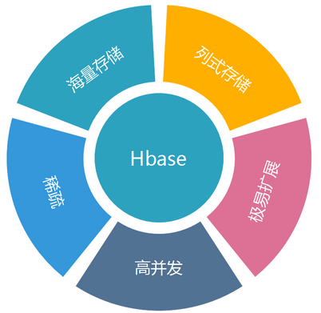
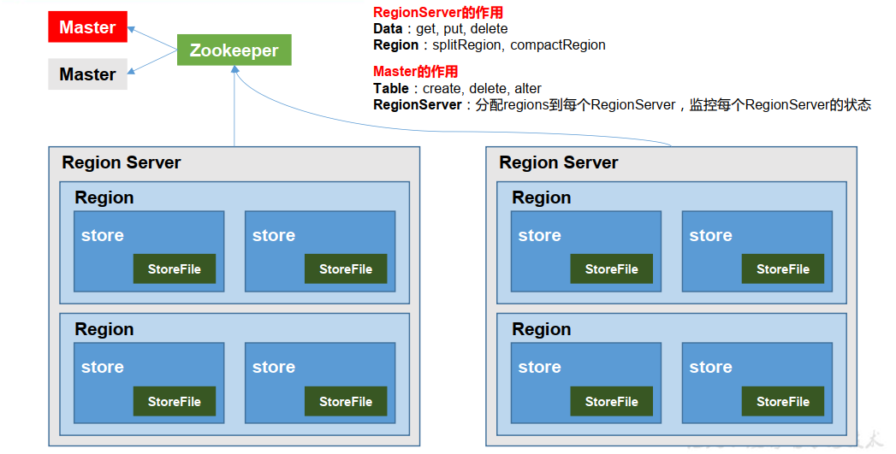
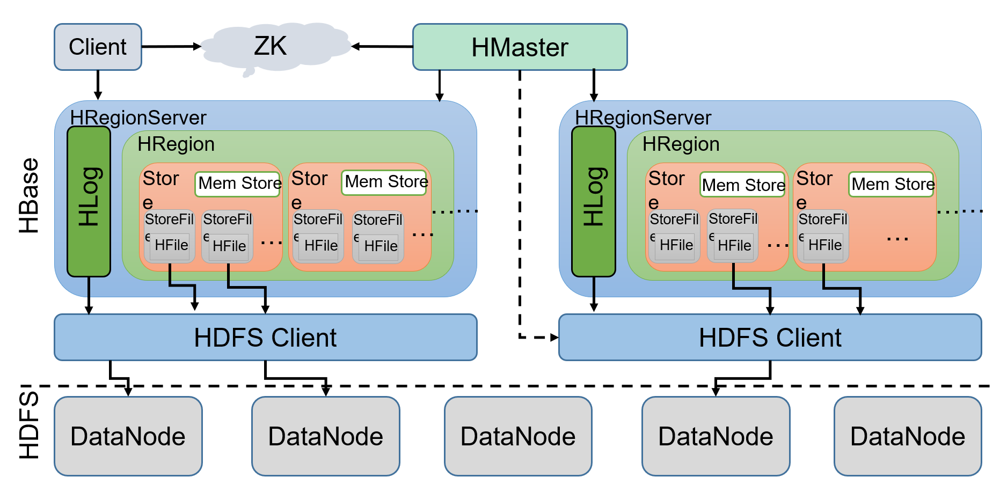

# HBase基础介绍

## 什么HBase
**HBase 是一种分布式、可扩展、面向列、支持海量数据存储的 NoSQL 数据库。**

HBase 是 Google Bigtable 的开源（源码使用 Java 编写）版本。是 Apache Hadoop 的数据库，是建 立在 HDFS 之上，被设计用来提供高可靠性、高性能、列存储、可伸缩、多版本的 NoSQL 的分布式数据存储系统，实现对大型数据的实时、随机的读写访问。

* HBase 依赖于 HDFS 做底层的数据存储，BigTable 依赖 Google GFS 做数据存储    
* HBase 依赖于 MapReduce 做数据计算，BigTable 依赖 Google MapReduce 做数据计算    
* HBase 依赖于 ZooKeeper 做服务协调，BigTable 依赖 Google Chubby 做服务协调

NoSQL = NO SQL

NoSQL = Not Only SQL：会有一些把 NoSQL 数据的原生查询语句封装成 SQL，比如 HBase 就有 Phoenix 工具

关系型数据库 和 非关系型数据库的典型代表：

* NoSQL：hbase, redis, mongodb    
* RDBMS：mysql,oracle,sql server,db2

## HBase 这个 NoSQL 数据库的要点
* ① 它介于 NoSQL 和 RDBMS 之间，仅能通过主键(rowkey)和主键的 range 来检索数据    
* ② HBase 查询数据功能很简单，不支持 join 等复杂操作(可通过 hive 支持来实现多表 join 等复杂操作)。    
* ③ 不支持复杂的事务，只支持行级事务    
* ④ HBase 中支持的数据类型：byte[]（底层所有数据的存储都是字节数组）    
* ⑤ 主要用来存储结构化和半结构化的松散数据。

## HBase 中的表特点
1、大：一个表可以有上十亿行，上百万列

2、面向列：面向列(族)的存储和权限控制，列(簇)独立检索。

3、稀疏：对于为空(null)的列，并不占用存储空间，因此，表可以设计的非常稀疏。

4、无模式：每行都有一个可排序的主键和任意多的列，列可以根据需要动态的增加，同一 张表中不同的行可以有截然不同的列

## HBase特点
**1）海量存储**

Hbase适合存储PB级别的海量数据，在PB级别的数据以及采用廉价PC存储的情况下，能在几十到百毫秒内返回数据。这与Hbase的极易扩展性息息相关。正式因为Hbase良好的扩展性，才为海量数据的存储提供了便利。

**2）列式存储**

**这里的列式存储其实说的是列族存储**，Hbase是根据列族来存储数据的。列族下面可以有非常多的列，列族在创建表的时候就必须指定。

**3）极易扩展**

Hbase的扩展性主要体现在两个方面，一个是基于上层处理能力（RegionServer）的扩展，一个是基于存储的扩展（HDFS）。
通过横向添加RegionSever的机器，进行水平扩展，提升Hbase上层的处理能力，提升Hbsae服务更多Region的能力。
备注：RegionServer的作用是管理region、承接业务的访问，这个后面会详细的介绍通过横向添加Datanode的机器，进行存储层扩容，提升Hbase的数据存储能力和提升后端存储的读写能力。

**4）高并发**

由于目前大部分使用Hbase的架构，都是采用的廉价PC，因此单个IO的延迟其实并不小，一般在几十到上百ms之间。这里说的高并发，主要是在并发的情况下，Hbase的单个IO延迟下降并不多。能获得高并发、低延迟的服务。

**5）稀疏**

稀疏主要是针对Hbase列的灵活性，在列族中，你可以指定任意多的列，**在列数据为空的情况下，是不会占用存储空间的**。

##  HBase表结构逻辑视图
初次接触HBase，可能看到以下描述会懵：“基于列存储”，“稀疏MAP”，“RowKey”,“ColumnFamily”。

其实没那么高深，我们需要分两步来理解HBase, 就能够理解为什么HBase能够“快速地”“分布式地”处理“大量数据”了。

　　1.内存结构

　　2.文件存储结构

### 名词概念
加入我们有如下一张表

### Rowkey的概念
Rowkey的概念和mysql中的主键是完全一样的，Hbase使用Rowkey来唯一的区分某一行的数据。

由于Hbase只支持3中查询方式：

* 1、基于Rowkey的单行查询    
* 2、基于Rowkey的范围扫描    
* 3、全表扫描

因此，Rowkey对Hbase的性能影响非常大，Rowkey的设计就显得尤为的重要。设计的时候要兼顾基于Rowkey的单行查询也要键入Rowkey的范围扫描。具体Rowkey要如何设计后续会整理相关的文章做进一步的描述。这里大家只要有一个概念就是Rowkey的设计极为重要。

rowkey 行键可以是任意字符串(最大长度是 64KB，实际应用中长度一般为 10-100bytes)，最好是 16。在 HBase 内部，rowkey 保存为字节数组。HBase 会对表中的数据按照 rowkey 排序 (字典顺序)

### Column的概念
列，可理解成MySQL列。

### ColumnFamily的概念
列族, HBase引入的概念。

Hbase通过列族划分数据的存储，列族下面可以包含任意多的列，实现灵活的数据存取。就像是家族的概念，我们知道一个家族是由于很多个的家庭组成的。列族也类似，列族是由一个一个的列组成（任意多）。

Hbase表的创建的时候就必须指定列族。就像关系型数据库创建的时候必须指定具体的列是一样的。

Hbase的列族不是越多越好，官方推荐的是列族最好小于或者等于3。我们使用的场景一般是1个列族。

### TimeStamp的概念
TimeStamp对Hbase来说至关重要，因为它是实现Hbase多版本的关键，删除和修改也依赖于TimeStamp。在Hbase中使用不同的timestame来标识相同rowkey行对应的不通版本的数据。

HBase 中通过 rowkey 和 columns 确定的为一个存储单元称为 cell。每个 cell 都保存着同一份 数据的多个版本。版本通过时间戳来索引。时间戳的类型是 64 位整型。时间戳可以由 hbase(在数据写入时自动)赋值，此时时间戳是精确到毫秒的当前系统时间。时间戳也可以由 客户显式赋值。如果应用程序要避免数据版本冲突，就必须自己生成具有唯一性的时间戳。 每个 cell 中，不同版本的数据按照时间倒序排序，即最新的数据排在最前面。

为了避免数据存在过多版本造成的的管理 (包括存贮和索引)负担，hbase 提供了两种数据版 本回收方式：
　　
* 保存数据的最后 n 个版本    
* 保存最近一段时间内的版本（设置数据的生命周期 TTL）。

用户可以针对每个列簇进行设置。

### 单元格（Cell）
由{rowkey, column Family： column Qualifier, time Stamp} 唯一确定的单元。 Cell 中的数据是没有类型的，全部是字节码形式存贮。

## HBase 数据模型
逻辑上， HBase 的数据模型同关系型数据库很类似，数据存储在一张表中，有行有列。但从 HBase 的底层物理存储结构（K-V） 来看， HBase 更像是一个 multi-dimensional map。

### HBase 逻辑结构

### HBase 物理存储结构

### 数据模型
#### 1） Name Space
命名空间，类似于关系型数据库的 DatabBase 概念，每个命名空间下有多个表。 HBase 有两个自带的命名空间，分别是 **hbase** 和 **default**， **hbase 中存放的是 HBase 内置的表**，default 表是用户默认使用的命名空间。

#### 2） Region
类似于关系型数据库的表概念。不同的是， HBase 定义表时**只需要声明列族即可，不需要声明具体的列**。这意味着， 往 HBase 写入数据时，字段可以**动态、 按需**指定。因此，和关系型数据库相比， HBase 能够轻松应对字段变更的场景。

#### Row
HBase 表中的每行数据都由一个 **RowKey** 和多个 **Column**（列）组成，**数据是按照 RowKey的字典顺序存储的**，并且查询数据时只能根据 RowKey 进行检索，所以 RowKey 的设计十分重要。

#### 4） Column
HBase 中的每个列都由 **Column Family(列族)**和 **Column Qualifier（列限定符）** 进行限定，例如 info： name， info： age。建表时，只需指明列族，而列限定符无需预先定义。

#### 5） Time Stamp
用于标识数据的不同版本（version）， 每条数据写入时， 如果不指定时间戳， 系统会自动为其加上该字段，其值为写入 HBase 的时间。

#### 6） Cell
由{rowkey, column Family： column Qualifier, time Stamp} 唯一确定的单元。 cell 中的数据是没有类型的，全部是字节码形式存贮。

## HBase架构
### HBase 基本架构（不完整版）

**架构组件**：

**1） Region Server**

Region Server 为 Region 的管理者， 其实现类为 HRegionServer，主要作用如下:

* 对于数据的操作： get, put, delete；    
* 对于 Region 的操作： splitRegion、 compactRegion。

**2） Master**

Master 是所有 Region Server 的管理者，其实现类为 HMaster，主要作用如下：

* 对于表的操作： create, delete, alter    
* 对于 RegionServer的操作：分配 regions到每个RegionServer，监控每个 RegionServer的状态，负载均衡和故障转移。

**3） Zookeeper**

HBase 通过 Zookeeper 来做 Master 的高可用、 RegionServer 的监控、元数据的入口以及集群配置的维护等工作。

**4） HDFS**

HDFS 为 HBase 提供最终的底层数据存储服务，同时为 HBase 提供高可用的支持。

### HBase架构

从图中可以看出Hbase是由Client、Zookeeper、Master、HRegionServer、HDFS等几个组件组成，下面来介绍一下几个组件的相关功能：

**1）Client**

Client包含了访问Hbase的接口，另外Client还维护了对应的cache来加速Hbase的访问，比如cache的.META.元数据的信息。

**2）Zookeeper**

HBase通过Zookeeper来做master的高可用、RegionServer的监控、元数据的入口以及集群配置的维护等工作。具体工作如下：

* 通过Zoopkeeper来保证集群中只有1个master在运行，如果master异常，会通过竞争机制产生新的master提供服务    
* 通过Zoopkeeper来监控RegionServer的状态，当RegionSevrer有异常的时候，通过回调的形式通知Master RegionServer上下线的信息    
* 通过Zoopkeeper存储元数据的统一入口地址

**3）Hmaster**

master节点的主要职责如下：

* 为RegionServer分配Region    
* 维护整个集群的负载均衡    
* 维护集群的元数据信息    
* 发现失效的Region，并将失效的Region分配到正常的RegionServer上    
* 当RegionSever失效的时候，协调对应Hlog的拆分  

**4）HregionServer**

HregionServer直接对接用户的读写请求，是真正的“干活”的节点。它的功能概括如下：

* 管理master为其分配的Region    
* 处理来自客户端的读写请求    
* 负责和底层HDFS的交互，存储数据到HDFS    
* 负责Region变大以后的拆分    
* 负责Storefile的合并工作  

**5）HDFS**

HDFS为Hbase提供最终的底层数据存储服务，同时为HBase提供高可用（Hlog存储在HDFS）的支持，具体功能概括如下：

* 提供元数据和表数据的底层分布式存储服务    
* 数据多副本，保证的高可靠和高可用性  

## HBase中的角色

### HMaster
功能

* 1．监控RegionServer    
* 2．处理RegionServer故障转移    
* 3．处理元数据的变更    
* 4．处理region的分配或转移    
* 5．在空闲时间进行数据的负载均衡    
* 6．通过Zookeeper发布自己的位置给客户端

### RegionServer
功能

* 1．负责存储HBase的实际数据    
* 2．处理分配给它的Region    
* 3．刷新缓存到HDFS    
* 4．维护Hlog    
* 5．执行压缩    
* 6．负责处理Region分片 

### 其他组件

#### Hlog(WAL)
Write-Ahead logs，增删改一定被记录下来。

HBase的修改记录，当对HBase读写数据的时候，数据不是直接写进磁盘，它会在内存中保留一段时间（时间以及数据量阈值可以设定）。但把数据保存在内存中可能有更高的概率引起数据丢失，为了解决这个问题，数据会先写在一个叫做Write-Ahead logfile的文件中，然后再写入内存中。所以在系统出现故障的时候，数据可以通过这个日志文件重建。

#### Region
Hbase表的分片，HBase表会根据RowKey值被切分成不同的region存储在RegionServer中，在一个RegionServer中可以有多个不同的region。

#### Store
HFile存储在Store中，一个Store对应HBase表中的一个列族。

#### MemStore
顾名思义，就是内存存储，位于内存中，用来保存当前的数据操作，所以当数据保存在WAL中之后，RegsionServer会在内存中存储键值对。

#### HFile
这是在磁盘上保存原始数据的实际的物理文件，是实际的存储文件。StoreFile是以Hfile的形式存储在HDFS的。

无模式