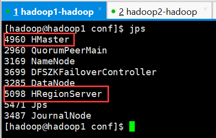
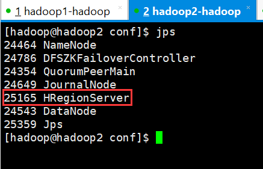
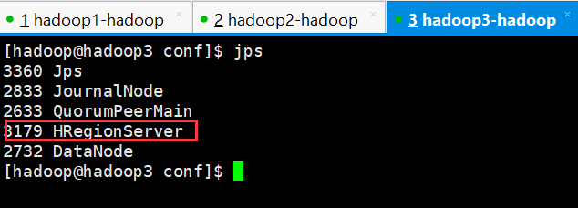

# HBase安装

##  Zookeeper正常部署
首先保证Zookeeper集群的正常部署，并启动之：
```
[atguigu@hadoop102 zookeeper-3.4.10]$ bin/zkServer.sh start
[atguigu@hadoop103 zookeeper-3.4.10]$ bin/zkServer.sh start
[atguigu@hadoop104 zookeeper-3.4.10]$ bin/zkServer.sh start
```

## Hadoop正常部署
Hadoop集群的正常部署并启动：
```
[atguigu@hadoop102 hadoop-2.7.2]$ sbin/start-dfs.sh
[atguigu@hadoop103 hadoop-2.7.2]$ sbin/start-yarn.sh
```

## HBase的解压
解压HBase到指定目录：
```
[atguigu@hadoop102 software]$ tar -zxvf hbase-1.3.1-bin.tar.gz -C /opt/module
```

## HBase的配置文件
修改HBase对应的配置文件。

1）hbase-env.sh修改内容：
```
export JAVA_HOME=/opt/module/jdk1.8.0_144
export HBASE_MANAGES_ZK=false

#JDK1.8需要注释
#export HBASE_MASTER_OPTS。。。。
#export HBASE_REGIONSERVER_OPTS。。。
```

2）hbase-site.xml修改内容：
```xml
<configuration>
	<property>     
		<name>hbase.rootdir</name>     
		<value>hdfs://hadoop102:9000/hbase</value>   
	</property>

	<property>   
		<name>hbase.cluster.distributed</name>
		<value>true</value>
	</property>

   <!-- 0.98后的新变动，之前版本没有.port,默认端口为60000 -->
	<property>
		<name>hbase.master.port</name>
		<value>16000</value>
	</property>

	<property>   
		<name>hbase.zookeeper.quorum</name>
	     <value>hadoop102:2181,hadoop103:2181,hadoop104:2181</value>
	</property>

	<property>   
		<name>hbase.zookeeper.property.dataDir</name>
	     <value>/opt/module/zookeeper-3.4.10/zkData</value>
	</property>
</configuration>
```

3）regionservers：
```
hadoop102
hadoop103
hadoop104
```

4）软连接hadoop配置文件到hbase：
```
[atguigu@hadoop102 module]$ ln -s /opt/module/hadoop-2.7.2/etc/hadoop/core-site.xml 
/opt/module/hbase/conf/core-site.xml
[atguigu@hadoop102 module]$ ln -s /opt/module/hadoop-2.7.2/etc/hadoop/hdfs-site.xml 
/opt/module/hbase/conf/hdfs-site.xml
```

## HBase远程发送到其他集群
```
[atguigu@hadoop102 module]$ xsync hbase/ 
```

## HBase服务的启动

### 启动方式1
```
[atguigu@hadoop102 hbase]$ bin/hbase-daemon.sh start master
[atguigu@hadoop102 hbase]$ bin/hbase-daemon.sh start regionserver
```

提示：如果集群之间的节点时间不同步，会导致regionserver无法启动，抛出ClockOutOfSyncException异常。

修复提示：

a、同步时间服务

b、属性：hbase.master.maxclockskew设置更大的值
```
<property>
        <name>hbase.master.maxclockskew</name>
        <value>180000</value>
        <description>Time difference of regionserver from master</description>
 </property>
```

### 启动方式2
```
[atguigu@hadoop102 hbase]$ bin/start-hbase.sh
```
对应的停止服务：
```
[atguigu@hadoop102 hbase]$ bin/stop-hbase.sh
```

## 查看HBase页面
启动成功后，可以通过“host:port”的方式来访问HBase管理页面，例如：
http://hadoop102:16010 

## 检查各进程是否启动正常
主节点和备用节点都启动 hmaster 进程

各从节点都启动 hregionserver 进程








## 如果有节点相应的进程没有启动，那么可以手动启动
启动HMaster进程
```
[hadoop@hadoop3 conf]$ jps
Jps
JournalNode
QuorumPeerMain
HRegionServer
DataNode
[hadoop@hadoop3 conf]$ hbase-daemon.sh start master
starting master, logging to /home/hadoop/apps/hbase-1.2.6/logs/hbase-hadoop-master-hadoop3.out
Java HotSpot(TM) 64-Bit Server VM warning: ignoring option PermSize=128m; support was removed in 8.0
Java HotSpot(TM) 64-Bit Server VM warning: ignoring option MaxPermSize=128m; support was removed in 8.0
[hadoop@hadoop3 conf]$ jps
JournalNode
Jps
HMaster
QuorumPeerMain
HRegionServer
DataNode
[hadoop@hadoop3 conf]$
```

启动HRegionServer进程
```
[hadoop@hadoop3 conf]$ hbase-daemon.sh start regionserver 
```


```

```