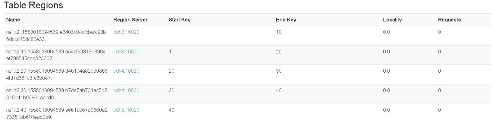

# HBase Shell操作
HBase Shell操作比较不易用，实际中用的也少，主要用java api操作。

HBase Shell的backspace键是向右删除的，可以使用ctrl + backspace 实现向左删除。

HBase Shell命令中一行为一条命令回车就执行，不要加`;`。

HBase Shell命令中的ns名、table名都是需要加引号的。如
```
help 'create_namespace'
help 'list_namespace'
```

## 进入hbase shell客户端
bin/hbase shell
```
[hadoop@hadoop01 hbase-1.3.1]$ bin/hbase shell
HBase Shell; enter 'help<RETURN>' for list of supported commands.
Type "exit<RETURN>" to leave the HBase Shell
Version 1.3.1, r930b9a55528fe45d8edce7af42fef2d35e77677a, Thu Apr  6 19:36:54 PDT 2017

hbase(main):001:0> 
```

## help命令
1. help : 查看所有的hbase的shell命令
2. help 'cmd' : 寻求指定命令的使用方法

e.g：help 'create_namespace'

```
hbase(main):007:0> help
HBase Shell, version 1.3.1, r930b9a55528fe45d8edce7af42fef2d35e77677a, Thu Apr  6 19:36:54 PDT 2017
Type 'help "COMMAND"', (e.g. 'help "get"' -- the quotes are necessary) for help on a specific command.
Commands are grouped. Type 'help "COMMAND_GROUP"', (e.g. 'help "general"') for help on a command group.

COMMAND GROUPS:
  Group name: general
  Commands: status, table_help, version, whoami

  Group name: ddl
  Commands: alter, alter_async, alter_status, create, describe, disable, disable_all, drop, drop_all, enable, enable_all, exists, get_table, is_disabled, is_enabled, list, locate_region, show_filters

  Group name: namespace
  Commands: alter_namespace, create_namespace, describe_namespace, drop_namespace, list_namespace, list_namespace_tables

  Group name: dml
  Commands: append, count, delete, deleteall, get, get_counter, get_splits, incr, put, scan, truncate, truncate_preserve

  Group name: tools
  Commands: assign, balance_switch, balancer, balancer_enabled, catalogjanitor_enabled, catalogjanitor_run, catalogjanitor_switch, close_region, compact, compact_rs, flush, major_compact, merge_region, move, normalize, normalizer_enabled, normalizer_switch, split, splitormerge_enabled, splitormerge_switch, trace, unassign, wal_roll, zk_dump

  Group name: replication
  Commands: add_peer, append_peer_tableCFs, disable_peer, disable_table_replication, enable_peer, enable_table_replication, get_peer_config, list_peer_configs, list_peers, list_replicated_tables, remove_peer, remove_peer_tableCFs, set_peer_tableCFs, show_peer_tableCFs

  Group name: snapshots
  Commands: clone_snapshot, delete_all_snapshot, delete_snapshot, delete_table_snapshots, list_snapshots, list_table_snapshots, restore_snapshot, snapshot

  Group name: configuration
  Commands: update_all_config, update_config

  Group name: quotas
  Commands: list_quotas, set_quota

  Group name: security
  Commands: grant, list_security_capabilities, revoke, user_permission

  Group name: procedures
  Commands: abort_procedure, list_procedures

  Group name: visibility labels
  Commands: add_labels, clear_auths, get_auths, list_labels, set_auths, set_visibility

SHELL USAGE:
Quote all names in HBase Shell such as table and column names.  Commas delimit
command parameters.  Type <RETURN> after entering a command to run it.
Dictionaries of configuration used in the creation and alteration of tables are
Ruby Hashes. They look like this:

  {'key1' => 'value1', 'key2' => 'value2', ...}

and are opened and closed with curley-braces.  Key/values are delimited by the
'=>' character combination.  Usually keys are predefined constants such as
NAME, VERSIONS, COMPRESSION, etc.  Constants do not need to be quoted.  Type
'Object.constants' to see a (messy) list of all constants in the environment.

If you are using binary keys or values and need to enter them in the shell, use
double-quote'd hexadecimal representation. For example:

  hbase> get 't1', "key\x03\x3f\xcd"
  hbase> get 't1', "key\003\023\011"
  hbase> put 't1', "test\xef\xff", 'f1:', "\x01\x33\x40"

The HBase shell is the (J)Ruby IRB with the above HBase-specific commands added.
For more on the HBase Shell, see http://hbase.apache.org/book.html
hbase(main):008:0> help 'list_namespace'
List all namespaces in hbase. Optional regular expression parameter could
be used to filter the output. Examples:

  hbase> list_namespace
  hbase> list_namespace 'abc.*'
hbase(main):009:0> 
```

## namespace

```
Group name: namespace
Commands: alter_namespace, create_namespace, describe_namespace, drop_namespace, list_namespace, list_namespace_tables
```

### namespace的常用命令

```
alter_namespace : 修改命名空间
create_namespace : 创建命名空间
describe_namespace : 查看命名空间的结构
drop_namespace  ： 删除命名空间
list_namespace ：查看HBase中所有的命名空间
list_namespace_tables ：查看指定的命名空间中的所有的表
```

### list_namespace
list_namespace的模糊查询使用的是正则的语法。

```
hbase(main):008:0> help 'list_namespace'
List all namespaces in hbase. Optional regular expression parameter could
be used to filter the output. Examples:

  hbase> list_namespace
  hbase> list_namespace 'abc.*'
hbase(main):009:0> help 'list_namespace'
List all namespaces in hbase. Optional regular expression parameter could
be used to filter the output. Examples:

  hbase> list_namespace
  hbase> list_namespace 'abc.*'
hbase(main):010:0> list_namespace
NAMESPACE                                                                                                                                      
default                                                                                                                                        
hbase                                                                                                                                          
weibo                                                                                                                                          
3 row(s) in 0.0210 seconds

hbase(main):011:0> list_namespace 'h.*'
NAMESPACE                                                                                                                                      
hbase                                                                                                                                          
1 row(s) in 0.0170 seconds

hbase(main):012:0> 
```

### list_namespace_tables
```
hbase(main):014:0> help 'list_namespace_tables'
List all tables that are members of the namespace.
Examples:

  hbase> list_namespace_tables 'ns1'
hbase(main):015:0> list_namespace_tables 'default'
TABLE                                                                                                                                          
fruit                                                                                                                                          
fruit2                                                                                                                                         
fruit_mr                                                                                                                                       
hbase_emp_table                                                                                                                                
hbase_user_hive                                                                                                                                
staff                                                                                                                                          
student                                                                                                                                        
7 row(s) in 0.0500 seconds

hbase(main):016:0> list_namespace_tables 'weibo'
TABLE                                                                                                                                          
content                                                                                                                                        
inbox                                                                                                                                          
relation                                                                                                                                       
3 row(s) in 0.0180 seconds

hbase(main):017:0> 
```

### create_namespace
可以看到tab键可以提示。
```
hbase(main):018:0> help 'create_namespace'
Create namespace; pass namespace name,
and optionally a dictionary of namespace configuration.
Examples:

  hbase> create_namespace 'ns1'
  hbase> create_namespace 'ns1', {'PROPERTY_NAME'=>'PROPERTY_VALUE'}
hbase(main):019:0> create_namespace 'test'
0 row(s) in 0.9760 seconds

hbase(main):020:0> list_namespace
list_namespace          list_namespace_tables
hbase(main):020:0> list_namespace
NAMESPACE                                                                                                                                      
default                                                                                                                                        
hbase                                                                                                                                          
test                                                                                                                                           
weibo                                                                                                                                          
4 row(s) in 0.0180 seconds

hbase(main):021:0> drop_namespace 'test'
0 row(s) in 0.8860 seconds

hbase(main):022:0> list_namespace
NAMESPACE                                                                                                                                      
default                                                                                                                                        
hbase                                                                                                                                          
weibo                                                                                                                                          
3 row(s) in 0.0150 seconds

hbase(main):023:0> 
```

## ddl
```
Group name: ddl
Commands: alter, alter_async, alter_status, create, describe, disable, disable_all, drop, drop_all, enable, enable_all, exists, get_table, is_disabled, is_enabled, list, locate_region, show_filters
```

### 表的常见命令

```
list ： 查询HBase所有的表
create : 建表
alter : 修改表
describe/desc ： 查看表结构
disable/disable_all : 令表失效，在HBase中，只有失效的表才能删除/所有表失效
enable/enable_all ： 使所有的表生效
drop/drop all ： 删除表
exists ： 判断表是否存在
is_disabled/is_enabled ： 是否失效/生效
```

### list
<div>
<div style="color: #ff0000;font-weight:600">hbase(main):027:0> help 'list'</div>
List all tables in hbase. Optional regular expression parameter could
be used to filter the output. Examples:

  hbase> list
  hbase> list 'abc.*'
  hbase> list 'ns:abc.*'
  hbase> list 'ns:.*'
<div style="color: #ff0000;font-weight:600">hbase(main):028:0> list 'f.*'</div>
TABLE                                                                                                                                          
fruit                                                                                                                                          
fruit2                                                                                                                                         
fruit_mr                                                                                                                                       
3 row(s) in 0.0100 seconds

=> ["fruit", "fruit2", "fruit_mr"]
<div style="color: #ff0000;font-weight:600">hbase(main):028:0> hbase(main):029:0> list 'weibo:.*'</div>
TABLE                                                                                                                                          
weibo:content                                                                                                                                  
weibo:inbox                                                                                                                                    
weibo:relation                                                                                                                                 
3 row(s) in 0.0070 seconds

=> ["weibo:content", "weibo:inbox", "weibo:relation"]
<div style="color: #ff0000;font-weight:600">hbase(main):028:0> hbase(main):030:0> list</div>
TABLE                                                                                                                                          
fruit                                                                                                                                          
fruit2                                                                                                                                         
fruit_mr                                                                                                                                       
hbase_emp_table                                                                                                                                
hbase_user_hive                                                                                                                                
staff                                                                                                                                          
student                                                                                                                                        
weibo:content                                                                                                                                  
weibo:inbox                                                                                                                                    
weibo:relation                                                                                                                                 
10 row(s) in 0.0080 seconds

=> ["fruit", "fruit2", "fruit_mr", "hbase_emp_table", "hbase_user_hive", "staff", "student", "weibo:content", "weibo:inbox", "weibo:relation"]
hbase(main):031:0> 
</div>

### create
```
hbase(main):052:0> create 'ns1:t1', {NAME => 'f1', VERSIONS => 5}
tip:创建一个叫做t1的表，这个表被创建叫做ns1的namespace中，并且列簇叫做f1

hbase(main):053:0> create 't1', {NAME => 'f1'}, {NAME => 'f2'}, {NAME => 'f3'}
hbase(main):054:0> create 'ns1:t1', 'f1', 'f2', 'f3'(这个是我们建表的语法)
tip:上面的两句话表达的意思完全相同。这个t1表被创建在default的namespace中

hbase(main):055:0> create 't1', {NAME => 'f1', VERSIONS => 1, TTL => 2592000, BLOCKCACHE => true}
tip：在default的namespace下创建了table t1。指定列簇f1的属性的配置：VERSIONS,TTL,BLOCKCACHE


hbase(main):056:0> create 'ns1:t2', 'f1', SPLITS => ['10', '20', '30', '40']
0 row(s) in 2.3190 seconds

=> Hbase::Table - ns1:t2
tip: 分片创建表，作用如下图所示：
```


### describe/desc

```
hbase(main):068:0> desc 'ns1:t1'
Table ns1:t1 is ENABLED
ns1:t1
COLUMN FAMILIES DESCRIPTION
{NAME => 'f1', BLOOMFILTER => 'ROW', VERSIONS => '5', IN_MEMORY => 'false', KEEP_DELETED_CELLS => 'FALSE', DATA_BLOCK_ENCODING => 'NONE', TTL => 'FOREVER', COMPRESSION => 'NONE', MIN_VERSIONS => '0', BLOCKCACHE => 't
rue', BLOCKSIZE => '65536', REPLICATION_SCOPE => '0'}
1 row(s) in 0.2950 seconds
```

### alter

```
tip:修改添加删除列簇的信息，也可以修改删除添加表的属性。

e.g.修改指定表的指定列簇的属性
hbase(main):071:0> alter 'ns1:t1', NAME => 'f1', VERSIONS => 10
Updating all regions with the new schema...
1/1 regions updated.
Done.
0 row(s) in 1.9450 seconds

hbase(main):068:0> desc 'ns1:t1'


e.g. 修改一张表中的多个列簇的属性
hbase(main):074:0> alter 't1', 'f1', {NAME => 'f2', IN_MEMORY => true}, {NAME => 'f3', VERSIONS => 5}
Updating all regions with the new schema...
1/1 regions updated.
Done.
Updating all regions with the new schema...
1/1 regions updated.
Done.
Updating all regions with the new schema...
1/1 regions updated.
Done.
0 row(s) in 5.6710 seconds

hbase(main):075:0> desc 't1'
Table t1 is ENABLED
t1
COLUMN FAMILIES DESCRIPTION
{NAME => 'f1', BLOOMFILTER => 'ROW', VERSIONS => '5', IN_MEMORY => 'false', KEEP_DELETED_CELLS => 'FALSE', DATA_BLOCK_ENCODING => 'NONE', TTL => 'FOREVER', COMPRESSION => 'NONE', MIN_VERSIONS => '0', BLOCKCACHE => 't
rue', BLOCKSIZE => '65536', REPLICATION_SCOPE => '0'}
{NAME => 'f2', BLOOMFILTER => 'ROW', VERSIONS => '1', IN_MEMORY => 'true', KEEP_DELETED_CELLS => 'FALSE', DATA_BLOCK_ENCODING => 'NONE', TTL => 'FOREVER', COMPRESSION => 'NONE', MIN_VERSIONS => '0', BLOCKCACHE => 'tr
ue', BLOCKSIZE => '65536', REPLICATION_SCOPE => '0'}
{NAME => 'f3', BLOOMFILTER => 'ROW', VERSIONS => '5', IN_MEMORY => 'false', KEEP_DELETED_CELLS => 'FALSE', DATA_BLOCK_ENCODING => 'NONE', TTL => 'FOREVER', COMPRESSION => 'NONE', MIN_VERSIONS => '0', BLOCKCACHE => 't
rue', BLOCKSIZE => '65536', REPLICATION_SCOPE => '0'}
3 row(s) in 0.0300 seconds

e.g. 删除一张表的列簇
hbase(main):078:0> alter 't1', 'delete' => 'f1'
Updating all regions with the new schema...
1/1 regions updated.
Done.
0 row(s) in 2.1780 seconds


e.g. 删除表中的属性
alter 't1', METHOD => 'table_att_unset', NAME => 'coprocessor$1'
```

### exists

```
hbase(main):087:0> exists 't1'
Table t1 does exist
```

### Drop/Enable/Disable

```
hbase(main):095:0> disable 't1'
0 row(s) in 2.2710 seconds

hbase(main):096:0> drop 't1'
0 row(s) in 1.2890 seconds
```

## ddl
```
Group name: dml
Commands: append, count, delete, deleteall, get, get_counter, get_splits, incr, put, scan, truncate, truncate_preserve
```

### put命令
put命令 ： 一次只能put一个cell
```
e.g.
hbase(main):101:0> put 'ns1:t1', '001', 'f1:id','1'
- 'ns1:t1' ： 表示 namespace : tablename
- '001' : 表示rowkey
- 'f1:id' ： f1表示列簇:列名
- '1' : 表示的你的列值

e.g.
hbase(main):102:0> put 'ns1:t1', '002', 'f1:id','2',111111111
- 111111111 : 表示的是时间戳

e.g.
put 'ns1:t1', '001', 'f1:name','lixi' 
put 'ns1:t1', '001', 'f1:name','rock'
put 'ns1:t1', '001', 'f1:name','lee'
put 'ns1:t1', '003', 'f1:school','1000phone'
```

```
hbase(main):012:0> help 'put'
Put a cell 'value' at specified table/row/column and optionally
timestamp coordinates.  To put a cell value into table 'ns1:t1' or 't1'
at row 'r1' under column 'c1' marked with the time 'ts1', do:

  hbase> put 'ns1:t1', 'r1', 'c1', 'value'
  hbase> put 't1', 'r1', 'c1', 'value'
  hbase> put 't1', 'r1', 'c1', 'value', ts1
  hbase> put 't1', 'r1', 'c1', 'value', {ATTRIBUTES=>{'mykey'=>'myvalue'}}
  hbase> put 't1', 'r1', 'c1', 'value', ts1, {ATTRIBUTES=>{'mykey'=>'myvalue'}}
  hbase> put 't1', 'r1', 'c1', 'value', ts1, {VISIBILITY=>'PRIVATE|SECRET'}

The same commands also can be run on a table reference. Suppose you had a reference
t to table 't1', the corresponding command would be:

  hbase> t.put 'r1', 'c1', 'value', ts1, {ATTRIBUTES=>{'mykey'=>'myvalue'}}
hbase(main):013:0> create 'test:people', 'info'
0 row(s) in 1.2440 seconds

=> Hbase::Table - test:people
hbase(main):014:0> put 'test:people', '001', 'info:name', 'monan'
0 row(s) in 0.0690 seconds

hbase(main):015:0> put 'test:people', '001', 'info:male', 'monan'
0 row(s) in 0.0080 seconds

hbase(main):016:0> put 'test:people', '001', 'info:sex', 'male'
0 row(s) in 0.0080 seconds

hbase(main):017:0> put 'test:people', '001', 'info:age', '18'
0 row(s) in 0.0050 seconds

hbase(main):018:0> scan 'test:people'
ROW                                  COLUMN+CELL                                                                                               
 001                                 column=info:age, timestamp=1585663177083, value=18                                                        
 001                                 column=info:male, timestamp=1585663132493, value=monan                                                    
 001                                 column=info:name, timestamp=1585663057643, value=monan                                                    
 001                                 column=info:sex, timestamp=1585663157859, value=male                                                      
1 row(s) in 0.0200 seconds

```

### Scan命令

```
e.g. 查询指定命名空间中的指定的表中的所有的数据

hbase(main):106:0> scan 'ns1:t1'
ROW                                                     COLUMN+CELL
 001                                                    column=f1:id, timestamp=1558021457322, value=1
 001                                                    column=f1:name, timestamp=1558021868579, value=lixi
 002                                                    column=f1:id, timestamp=111111111, value=2

e.g. 查询指定命名空间中的指定表中的指定的列簇中的指定的列
hbase(main):108:0> scan 'ns1:t1', {COLUMNS => 'f1:id'}
ROW                                                     COLUMN+CELL
 001                                                    column=f1:id, timestamp=1558021457322, value=1
 002                                                    column=f1:id, timestamp=111111111, value=2

e.g. 分页查询 ： 
hbase(main):111:0> scan 'ns1:t1', {COLUMNS => ['f1'], LIMIT => 2, STARTROW => '001'}
ROW                                                     COLUMN+CELL
 001                                                    column=f1:id, timestamp=1558021457322, value=1
 001                                                    column=f1:name, timestamp=1558021868579, value=lixi
 002                                                    column=f1:id, timestamp=111111111, value=2
2 row(s) in 0.0200 seconds

e.g. 按时间范围查询数据:起始时间是包含的，结束时间是不包含的
hbase(main):113:0> scan 'ns1:t1', {COLUMNS => 'f1', TIMERANGE => [111111111, 1558021457322]}
ROW                                                     COLUMN+CELL
 002                                                    column=f1:id, timestamp=111111111, value=2
1 row(s) in 0.0170 seconds

e.g. 按照版本查询数据
scan 'ns1:t1', {RAW => true, VERSIONS => 1}

hbase(main):122:0> scan 'ns1:t1', {RAW => true, VERSIONS => 3}
ROW                                                     COLUMN+CELL
 001                                                    column=f1:id, timestamp=1558021457322, value=1
 001                                                    column=f1:name, timestamp=1558022593946, value=lee
 001                                                    column=f1:name, timestamp=1558022542663, value=rock
 001                                                    column=f1:name, timestamp=1558021868579, value=lixi
 002                                                    column=f1:id, timestamp=111111111, value=2
 003                                                    column=f1:school, timestamp=1558022133050, value=1000phone
```

扫描全表：
```
hbase(main):031:0> delete 'test:people', '001', 'info:male'
0 row(s) in 0.0060 seconds

hbase(main):032:0> scan 'test:people'
ROW                                  COLUMN+CELL                                                                                               
 001                                 column=info:age, timestamp=1585663177083, value=18                                                        
 001                                 column=info:name, timestamp=1585663057643, value=monan                                                    
 001                                 column=info:sex, timestamp=1585663157859, value=male                                                      
 002                                 column=info:age, timestamp=1585663570996, value=17                                                        
 002                                 column=info:name, timestamp=1585663587553, value=yanqingsi                                                
 003                                 column=info:age, timestamp=1585663616652, value=18                                                        
 003                                 column=info:name, timestamp=1585663597695, value=muxuanyin                                                
3 row(s) in 0.0320 seconds
```

指定扫描的列和起始行：
```
hbase(main):035:0> scan 'test:people', {STARTROW => '002'}
ROW                                  COLUMN+CELL                                                                                               
 002                                 column=info:age, timestamp=1585663570996, value=17                                                        
 002                                 column=info:name, timestamp=1585663587553, value=yanqingsi                                                
 003                                 column=info:age, timestamp=1585663616652, value=18                                                        
 003                                 column=info:name, timestamp=1585663597695, value=muxuanyin                                                
2 row(s) in 0.0160 seconds

hbase(main):036:0> scan 'test:people', {COLUMNS => 'info:name' , STARTROW => '002'}
ROW                                  COLUMN+CELL                                                                                               
 002                                 column=info:name, timestamp=1585663587553, value=yanqingsi                                                
 003                                 column=info:name, timestamp=1585663597695, value=muxuanyin                                                
2 row(s) in 0.0100 seconds

```

起始行的区间是左闭右开的：
```
hbase(main):039:0> scan 'test:people', {COLUMNS => 'info:name' , STARTROW => '001', STOPROW => '003'}
ROW                                  COLUMN+CELL                                                                                               
 001                                 column=info:name, timestamp=1585663057643, value=monan                                                    
 002                                 column=info:name, timestamp=1585663587553, value=yanqingsi                                                
2 row(s) in 0.0160 seconds

hbase(main):040:0> scan 'test:people', {COLUMNS => 'info:name' , STARTROW => '002', STOPROW => '004'}
ROW                                  COLUMN+CELL                                                                                               
 002                                 column=info:name, timestamp=1585663587553, value=yanqingsi                                                
 003                                 column=info:name, timestamp=1585663597695, value=muxuanyin                                                
2 row(s) in 0.0080 seconds

```

LIMIT属性限制返回的条数：
```
hbase(main):048:0> scan 'test:people', {COLUMNS => 'info:name' ,LIMIT => 2, STARTROW => '001'}
ROW                                  COLUMN+CELL                                                                                               
 001                                 column=info:name, timestamp=1585663057643, value=monan                                                    
 002                                 column=info:name, timestamp=1585663587553, value=yanqingsi                                                
2 row(s) in 0.0160 seconds

hbase(main):049:0> scan 'test:people', {COLUMNS => 'info:name' ,LIMIT => 1, STARTROW => '002', STOPROW => '004'}
ROW                                  COLUMN+CELL                                                                                               
 002                                 column=info:name, timestamp=1585663587553, value=yanqingsi                                                
1 row(s) in 0.0140 seconds

```


`RAW => true`可以查看到更多的历史信息，新建表列族的默认版本是`VERSIONS => '1'`
```
hbase(main):043:0> scan 'test:people', {RAW => true, VERSIONS => 3}
ROW                                  COLUMN+CELL                                                                                               
 001                                 column=info:age, timestamp=1585663177083, value=18                                                        
 001                                 column=info:male, timestamp=1585663794311, type=DeleteColumn                                              
 001                                 column=info:male, timestamp=1585663132493, value=monan                                                    
 001                                 column=info:name, timestamp=1585663057643, value=monan                                                    
 001                                 column=info:sex, timestamp=1585663157859, value=male                                                      
 002                                 column=info:age, timestamp=1585663570996, value=17                                                        
 002                                 column=info:name, timestamp=1585663587553, value=yanqingsi                                                
 002                                 column=info:name, timestamp=1585663581585, value=muxuanyin                                                
 002                                 column=info:name, timestamp=1585663553108, value=yanqingsi                                                
 003                                 column=info:age, timestamp=1585663616652, value=18                                                        
 003                                 column=info:name, timestamp=1585663597695, value=muxuanyin                                                
3 row(s) in 0.0160 seconds

```

### Get命令
**Get命令 ： 单行查询**
```
e.g. 查询指定表中的行
hbase(main):126:0> get 'ns1:t1', '001'
COLUMN                                                  CELL
 f1:id                                                  timestamp=1558021457322, value=1
 f1:name                                                timestamp=1558022593946, value=lee
2 row(s) in 0.0860 seconds

e.g. 按照时间范围

hbase(main):130:0> get 'ns1:t1', '001', {COLUMNS => 'f1', TIMERANGE => [111111111, 1558021457323]}
COLUMN                                                  CELL
 f1:id                                                  timestamp=1558021457322, value=1
1 row(s) in 0.0040 seconds

e.g. 查询指定列簇
hbase(main):131:0> get 'ns1:t1','001',{COLUMN => 'f1'}
hbase(main):131:0> get 'ns1:t1', '001', 'f1'
COLUMN                                                  CELL
 f1:id                                                  timestamp=1558021457322, value=1
 f1:name                                                timestamp=1558022593946, value=lee
2 row(s) in 0.0100 seconds

e.g. 按版本查
hbase(main):138:0> get 'ns1:t1', '001', {COLUMN => 'f1', VERSIONS => 3}
COLUMN                                                  CELL
 f1:id                                                  timestamp=1558021457322, value=1
 f1:name                                                timestamp=1558022593946, value=lee
 f1:name                                                timestamp=1558022542663, value=rock
 f1:name                                                timestamp=1558021868579, value=lixi
```

**使用简便的语法：**
```
hbase(main):052:0> get 'test:people', '001'
COLUMN                               CELL                                                                                                      
 info:age                            timestamp=1585663177083, value=18                                                                         
 info:name                           timestamp=1585663057643, value=monan                                                                      
 info:sex                            timestamp=1585663157859, value=male                                                                       
1 row(s) in 0.0230 seconds

hbase(main):053:0> get 'test:people', '001', 'info:name'
COLUMN                               CELL                                                                                                      
 info:name                           timestamp=1585663057643, value=monan                                                                      
1 row(s) in 0.0080 seconds

hbase(main):054:0> get 'test:people', '001', 'info'
COLUMN                               CELL                                                                                                      
 info:age                            timestamp=1585663177083, value=18                                                                         
 info:name                           timestamp=1585663057643, value=monan                                                                      
 info:sex                            timestamp=1585663157859, value=male                                                                       
1 row(s) in 0.0070 seconds

hbase(main):055:0> get 'test:people', '001', ['info:name', 'info:age']
COLUMN                               CELL                                                                                                      
 info:age                            timestamp=1585663177083, value=18                                                                         
 info:name                           timestamp=1585663057643, value=monan                                                                      
1 row(s) in 0.0050 seconds
```

### put命令修改数据
没有专门的修改数据的命令，我们使用put命令来修改数据。只要你的表名和列簇以及列名相同，那么后put的数据会覆盖先put的数据。

### delete删除数据
**delete一次只能删除一个cell**
```
hbase(main):063:0> get 'test:people', '004'
COLUMN                               CELL                                                                                                      
 info:age                            timestamp=1585666037885, value=18                                                                         
 info:name                           timestamp=1585666027574, value=aaa                                                                        
 info:sex                            timestamp=1585666163534, value=male                                                                       
1 row(s) in 0.0100 seconds

hbase(main):064:0> delete 'test:people', '004', 'info:sex'
0 row(s) in 0.0090 seconds

hbase(main):065:0> get 'test:people', '004'
COLUMN                               CELL                                                                                                      
 info:age                            timestamp=1585666037885, value=18                                                                         
 info:name                           timestamp=1585666027574, value=aaa                                                                        
1 row(s) in 0.0070 seconds
```

### deleteall删除一行数据
删除某rowkey的全部数据：
```
hbase(main):068:0> get 'test:people', '004'
COLUMN                               CELL                                                                                                      
 info:age                            timestamp=1585666037885, value=18                                                                         
 info:name                           timestamp=1585666027574, value=aaa                                                                        
1 row(s) in 0.0060 seconds

hbase(main):069:0> deleteall 'test:people', '004'
0 row(s) in 0.0040 seconds

hbase(main):070:0> get 'test:people', '004'
COLUMN                               CELL                                                                                                      
0 row(s) in 0.0090 seconds
```

### count
count : 统计表中的行数
```
hbase(main):072:0> count 'test:people'
3 row(s) in 0.0460 seconds

=> 3
```

### 删除表
首先需要先让该表为disable状态：
```
hbase(main):019:0> disable 'student'
```

然后才能drop这个表：
```
hbase(main):020:0> drop 'student'
```

提示：如果直接drop表，会报错：ERROR: Table student is enabled. Disable it first.


### alter变更表信息
将info列族中的数据存放3个版本：
```
hbase(main):073:0> alter 'test:people', {NAME=>'info',VERSIONS=>3}
Updating all regions with the new schema...
0/1 regions updated.
1/1 regions updated.
Done.
0 row(s) in 2.9490 seconds

hbase(main):074:0> desc 'test:people'
Table test:people is ENABLED                                                                                                                   
test:people                                                                                                                                    
COLUMN FAMILIES DESCRIPTION                                                                                                                    
{NAME => 'info', DATA_BLOCK_ENCODING => 'NONE', BLOOMFILTER => 'ROW', REPLICATION_SCOPE => '0', VERSIONS => '3', COMPRESSION => 'NONE', MIN_VER
SIONS => '0', TTL => 'FOREVER', KEEP_DELETED_CELLS => 'FALSE', BLOCKSIZE => '65536', IN_MEMORY => 'false', BLOCKCACHE => 'true'}               
1 row(s) in 0.0150 seconds

hbase(main):075:0> get 'test:people','002',{COLUMN=>'info:name',VERSIONS=>3}
COLUMN                               CELL                                                                                                      
 info:name                           timestamp=1585663587553, value=yanqingsi                                                                  
1 row(s) in 0.0110 seconds

hbase(main):076:0> put 'test:people','002','info:name', 'yanqingsi2'
0 row(s) in 0.0060 seconds

hbase(main):077:0> get 'test:people','002',{COLUMN=>'info:name',VERSIONS=>3}
COLUMN                               CELL                                                                                                      
 info:name                           timestamp=1585666831027, value=yanqingsi2                                                                 
 info:name                           timestamp=1585663587553, value=yanqingsi                                                                  
1 row(s) in 0.0050 seconds
```


```

```