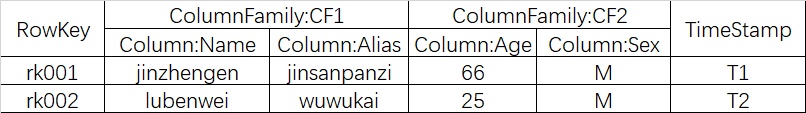
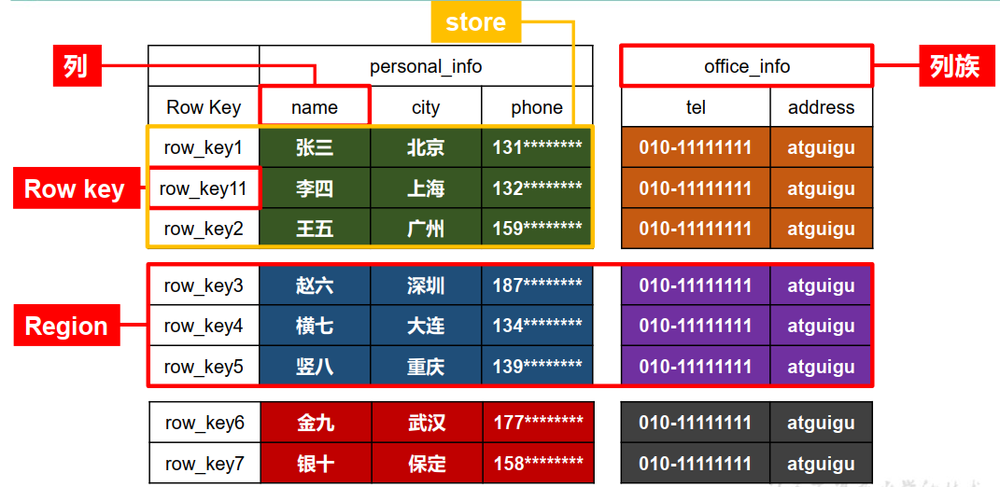
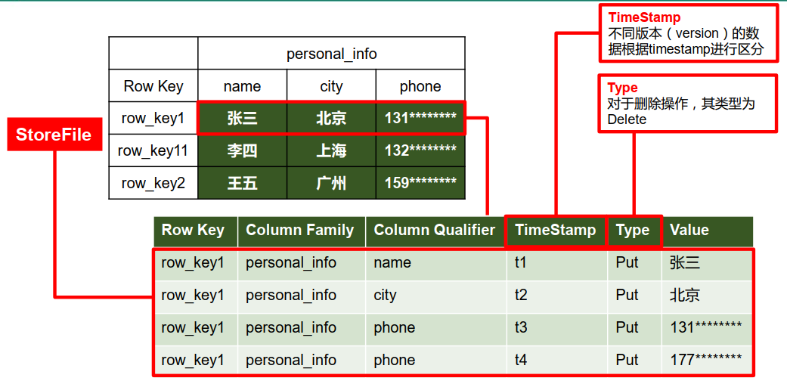

##  HBase表结构逻辑视图
初次接触HBase，可能看到以下描述会懵：“基于列存储”，“稀疏MAP”，“RowKey”,“ColumnFamily”。

其实没那么高深，我们需要分两步来理解HBase, 就能够理解为什么HBase能够“快速地”“分布式地”处理“大量数据”了。

　　1.内存结构

　　2.文件存储结构

### 名词概念
加入我们有如下一张表

### Rowkey的概念
Rowkey的概念和mysql中的主键是完全一样的，Hbase使用Rowkey来唯一的区分某一行的数据。

由于Hbase只支持3中查询方式：

* 1、基于Rowkey的单行查询    
* 2、基于Rowkey的范围扫描    
* 3、全表扫描

因此，Rowkey对Hbase的性能影响非常大，Rowkey的设计就显得尤为的重要。设计的时候要兼顾基于Rowkey的单行查询也要键入Rowkey的范围扫描。具体Rowkey要如何设计后续会整理相关的文章做进一步的描述。这里大家只要有一个概念就是Rowkey的设计极为重要。

rowkey 行键可以是任意字符串(最大长度是 64KB，实际应用中长度一般为 10-100bytes)，最好是 16。在 HBase 内部，rowkey 保存为字节数组。HBase 会对表中的数据按照 rowkey 排序 (字典顺序)

### Column的概念
列，可理解成MySQL列。

### ColumnFamily的概念
列族, HBase引入的概念。

Hbase通过列族划分数据的存储，列族下面可以包含任意多的列，实现灵活的数据存取。就像是家族的概念，我们知道一个家族是由于很多个的家庭组成的。列族也类似，列族是由一个一个的列组成（任意多）。

Hbase表的创建的时候就必须指定列族。就像关系型数据库创建的时候必须指定具体的列是一样的。

Hbase的列族不是越多越好，官方推荐的是列族最好小于或者等于3。我们使用的场景一般是1个列族。

### TimeStamp的概念
TimeStamp对Hbase来说至关重要，因为它是实现Hbase多版本的关键，删除和修改也依赖于TimeStamp。在Hbase中使用不同的timestame来标识相同rowkey行对应的不通版本的数据。

HBase 中通过 rowkey 和 columns 确定的为一个存储单元称为 cell。每个 cell 都保存着同一份 数据的多个版本。版本通过时间戳来索引。时间戳的类型是 64 位整型。时间戳可以由 hbase(在数据写入时自动)赋值，此时时间戳是精确到毫秒的当前系统时间。时间戳也可以由 客户显式赋值。如果应用程序要避免数据版本冲突，就必须自己生成具有唯一性的时间戳。 每个 cell 中，不同版本的数据按照时间倒序排序，即最新的数据排在最前面。

为了避免数据存在过多版本造成的的管理 (包括存贮和索引)负担，hbase 提供了两种数据版 本回收方式：
　　
* 保存数据的最后 n 个版本    
* 保存最近一段时间内的版本（设置数据的生命周期 TTL）。

用户可以针对每个列簇进行设置。

### 单元格（Cell）
由{rowkey, column Family： column Qualifier, time Stamp} 唯一确定的单元。 Cell 中的数据是没有类型的，全部是字节码形式存贮。

## HBase 数据模型
逻辑上， HBase 的数据模型同关系型数据库很类似，数据存储在一张表中，有行有列。但从 HBase 的底层物理存储结构（K-V） 来看， HBase 更像是一个 multi-dimensional map。

### HBase 逻辑结构

### HBase 物理存储结构

### 数据模型
#### 1） Name Space
命名空间，类似于关系型数据库的 DatabBase 概念，每个命名空间下有多个表。 HBase 有两个自带的命名空间，分别是 **hbase** 和 **default**， **hbase 中存放的是 HBase 内置的表**，default 表是用户默认使用的命名空间。

#### 2） Region
类似于关系型数据库的表概念。不同的是， HBase 定义表时**只需要声明列族即可，不需要声明具体的列**。这意味着， 往 HBase 写入数据时，字段可以**动态、 按需**指定。因此，和关系型数据库相比， HBase 能够轻松应对字段变更的场景。

#### Row
HBase 表中的每行数据都由一个 **RowKey** 和多个 **Column**（列）组成，**数据是按照 RowKey的字典顺序存储的**，并且查询数据时只能根据 RowKey 进行检索，所以 RowKey 的设计十分重要。

#### 4） Column
HBase 中的每个列都由 **Column Family(列族)**和 **Column Qualifier（列限定符）** 进行限定，例如 info： name， info： age。建表时，只需指明列族，而列限定符无需预先定义。

#### 5） Time Stamp
用于标识数据的不同版本（version）， 每条数据写入时， 如果不指定时间戳， 系统会自动为其加上该字段，其值为写入 HBase 的时间。

#### 6） Cell
由{rowkey, column Family： column Qualifier, time Stamp} 唯一确定的单元。 cell 中的数据是没有类型的，全部是字节码形式存贮。

## 一个版本
### RowKey
与nosql数据库们一样,RowKey是用来检索记录的主键。访问HBASE table中的行，只有三种方式：

* 1.通过单个RowKey访问    
* 2.通过RowKey的range    
* 3.全表扫描

RowKey行键 (RowKey)可以是任意字符串(最大长度是64KB，实际应用中长度一般为 10-100bytes)，在HBASE内部，RowKey保存为字节数组。存储时，数据按照RowKey的字典序(byte order)排序存储。设计RowKey时，要充分排序存储这个特性，将经常一起读取的行存储放到一起。(位置相关性)

### Column Family
列族：HBASE表中的每个列，都归属于某个列族。列族是表的schema的一部 分(而列不是)，必须在使用表之前定义。列名都以列族作为前缀。例如 courses:history，courses:math都属于courses 这个列族。

### Cell
由{rowkey, column Family:columu, version} 唯一确定的单元。cell中的数据是没有类型的，全部是字节码形式存贮。

关键字：无类型、字节码

### Time Stamp
HBASE 中通过rowkey和columns确定的为一个存贮单元称为cell。每个 cell都保存 着同一份数据的多个版本。版本通过时间戳来索引。时间戳的类型是 64位整型。时间戳可以由HBASE(在数据写入时自动 )赋值，此时时间戳是精确到毫秒 的当前系统时间。时间戳也可以由客户显式赋值。如果应用程序要避免数据版 本冲突，就必须自己生成具有唯一性的时间戳。每个 cell中，不同版本的数据按照时间倒序排序，即最新的数据排在最前面。

为了避免数据存在过多版本造成的的管理 (包括存贮和索引)负担，HBASE提供 了两种数据版本回收方式。一是保存数据的最后n个版本，二是保存最近一段 时间内的版本（比如最近七天）。用户可以针对每个列族进行设置。

