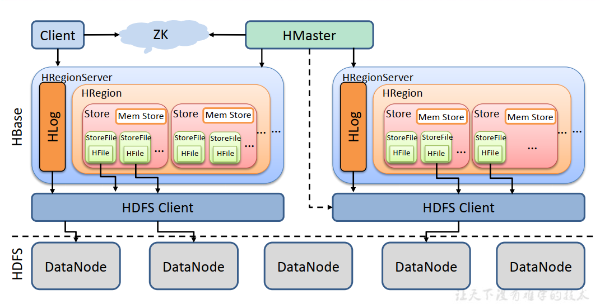
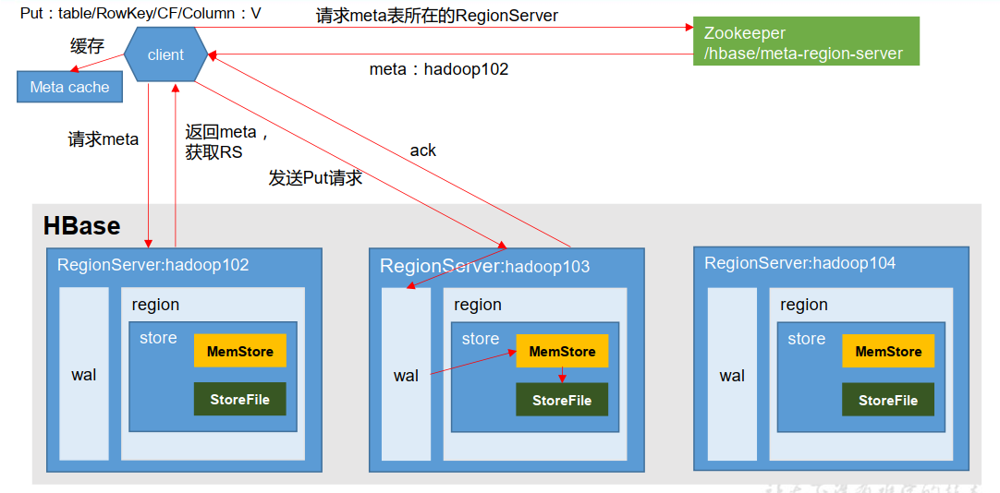
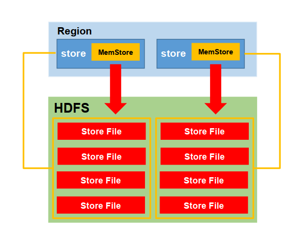
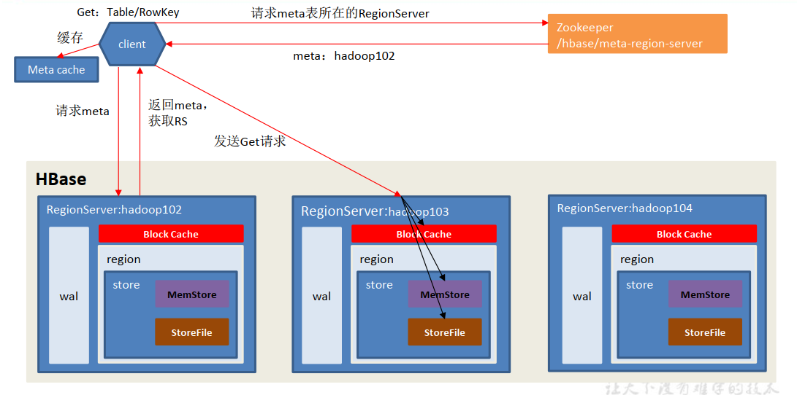
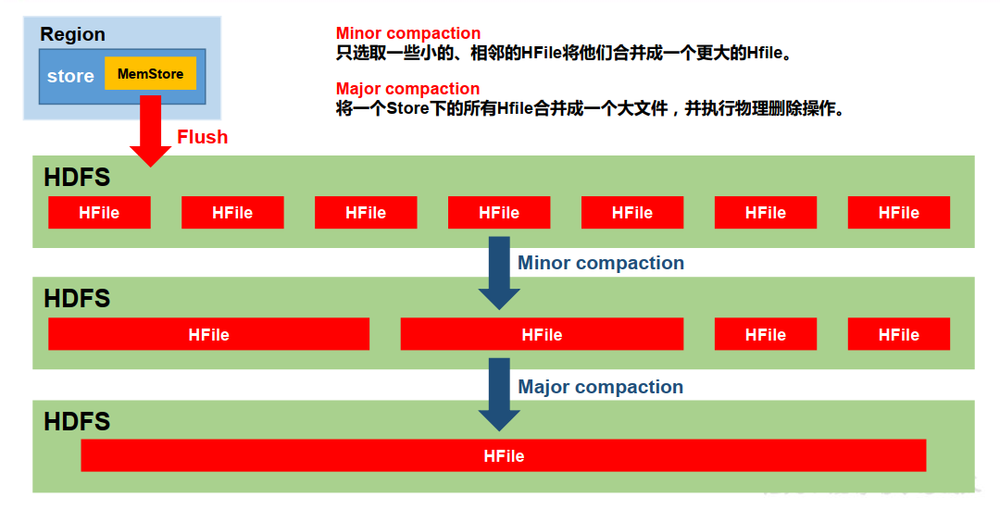
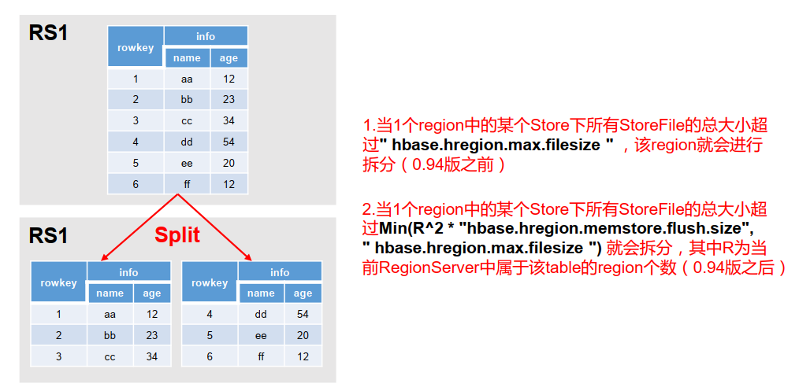

# HBase 进阶

## 架构原理(详细架构图)

**1）StoreFile**

保存实际数据的物理文件， StoreFile 以 HFile 的形式存储在 HDFS 上。每个 Store 会有一个或多个 StoreFile（HFile），数据在每个 StoreFile 中都是有序的。

**2）MemStore**

写缓存， 由于 HFile 中的数据要求是有序的， 所以数据是先存储在 MemStore 中，排好序后，等到达刷写时机才会刷写到 HFile，每次刷写都会形成一个新的 HFile。

**3）WAL**

由于数据要经 MemStore 排序后才能刷写到 HFile， 但把数据保存在内存中会有很高的概率导致数据丢失，为了解决这个问题，数据会先写在一个叫做 Write-Ahead logfile 的文件中，然后再写入 MemStore 中。所以在系统出现故障的时候，数据可以通过这个日志文件重建。

## HBase写流程

写流程：

* 1） Client 先访问 zookeeper，获取 hbase:meta 表位于哪个 Region Server。    
* 2）访问对应的 Region Server，获取 hbase:meta 表，根据读请求的 namespace:table/rowkey，查询出目标数据位于哪个 Region Server 中的哪个 Region 中。并将该 table 的 region 信息以及 meta 表的位置信息缓存在客户端的 meta cache，方便下次访问。    
* 3）与目标 Region Server 进行通讯；    
* 4）将数据顺序写入（追加）到 WAL；    
* 5）将数据写入对应的 MemStore，数据会在 MemStore 进行排序；    
* 6）向客户端发送 ack；    
* 7） 等达到 MemStore 的刷写时机后，将数据刷写到 HFile。  

## MemStore Flush

MemStore 刷写时机：

* 1.当某个 memstroe 的大小达到了 hbase.hregion.memstore.flush.size（默认值 128M） ，其所在 region 的所有 memstore 都会刷写。当 memstore 的大小达到了hbase.hregion.memstore.flush.size（默认值 128M）* hbase.hregion.memstore.block.multiplier（默认值 4）时，会阻止继续往该 memstore 写数据。    
* 2.当 region server 中 memstore 的总大小达到java_heapsize*hbase.regionserver.global.memstore.size（默认值 0.4）*hbase.regionserver.global.memstore.size.lower.limit（默认值 0.95） ，    
* region 会按照其所有 memstore 的大小顺序（由大到小）依次进行刷写。直到 region server中所有 memstore 的总大小减小到上述值以下。当 region server 中 memstore 的总大小达到java_heapsize*hbase.regionserver.global.memstore.size（默认值 0.4）时，会阻止继续往所有的 memstore 写数据。    
* 3.到达自动刷写的时间，也会触发 memstore flush。自动刷新的时间间隔由该属性进行配置 hbase.regionserver.optionalcacheflushinterval（默认 1 小时） 。    
* 4.当 WAL 文件的数量超过 hbase.regionserver.max.logs， region 会按照时间顺序依次进行刷写，直到 WAL 文件数量减小到 hbase.regionserver.max.log 以下（该属性名已经废弃，现无需手动设置， 最大值为 32）。   

## 读流程

读流程

* 1） Client 先访问 zookeeper，获取 hbase:meta 表位于哪个 Region Server。    
* 2）访问对应的 Region Server，获取 hbase:meta 表，根据读请求的 namespace:table/rowkey，查询出目标数据位于哪个 Region Server 中的哪个 Region 中。并将该 table 的 region 信息以及 meta 表的位置信息缓存在客户端的 meta cache，方便下次访问。    
* 3）与目标 Region Server 进行通讯；    
* 4） 分别在 Block Cache（读缓存）， MemStore 和 Store File（HFile）中查询目标数据，并将查到的所有数据进行合并。此处所有数据是指同一条数据的不同版本（time stamp）或者不同的类型（Put/Delete）。    
* 5） 将从文件中查询到的数据块（Block， HFile 数据存储单元，默认大小为 64KB）缓存到Block Cache。    
* 6） 将合并后的最终结果返回给客户端  

## StoreFile Compaction
由于memstore每次刷写都会生成一个新的HFile，且同一个字段的不同版本（timestamp）和不同类型（Put/Delete）有可能会分布在不同的 HFile 中，因此查询时需要遍历所有的 HFile。为了减少 HFile 的个数，以及清理掉过期和删除的数据，会进行 StoreFile Compaction。

Compaction 分为两种，分别是 **Minor Compaction** 和 **Major Compaction**。Minor Compaction会将临近的若干个较小的 HFile 合并成一个较大的 HFile，但**不会清理过期和删除的数据**。Major Compaction 会将一个 Store 下的所有的 HFile 合并成一个大 HFile，并且**会清理掉过期和删除的数据**。

## Region Split
默认情况下，每个 Table 起初只有一个 Region，随着数据的不断写入， Region 会自动进行拆分。刚拆分时，两个子 Region 都位于当前的 Region Server，但处于负载均衡的考虑，HMaster 有可能会将某个 Region 转移给其他的 Region Server。

Region Split 时机：

* 1.当1个region中的某个Store下所有StoreFile的总大小超过hbase.hregion.max.filesize，该 Region 就会进行拆分（0.94 版本之前）。    
* 2. 当 1 个 region 中 的 某 个 Store 下 所 有 StoreFile 的 总 大 小 超 过 `Min(R^2 * "hbase.hregion.memstore.flush.size","hbase.hregion.max.filesize")`， 该 Region 就会进行拆分，其中 R 为当前 Region Server 中属于该 Table 的个数（0.94 版本之后）。  

