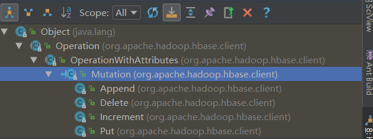

# MapReduce操作Hbase

## 我的MapReduce测试
通过HBase的相关JavaAPI，我们可以实现伴随HBase操作的MapReduce过程，比如使用MapReduce将数据从本地文件系统导入到HBase的表中，比如我们从HBase中读取一些原始数据后使用MapReduce做数据分析。

### 环境配置
在/etc/profile配置
```
export HBASE_HOME=/opt/module/hbase-1.3.1
export HADOOP_HOME=/opt/module/hadoop-2.7.2
```

并在hadoop-env.sh中配置：（注意：在for循环之后配）
```
export HADOOP_CLASSPATH=$HADOOP_CLASSPATH:/opt/module/hbase/lib/*
```


### mr代码

#### Mapper
继承TableMapper：
```java
public class FruitMapper extends TableMapper<ImmutableBytesWritable, Put> {

    @Override
    protected void map(ImmutableBytesWritable key, Result value, Context context) throws IOException, InterruptedException {
        //构建put对象
        Put put = new Put(key.get());

        Cell[] cells = value.rawCells();

        for (Cell cell : cells) {
            if("name".equals(Bytes.toString(CellUtil.cloneQualifier(cell)))){
                //将该列cell加入到put对象中
                put.add(cell);
            }
        }

        context.write(key, put);
    }
}
```

TableMapper
```java
/**
 * Extends the base <code>Mapper</code> class to add the required input key
 * and value classes.
 *
 * @param <KEYOUT>  The type of the key.
 * @param <VALUEOUT>  The type of the value.
 * @see org.apache.hadoop.mapreduce.Mapper
 */
@InterfaceAudience.Public
@InterfaceStability.Stable
public abstract class TableMapper<KEYOUT, VALUEOUT>
extends Mapper<ImmutableBytesWritable, Result, KEYOUT, VALUEOUT> {

}
```


#### Reducer
```java
public class FruitReducer extends TableReducer<ImmutableBytesWritable, Put, NullWritable> {
    @Override
    protected void reduce(ImmutableBytesWritable key, Iterable<Put> values, Context context) throws IOException, InterruptedException {
        super.reduce(key, values, context);

        for (Put value : values) {
            context.write(NullWritable.get(), value);
        }
    }
}
```

TableReducer：
```java
/**
 * Extends the basic <code>Reducer</code> class to add the required key and
 * value input/output classes. While the input key and value as well as the
 * output key can be anything handed in from the previous map phase the output
 * value <u>must</u> be either a {@link org.apache.hadoop.hbase.client.Put Put}
 * or a {@link org.apache.hadoop.hbase.client.Delete Delete} instance when
 * using the {@link TableOutputFormat} class.
 * <p>
 * This class is extended by {@link IdentityTableReducer} but can also be
 * subclassed to implement similar features or any custom code needed. It has
 * the advantage to enforce the output value to a specific basic type.
 *
 * @param <KEYIN>  The type of the input key.
 * @param <VALUEIN>  The type of the input value.
 * @param <KEYOUT>  The type of the output key.
 * @see org.apache.hadoop.mapreduce.Reducer
 */
@InterfaceAudience.Public
@InterfaceStability.Stable
public abstract class TableReducer<KEYIN, VALUEIN, KEYOUT>
extends Reducer<KEYIN, VALUEIN, KEYOUT, Mutation> {
}
```



#### Driver
```java
public class FruitDriver extends Configuration implements Tool{

    private Configuration configuration = null;

    public int run(String[] args) throws Exception {
        //得到Configuration
        Configuration conf = this.getConf();
        //创建Job任务
        Job job = Job.getInstance(conf);

        //指定Driver
        job.setJarByClass(FruitDriver.class);

        //设置Mapper，注意导入的是mapreduce包下的，不是mapred包下的，后者是老版本
        TableMapReduceUtil.initTableMapperJob(
                "fruit", //数据源的表名
                new Scan(), //scan扫描控制器
                FruitMapper.class,//设置Mapper类
                ImmutableBytesWritable.class,//设置Mapper输出key类型
                Put.class,//设置Mapper输出value值类型
                job//设置给哪个JOB
        );
        //设置Reducer
        TableMapReduceUtil.initTableReducerJob("fruit_mr", FruitReducer.class, job);


        boolean isSuccess = job.waitForCompletion(true);
        return isSuccess ? 0 : 1;

    }

    public void setConf(Configuration conf) {
        this.configuration = conf;
    }

    public Configuration getConf() {
        return configuration;
    }

    public static void main(String[] args) throws Exception {
        Configuration conf = HBaseConfiguration.create();
        int status = ToolRunner.run(conf, new FruitDriver(), args);
        System.exit(status);
    }
}
```

## mr(网上)
`https://www.cnblogs.com/qingyunzong/p/8681490.html`

### MapReduce从HDFS读取数据存储到HBase中
现有HDFS中有一个student.txt文件，格式如下
```
95002,刘晨,女,19,IS
95017,王风娟,女,18,IS
95018,王一,女,19,IS
95013,冯伟,男,21,CS
95014,王小丽,女,19,CS
95019,邢小丽,女,19,IS
95020,赵钱,男,21,IS
95003,王敏,女,22,MA
95004,张立,男,19,IS
95012,孙花,女,20,CS
95010,孔小涛,男,19,CS
95005,刘刚,男,18,MA
95006,孙庆,男,23,CS
95007,易思玲,女,19,MA
95008,李娜,女,18,CS
95021,周二,男,17,MA
95022,郑明,男,20,MA
95001,李勇,男,20,CS
95011,包小柏,男,18,MA
95009,梦圆圆,女,18,MA
95015,王君,男,18,MA
```
将HDFS上的这个文件里面的数据写入到HBase数据块中

MapReduce实现代码如下
```java
import java.io.IOException;

import org.apache.hadoop.conf.Configuration;
import org.apache.hadoop.conf.Configured;
import org.apache.hadoop.fs.FileSystem;
import org.apache.hadoop.fs.Path;
import org.apache.hadoop.hbase.HBaseConfiguration;
import org.apache.hadoop.hbase.client.Put;
import org.apache.hadoop.hbase.mapreduce.TableMapReduceUtil;
import org.apache.hadoop.hbase.mapreduce.TableReducer;
import org.apache.hadoop.io.LongWritable;
import org.apache.hadoop.io.NullWritable;
import org.apache.hadoop.io.Text;
import org.apache.hadoop.mapreduce.Job;
import org.apache.hadoop.mapreduce.Mapper;
import org.apache.hadoop.mapreduce.lib.input.FileInputFormat;
import org.apache.hadoop.mapreduce.lib.output.FileOutputFormat;
import org.apache.hadoop.util.Tool;
import org.apache.hadoop.util.ToolRunner;

public class ReadHDFSDataToHbaseMR extends Configured implements Tool{

    public static void main(String[] args) throws Exception {
        
        int run = ToolRunner.run(new ReadHDFSDataToHbaseMR(), args);
        System.exit(run);
    }

    @Override
    public int run(String[] arg0) throws Exception {

        Configuration conf = HBaseConfiguration.create();
        conf.set("fs.defaultFS", "hdfs://myha01/");
        conf.set("hbase.zookeeper.quorum", "hadoop1:2181,hadoop2:2181,hadoop3:2181");
        System.setProperty("HADOOP_USER_NAME", "hadoop");
        FileSystem fs = FileSystem.get(conf);
//        conf.addResource("config/core-site.xml");
//        conf.addResource("config/hdfs-site.xml");
        
        Job job = Job.getInstance(conf);
        
        job.setJarByClass(ReadHDFSDataToHbaseMR.class);
        
        job.setMapperClass(HDFSToHbaseMapper.class);
        job.setMapOutputKeyClass(Text.class);
        job.setMapOutputValueClass(NullWritable.class);

        TableMapReduceUtil.initTableReducerJob("student", HDFSToHbaseReducer.class, job,null,null,null,null,false);
        job.setOutputKeyClass(NullWritable.class);
        job.setOutputValueClass(Put.class);
        
        Path inputPath = new Path("/student/input/");
        Path outputPath = new Path("/student/output/");
        
        if(fs.exists(outputPath)) {
            fs.delete(outputPath,true);
        }
        
        FileInputFormat.addInputPath(job, inputPath);
        FileOutputFormat.setOutputPath(job, outputPath);
        
        boolean isDone = job.waitForCompletion(true);
        
        return isDone ? 0 : 1;
    }
    
    
    public static class HDFSToHbaseMapper extends Mapper<LongWritable, Text, Text, NullWritable>{
        
        @Override
        protected void map(LongWritable key, Text value, Context context)
                throws IOException, InterruptedException {    
            context.write(value, NullWritable.get());
        }
        
    }
    
    /**
     * 95015,王君,男,18,MA
     * */
    public static class HDFSToHbaseReducer extends TableReducer<Text, NullWritable, NullWritable>{
        
        @Override
        protected void reduce(Text key, Iterable<NullWritable> values,Context context)
                throws IOException, InterruptedException {
            
            String[] split = key.toString().split(",");
            
            Put put = new Put(split[0].getBytes());
            
            put.addColumn("info".getBytes(), "name".getBytes(), split[1].getBytes());
            put.addColumn("info".getBytes(), "sex".getBytes(), split[2].getBytes());
            put.addColumn("info".getBytes(), "age".getBytes(), split[3].getBytes());
            put.addColumn("info".getBytes(), "department".getBytes(), split[4].getBytes());
            
            context.write(NullWritable.get(), put);
        
        }
        
    }
    
}
```


### MapReduce从HBase读取数据计算平均年龄并存储到HDFS中

```java
import java.io.IOException;
import java.util.List;

import org.apache.hadoop.conf.Configuration;
import org.apache.hadoop.conf.Configured;
import org.apache.hadoop.fs.FileSystem;
import org.apache.hadoop.fs.Path;
import org.apache.hadoop.hbase.Cell;
import org.apache.hadoop.hbase.CellUtil;
import org.apache.hadoop.hbase.HBaseConfiguration;
import org.apache.hadoop.hbase.client.Result;
import org.apache.hadoop.hbase.client.Scan;
import org.apache.hadoop.hbase.io.ImmutableBytesWritable;
import org.apache.hadoop.hbase.mapreduce.TableMapReduceUtil;
import org.apache.hadoop.hbase.mapreduce.TableMapper;
import org.apache.hadoop.hbase.util.Bytes;
import org.apache.hadoop.io.DoubleWritable;
import org.apache.hadoop.io.IntWritable;
import org.apache.hadoop.io.Text;
import org.apache.hadoop.mapreduce.Job;
import org.apache.hadoop.mapreduce.Reducer;
import org.apache.hadoop.mapreduce.lib.output.FileOutputFormat;
import org.apache.hadoop.util.Tool;
import org.apache.hadoop.util.ToolRunner;


public class ReadHbaseDataToHDFS extends Configured implements Tool{

    public static void main(String[] args) throws Exception {
        
        int run = ToolRunner.run(new ReadHbaseDataToHDFS(), args);
        System.exit(run);
        
    }

    @Override
    public int run(String[] arg0) throws Exception {

        Configuration conf = HBaseConfiguration.create();
        conf.set("fs.defaultFS", "hdfs://myha01/");
        conf.set("hbase.zookeeper.quorum", "hadoop1:2181,hadoop2:2181,hadoop3:2181");
        System.setProperty("HADOOP_USER_NAME", "hadoop");
        FileSystem fs = FileSystem.get(conf);
//        conf.addResource("config/core-site.xml");
//        conf.addResource("config/hdfs-site.xml");
        
        Job job = Job.getInstance(conf);
        
        job.setJarByClass(ReadHbaseDataToHDFS.class);
        
        
        // 取对业务有用的数据 info,age
        Scan scan = new Scan();
        scan.addColumn("info".getBytes(), "age".getBytes());
        
        TableMapReduceUtil.initTableMapperJob(
                "student".getBytes(), // 指定表名
                scan, // 指定扫描数据的条件
                HbaseToHDFSMapper.class, // 指定mapper class
                Text.class,     // outputKeyClass mapper阶段的输出的key的类型
                IntWritable.class, // outputValueClass mapper阶段的输出的value的类型
                job, // job对象
                false
                );
    

        job.setReducerClass(HbaseToHDFSReducer.class);
        job.setOutputKeyClass(Text.class);
        job.setOutputValueClass(DoubleWritable.class);
        
        Path outputPath = new Path("/student/avg/");
        
        if(fs.exists(outputPath)) {
            fs.delete(outputPath,true);
        }
        
        FileOutputFormat.setOutputPath(job, outputPath);
        
        boolean isDone = job.waitForCompletion(true);
        
        return isDone ? 0 : 1;
    }
    
    public static class HbaseToHDFSMapper extends TableMapper<Text, IntWritable>{
        
        Text outKey = new Text("age");
        IntWritable outValue = new IntWritable();
        // key是hbase中的行键
        // value是hbase中的所行键的所有数据
        @Override
        protected void map(ImmutableBytesWritable key, Result value,Context context)
                throws IOException, InterruptedException {
            
            boolean isContainsColumn = value.containsColumn("info".getBytes(), "age".getBytes());
        
            if(isContainsColumn) {
                
                List<Cell> listCells = value.getColumnCells("info".getBytes(), "age".getBytes());
                System.out.println("listCells:\t"+listCells);
                Cell cell = listCells.get(0);
                System.out.println("cells:\t"+cell);
                
                byte[] cloneValue = CellUtil.cloneValue(cell);
                String ageValue = Bytes.toString(cloneValue);
                outValue.set(Integer.parseInt(ageValue));
                
                context.write(outKey,outValue);
                
            }
            
        }
        
    }
    
    public static class HbaseToHDFSReducer extends Reducer<Text, IntWritable, Text, DoubleWritable>{
        
        DoubleWritable outValue = new DoubleWritable();
        
        @Override
        protected void reduce(Text key, Iterable<IntWritable> values,Context context)
                throws IOException, InterruptedException {
            
            int count = 0;
            int sum = 0;
            for(IntWritable value : values) {
                count++;
                sum += value.get();
            }
            
            double avgAge = sum * 1.0 / count;
            outValue.set(avgAge);
            context.write(key, outValue);
        }
        
    }
    
}
```


```

```
