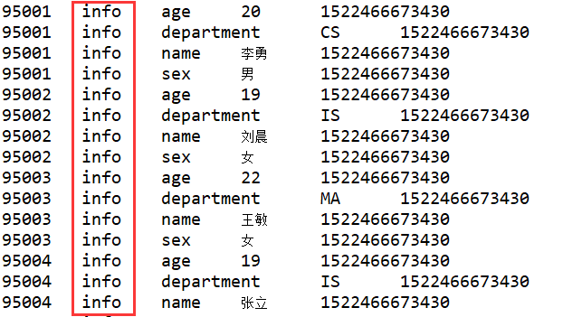

[toc]

# 过滤器

## 过滤器(网上)
`https://www.cnblogs.com/qingyunzong/p/8681529.html`

### 过滤器（Filter）
基础API中的查询操作在面对大量数据的时候是非常苍白的，这里Hbase提供了高级的查询方法：Filter。Filter可以根据簇、列、版本等更多的条件来对数据进行过滤，基于Hbase本身提供的三维有序（主键有序、列有序、版本有序），这些Filter可以高效的完成查询过滤的任务。带有Filter条件的RPC查询请求会把Filter分发到各个RegionServer，是一个服务器端（Server-side）的过滤器，这样也可以降低网络传输的压力。

要完成一个过滤的操作，至少需要两个参数。**一个是抽象的操作符**，Hbase提供了枚举类型的变量来表示这些抽象的操作符：LESS/LESS_OR_EQUAL/EQUAL/NOT_EUQAL等；**另外一个就是具体的比较器（Comparator）**，代表具体的比较逻辑，如果可以提高字节级的比较、字符串级的比较等。有了这两个参数，我们就可以清晰的定义筛选的条件，过滤数据。

**抽象操作符（比较运算符）**
```
LESS <
LESS_OR_EQUAL <=
EQUAL =
NOT_EQUAL <>
GREATER_OR_EQUAL >=
GREATER >
NO_OP 排除所有
```

**比较器（指定比较机制）**
```
BinaryComparator 按字节索引顺序比较指定字节数组，采用 Bytes.compareTo(byte[])
BinaryPrefixComparator 跟前面相同，只是比较左端的数据是否相同
NullComparator 判断给定的是否为空
BitComparator 按位比较
RegexStringComparator 提供一个正则的比较器，仅支持 EQUAL 和非 EQUAL
SubstringComparator 判断提供的子串是否出现在 value 中
```

### HBase过滤器的分类

#### 比较过滤器

##### 1、行键过滤器 RowFilter
```java
Filter rowFilter = new RowFilter(CompareOp.GREATER, new BinaryComparator("95007".getBytes()));
scan.setFilter(rowFilter);
```

```java
public class HbaseFilterTest {

    private static final String ZK_CONNECT_KEY = "hbase.zookeeper.quorum";
    private static final String ZK_CONNECT_VALUE = "hadoop1:2181,hadoop2:2181,hadoop3:2181";

    private static Connection conn = null;
    private static Admin admin = null;
    
    public static void main(String[] args) throws Exception {
        
        Configuration conf = HBaseConfiguration.create();
        conf.set(ZK_CONNECT_KEY, ZK_CONNECT_VALUE);
        conn = ConnectionFactory.createConnection(conf);
        admin = conn.getAdmin();
        Table table = conn.getTable(TableName.valueOf("student"));
        
        Scan scan = new Scan();
        
        Filter rowFilter = new RowFilter(CompareOp.GREATER, new BinaryComparator("95007".getBytes()));
        scan.setFilter(rowFilter);
        ResultScanner resultScanner = table.getScanner(scan);
        for(Result result : resultScanner) {
            List<Cell> cells = result.listCells();
            for(Cell cell : cells) {
                System.out.println(cell);
            }
        }
        
        
    }
    
} 
```
运行结果部分截图


##### 2、列簇过滤器 FamilyFilter
```java
Filter familyFilter = new FamilyFilter(CompareOp.EQUAL, new BinaryComparator("info".getBytes()));
scan.setFilter(familyFilter);
```

```java
public class HbaseFilterTest {

    private static final String ZK_CONNECT_KEY = "hbase.zookeeper.quorum";
    private static final String ZK_CONNECT_VALUE = "hadoop1:2181,hadoop2:2181,hadoop3:2181";

    private static Connection conn = null;
    private static Admin admin = null;
    
    public static void main(String[] args) throws Exception {
        
        Configuration conf = HBaseConfiguration.create();
        conf.set(ZK_CONNECT_KEY, ZK_CONNECT_VALUE);
        conn = ConnectionFactory.createConnection(conf);
        admin = conn.getAdmin();
        Table table = conn.getTable(TableName.valueOf("student"));
        
        Scan scan = new Scan();

        Filter familyFilter = new FamilyFilter(CompareOp.EQUAL, new BinaryComparator("info".getBytes()));
        scan.setFilter(familyFilter);
        ResultScanner resultScanner = table.getScanner(scan);
        for(Result result : resultScanner) {
            List<Cell> cells = result.listCells();
            for(Cell cell : cells) {
                System.out.println(cell);
            }
        }
        
        
    }
    
    
}
```



##### 3、列过滤器 QualifierFilter
```java
Filter qualifierFilter = new QualifierFilter(CompareOp.EQUAL, new BinaryComparator("name".getBytes()));
scan.setFilter(qualifierFilter);
```

```java
public class HbaseFilterTest {

    private static final String ZK_CONNECT_KEY = "hbase.zookeeper.quorum";
    private static final String ZK_CONNECT_VALUE = "hadoop1:2181,hadoop2:2181,hadoop3:2181";

    private static Connection conn = null;
    private static Admin admin = null;
    
    public static void main(String[] args) throws Exception {
        
        Configuration conf = HBaseConfiguration.create();
        conf.set(ZK_CONNECT_KEY, ZK_CONNECT_VALUE);
        conn = ConnectionFactory.createConnection(conf);
        admin = conn.getAdmin();
        Table table = conn.getTable(TableName.valueOf("student"));
        
        Scan scan = new Scan();
        
        Filter qualifierFilter = new QualifierFilter(CompareOp.EQUAL, new BinaryComparator("name".getBytes()));
        scan.setFilter(qualifierFilter);
        ResultScanner resultScanner = table.getScanner(scan);
        for(Result result : resultScanner) {
            List<Cell> cells = result.listCells();
            for(Cell cell : cells) {
                System.out.println(cell);
            }
        }
        
        
    }
    
    
}
```


##### 4、值过滤器 ValueFilter
```java
Filter valueFilter = new ValueFilter(CompareOp.EQUAL, new SubstringComparator("男"));
scan.setFilter(valueFilter)
```

```java
public class HbaseFilterTest {

    private static final String ZK_CONNECT_KEY = "hbase.zookeeper.quorum";
    private static final String ZK_CONNECT_VALUE = "hadoop1:2181,hadoop2:2181,hadoop3:2181";

    private static Connection conn = null;
    private static Admin admin = null;
    
    public static void main(String[] args) throws Exception {
        
        Configuration conf = HBaseConfiguration.create();
        conf.set(ZK_CONNECT_KEY, ZK_CONNECT_VALUE);
        conn = ConnectionFactory.createConnection(conf);
        admin = conn.getAdmin();
        Table table = conn.getTable(TableName.valueOf("student"));
        
        Scan scan = new Scan();
        
        Filter valueFilter = new ValueFilter(CompareOp.EQUAL, new SubstringComparator("男"));
        scan.setFilter(valueFilter);
        ResultScanner resultScanner = table.getScanner(scan);
        for(Result result : resultScanner) {
            List<Cell> cells = result.listCells();
            for(Cell cell : cells) {
                System.out.println(cell);
            }
        }
        
        
    }
    
    
}
```


##### 5、时间戳过滤器 TimestampsFilter
```java
List<Long> list = new ArrayList<>();
list.add(1522469029503l);
TimestampsFilter timestampsFilter = new TimestampsFilter(list);
scan.setFilter(timestampsFilter);
```


```java
public class HbaseFilterTest {

    private static final String ZK_CONNECT_KEY = "hbase.zookeeper.quorum";
    private static final String ZK_CONNECT_VALUE = "hadoop1:2181,hadoop2:2181,hadoop3:2181";

    private static Connection conn = null;
    private static Admin admin = null;
    
    public static void main(String[] args) throws Exception {
        
        Configuration conf = HBaseConfiguration.create();
        conf.set(ZK_CONNECT_KEY, ZK_CONNECT_VALUE);
        conn = ConnectionFactory.createConnection(conf);
        admin = conn.getAdmin();
        Table table = conn.getTable(TableName.valueOf("student"));
        
        Scan scan = new Scan();
        
        List<Long> list = new ArrayList<>();
        list.add(1522469029503l);
        TimestampsFilter timestampsFilter = new TimestampsFilter(list);
        scan.setFilter(timestampsFilter);
        ResultScanner resultScanner = table.getScanner(scan);
        for(Result result : resultScanner) {
            List<Cell> cells = result.listCells();
            for(Cell cell : cells) {
                System.out.println(Bytes.toString(cell.getRow()) + "\t" + Bytes.toString(cell.getFamily()) + "\t" + Bytes.toString(cell.getQualifier())
                + "\t" + Bytes.toString(cell.getValue()) + "\t" + cell.getTimestamp());
            }
        }
        
        
    }
    
    
}
```


#### 专用过滤器

##### 1、单列值过滤器 SingleColumnValueFilter
单列值过滤器 SingleColumnValueFilter ----会返回满足条件的整行
```java
SingleColumnValueFilter singleColumnValueFilter = new SingleColumnValueFilter(
                "info".getBytes(), //列簇
                "name".getBytes(), //列
                CompareOp.EQUAL, 
                new SubstringComparator("刘晨"));
//如果不设置为 true，则那些不包含指定 column 的行也会返回
singleColumnValueFilter.setFilterIfMissing(true);
scan.setFilter(singleColumnValueFilter);
```

```java
public class HbaseFilterTest2 {

    private static final String ZK_CONNECT_KEY = "hbase.zookeeper.quorum";
    private static final String ZK_CONNECT_VALUE = "hadoop1:2181,hadoop2:2181,hadoop3:2181";

    private static Connection conn = null;
    private static Admin admin = null;
    
    public static void main(String[] args) throws Exception {
        
        Configuration conf = HBaseConfiguration.create();
        conf.set(ZK_CONNECT_KEY, ZK_CONNECT_VALUE);
        conn = ConnectionFactory.createConnection(conf);
        admin = conn.getAdmin();
        Table table = conn.getTable(TableName.valueOf("student"));
        
        Scan scan = new Scan();
        
        SingleColumnValueFilter singleColumnValueFilter = new SingleColumnValueFilter(
                "info".getBytes(), 
                "name".getBytes(), 
                CompareOp.EQUAL, 
                new SubstringComparator("刘晨"));
        singleColumnValueFilter.setFilterIfMissing(true);
        
        scan.setFilter(singleColumnValueFilter);
        ResultScanner resultScanner = table.getScanner(scan);
        for(Result result : resultScanner) {
            List<Cell> cells = result.listCells();
            for(Cell cell : cells) {
                System.out.println(Bytes.toString(cell.getRow()) + "\t" + Bytes.toString(cell.getFamily()) + "\t" + Bytes.toString(cell.getQualifier())
                + "\t" + Bytes.toString(cell.getValue()) + "\t" + cell.getTimestamp());
            }
        }
        
        
    }
    
    
}
```


##### 2、单列值排除器 SingleColumnValueExcludeFilter 
```java
SingleColumnValueExcludeFilter singleColumnValueExcludeFilter = new SingleColumnValueExcludeFilter(
                "info".getBytes(), 
                "name".getBytes(), 
                CompareOp.EQUAL, 
                new SubstringComparator("刘晨"));
singleColumnValueExcludeFilter.setFilterIfMissing(true);
        
scan.setFilter(singleColumnValueExcludeFilter);
```

```java
public class HbaseFilterTest2 {

    private static final String ZK_CONNECT_KEY = "hbase.zookeeper.quorum";
    private static final String ZK_CONNECT_VALUE = "hadoop1:2181,hadoop2:2181,hadoop3:2181";

    private static Connection conn = null;
    private static Admin admin = null;
    
    public static void main(String[] args) throws Exception {
        
        Configuration conf = HBaseConfiguration.create();
        conf.set(ZK_CONNECT_KEY, ZK_CONNECT_VALUE);
        conn = ConnectionFactory.createConnection(conf);
        admin = conn.getAdmin();
        Table table = conn.getTable(TableName.valueOf("student"));
        
        Scan scan = new Scan();
        
        SingleColumnValueExcludeFilter singleColumnValueExcludeFilter = new SingleColumnValueExcludeFilter(
                "info".getBytes(), 
                "name".getBytes(), 
                CompareOp.EQUAL, 
                new SubstringComparator("刘晨"));
        singleColumnValueExcludeFilter.setFilterIfMissing(true);
        
        scan.setFilter(singleColumnValueExcludeFilter);
        ResultScanner resultScanner = table.getScanner(scan);
        for(Result result : resultScanner) {
            List<Cell> cells = result.listCells();
            for(Cell cell : cells) {
                System.out.println(Bytes.toString(cell.getRow()) + "\t" + Bytes.toString(cell.getFamily()) + "\t" + Bytes.toString(cell.getQualifier())
                + "\t" + Bytes.toString(cell.getValue()) + "\t" + cell.getTimestamp());
            }
        }
        
        
    }
    
    
}
```


##### 3、前缀过滤器 PrefixFilter
前缀过滤器 PrefixFilter----针对行键
```java
PrefixFilter prefixFilter = new PrefixFilter("9501".getBytes());
        
scan.setFilter(prefixFilter);
```

```java
public class HbaseFilterTest2 {

    private static final String ZK_CONNECT_KEY = "hbase.zookeeper.quorum";
    private static final String ZK_CONNECT_VALUE = "hadoop1:2181,hadoop2:2181,hadoop3:2181";

    private static Connection conn = null;
    private static Admin admin = null;
    
    public static void main(String[] args) throws Exception {
        
        Configuration conf = HBaseConfiguration.create();
        conf.set(ZK_CONNECT_KEY, ZK_CONNECT_VALUE);
        conn = ConnectionFactory.createConnection(conf);
        admin = conn.getAdmin();
        Table table = conn.getTable(TableName.valueOf("student"));
        
        Scan scan = new Scan();
        
        PrefixFilter prefixFilter = new PrefixFilter("9501".getBytes());
        
        scan.setFilter(prefixFilter);
        ResultScanner resultScanner = table.getScanner(scan);
        for(Result result : resultScanner) {
            List<Cell> cells = result.listCells();
            for(Cell cell : cells) {
                System.out.println(Bytes.toString(cell.getRow()) + "\t" + Bytes.toString(cell.getFamily()) + "\t" + Bytes.toString(cell.getQualifier())
                + "\t" + Bytes.toString(cell.getValue()) + "\t" + cell.getTimestamp());
            }
        }
        
        
    }
    
    
}
```


##### 4、列前缀过滤器 ColumnPrefixFilter
```java
ColumnPrefixFilter columnPrefixFilter = new ColumnPrefixFilter("name".getBytes());
        
scan.setFilter(columnPrefixFilter);
```

```java
public class HbaseFilterTest2 {

    private static final String ZK_CONNECT_KEY = "hbase.zookeeper.quorum";
    private static final String ZK_CONNECT_VALUE = "hadoop1:2181,hadoop2:2181,hadoop3:2181";

    private static Connection conn = null;
    private static Admin admin = null;
    
    public static void main(String[] args) throws Exception {
        
        Configuration conf = HBaseConfiguration.create();
        conf.set(ZK_CONNECT_KEY, ZK_CONNECT_VALUE);
        conn = ConnectionFactory.createConnection(conf);
        admin = conn.getAdmin();
        Table table = conn.getTable(TableName.valueOf("student"));
        
        Scan scan = new Scan();
        
        ColumnPrefixFilter columnPrefixFilter = new ColumnPrefixFilter("name".getBytes());
        
        scan.setFilter(columnPrefixFilter);
        ResultScanner resultScanner = table.getScanner(scan);
        for(Result result : resultScanner) {
            List<Cell> cells = result.listCells();
            for(Cell cell : cells) {
                System.out.println(Bytes.toString(cell.getRow()) + "\t" + Bytes.toString(cell.getFamily()) + "\t" + Bytes.toString(cell.getQualifier())
                + "\t" + Bytes.toString(cell.getValue()) + "\t" + cell.getTimestamp());
            }
        }
        
        
    }
    
    
}
```


##### 5、分页过滤器 PageFilter

## HBase的高级查询(qf)

### 1 过滤器链的值查询 : 

#### 1.1 SingleColumnValueFilter 
SingleColumnValueFilter：select * from ns1_userinfo where age <= 18 and name = narudo

```java
/**
 * 高级查询
 * 过滤器链查询
 */
public class Demo6_Filter {
    /**
     * 需求：
     * select * from ns1_userinfo where age <= 18 and name = narudo
     */
    @Test
    public void listFilter() throws IOException {
        /*
         * 1. 创建过滤器链
         * and条件使用MUST_PASS_ALL作为条件
         * or条件使用MUST_PASS_ONE
         */
        FilterList filterList = new FilterList(FilterList.Operator.MUST_PASS_ALL);
        /*
         * 2. 构造查询条件
         * 对于单列值比较器使用SingleColumnValueFilter
         * ColumnFamily, qualifier, 比较过滤器（大于、小于、等于、...）, value
         */
        SingleColumnValueFilter ageFilter = new SingleColumnValueFilter(Bytes.toBytes("base_info"), Bytes.toBytes("age"),
                CompareFilter.CompareOp.LESS_OR_EQUAL, Bytes.toBytes("18"));
        SingleColumnValueFilter nameFilter = new SingleColumnValueFilter(Bytes.toBytes("base_info"), Bytes.toBytes("name"),
                CompareFilter.CompareOp.EQUAL, Bytes.toBytes("narudo"));
        /*
         * 3. 将条件加入到过滤器链中
         */
        filterList.addFilter(ageFilter);
        filterList.addFilter(nameFilter);

        //4.创建扫描器进行扫描
        Scan scan = new Scan();

        //5. 将过滤条件关联到扫描器
        scan.setFilter(filterList);

        //6. 获取表对象
        Table table = HBaseUtils.getTable();

        //7. 扫描表
        ResultScanner scanner = table.getScanner(scan);

        //8. 打印数据
        Iterator<Result> iterator = scanner.iterator();
        while (iterator.hasNext()) {
            Result result = iterator.next();
            HBaseUtils.showResult(result);
        }
    }
}
```

#### 1.2 说明在查询的时候

```
1. 这种查询如果对应的行键，如果都包含了age和name列，就会对比值，如果都不满足就将其过滤，如果满足就获取。
2. 如果包含其中也给值，name或者age，只要其中一个列满足条件就会，就会获取。
3. 如果name和age都没有，那么视为该行满足条件
```

#### 1.3 解决方案

```
1. 在某个单值过滤器总添加
ageFilter.setFilterIfMissing(true);
nameFilter.setFilterIfMissing(true);
```

### 2 比较器查询

#### 2.1 RegexStringComparator  
RegexStringComparator : select * from ns1_userinfo where name like '%i%'

```java
/**
     *
     * 测试正则比较器
     * 需求：select * from ns1_userinfo where name like '%i%'
     */
    @Test
    public void regexStringComparatorTest() throws IOException {
        //1. 创建比较器，正则：以li开头的
        RegexStringComparator regexStringComparator = new RegexStringComparator("[$a-z]i[$a-z]");
        //2. 获取单列值过滤器
        SingleColumnValueFilter nameFilter = new SingleColumnValueFilter(Bytes.toBytes("base_info"), Bytes.toBytes("name"),
                CompareFilter.CompareOp.EQUAL, regexStringComparator);
        //3. 设置缺失
        nameFilter.setFilterIfMissing(true);
        //4.创建扫描器进行扫描
        Scan scan = new Scan();
        //5. 设置过滤器
        scan.setFilter(nameFilter);
        //6. 获取表对象
        Table table = HBaseUtils.getTable();
        //7. 扫描表
        ResultScanner scanner = table.getScanner(scan);
        //8. 打印数据
        Iterator<Result> iterator = scanner.iterator();
        while (iterator.hasNext()) {
            Result result = iterator.next();
            HBaseUtils.showResult(result);
        }
    }
```

#### 2.2 封装HbaseUtils

```java
/**
* 显示这个过滤器扫描的对象
*/
public static void showFilterResult(Filter filter) {
    //4.创建扫描器进行扫描
    Scan scan = new Scan();
    //5. 设置过滤器
    scan.setFilter(filter);
    //6. 获取表对象
    Table table = HBaseUtils.getTable();
    //7. 扫描表
    ResultScanner scanner = null;
    try {
        scanner = table.getScanner(scan);
        //8. 打印数据
        Iterator<Result> iterator = scanner.iterator();
        while (iterator.hasNext()) {
            Result result = iterator.next();
            HBaseUtils.showResult(result);
        }
    } catch (IOException e) {
    	logger.warn("获取table的时候异常！", e);
    } finally {
        try {
        	table.close();
        } catch (IOException e) {
        	logger.warn("关闭table的时候异常！", e);
        }
    }
}
```

- 修改之前的方法

```java
/**
*
* 测试正则比较器
* 需求：select * from ns1_userinfo where name like '%i%'
*/
@Test
public void regexStringComparatorTest() throws IOException {
    //1. 创建比较器，正则：以li开头的
    RegexStringComparator regexStringComparator = new RegexStringComparator("[$a-z]i[$a-z]");
    //2. 获取单列值过滤器
    SingleColumnValueFilter nameFilter = new SingleColumnValueFilter(Bytes.toBytes("base_info"), Bytes.toBytes("name"),
    CompareFilter.CompareOp.EQUAL, regexStringComparator);
    //3. 设置缺失
    nameFilter.setFilterIfMissing(true);
    //4. 打印
    HBaseUtils.showFilterResult(nameFilter);
}
```

#### 2.3  subStringComparator

```java
/**
*
* 测试subString比较器
* 需求：select * from ns1_userinfo where name like '%i%'
*/
@Test
public void subStringComparatorTest() throws IOException {
    //1. 创建比较器，正则：以li开头的
    SubstringComparator substringComparator = new SubstringComparator("i");
    //2. 获取单列值过滤器
    SingleColumnValueFilter nameFilter = new SingleColumnValueFilter(Bytes.toBytes("base_info"), Bytes.toBytes("name"),
    CompareFilter.CompareOp.EQUAL, substringComparator);
    //3. 设置缺失
    nameFilter.setFilterIfMissing(true);
    //4. 打印
    HBaseUtils.showFilterResult(nameFilter);
}
```

#### 2.4 Comparator和CompareOp的关系

```
查看官网的比较器API文档即可
```

#### 2.5 BinaryComparator

```java
/**
*
* 测试二进制比较器
* 需求：select * from ns1_userinfo where name = 'lixi'
*/
@Test
public void binaryComparatorTest() throws IOException {
    //1. 创建比较器，正则：以li开头的
    BinaryComparator binaryComparator = new BinaryComparator(Bytes.toBytes("lixi"));
    //2. 获取单列值过滤器
    SingleColumnValueFilter nameFilter = new SingleColumnValueFilter(Bytes.toBytes("base_info"), Bytes.toBytes("name"),
    CompareFilter.CompareOp.EQUAL, binaryComparator);
    //3. 设置缺失
    nameFilter.setFilterIfMissing(true);
    //4. 打印
    HBaseUtils.showFilterResult(nameFilter);
}
```

#### 2.6 BinaryPrefixComparator

```java
/**
*
* 测试二进制前缀比较器
* 需求：select * from ns1_userinfo where name like 'li%'
*/
@Test
public void binaryPrefixComparatorTest() throws IOException {
    //1. 创建比较器，正则：以li开头的
    BinaryPrefixComparator binaryPrefixComparator = new BinaryPrefixComparator(Bytes.toBytes("li"));
    //2. 获取单列值过滤器
    SingleColumnValueFilter nameFilter = new SingleColumnValueFilter(Bytes.toBytes("base_info"), Bytes.toBytes("name"),
    CompareFilter.CompareOp.EQUAL, binaryPrefixComparator);
    //3. 设置缺失
    nameFilter.setFilterIfMissing(true);
    //4. 打印
    HBaseUtils.showFilterResult(nameFilter);
}
```

### 3 KeyValue Metadata

#### 3.1 FamilyFilter1

```java
/**
* 查询以base开头的列簇
*/
@Test
public void testColumnFamily1() {
    //1. 创建正则比较器：以base开头的字符串
    RegexStringComparator regexStringComparator = new RegexStringComparator("^base");
    //2. 创建FamilyFilter：结果中只包含满足条件的列簇信息
    FamilyFilter familyFilter = new FamilyFilter(CompareFilter.CompareOp.EQUAL, regexStringComparator);
    //3. 打印
    HBaseUtils.showFilterResult(familyFilter);
} 
```

#### 3.2 FamilyFilter2

```java
/**
* 查询包含xtr的列簇
*/
@Test
public void testColumnFamily2() {
    //1. 创建正则比较器：以base开头的字符串
    SubstringComparator substringComparator = new SubstringComparator("xtr");
    //2. 创建FamilyFilter
    FamilyFilter familyFilter = new FamilyFilter(CompareFilter.CompareOp.EQUAL, substringComparator);
    //3. 打印
    HBaseUtils.showFilterResult(familyFilter);
}
```

#### 3.3 QualifierFilter

```java
/**
* 查询包含xtr的列簇
*/
@Test
public void testQualifierFilter() {
    //1. 创建正则比较器：以base开头的字符串
    SubstringComparator substringComparator = new SubstringComparator("am");
    //2. 创建FamilyFilter
    QualifierFilter qualifierFilter = new QualifierFilter(CompareFilter.CompareOp.EQUAL, substringComparator);
    //3. 打印
    HBaseUtils.showFilterResult(qualifierFilter);
}
```

#### 3.4 ColumnPrefixFilter

```java
/**
* 查询包含xtr的列簇
*/
@Test
public void testColumnPrefixFilter() {
    //1. 创建ColumnPrefixFilter
    ColumnPrefixFilter columnPrefixFilter = new ColumnPrefixFilter(Bytes.toBytes("a"));
    //2. 打印
    HBaseUtils.showFilterResult(columnPrefixFilter);
}
```

#### 3.5  MultipleColumnPrefixFilter

```java
/**
* 查找以“a”或“n”开头的行和列族中的所有列
*/
@Test
public void testMultipleColumnPrefixFilter() {
    //1. 创建ColumnPrefixFilter
    byte[][] prefixes = new byte[][] {Bytes.toBytes("a"), Bytes.toBytes("n")};
    MultipleColumnPrefixFilter multipleColumnPrefixFilter = new MultipleColumnPrefixFilter(prefixes);
    //2. 打印
    HBaseUtils.showFilterResult(multipleColumnPrefixFilter);
}
```

#### 3.6 ColumnRangeFilter

```java
/**
* 查找以“age”到“name”的列的信息
* minColumnInclusive:true为包含，false为不包含
*/
@Test
public void testColumnRangeFilter() {
    //1. 创建ColumnPrefixFilter
    ColumnRangeFilter columnRangeFilter = new ColumnRangeFilter(Bytes.toBytes("age"), false,
    Bytes.toBytes("name"), true);
    //2. 打印
    HBaseUtils.showFilterResult(columnRangeFilter);
}
```

### 4 RowKey

#### 4.1 RowFilter

```java
/**
* 查找rowkey=002的信息
*/
@Test
public void testRowFilter() {
    //1. 创建RowFilter
    BinaryComparator binaryComparator = new BinaryComparator(Bytes.toBytes("002"));
    RowFilter rowFilter = new RowFilter(CompareFilter.CompareOp.EQUAL, binaryComparator);
    //2. 打印
    HBaseUtils.showFilterResult(rowFilter);
}
```

### 5 Utility

#### 5.1 FirstKeyOnlyFilter

```java
/**
* 查找指定表中的所有的行键的第一个列
*/
@Test
public void testFirstKeyOnlyFilter() {
    //1. 创建RowFilter
    FirstKeyOnlyFilter firstKeyOnlyFilter = new FirstKeyOnlyFilter();
    //2. 打印
    HBaseUtils.showFilterResult(firstKeyOnlyFilter);
}
```

#### 5.2 最后举例

```java
/**
* 需求：select * from ns1_userinfo where age <= 18 or name = lixi
*/
@Test
public void listFilter2() {
    //1.
    FilterList filterList = new FilterList(FilterList.Operator.MUST_PASS_ONE);
    SingleColumnValueFilter ageFilter = new SingleColumnValueFilter(Bytes.toBytes("base_info"), Bytes.toBytes("age"),
    CompareFilter.CompareOp.LESS_OR_EQUAL, Bytes.toBytes("18"));
    SingleColumnValueFilter nameFilter = new SingleColumnValueFilter(Bytes.toBytes("base_info"), Bytes.toBytes("name"),
    CompareFilter.CompareOp.EQUAL, Bytes.toBytes("lixi"));
    ageFilter.setFilterIfMissing(true);
    nameFilter.setFilterIfMissing(true);
    filterList.addFilter(ageFilter);
    filterList.addFilter(nameFilter);
    List<Filter> filters = filterList.getFilters();
    for(Filter filter : filters) {
    	HBaseUtils.showFilterResult(filter);
    }
}
```


### 6 PageFilter

```java
/**
 * 需求：每行显示3条记录
 * 将全部的数据分页显示出来
 *
 * 思路：
 * 1. 第一页：
 * select * from user_info where rowkey > \001 limit 3;
 * 2. 其他页
 * select * from user_info where rowkey > 第一页的maxrowkey limit 3;
 * 3. 循环什么时候结束？
 *  while(true) {
 *      select * from user_info where rowkey > 第一页的maxrowkey limit 3;
 *      print 3行数据
 *      结束条件：count<3
 *  }
 */
public class Demo7_PageFilter {

    /**
     * 测试分页显示user_info表中的所有数据，分页显示为3行记录
     */
    @Test
    public void testPageFilter() throws IOException {
        //1. 创建分页过滤器，并设置每页显示3条记录
        PageFilter pageFilter = new PageFilter(3);
        //2. 构造扫描器
        Scan scan = new Scan();
        //3. 给扫描器设置过滤器
        scan.setFilter(pageFilter);
        //4. 获取表的管理器
        Table table = HBaseUtils.getTable();
        //5. 遍历显示
        String maxKey = ""; // 最大key值记录器
        while(true) {
            int count = 0; // 计算器
            //6. 获取结构扫描器
            ResultScanner scanner = table.getScanner(scan);
            //7. 获取迭代器迭代
            Iterator<Result> iterator = scanner.iterator();
            //8. 迭代
            while (iterator.hasNext()) {
                Result result = iterator.next();
                System.out.println(new String(result.getRow()));
                count++;
                maxKey = Bytes.toString(result.getRow());
                //9. 打印
                HBaseUtils.showResult(result);
            }
            System.out.println("------------------------------------");
            //10. 判断是否可以结束
            if (count < 3) break;

            //11. 设置下一次开始查询的行键号
            scan.setStartRow(Bytes.toBytes(maxKey + "\001"));
        }
    }
}
```


```java

```