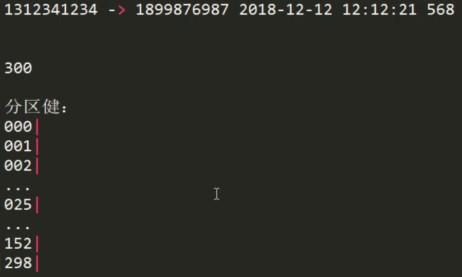
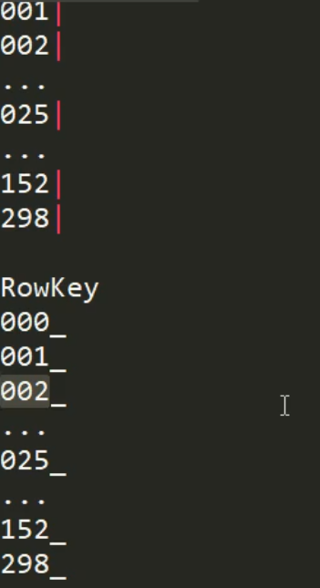
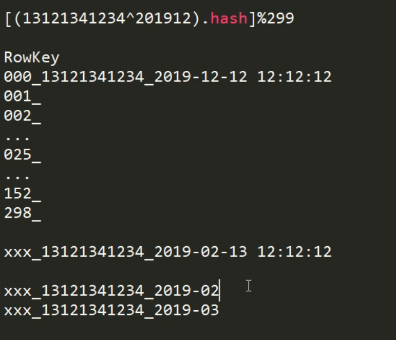
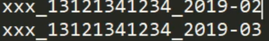

# HBase表的设计原则

## 预分区
每一个 region 维护着 StartRow 与 EndRow，如果加入的数据符合某个 Region 维护的RowKey 范围，则该数据交给这个 Region 维护。那么依照这个原则，我们可以将数据所要投放的分区提前大致的规划好，以提高 HBase 性能。

1．手动设定预分区

四个切分点，分成了5个分区
```
hbase> create 'staff1','info','partition1',SPLITS => ['1000','2000','3000','4000']
```

2．生成16进制序列预分区
```
create 'staff2','info','partition2',{NUMREGIONS => 15, SPLITALGO => 'HexStringSplit'}
```

3．按照文件中设置的规则预分区

创建splits.txt文件内容如下：
```
aaaa
bbbb
cccc
dddd
```
然后执行：
```
create 'staff3','partition3',SPLITS_FILE => 'splits.txt'
```

4．使用JavaAPI创建预分区
```java
//自定义算法，产生一系列Hash散列值存储在二维数组中
byte[][] splitKeys = 某个散列值函数
//创建HBaseAdmin实例
HBaseAdmin hAdmin = new HBaseAdmin(HBaseConfiguration.create());
//创建HTableDescriptor实例
HTableDescriptor tableDesc = new HTableDescriptor(tableName);
//通过HTableDescriptor实例和散列值二维数组创建带有预分区的HBase表
hAdmin.createTable(tableDesc, splitKeys);
```

## 列簇设计
追求的原则是：在合理范围内能尽量少的减少列簇就尽量减少列簇。

最优设计是：将所有相关性很强的 key-value 都放在同一个列簇下，这样既能做到查询效率 最高，也能保持尽可能少的访问不同的磁盘文件。

以用户信息为例，可以将必须的基本信息存放在一个列族，而一些附加的额外信息可以放在 另一列族。

## RowKey 设计
HBase 中，表会被划分为 1...n 个 Region，被托管在 RegionServer 中。Region 二个重要的 属性：StartKey 与 EndKey 表示这个 Region 维护的 rowKey 范围，当我们要读/写数据时，如 果 rowKey 落在某个 start-end key 范围内，那么就会定位到目标 region 并且读/写到相关的数 据

那怎么快速精准的定位到我们想要操作的数据，就在于我们的 rowkey 的设计了

一条数据的唯一标识就是rowkey，那么这条数据存储于哪个分区，取决于rowkey处于哪个一个预分区的区间内，设计rowkey的主要目的 ，就是让数据均匀的分布于所有的region中，在一定程度上防止数据倾斜。接下来我们就谈一谈rowkey常用的设计方案。

## Rowkey 设计三原则

###  1、 rowkey 长度原则
Rowkey 是一个二进制码流，Rowkey 的长度被很多开发者建议说设计在 10~100 个字节，不 过建议是越短越好，不要超过 16 个字节。

原因如下：

* 1、数据的持久化文件 HFile 中是按照 KeyValue 存储的，如果 Rowkey 过长比如 100 个字 节，1000 万列数据光 Rowkey 就要占用 100*1000 万=10 亿个字节，将近 1G 数据，这会极大 影响 HFile 的存储效率；    
* 2、MemStore 将缓存部分数据到内存，如果 Rowkey 字段过长内存的有效利用率会降低， 系统将无法缓存更多的数据，这会降低检索效率。因此 Rowkey 的字节长度越短越好。    
* 3、目前操作系统是都是 64 位系统，内存 8 字节对齐。控制在 16 个字节，8 字节的整数 倍利用操作系统的最佳特性。  

### 2、rowkey 散列原则
如果 Rowkey 是按时间戳的方式递增，不要将时间放在二进制码的前面，建议将 Rowkey 的高位作为散列字段，由程序循环生成，低位放时间字段，这样将提高数据均衡分布在每个 Regionserver 实现负载均衡的几率。如果没有散列字段，首字段直接是时间信息将产生所有 新数据都在一个 RegionServer 上堆积的热点现象，这样在做数据检索的时候负载将会集中 在个别 RegionServer，降低查询效率。

### rowkey 唯一原则
必须在设计上保证其唯一性。rowkey 是按照字典顺序排序存储的，因此，设计 rowkey 的时候，要充分利用这个排序的特点，将经常读取的数据存储到一块，将最近可能会被访问 的数据放到一块。

### 数据热点
HBase 中的行是按照 rowkey 的字典顺序排序的，这种设计优化了 scan 操作，可以将相 关的行以及会被一起读取的行存取在临近位置，便于 scan。然而糟糕的 rowkey 设计是热点 的源头。 热点发生在大量的 client 直接访问集群的一个或极少数个节点（访问可能是读， 写或者其他操作）。大量访问会使热点 region 所在的单个机器超出自身承受能力，引起性能 下降甚至 region 不可用，这也会影响同一个 RegionServer 上的其他 region，由于主机无法服 务其他 region 的请求。 设计良好的数据访问模式以使集群被充分，均衡的利用。 为了避免写热点，设计 rowkey 使得不同行在同一个 region，但是在更多数据情况下，数据 应该被写入集群的多个 region，而不是一个。

### 防止数据热点的有效措施

#### 加盐
这里所说的加盐不是密码学中的加盐，而是在 rowkey 的前面增加随机数，具体就是给 rowkey 分配一个随机前缀以使得它和之前的 rowkey 的开头不同。分配的前缀种类数量应该 和你想使用数据分散到不同的 region 的数量一致。加盐之后的 rowkey 就会根据随机生成的 前缀分散到各个 region 上，以避免热点。

#### 哈希
哈希会使同一行永远用一个前缀加盐。哈希也可以使负载分散到整个集群，但是读却是 可以预测的。使用确定的哈希可以让客户端重构完整的 rowkey，可以使用 get 操作准确获取 某一个行数据


#### 反转
第三种防止热点的方法是反转固定长度或者数字格式的 rowkey。这样可以使得 rowkey 中经常改变的部分（最没有意义的部分）放在前面。这样可以有效的随机 rowkey，但是牺 牲了 rowkey 的有序性。

反转 rowkey 的例子以手机号为 rowkey，可以将手机号反转后的字符串作为 rowkey，这 样的就避免了以手机号那样比较固定开头导致热点问题

#### 时间戳反转
一个常见的数据处理问题是快速获取数据的最近版本，使用反转的时间戳作为 rowkey 的一部分对这个问题十分有用，可以用 Long.Max_Value - timestamp 追加到 key 的末尾，例 如 [key][reverse_timestamp] , [key] 的最新值可以通过 scan [key]获得[key]的第一条记录，因 为 HBase 中 rowkey 是有序的，第一条记录是最后录入的数据。比如需要保存一个用户的操 作记录，按照操作时间倒序排序，在设计 rowkey 的时候，可以这样设计 [userId 反转][Long.Max_Value - timestamp]，在查询用户的所有操作记录数据的时候，直接指 定 反 转 后 的 userId ， startRow 是 [userId 反 转 ][000000000000],stopRow 是 [userId 反 转][Long.Max_Value - timestamp]

如果需要查询某段时间的操作记录，startRow 是[user 反转][Long.Max_Value - 起始时间]， stopRow 是[userId 反转][Long.Max_Value - 结束时间]


## 一个rowkey的设计例子
设计300个分区，分区键是'000|'、'001|'、'002|'...


rowkey的前缀是这样，保证一定落于对应的分区


分区号的计算采用（手机号+月时间）hash 取模的方式，保证同一个月的某一账户在一个分区，查询一月的数据比较常见。

rowkey = 分区号 + 账户 + 月时间 + 详细时间。保证一个月的数据在同一个分区，并且有序。


查询某个账户一个月的数据只需这样(数据在同一个分区)：


查询某个账户一年的数据也只需查询12次而已。

