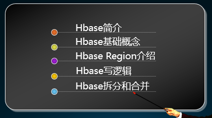
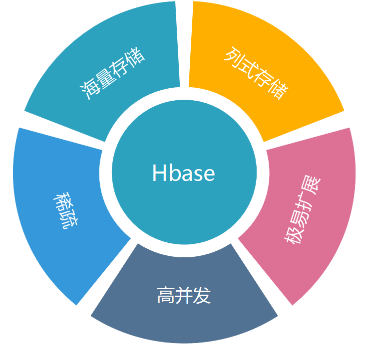
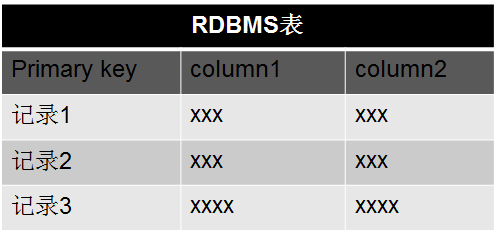
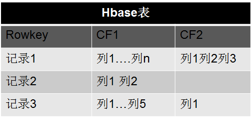
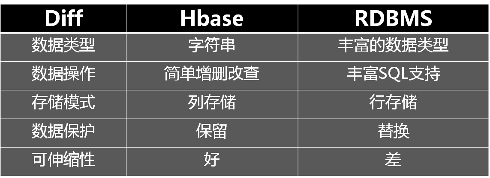
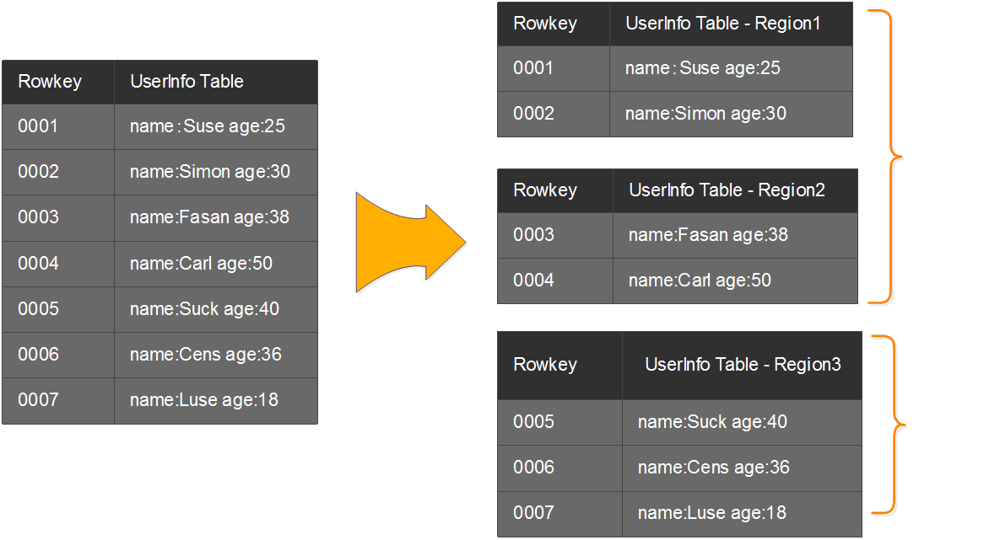
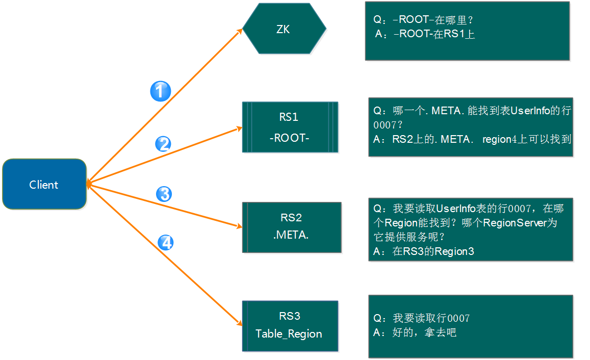
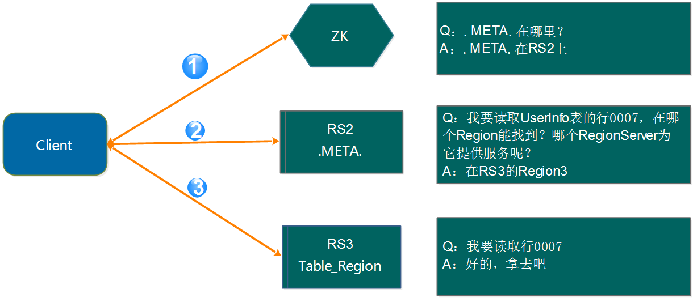
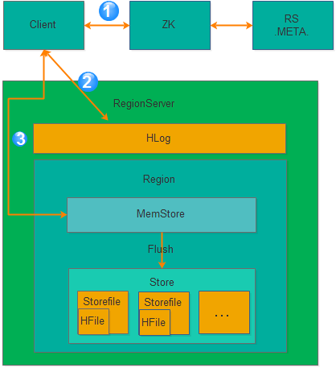

[toc]

# Hbase 技术细节笔记（上）
摘抄自：`https://cloud.tencent.com/developer/article/1006043`

## 前言

最近在跟进Hbase的相关工作，由于之前对Hbase并不怎么了解，因此系统地学习了下Hbase，为了加深对Hbase的理解，对相关知识点做了笔记，并在组内进行了Hbase相关技术的分享，由于Hbase涵盖的内容比较多，因此计划分享2期，下面就是针对第一期Hbase技术分享整体而成，第一期的主要内容如下:

一、Hbase介绍
二、Hbase的Region介绍
三、Hbase的写逻辑介绍
四、Hbase的故障恢复
五、Hbase的拆分和合并

如下ppt所示：

下面就来针对各个部分的内容来进行详细的介绍：

## 一、Hbase介绍

### 1、Hbase简介

Hbase是Hadoop Database的简称 ，Hbase项目是由Powerset公司的Chad Walters和Jim Kelleman在2006年末发起，根据Google的Chang等人发表的论文“Bigtable：A Distributed Storage System for Strctured Data“来设计的。2007年10月发布了第一个版本。2010年5月，Hbase从Hadoop子项目升级成Apache顶级项目。

Hbase是分布式、面向列的开源数据库（其实准确的说是面向列族）。HDFS为Hbase提供可靠的底层数据存储服务，MapReduce为Hbase提供高性能的计算能力，Zookeeper为Hbase提供稳定服务和Failover机制，因此我们说Hbase是一个通过大量廉价的机器解决海量数据的高速存储和读取的分布式数据库解决方案。

### 2、Hbase几个特点介绍

提炼出Hbase的几个特点，如下图所示：

**2.1、海量存储**

Hbase适合存储PB级别的海量数据，在PB级别的数据以及采用廉价PC存储的情况下，能在几十到百毫秒内返回数据。这与Hbase的极易扩展性息息相关。正式因为Hbase良好的扩展性，才为海量数据的存储提供了便利。

**2.2、列式存储**

这里的列式存储其实说的是列族存储，Hbase是根据列族来存储数据的。列族下面可以有非常多的列，**列族在创建表的时候就必须指定**。为了加深对Hbase列族的理解，下面是一个简单的[关系型数据库](https://cloud.tencent.com/product/cdb-overview?from=10680 "关系型数据库")的表和Hbase数据库的表：

RDBMS的表：

Hbase的表：

下图是针对Hbase和关系型数据库的基本的一个比较：

**2.3、极易扩展**

Hbase的扩展性主要体现在两个方面，一个是基于上层处理能力（RegionServer）的扩展，一个是基于存储的扩展（HDFS）。
通过横向添加RegionSever的机器，进行水平扩展，提升Hbase上层的处理能力，提升Hbsae服务更多Region的能力。

备注：RegionServer的作用是管理region、承接业务的访问，这个后面会详细的介绍通过横向添加Datanode的机器，进行存储层扩容，提升Hbase的数据存储能力和提升后端存储的读写能力。

**2.4、高并发**

由于目前大部分使用Hbase的架构，都是采用的廉价PC，因此单个IO的延迟其实并不小，一般在几十到上百ms之间。这里说的高并发，主要是在并发的情况下，Hbase的单个IO延迟下降并不多。能获得高并发、低延迟的服务。

**2.5、稀疏**

稀疏主要是针对Hbase列的灵活性，在列族中，你可以指定任意多的列，在列数据为空的情况下，是不会占用存储空间的。

### 3、Hbase的几个概念介绍

在我学习Hbase的时候有几个概念需要重点理解一下，列出4个基础概念如下图所示：

**3.1、Column Family的概念**

Column Family又叫列族，Hbase通过列族划分数据的存储，列族下面可以包含任意多的列，实现灵活的数据存取。刚接触的时候，理解起来有点吃力。我想到了一个非常类似的概念，理解起来就非常容易了。**那就是家族的概念，我们知道一个家族是由于很多个的家庭组成的。列族也类似，列族是由一个一个的列组成（任意多）**。

**Hbase表的创建的时候就必须指定列族。就像关系型数据库创建的时候必须指定具体的列是一样的。**

**Hbase的列族不是越多越好，官方推荐的是列族最好小于或者等于3。我们使用的场景一般是1个列族**。

**3.2、Rowkey的概念**

Rowkey的概念和mysql中的主键是完全一样的，Hbase使用Rowkey来唯一的区分某一行的数据。

由于Hbase**只支持3中查询方式**：

* **基于Rowkey的单行查询**    
* **基于Rowkey的范围扫描**    
* **全表扫描**

因此，Rowkey对Hbase的性能影响非常大，Rowkey的设计就显得尤为的重要。设计的时候要兼顾基于Rowkey的单行查询也要键入Rowkey的范围扫描。具体Rowkey要如何设计后续会整理相关的文章做进一步的描述。这里大家只要有一个概念就是Rowkey的设计极为重要。

**3.3、Region的概念**

Region的概念和关系型数据库的分区或者分片差不多。
Hbase会将一个大表的数据基于Rowkey的不同范围分配到不通的Region中，每个Region负责一定范围的数据访问和存储。这样即使是一张巨大的表，由于被切割到不通的region，访问起来的时延也很低。

**3.4、TimeStamp的概念**

TimeStamp对Hbase来说至关重要，因为它是实现Hbase多版本的关键。在Hbase中使用不同的timestame来标识相同rowkey行对应的不通版本的数据。

在写入数据的时候，如果用户没有指定对应的timestamp，Hbase会自动添加一个timestamp，timestamp和服务器时间保持一致。
在Hbase中，相同rowkey的数据按照timestamp倒序排列。默认查询的是最新的版本，用户可同指定timestamp的值来读取旧版本的数据。

### 4、Hbase的架构

Hbase的架构图如下图所示：

从图中可以看出Hbase是由Client、Zookeeper、Master、HRegionServer、HDFS等几个组建组成，下面来介绍一下几个组建的相关功能：

**4.1、Client**

Client包含了访问Hbase的接口，另外Client还维护了对应的cache来加速Hbase的访问，比如cache的.META.元数据的信息。

**4.2、Zookeeper**

Hbase通过Zookeeper来做master的高可用、RegionServer的监控、元数据的入口以及集群配置的维护等工作。具体工作如下：

通过Zoopkeeper来保证集群中只有1个master在运行，如果master异常，会通过竞争机制产生新的master提供服务

通过Zoopkeeper来监控RegionServer的状态，当RegionSevrer有异常的时候，通过回调的形式通知Master RegionServer上下限的信息

通过Zoopkeeper存储元数据的统一入口地址

**4.3、Hmaster**

master节点的主要职责如下：
为RegionServer分配Region
维护整个集群的[负载均衡](https://cloud.tencent.com/product/clb?from=10680 "负载均衡")维护集群的元数据信息
发现失效的Region，并将失效的Region分配到正常的RegionServer上
当RegionSever失效的时候，协调对应Hlog的拆分

**4.4、HregionServer**

HregionServer直接对接用户的读写请求，是真正的“干活”的节点。它的功能概括如下：
管理master为其分配的Region
处理来自客户端的读写请求
负责和底层HDFS的交互，存储数据到HDFS
负责Region变大以后的拆分
负责Storefile的合并工作

**4.5、HDFS**

HDFS为Hbase提供最终的底层数据存储服务，同时为Hbase提供高可用（Hlog存储在HDFS）的支持，具体功能概括如下：
提供元数据和表数据的底层分布式存储服务
数据多副本，保证的高可靠和高可用性

### 5、Hbase的使用场景

Hbase是一个通过廉价PC机器集群来存储海量数据的分布式数据库解决方案。它比较适合的场景概括如下：

* 数据量大（百T、PB级别）    
* 查询简单（基于rowkey或者rowkey范围查询）    
* 不涉及到复杂的关联

有几个典型的场景特别适合使用Hbase来存储：
海量订单流水数据（长久保存）
交易记录
数据库历史数据

## 二、Hbase的Region介绍

前面已经介绍了Region类似于数据库的分片和分区的概念，每个Region负责一小部分Rowkey范围的数据的读写和维护，Region包含了对应的起始行到结束行的所有信息。master将对应的region分配给不同的RergionServer，由RegionSever来提供Region的读写服务和相关的管理工作。这部分主要介绍Region实例以及Rgeion的寻找路径：

### 1、region实例

上图模拟了一个Hbase的表是如何拆分成region，以及分配到不同的RegionServer中去。上面是1个Userinfo表，里面有7条记录，其中rowkey为0001到0002的记录被分配到了Region1上，Rowkey为0003到0004的记录被分配到了Region2上，而rowkey为0005、0006和0007的记录则被分配到了Region3上。region1和region2被master分配给了RegionServer1（RS1），Region3被master配分给了RegionServer2（RS2）

备注：这里只是为了更容易的说明拆分的规则，其实真实的场景并不会几条记录拆分到不通的Region上，而是到一定的数据量才会拆分，具体的在Region的拆分那部分再具体的介绍。

### 2、Region的寻址

既然读写都在RegionServer上发生，我们前面有讲到，每个RegionSever为一定数量的region服务，那么client要对某一行数据做读写的时候如何能知道具体要去访问哪个RegionServer呢？那就是接下来我们要讨论的问题

**2.1、老的Region寻址方式**

在Hbase 0.96版本以前，Hbase有两个特殊的表，分别是-ROOT-表和.META.表，其中-ROOT-的位置存储在ZooKeeper中，-ROOT-本身存储了 .META. Table的RegionInfo信息，并且-ROOT-不会分裂，只有一个region。而.META.表可以被切分成多个region。读取的流程如下图所示：

第1步：client请求ZK获得-ROOT-所在的RegionServer地址

第2步：client请求-ROOT-所在的RS地址，获取.META.表的地址，client会将-ROOT-的相关信息cache下来，以便下一次快速访问

第3步：client请求 .META.表的RS地址，获取访问数据所在RegionServer的地址，client会将.META.的相关信息cache下来，以便下一次快速访问

第4步：client请求访问数据所在RegionServer的地址，获取对应的数据

从上面的路径我们可以看出，用户需要3次请求才能直到用户Table真正的位置，这在一定程序带来了性能的下降。在0.96之前使用3层设计的主要原因是考虑到元数据可能需要很大。但是真正集群运行，元数据的大小其实很容易计算出来。在BigTable的论文中，每行METADATA数据存储大小为1KB左右，如果按照一个Region为128M的计算，3层设计可以支持的Region个数为2^34个，采用2层设计可以支持2^17（131072）。那么2层设计的情况下一个 集群可以存储4P的数据。这仅仅是一个Region只有128M的情况下。如果是10G呢? 因此，通过计算，其实2层设计就可以满足集群的需求。因此在0.96版本以后就去掉了-ROOT-表了。

**2.2、新的Region寻址方式**

如上面的计算，2层结构其实完全能满足业务的需求，因此0.96版本以后将-ROOT-表去掉了。如下图所示：

访问路径变成了3步：

第1步：Client请求ZK获取.META.所在的RegionServer的地址。

第2步：Client请求.META.所在的RegionServer获取访问数据所在的RegionServer地址，client会将.META.的相关信息cache下来，以便下一次快速访问。

第3步：Client请求数据所在的RegionServer，获取所需要的数据。

总结去掉-ROOT-的原因有如下2点：

其一：提高性能
其二：2层结构已经足以满足集群的需求

这里还有一个问题需要说明，那就是Client会缓存.META.的数据，用来加快访问，既然有缓存，那它什么时候更新？如果.META.更新了，比如Region1不在RerverServer2上了，被转移到了RerverServer3上。client的缓存没有更新会有什么情况？
其实，Client的元数据缓存不更新，当.META.的数据发生更新。如上面的例子，由于Region1的位置发生了变化，Client再次根据缓存去访问的时候，会出现错误，当出现异常达到重试次数后就会去.META.所在的RegionServer获取最新的数据，如果.META.所在的RegionServer也变了，Client就会去ZK上获取.META.所在的RegionServer的最新地址。

## 三、Hbase的写逻辑

Hbase的写逻辑涉及到写内存、写log、刷盘等操作，看起来简单，其实里面又有很多的逻辑，下面就来做详细的介绍

### 1、Hbase写入逻辑

Hbase的写入流程如下图所示：

从上图可以看出氛围3步骤：

第1步：Client获取数据写入的Region所在的RegionServer
第2步：请求写Hlog
第3步：请求写MemStore

只有当写Hlog和写MemStore都成功了才算请求写入完成。MemStore后续会逐渐刷到HDFS中。

备注：Hlog存储在HDFS，当RegionServer出现异常，需要使用Hlog来恢复数据。

### 2、MemStore刷盘

为了提高Hbase的写入性能，当写请求写入MemStore后，不会立即刷盘。而是会等到一定的时候进行刷盘的操作。具体是哪些场景会触发刷盘的操作呢？总结成如下的几个场景：

**2.1、全局内存控制**

这个全局的参数是控制内存整体的使用情况，当所有memstore占整个heap的最大比例的时候，会触发刷盘的操作。这个参数是hbase.regionserver.global.memstore.upperLimit，默认为整个heap内存的40%。但这并不意味着全局内存触发的刷盘操作会将所有的MemStore都进行输盘，而是通过另外一个参数hbase.regionserver.global.memstore.lowerLimit来控制，默认是整个heap内存的35%。当flush到所有memstore占整个heap内存的比率为35%的时候，就停止刷盘。这么做主要是为了减少刷盘对业务带来的影响，实现平滑系统负载的目的。

**2.2、MemStore达到上限**

当MemStore的大小达到hbase.hregion.memstore.flush.size大小的时候会触发刷盘，默认128M大小

**2.3、RegionServer的Hlog数量达到上限**

前面说到Hlog为了保证Hbase数据的一致性，那么如果Hlog太多的话，会导致故障恢复的时间太长，因此Hbase会对Hlog的最大个数做限制。当达到Hlog的最大个数的时候，会强制刷盘。这个参数是hase.regionserver.max.logs，默认是32个。

**2.4、手工触发**

可以通过hbase shell或者java api手工触发flush的操作。

**2.5、关闭RegionServer触发**

在正常关闭RegionServer会触发刷盘的操作，全部数据刷盘后就不需要再使用Hlog恢复数据。

**2.6、Region使用HLOG恢复完数据后触发**

当RegionServer出现故障的时候，其上面的Region会迁移到其他正常的RegionServer上，在恢复完Region的数据后，会触发刷盘，当刷盘完成后才会提供给业务访问。

### 3、Hlog

**3.1、Hlog简介**

Hlog是Hbase实现WAL（Write ahead log）方式产生的日志信息，内部是一个简单的顺序日志。每个RegionServer对应1个Hlog(备注：1.x版本的可以开启MultiWAL功能，允许多个Hlog)，所有对于该RegionServer的写入都被记录到Hlog中。Hlog实现的功能就是我们前面讲到的保证[数据安全](https://cloud.tencent.com/solution/data_protection?from=10680 "数据安全")。当RegionServer出现问题的时候，能跟进Hlog来做数据恢复。此外为了保证恢复的效率，Hbase会限制最大保存的Hlog数量，如果达到Hlog的最大个数（hase.regionserver.max.logs参数控制）的时候，就会触发强制刷盘操作。对于已经刷盘的数据，其对应的Hlog会有一个过期的概念，Hlog过期后，会被监控线程移动到 .oldlogs，然后会被自动删除掉。

Hbase是如何判断Hlog过期的呢？要找到这个答案，我们就必须了解Hlog的详细结构。

**3.2、Hlog结构**

下图是Hlog的详细结构（图片来源[http://hbasefly.com/](http://hbasefly.com/ "http://hbasefly.com/")）：

从上图我们可以看出多个Region共享一个Hlog文件，单个Region在Hlog中是按照时间顺序存储的，但是多个Region可能并不是完全按照时间顺序。

每个Hlog最小单元由Hlogkey和WALEdit两部分组成。Hlogky由sequenceid、timestamp、cluster ids、regionname以及tablename等组成，WALEdit是由一系列的KeyValue组成，对一行上所有列（即所有KeyValue）的更新操作，都包含在同一个WALEdit对象中，这主要是为了实现写入一行多个列时的原子性。

注意，图中有个sequenceid的东东。sequenceid是一个store级别的自增序列号，这东东非常重要，region的数据恢复和Hlog过期清除都要依赖这个东东。下面就来简单描述一下sequenceid的相关逻辑。

* Memstore在达到一定的条件会触发刷盘的操作，刷盘的时候会获取刷新到最新的一个sequenceid的下一个sequenceid，并将新的sequenceid赋给oldestUnflushedSequenceId，并刷到Ffile中。有点绕，举个例子来说明：比如对于某一个store，开始的时候oldestUnflushedSequenceId为NULL，此时，如果触发flush的操作，假设初始刷盘到sequenceid为10，那么hbase会在10的基础上append一个空的Entry到HLog，最新的sequenceid为11，然后将sequenceid为11的号赋给oldestUnflushedSequenceId，并将oldestUnflushedSequenceId的值刷到Hfile文件中进行持久化。    
* Hlog文件对应所有Region的store中最大的sequenceid如果已经刷盘，就认为Hlog文件已经过期，就会移动到.oldlogs，等待被移除。    
* 当RegionServer出现故障的时候，需要对Hlog进行回放来恢复数据。回放的时候会读取Hfile的oldestUnflushedSequenceId中的sequenceid和Hlog中的sequenceid进行比较，小于sequenceid的就直接忽略，但与或者等于的就进行重做。回放完成后，就完成了数据的恢复工作。

**3.3、Hlog的生命周期**

Hlog从产生到最后删除需要经历如下几个过程：

* **产生**
所有涉及到数据的变更都会先写Hlog，除非是你关闭了Hlog    
* **滚动**
Hlog的大小通过参数hbase.regionserver.logroll.period控制，默认是1个小时，时间达到hbase.regionserver.logroll.period 设置的时间，Hbase会创建一个新的Hlog文件。这就实现了Hlog滚动的目的。Hbase通过hbase.regionserver.maxlogs参数控制Hlog的个数。滚动的目的，为了控制单个Hlog文件过大的情况，方便后续的过期和删除。    
* **过期**
前面我们有讲到sequenceid这个东东，Hlog的过期依赖于对sequenceid的判断。Hbase会将Hlog的sequenceid和Hfile最大的sequenceid（刷新到的最新位置）进行比较，如果该Hlog文件中的sequenceid比刷新的最新位置的sequenceid都要小，那么这个Hlog就过期了，过期了以后，对应Hlog会被移动到.oldlogs目录。
这里有个问题，为什么要将过期的Hlog移动到.oldlogs目录，而不是直接删除呢？
答案是因为Hbase还有一个主从同步的功能，这个依赖Hlog来同步Hbase的变更，有一种情况不能删除Hlog，那就是Hlog虽然过期，但是对应的Hlog并没有同步完成，因此比较好的做好是移动到别的目录。再增加对应的检查和保留时间。    
* **删除**
如果Hbase开启了replication，当replication执行完一个Hlog的时候，会删除Zoopkeeper上的对应Hlog节点。在Hlog被移动到.oldlogs目录后，Hbase每隔hbase.master.cleaner.interval（默认60秒）时间会去检查.oldlogs目录下的所有Hlog，确认对应的Zookeeper的Hlog节点是否被删除，如果Zookeeper 上不存在对应的Hlog节点，那么就直接删除对应的Hlog。
hbase.master.logcleaner.ttl（默认10分钟）这个参数设置Hlog在.oldlogs目录保留的最长时间。

**更多相关内容详见：**[Hbase 技术细节笔记（下）](https://www.qcloud.com/community/article/434951 "Hbase 技术细节笔记（下）")

