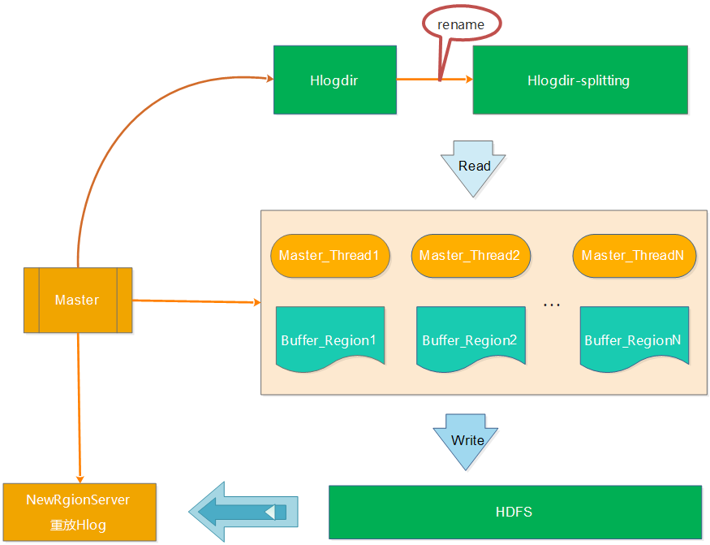

[toc]

# Hbase 技术细节笔记（上）
摘抄自：`https://cloud.tencent.com/developer/article/1006044`

**上篇：**[Hbase 技术细节笔记（上）](https://www.qcloud.com/community/article/761242 "Hbase 技术细节笔记（上）")

## 四、RegionServer的故障恢复

我们知道，RegionServer的相关信息保存在ZK中，在RegionServer启动的时候，会在Zookeeper中创建对应的临时节点。RegionServer通过Socket和Zookeeper建立session会话，RegionServer会周期性地向Zookeeper发送ping消息包，以此说明自己还处于存活状态。而Zookeeper收到ping包后，则会更新对应session的超时时间。

当Zookeeper超过session超时时间还未收到RegionServer的ping包，则Zookeeper会认为该RegionServer出现故障，ZK会将该RegionServer对应的临时节点删除，并通知Master，Master收到RegionServer挂掉的信息后就会启动数据恢复的流程。

Master启动数据恢复流程后，其实主要的流程如下：

RegionServer宕机---》ZK检测到RegionServer异常---》Master启动数据恢复---》Hlog切分---》Region重新分配---》Hlog重放---》恢复完成并提供服务

故障恢复有3中模式，下面就一一来介绍。

### 1、LogSplitting

在最开始的恢复流程中，Hlog的整个切分过程都由于Master来执行，如下图所示：

a、将待切分的日志文件夹进行重命名，防止RegionServer未真的宕机而持续写入Hlog
b、Master启动读取线程读取Hlog的数据，并将不同RegionServer的日志写入到不通的内存buffer中
c、针对每个buffer，Master会启动对应的写线程将不同Region的buffer数据写入到HDFS中，对应的路径为/hbase/table_name/region/recoverd.edits/.tmp。
d、Master重新将宕机的RegionServer中的Rgion分配到正常的RegionServer中，对应的RegionServer读取Region的数据，会发现该region目录下的recoverd.edits目录以及相关的日志，然后RegionServer重放对应的Hlog日志，从而实现对应Region数据的恢复。
从上面的步骤中，我们可以看出Hlog的切分一直都是master在干活，效率比较低。设想，如果集群中有多台RegionServer在同一时间宕机，会是什么情况？串行修复，肯定异常慢，因为只有master一个人在干Hlog切分的活。因此，为了提高效率，开发了Distributed Log Splitting架构。

### 2、Distributed Log Splitting

顾名思义，Distributed Log Splitting是LogSplitting的分布式实现，分布式就不是master一个人在干活了，而是充分使用各个RegionServer上的资源，利用多个RegionServer来并行切分Hlog，提高切分的效率。如下图所示：

上图的操作顺序如下：

a、Master将要切分的日志发布到Zookeeper节点上（/hbase/splitWAL），每个Hlog日志一个任务，任务的初始状态为TASK_UNASSIGNED
b、在Master发布Hlog任务后，RegionServer会采用竞争方式认领对应的任务（先查看任务的状态，如果是TASK_UNASSIGNED，就将该任务状态修改为TASK_OWNED）
c、RegionServer取得任务后会让对应的HLogSplitter线程处理Hlog的切分，切分的时候读取出Hlog的对，然后写入不通的Region buffer的内存中。
d、RegionServer启动对应写线程，将Region buffer的数据写入到HDFS中，路径为/hbase/table/region/seqenceid.temp，seqenceid是一个日志中该Region对应的最大sequenceid，如果日志切分成功，而RegionServer会将对应的ZK节点的任务修改为TASK_DONE，如果切分失败，则会将任务修改为TASK_ERR。
e、如果任务是TASK_ERR状态，则Master会重新发布该任务，继续由RegionServer竞争任务，并做切分处理。
f、Master重新将宕机的RegionServer中的Rgion分配到正常的RegionServer中，对应的RegionServer读取Region的数据，将该region目录下的一系列的seqenceid.temp进行从小到大进行重放，从而实现对应Region数据的恢复。

从上面的步骤中，我们可以看出Distributed Log Splitting采用分布式的方式，使用多台RegionServer做Hlog的切分工作，确实能提高效率。正常故障恢复可以降低到分钟级别。但是这种方式有个弊端是会产生很多小文件（切分的Hlog数宕机的RegionServer上的Region数）。比如一个RegionServer有20个Region，有50个Hlog，那么产生的小文件数量为2050=1000个。如果集群中有多台RegionServer宕机的情况，小文件更是会成倍增加，恢复的过程还是会比较慢。由次诞生了Distributed Log Replay模式。

### 3、Distributed Log Replay

Distributed Log Replay和Distributed Log Splitting的不同是先将宕机RegionServer上的Region分配给正常的RgionServer，并将该Region标记为recovering。再使用Distributed Log Splitting类似的方式进行Hlog切分，不同的是，RegionServer将Hlog切分到对应Region buffer后，并不写HDFS，而是直接进行重放。这样可以减少将大量的文件写入HDFS中，大大减少了HDFS的IO消耗。如下图所示：

## 五、Region的拆分

### 1、Hbase Region的三种拆分策略

Hbase Region的拆分策略有比较多，比如除了3种默认过的策略，还有DelimitedKeyPrefixRegionSplitPolicy、KeyPrefixRegionSplitPolicy、DisableSplitPolicy等策略，这里只介绍3种默认的策略。分别是ConstantSizeRegionSplitPolicy策略、IncreasingToUpperBoundRegionSplitPolicy策略和SteppingSplitPolicy策略。

**1.1、ConstantSizeRegionSplitPolicy**

ConstantSizeRegionSplitPolicy策略是0.94版本之前的默认拆分策略，这个策略的拆分规则是：当region大小达到hbase.hregion.max.filesize（默认10G）后拆分。
这种拆分策略对于小表不太友好，按照默认的设置，如果1个表的Hfile小于10G就一直不会拆分。注意10G是压缩后的大小，如果使用了压缩的话。

如果1个表一直不拆分，访问量小也不会有问题，但是如果这个表访问量比较大的话，就比较容易出现性能问题。这个时候只能手工进行拆分。还是很不方便。

**2.1.2、IncreasingToUpperBoundRegionSplitPolicy**

IncreasingToUpperBoundRegionSplitPolicy策略是Hbase的0.94~2.0版本默认的拆分策略，这个策略相较于ConstantSizeRegionSplitPolicy策略做了一些优化，该策略的算法为：min(r^2*flushSize，maxFileSize )，最大为maxFileSize 。

从这个算是我们可以得出flushsize为128M、maxFileSize为10G的情况下，可以计算出Region的分裂情况如下：
第一次拆分大小为：min(10G，11128M)=128M
第二次拆分大小为：min(10G，33128M)=1152M
第三次拆分大小为：min(10G，55128M)=3200M
第四次拆分大小为：min(10G，77128M)=6272M
第五次拆分大小为：min(10G，99128M)=10G
第五次拆分大小为：min(10G，1111128M)=10G

从上面的计算我们可以看到这种策略能够自适应大表和小表，但是这种策略会导致小表产生比较多的小region，对于小表还是不是很完美。

**1.3、SteppingSplitPolicy**

SteppingSplitPolicy是在Hbase 2.0版本后的默认策略，，拆分规则为：If region=1 then: flush size * 2 else: MaxRegionFileSize。

还是以flushsize为128M、maxFileSize为10场景为列，计算出Region的分裂情况如下：
第一次拆分大小为：2*128M=256M
第二次拆分大小为：10G

从上面的计算我们可以看出，这种策略兼顾了ConstantSizeRegionSplitPolicy策略和IncreasingToUpperBoundRegionSplitPolicy策略，对于小表也肯呢个比较好的适配。

### 2、Hbase Region拆分的详细流程

Hbase的详细拆分流程图如下：

备注图片来源（[https://zh.hortonworks.com/blog/apache-hbase-region-splitting-and-merging/](https://zh.hortonworks.com/blog/apache-hbase-region-splitting-and-merging/ "https://zh.hortonworks.com/blog/apache-hbase-region-splitting-and-merging/")）

从上图我们可以看出Region切分的详细流程如下：

第1步会ZK的/hbase/region-in-transition/region-name下创建一个znode，并设置状态为SPLITTING

第2步master通过watch节点检测到Region状态的变化，并修改内存中Region状态的变化

第3步RegionServer在父Region的目录下创建一个名称为.splits的子目录

第4步RegionServer关闭父Region，强制将数据刷新到磁盘，并这个Region标记为offline的状态。此时，落到这个Region的请求都会返回NotServingRegionException这个错误

第5步RegionServer在.splits创建daughterA和daughterB，并在文件夹中创建对应的reference文件，指向父Region的Region文件

第6步RegionServer在HDFS中创建daughterA和daughterB的Region目录，并将reference文件移动到对应的Region目录中

第7步在.META.表中设置父Region为offline状态，不再提供服务，并将父Region的daughterA和daughterB的Region添加到.META.表中，已表名父Region被拆分成了daughterA和daughterB两个Region

第8步RegionServer并行开启两个子Region，并正式提供对外写服务

第9步RegionSever将daughterA和daughterB添加到.META.表中，这样就可以从.META.找到子Region，并可以对子Region进行访问了

第10步RegionServr修改/hbase/region-in-transition/region-name的znode的状态为SPLIT

备注：为了减少对业务的影响，Region的拆分并不涉及到数据迁移的操作，而只是创建了对父Region的指向。只有在做大合并的时候，才会将数据进行迁移。

那么通过reference文件如何才能查找到对应的数据呢？如下图所示：

* 根据文件名来判断是否是reference文件    
* 由于reference文件的命名规则为前半部分为父Region对应的File的文件名，后半部分是父Region的名称，因此读取的时候也根据前半部分和后半部分来识别    
* 根据reference文件的内容来确定扫描的范围，reference的内容包含两部分，一部分是切分点splitkey，另一部分是boolean类型的变量（true或者false）。如果为true则扫描文件的上半部分，false则扫描文件的下半部分    
* 接下来确定了扫描的文件，以及文件的扫描范围，那就按照正常的文件检索了

## 六、Region的合并

Region的合并分为小合并和大合并，下面就分别来做介绍：

### 1、小合并（MinorCompaction）

由前面的刷盘部分的介绍，我们知道当MemStore达到hbase.hregion.memstore.flush.size大小的时候会将数据刷到磁盘，生产StoreFile，因此势必产生很多的小问题，对于Hbase的读取，如果要扫描大量的小文件，会导致性能很差，因此需要将这些小文件合并成大一点的文件。因此所谓的小合并，就是把多个小的StoreFile组合在一起，形成一个较大的StoreFile，通常是累积到3个Store File后执行。通过参数hbase.hstore,compactionThreadhold配置。小合并的大致步骤为：

* 分别读取出待合并的StoreFile文件的KeyValues，并顺序地写入到位于./tmp目录下的临时文件中    
* 将临时文件移动到对应的Region目录中    
* 将合并的输入文件路径和输出路径封装成KeyValues写入WAL日志，并打上compaction标记，最后强制自行sync    
* 将对应region数据目录下的合并的输入文件全部删除，合并完成

这种小合并一般速度很快，对业务的影响也比较小。本质上，小合并就是使用短时间的IO消耗以及带宽消耗换取后续查询的低延迟。

### 2、大合并（MajorCompaction）

所谓的大合并，就是将一个Region下的所有StoreFile合并成一个StoreFile文件，在大合并的过程中，之前删除的行和过期的版本都会被删除，拆分的母Region的数据也会迁移到拆分后的子Region上。大合并一般一周做一次，控制参数为hbase.hregion.majorcompaction。大合并的影响一般比较大，尽量避免统一时间多个Region进行合并，因此Hbase通过一些参数来进行控制，用于防止多个Region同时进行大合并。该参数为： hbase.hregion.majorcompaction.jitter
具体算法为：

hbase.hregion.majorcompaction参数的值乘于一个随机分数，这个随机分数不能超过hbase.hregion.majorcompaction.jitter的值。hbase.hregion.majorcompaction.jitter的值默认为0.5。
通过hbase.hregion.majorcompaction参数的值加上或减去hbase.hregion.majorcompaction参数的值乘于一个随机分数的值就确定下一次大合并的时间区间。

用户如果想禁用major compaction，只需要将参数hbase.hregion.majorcompaction设为0。建议禁用。

七、参考资料
参考了很多前人的资料，尤其是[http://hbasefly.com](http://hbasefly.com/ "http://hbasefly.com")，博客写得很棒，罗列如下：[http://hbase.apache.org/](http://hbase.apache.org/ "http://hbase.apache.org/")[https://zh.hortonworks.com/blog/apache-hbase-region-splitting-and-merging/](https://zh.hortonworks.com/blog/apache-hbase-region-splitting-and-merging/ "https://zh.hortonworks.com/blog/apache-hbase-region-splitting-and-merging/")[http://blog.csdn.net/u011490320/article/details/50814967](http://blog.csdn.net/u011490320/article/details/50814967 "http://blog.csdn.net/u011490320/article/details/50814967")[http://hbasefly.com/2016/12/21/hbase-getorscan/](http://hbasefly.com/2016/12/21/hbase-getorscan/ "http://hbasefly.com/2016/12/21/hbase-getorscan/")[http://blog.csdn.net/xgjianstart/article/details/53290155](http://blog.csdn.net/xgjianstart/article/details/53290155 "http://blog.csdn.net/xgjianstart/article/details/53290155")[http://blog.csdn.net/weihongrao/article/details/17281991](http://blog.csdn.net/weihongrao/article/details/17281991 "http://blog.csdn.net/weihongrao/article/details/17281991")[http://www.aboutyun.com/thread-20207-1-1.html](http://www.aboutyun.com/thread-20207-1-1.html "http://www.aboutyun.com/thread-20207-1-1.html")[http://hbasefly.com/2017/08/27/hbase-split/](http://hbasefly.com/2017/08/27/hbase-split/ "http://hbasefly.com/2017/08/27/hbase-split/")[http://blog.csdn.net/weihongrao/article/details/17281991](http://blog.csdn.net/weihongrao/article/details/17281991 "http://blog.csdn.net/weihongrao/article/details/17281991")[http://blog.csdn.net/gaijianwei/article/details/46271011](http://blog.csdn.net/gaijianwei/article/details/46271011 "http://blog.csdn.net/gaijianwei/article/details/46271011")[http://blog.csdn.net/u010270403/article/details/51648462](http://blog.csdn.net/u010270403/article/details/51648462 "http://blog.csdn.net/u010270403/article/details/51648462")

