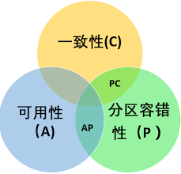

# 一文搞懂HBase的基本原理
摘抄自：`https://www.cnblogs.com/jmx-bigdata/p/13708843.html`

6本文会对HBase的基本原理进行剖析，通过本文你可以了解到：


* CAP理论    
* NoSQL出现的原因    
* HBase的特点及使用场景    
* HBase的数据模型和基本原理    
* 客户端API的基本使用    
* 易混淆知识点面试总结


`温馨提示`:本文内容较长，如果觉得有用，建议收藏。另外记得分享、点赞、在看，素质三连哦！


## 从BigTable说起


HBase是在谷歌BigTable的基础之上进行开源实现的，是一个高可靠、高性能、面向列、可伸缩的分布式数据库，可以用来存储非结构化和半结构化的稀疏数据。HBase支持超大规模数据存储，可以通过水平扩展的方式处理超过10亿行数据和百万列元素组成的数据表。


BigTable是一个分布式存储系统，利用谷歌提出的MapReduce分布式并行计算模型来处理海量数据，使用谷歌分布式文件系统GFS作为底层的数据存储，并采用Chubby提供协同服务管理，具备广泛的应用型、可扩展性、高可用性及高性能性等特点。关于BigTable与HBase的对比，见下表：


| 依赖 | BigTbale | HBase |
| --| --| -- |
| 数据存储 | GFS | HDFS |
| 数据处理 | MapReduce | Hadoop的MapReduce |
| 协同服务 | Chubby | Zookeeper |


## CAP理论


2000年，Berkerly大学有位Eric Brewer教授提出了一个CAP理论，在2002年，麻省理工学院的`Seth Gilbert(赛斯·吉尔伯特)`和`Nancy Lynch(南希·林奇)`发表了布鲁尔猜想的证明，证明了CAP理论的正确性。所谓CAP理论，是指对于一个分布式计算系统来说，不可能同时满足以下三点：


* 一致性（**C**onsistency）等同于所有节点访问同一份最新的数据副本。即任何一个读操作总是能够读到之前完成的写操作的结果，也就是说，在分布式环境中，不同节点访问的数据是一致的。    
* 可用性（**A**vailability）每次请求都能获取到非错的响应——**但是不保证获取的数据为最新数据**。即快速获取数据，可以在确定的时间内返回操作结果。    
* 分区容错性（**P**artition tolerance）以实际效果而言，分区相当于对通信的时限要求。系统如果不能在时限内达成数据一致性，就意味着发生了分区的情况，必须就当前操作在C和A之间做出选择。即指当出现网络分区时(系统中的一部分节点无法与其他的节点进行通信)，分离的系统也能够正常运行，即可靠性。





如上图所示：一个分布式的系统不可能同时满足一致性、可用性和分区容错性，最多同时满足两个。当处理CAP的问题时，可以有一下几个选择：


* 满足CA，不满足P。将所有与事务相关的内容都放在同一个机器上，这样会影响系统的可扩展性。传统的关系型数据库。如MySQL、SQL Server 、PostgresSQL等都采用了此种设计原则。    
* 满足AP，不满足C。不满足一致性©，即允许系统返回不一致的数据。其实，对于WEB2.0的网站而言，更加关注的是服务是否可用，而不是一致性。比如你发了一篇博客或者写一篇微博，你的一部分朋友立马看到了这篇文章或者微博，另一部分朋友却要等一段时间之后才能刷出这篇文章或者微博。虽然有延时，但是对于一个娱乐性质的Web 2.0网站而言，这几分钟的延时并不重要，不会影响用户体验。相反，当发布一篇文章或微博时，不能够立即发布(不满足可用性)，用户对此肯定不爽。所以呢，对于WEB2.0的网站而言，可用性和分区容错性的优先级要高于数据一致性，当然，并没有完全放弃一致性，而是最终的一致性(有延时)。如Dynamo、Cassandra、CouchDB等NoSQL数据库采用了此原则。    
* 满足CP，不满足A。强调一致性性©和分区容错性§，放弃可用性性(A)。当出现网络分区时，受影响的服务需要等待数据一致，在等待期间无法对外提供服务。如Neo4J、HBase 、MongoDB、Redis等采用了此种设计原则。


## 为什么出现NoSQL


所谓**NoSQL**，即**Not Only SQL**的缩写，意思是不只是SQL。上面提到的CAP理论正是NoSQL的设计原则。那么，为什么会兴起NoSQL数据库呢?因为WEB2.0以及大数据时代的到来，关系型数据库越来越不能满足需求。大数据、物联网、移动互联网和云计算的发展，使得非结构化的数据比例高达90%以上，关系型数据库由于模型不灵活以及扩展水平较差，在面对大数据时，暴露出了越来越多的缺陷。由此NoSQL数据库应运而生，更好地满足了大数据时代及WEB2.0的需求。


面对WEB2.0以及大数据的挑战，关系型数据库在以下几个方面表现欠佳：


* 对于海量数据的处理性能较差WEB2.0时代，尤其是移动互联网的发展，UGC(用户生成内容，User Generated Content)以及PGC(公众生成内容，Public Generated Content)占据了我们的日常。现如今，自媒体发展遍地开花，几乎每个人都成了内容的创造者，比如博文、评论、意见、新闻消息、视频等等，不一而足。可见，这些数据产生的速度之快，数据量之大。比如微博、公众号、抑或是淘宝，在一分钟内产生的数据可能就会非常的惊人，面对这些千万级、亿级的数据记录，关系型数据库的查询效率显然是不能接受的。    
* 无法满足高并发需求WEB1.0时代，大部分是静态网页(即提供什么就看什么)，从而在大规模用户访问时，可以实现较好的响应能力。但是，在WEB2.0时代，强调的是用户的交互性(用户创造内容)，所有信息都需要事实动态生成，会造成高并发的数据库访问，可能每秒上万次的读写请求，对于很多关系型数据库而言，这显示是难以承受的。    
* 无法满足扩展性和高可用性的需求在当今娱乐至死的时代，热点问题(吸引人眼球，满足猎奇心理)会引来一窝蜂的流量，比如微博曝出某明星出轨，热搜榜会迅速引来大批用户围观(俗称吃瓜群众)，从而产生大量的互动交流(蹭热点)，这些都会造成数据库的读写负荷急剧增加，从而需要数据库能够在短时间内迅速提升性能以应对突发需求(毕竟宕机会非常影响户体验)。但是关系型数据库通常难以水平扩展，不能够像网页服务器和应用服务器那样简单地通过增加更多的硬件和服务节点来扩展性能和负载能力。


综上，NoSQL数据库应运而生，是IT发展的必然。


## HBase的特点及使用场景


### 特点


* **强一致性读写**


HBase 不是`最终一致性(eventually consistent)`数据存储. 这让它很适合高速计数聚合类任务


* **自动分片(Automatic sharding)**


HBase 表通过region分布在集群中。数据增长时，region会自动分割并重新分布


* **RegionServer 自动故障转移**    
* **Hadoop/HDFS 集成**


HBase 支持本机外HDFS 作为它的分布式文件系统


* **MapReduce集成**


HBase 通过MapReduce支持大并发处理， HBase 可以同时做源(Source)和汇(Sink)


* **Java 客户端 API**


HBase 支持易于使用的 Java API 进行编程访问


* **Thrift/REST API**


支持Thrift 和 REST 的方式访问HBase


* **Block Cache 和 布隆过滤器（Bloom Filter）**


HBase支持 Block Cache 和 布隆过滤器进行查询优化，提升查询性能


* **运维管理**


HBase提供内置的用于运维的网页和JMX 指标


### 使用场景


**HBase并不适合所有场景**


首先，**数据量方面 **。确信有足够多数据，如果有上亿或十亿行数据，至少单表数据量超过千万，HBase会是一个很好的选择。 如果只有上千或上百万行，用传统的RDBMS可能是更好的选择。


其次，**关系型数据库特性方面**。确信可以不依赖所有RDBMS的额外特性 (如列数据类型、二级索引、事务、高级查询语言等) 。一个建立在RDBMS上应用，并不能通过简单的改变JDBC驱动就能迁移到HBase，需要一次完全的重新设计。


再次，**硬件方面**。 确信你有足够硬件。比如由于HDFS 的默认副本是3，所以一般至少5个数据节点才能够发挥其特性，另外 还要加上一个 NameNode节点。


最后，**数据分析方面**。数据分析是HBase的弱项，因为对于HBase乃至整个NoSQL生态圈来说，基本上都是不支持表关联的。如果主要需求是数据分析，比如做报表，显然HBase是不太合适的。


## HBase的数据模型


### 基本术语


HBase是一个稀疏、多维、持久化存储的映射表，采用的row key、列族、列限定符合时间戳进行索引，每个cell的值都是字节数组byte[]。了解HBase需要先知道下面的一些概念：


* **Namespace**Namespace，即命名空间，是表的逻辑分组，类似于关系型数据库管理系统的database。HBase存在两个预定义的特殊的命名空间：**hbase**和**default**，其中hbase属于系统命名空间，用来存储HBase的内部的表。default属于默认的命名空间，即如果建表时不指定命名空间，则默认使用default。    
* **表**由行和列组成，列划分为若干个列族    
* **行**row key是未解释的字节数组，在HBase内部，row key是按字典排序由低到高存储在表中的。每个HBase的表由若干行组成，每个行由行键(row key)标识。可以利用这一特性，将经常一起读取的行存储在一起。    
* **列族**HBase中，列是由列族进行组织的。一个列族所有列成员是有着相同的前缀，比如，列courses:history和courses:math都是 列族courses的成员。冒号(:)是列族的分隔符，用来区分前缀和列名。列族必须在表建立的时候声明，而列则可以在使用时进行声明。另外，存储在一个列族中的所有数据，通常都具有相同的数据类型，这可以极大提高数据的压缩率。在物理上，一个的列族成员在文件系统上都是存储在一起。    
* **列**列族里面的数据通过列限定符来定位。列通常不需要在创建表时就去定义，也不需要在不同行之间保持一致。列没有明确的数据类型，总是被视为字节数组byte[]。    
* **cell**单元格，即通过row key、列族、列确定的具体存储的数据。单元格中存储的数据也没有明确的数据类型，总被视为字节数组byte[]。另外，每个单元格的数据是多版本的，每个版本会对应一个时间戳。    
* **时间戳**由于HBase的表数据是具有版本的，这些版本是通过时间戳进行标识的。每次对一个单元格进行修改或删除时，HBase会自动为其生成并存储一个时间戳。一个单元格的不同版本是根据时间戳降序的顺序进行存储的，即优先读取最新的数据。关于HBase的数据模型，详见下图：


### 概念模型


在HBase概念模型中，一个表可以被看做是一个稀疏的、多维的映射关系，如下图所示：


如上表所示：


该表包含两行数据，分别为`com.cnn.www`和`com.example.www`;


三个列族，分别为：`contents`,`anchor`和`people`。


对于第一行数据(对应的row key为`com.cnn.www`),列族`anchor`包含两列：`anchor:cssnsi.com`和`anchor:my.look.ca`;列族`contents`包含一列：`contents:html`;


对于第一行数据(对应的row key为`com.cnn.www`),包含5个版本的数据


对于第二行数据(对应的row key为`com.example.www`),包含1个版本的数据


上表中可以通过一个四维坐标定位一个单元格数据：[row key,列族,列,时间戳]，比如[`com.cnn.www`,`contents`,`contents:html`,`t6`]


### 物理模型


从概念模型上看，HBase的表是稀疏的。在物理存储的时候，是按照列族进行存储的。一个列限定符(`column_family:column_qualifier`)可以被随时添加到已经存在的列族上。


从物理模型上看，概念模型中存在的`空单元格`是不会被存储的。比如要访问`contents:html`，时间戳为`t8`,则不会返回值。值得注意的是，如果访问数据时没有指定时间戳，则默认访问最新版本的数据，因为数据是按照版本时间戳降序排列的。


如上表：如果访问行`com.cnn.www`，列`contents:html`，在没有指定时间戳的情况下，则返回`t6`对应的数据;同理如果访问`anchor:cnnsi.com`,则返回`t9`对应的数据。


## HBase的原理及运行机制


### 整体架构


通过上面的描述，应该对HBase有了一定的了解。现在我们在来看一下HBase的宏观架构，如下图：


我们先从宏观的角度看一下HBase的整体架构。从HBase的部署架构上来说，HBase有两种服务器：`Master服务器`和`RegionServer服务器`。一般一个HBase集群有一个Master服务器和几个RegionServer服务器。


`Master服务器`负责维护表结构信息，实际的数据都存储在RegionServer服务器上。在HBase的集群中，客户端获取数据由客户端直连RegionServer的，所以你会发现Master挂掉之后你依然可以查询数据，但是不能创建新的表了。


* **Master**


我们都知道，在Hadoop采用的是master-slave架构，即namenode节点为主节点，datanode节点为从节点。namenode节点对于hadoop集群而言至关重要，如果namenode节点挂了，那么整个集群也就瘫痪了。


但是，在HBase集群中，Master服务的作用并没有那么的重要。虽然是Master节点，其实并不是一个leader的角色。Master服务更像是一个‘打杂’的，类似于一个辅助者的角色。因为当我们连接HBase集群时，客户端会直接从Zookeeper中获取RegionServer的地址，然后从RegionServer中获取想要的数据，不需要经过Master节点。除此之外，当我们向HBase表中**插入数据**、**删除数据**等操作时，也都是直接跟RegionServer交互的，不需要Master服务参与。


那么，Master服务有什么作用呢？Master只负责各种协调工作，比如**建表**、**删表**、**移动Region**、**合并**等操作。这些操作有一个共性的问题：**就是需要跨RegionServer**。所以，HBase就将这些工作分配给了Master服务。这种结构的好处是大大降低了集群对Master的依赖。而Master节点一般只有一个到两个，一旦宕机，如果集群对Master的依赖度很大，那么就会产生单点故障问题。在HBase中即使Master宕机了，集群依然可以正常地运行，依然可以存储和删除数据。


* **RegionServer**


RegionServer就是存放Region的容器，直观上说就是服务器上的一个服务。RegionServer是真正存储数据的节点，最终存储在分布式文件系统HDFS。当客户端从ZooKeeper获取RegionServer的地址后，它会直接从RegionServer获取数据。对于HBase集群而言，其重要性要比Master服务大。


* **Zookeeper**


RegionServer非常依赖ZooKeeper服务，ZooKeeper在HBase中扮演的角色类似一个管家。ZooKeeper管理了HBase所有RegionServer的信息，包括具体的数据段存放在哪个RegionServer上。客户端每次与HBase连接，其实都是先与ZooKeeper通信，查询出哪个RegionServer需要连接，然后再连接RegionServer。


我们可以通过zkCli访问hbase节点的数据，通过下面命名可以获取hbase:meta表的信息：

```bash
[zk: localhost:2181(CONNECTED) 17] get /hbase/meta-region-server

```

简单总结Zookeeper在HBase集群中的作用如下：对于服务端，**是实现集群协调与控制的重要依赖**。对于客户端，**是查询与操作数据必不可少的一部分**。


需要注意的是：当Master服务挂掉时，依然可以进行能读能写操作；但是把ZooKeeper一旦挂掉，就不能读取数据了，因为读取数据所需要的元数据表**hbase:meata**的位置存储在ZooKeeper上。可见zookeeper对于HBase而言是至关重要的。


* Region


Region就是一段数据的集合。HBase中的表一般拥有一个到多个Region。Region不能跨服务器，一个RegionServer上有一个或者多个Region。当开始创建表时，数据量小的时候，一个Region足以存储所有数据，等到数据量逐渐增加，会拆分为多个region；当HBase在进行负载均衡的时候，也有可能会从一台RegionServer上把Region移动到另一台RegionServer上。Region是存储在HDFS的，它的所有数据存取操作都是调用了HDFS的客户端接口来实现的。一个Region就相当于关系型数据库中分区表的一个分区。


### 微观架构


上一小节对HBase的整体架构进行了说明，接下来再看一下内部细节，如下图所示：展示了一台RegionServer的内部架构。


如上图所示：一个RegionServer可以存储多个region，Region相当于一个数据分片。每一个Region都有起

始rowkey和结束rowkey，代表了它所存储的row范围。在一个region内部，包括多个store，其中一个store对应一个列族，每个store的内部又包含一个**MemStore**，主要负责数据排序，等超过一定阈值之后将MemStore的数据刷到HFile文件，HFile文件时最终存储数据的地方。


值得注意的是：一台RegionServer共用一个WAL(Write-Ahead Log)预写日志，如果开启了WAL，那么当写数据时会先写进WAL，可以起到容错作用。WAL是一个保险机制，数据在写到Memstore之前，先被写到WAL了。这样当故障恢复的时候可以从WAL中恢复数据。另外，每个Store都有一个MemStore，用于数据排序。一台RegionServer也只有一个BlockCache，用于读数据是进行缓存。


* **WAL预写日志**


**Write Ahead Log (WAL)**会记录HBase中的所有数据，WAL起到容错恢复的作用，并不是必须的选项。在HDFS上，WAL的默认路径是`/hbase/WALs/`,用户可以通过`hbase.wal.dir`进行配置。


WAL默认是开启的，如果关闭，可以使用下面的命令`Mutation.setDurability(Durability.SKIP_WAL)`。WAL支持异步和同步的写入方式，异步方式通过调用下面的方法`Mutation.setDurability(Durability.ASYNC_WAL)`。同步方式通过调用下面的方法：`Mutation.setDurability(Durability.SYNC_WAL)`，其中同步方式是默认的方式。


关于异步WAL，当有Put、Delete、Append操作时，并不会立即触发同步数据。而是要等到一定的时间间隔，该时间间隔可以通过参数`hbase.regionserver.optionallogflushinterval`进行设定，默认是1000ms。


* **MemStore**


每个Store中有一个MemStore实例。数据写入WAL之后就会被放入MemStore。MemStore是内存的存储对象，只有当MemStore满了的时候才会将数据刷写（flush）到HFile中。


为了让数据顺序存储从而提高读取效率，HBase使用了LSM树结构来存储数据。数据会先在Memstore中

整理成LSM树，最后再刷写到HFile上。


关于MemStore，很容易让人混淆。数据在被刷到HFile之前，已经被存储到了HDFS的WAL上了，那么为什么还要在放入MemStore呢？其实很简单，我们都知道HDFS是不能修改的，而HBase的数据又是按照Row Key进行排序的，其实这个排序的过程就是在MemStore中进行的。**值得注意的是：MemStore的作用不是为了加快写速度，而是为了对Row Key进行排序**。


* **HFile**


HFile是数据存储的实际载体，我们创建的所有表、列等数据都存储在HFile里面。当Memstore达到一定阀值，或者达到了刷写时间间隔阀值的时候，HBaes会被这个Memstore的内容刷写到HDFS系统上，称为一个存储在硬盘上的HFile文件。至此，我们数据真正地被持久化到硬盘上。


### Region的定位


在开始讲解HBase的数据读写流程之前，先来看一下Region是怎么定位的。我们知道Region是HBase非常重要的一个概念，Region存储在RegionServer中，那么客户端在读写操作时是如何定位到所需要的region呢？关于这个问题，老版本的HBase与新版本的HBase有所不同。


#### 老版本HBase(0.96.0之前)


老版本的HBase采用的是为三层查询架构，如下图所示：


如上图：第一层定位是Zookeeper中的节点数据，记录了`-ROOT-`表的位置信息；


第二层`-ROOT-`表记录了`.META.`region位置信息，`-ROOT-`表只有一个region，通过`-ROOT-`表可以访问`.META.表中的数据`


第三层`.META.`表，记录了用户数据表的region位置信息，`.META.`表可以有多个region。


**整个查询步骤**如下：


第一步：用户通过查找zk（ZooKeeper）的/hbase/root-regionserver节点来知道`-ROOT-`表的RegionServer位置。


第二步：访问`-ROOT-`表，查找所需要的数据表的元数据信息存在哪个`.META.`表上，这个`.META.`表在哪个RegionServer上。


第四步：访问`.META.`表来看你要查询的行键在什么Region范围里面。


第五步：连接具体的数据所在的RegionServer，这个一步才开始在很正的查询数据。


#### 新版本HBase


老版本的HBase寻址存在很多弊端，在新版本中进行了改进。采用的是二级寻址的方式，仅仅使用`hbase:meta`表来定位region，那么 从哪里获取`hbase:meta`的信息呢，答案是zookeeper。在zookeeper中存在一个`/hbase/meta-region-server`节点，可以获取`hbase:meta`表的位置信息，然后通过`hbase:meta`表查询所需要数据所在的region位置信息。


**整个查询步骤**如下：


第一步：客户端先通过ZooKeeper的`/hbase/meta-region-server`节点查询`hbase:meta`表的位置。


第二步：客户端连接`hbase:meta`表所在的RegionServer。`hbase:meta`表存储了所有Region的行键范围信息，通过这个表就可以查询出你要存取的rowkey属于哪个Region的范围里面，以及这个Region属于哪个

RegionServer。


第三步：获取这些信息后，客户端就可以直连拥有你要存取的rowkey的RegionServer，并直接对其操作。


第四步：客户端会把meta信息缓存起来，下次操作就不需要进行以上加载hbase:meta的步骤了。


## 客户端API基本使用

```java
public class Example {

  private static final String TABLE_NAME = "MY_TABLE_NAME_TOO";
  private static final String CF_DEFAULT = "DEFAULT_COLUMN_FAMILY";

  public static void createOrOverwrite(Admin admin, HTableDescriptor table) throws IOException {
    if (admin.tableExists(table.getTableName())) {
      admin.disableTable(table.getTableName());
      admin.deleteTable(table.getTableName());
    }
    admin.createTable(table);
  }

  public static void createSchemaTables(Configuration config) throws IOException {
    try (Connection connection = ConnectionFactory.createConnection(config);
         Admin admin = connection.getAdmin()) {

      HTableDescriptor table = new HTableDescriptor(TableName.valueOf(TABLE_NAME));
      table.addFamily(new HColumnDescriptor(CF_DEFAULT).setCompressionType(Algorithm.NONE));

      System.out.print("Creating table. ");
      createOrOverwrite(admin, table);
      System.out.println(" Done.");
    }
  }

  public static void modifySchema (Configuration config) throws IOException {
    try (Connection connection = ConnectionFactory.createConnection(config);
         Admin admin = connection.getAdmin()) {

      TableName tableName = TableName.valueOf(TABLE_NAME);
      if (!admin.tableExists(tableName)) {
        System.out.println("Table does not exist.");
        System.exit(-1);
      }

      HTableDescriptor table = admin.getTableDescriptor(tableName);

      // 更新table
      HColumnDescriptor newColumn = new HColumnDescriptor("NEWCF");
      newColumn.setCompactionCompressionType(Algorithm.GZ);
      newColumn.setMaxVersions(HConstants.ALL_VERSIONS);
      admin.addColumn(tableName, newColumn);

      // 更新column family
      HColumnDescriptor existingColumn = new HColumnDescriptor(CF_DEFAULT);
      existingColumn.setCompactionCompressionType(Algorithm.GZ);
      existingColumn.setMaxVersions(HConstants.ALL_VERSIONS);
      table.modifyFamily(existingColumn);
      admin.modifyTable(tableName, table);

      // 禁用table
      admin.disableTable(tableName);

      // 删除column family
      admin.deleteColumn(tableName, CF_DEFAULT.getBytes("UTF-8"));

      // 删除表，首先要禁用表
      admin.deleteTable(tableName);
    }
  }

  public static void main(String[] args) throws IOException {
    Configuration config = HBaseConfiguration.create();

    config.addResource(new Path(System.getenv("HBASE_CONF_DIR"), "hbase-site.xml"));
    config.addResource(new Path(System.getenv("HADOOP_CONF_DIR"), "core-site.xml"));
    createSchemaTables(config);
    modifySchema(config);
  }
}
```

## 易混淆知识点总结


### Q1：MemStore的作用是什么？


在HBase中，一个表可以有多个列族，一个列族在物理上是存储在一起的，一个列族会对应一个store，在store的内部会存在一个MemStore，其作用并不是为了提升读写速度，而是为了对RowKey进行排序。我们知道，HBase的数据是存储在HDFS上的，而HDFS是不支持修改的，HBase为了按RowKey进行排序，首先会将数据写入MemStore，数据会先在Memstore中整理成LSM树，最后再刷写到HFile上。


总之一句话：**Memstore的实现目的不是加速数据写入或读取，而是维持数据结构**。


### Q2：读取数据时会先从MemStore读取吗？


MemStore的作用是为了按RowKey进行排序，其作用不是为了提升读取速度的。读取数据的时候是有专门的缓存叫`BlockCache`，如果开启了BlockCache，就是先读BlockCache，然后才是读HFile+Memstore的数据。


### Q3：BlockCache有什么用?


`块缓存（BlockCache）`使用内存来记录数据，适用于提升读取性能。当开启了块缓存后，HBase会优先从块缓存中查询是否有记录，如果没有才去检索存储在硬盘上的HFile。


值得注意的是，**一个RegionServer只有一个BlockCache**。BlockCache不是数据存储的必须组成部分，只是用来优化读取性能的。


BlockCache的基本原理是：在读请求到HBase之后，会先尝试查询BlockCache，如果获取不到所需的数据，就去HFile和Memstore中去获取。如果获取到了，则在返回数据的同时把Block块缓存到BlockCache中。


### Q4：HBase是怎么删除数据的？


HBase删除记录并不是真的删除了数据，而是标识了一个墓碑标记（tombstone marker），把这个版本连同之前的版本都标记为不可见了。这是为了性能着想，这样HBase就可以定期去清理这些已经被删除的记录，而不用每次都进行删除操作。所谓定期清理，就是按照一定时间周期在HBase做自动合并（compaction，HBase整理存储文件时的一个操作，会把多个文件块合并成一个文件）。这样删除操作对于HBase的性能影响被降到了最低，即便是在很高的并发负载下大量删除记录也是OK的。


合并操作分为两种：**Minor Compaction**和**Major Compaction**。


其中**Minor Compaction**是将**Store**中**多个HFile**合并为一个HFile。在这个过程中达到TTL的数据会被移除，**但是被手动删除的数据不会被移除**。这种合并触发频率较高。


而**Major Compaction**合并**Store**中的**所有HFile**为一个HFile。在这个过程中**被手动删除的数据会被真正地移除**。同时被删除的还有单元格内超过MaxVersions的版本数据。这种合并触发频率较低，默认为7天一次。不过由于Major Compaction消耗的性能较大，一般建议手动控制MajorCompaction的时机。


**需要注意的是**：Major Compaction删除的是那些带墓碑标记的数据，而Minor Compaction合并的时候直接会忽略过期数据文件，所以过期的这些文件会在Minor Compaction的时候就被删除。


### Q5：为什么HBase具有高性能的读写能力？


因为HBase使用了一种LSM的存储结构，在LSM树的实现方式中，会在数据存储之前先对数据进行排序。LSM树是Google BigTable和HBase的基本存储算法，它是传统关系型数据库的B+树的改进。算法的核心在于尽量保证数据是顺序存储到磁盘上的，并且会有频率地对数据进行整理，确保其顺序性。


LSM树就是一堆小树，在内存中的小树即memstore，每次flush，内存中的memstore变成磁盘上一个新的storefile。这种批量的读写操作使得HBase的性能较高。


### Q6：Store与列簇是什么关系？


Region是HBase的核心模块，而Store则是Region的核心模块。每个Store对应了表中的一个列族存储。每个Store包含一个MemStore和若干个HFile。


### Q7：WAL是RegionServer共享的，还是Region级别共享的？


在HBase中，每个RegionServer只需要维护一个WAL，所有Region对象共用一个WAL，而不是每个Region都维护一个WAL。这种方式对于多个Region的更新操作所发生的的日志修改，只需要不断地追加到单个日志文件中，不需要同时打开并写入多个日志文件，这样可以减少磁盘寻址次数，提高写性能。


但是这种方式也存在一个缺点，如果RegionServer发生故障，为了恢复其上的Region对象，需要将RegionServer上的WAL按照其所属的Region对象进行拆分，然后分发到其他RegionServer上执行恢复操作。


### Q8：Master挂掉之后，还能查询数据吗？


可以的。Master服务主要负责表和Region的管理工作。主要作用有：


* 管理用户对表的增加、删除、修改操作    
* 实现不同RegionServer之前的负载均衡    
* Region的分裂与合并    
* 对发生故障的RegionServer的Region进行迁移


客户端访问HBase时，不需要Master的参与，只需要连接zookeeper获取**hbase:meta**地址，然后直连RegionServer进行数据读写操作，Master仅仅维护表和Region的元数据信息，负载很小。但是Master节点也不能长时间的宕机。


## 总结


本文首先从谷歌的BigTable说起，然后介绍了CAP相关理论，并分析了NoSQL出现的原因。接着对HBase的数据模型进行了剖析，然后详细描述了HBase的原理和运行机制。最后给出了客户端API的基本使用，并对常见的、易混淆的知识点进行了解释。


公众号『大数据技术与数仓』，回复『资料』领取大数据资料包
