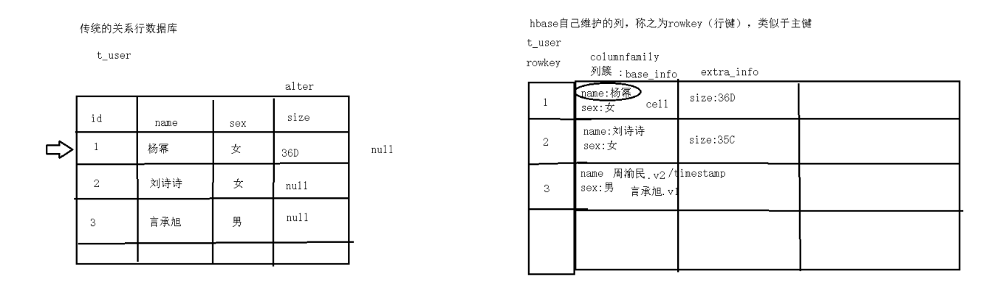
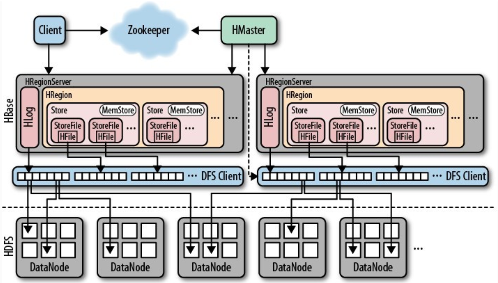

#### 一、 HBase介绍

##### 1 是什么

###### 1.1 HBase是什么(baidu,  官网)

```
	HBase是一个Hadoop生态圈中的一种数据库, 分布式、可伸缩的、是一个稀疏的、存储海量数据的工具。以谷歌的Bigtable为模型的分布式、版本化、非关系数据库:结构化数据分布式存储系统。Apache HBase在Hadoop和HDFS上提供了类似Bigtable的功能。
```

##### 2 有什么用

###### 2.1 为什么要有HBase

```
	随着互联网整个行业的发展，整个数据处理爆炸的年代，换言之我们每天会产生大量的数据，这些数据如果存储到传统的数据库中，已经不能满足我们对数据存储的要求了，所以出现很多分布式的存储介质。当我们需要随机的并且实时的读写海量数据的时候就可以使用HBase。
```

###### 2.2 特点

###### 2.3 认识HBase的表结构



###### 2.4 HBase的内部结构



- 各个节点的作用

```
- Client : hbase客户端，1.包含访问hbase的接口。比如，linux shell，java api。2.除此之外，它会维护缓存来加速访问hbase的速度。比如region的位置信息。
- Zookeeper ： 1.监控Hmaster的状态，保证有且仅有一个活跃的Hmaster。达到高可用。2.它可以存储所有region的寻址入口。如：root表在哪一台服务器上。3. 实时监控HregionServer的状态，感知HRegionServer的上下线信息，并实时通知给Hmaster。4. 存储hbase的部分元数据。
- HMaster : 1. 为HRegionServer分配Region（新建表等）。2. 负责HRegionServer的负载均衡。3. 负责Region的重新分配（HRegionServer宕机之后的Region分配，HRegion裂变：当Region过大之后的拆分）。4. Hdfs上的垃圾回收。5. 处理schema的更新请求
- HRegionServer ：1. 维护HMaster分配给的Region（管理本机的Region）。2. 处理client对这些region的读写请求，并和HDFS进行交互。3. 负责切分在运行过程中组件变大的Region。
- HLog ： 1. 对HBase的操作进行记录，使用WAL写数据，优先写入log（put操作：先写日志再写memstore，这样可以防止数据丢失，即使丢失也可以回滚）。
- HRegion ： 1. HBase中分布式存储和负载均衡的最小单元，它是表或者表的一部分。
- Store ： 1. 相当于一个列簇
- Memstore ： 1. 内存缓冲区，用于将数据批量刷新到hdfs中，默认大小为128M
- StoreFile : 1. 和HFile概念意义，不过是一个逻辑概念。HBase中的数据是以HFile存储在Hdfs上。
```

- 各个节点之间的关系

```
HMaster:HRegionServer : 1=*
HRegionServer:HRegion : 1=*
HRegionServer:HLog : 1=1
HRegion:Store : 1=*
Store:Memstore : 1=1
Memstore:HStoreFile : 1=*
StoreFile:HFile : 1=1
```

