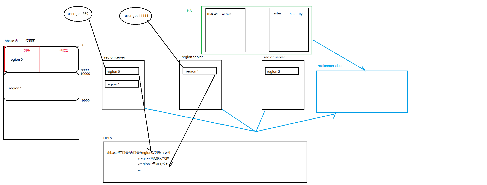
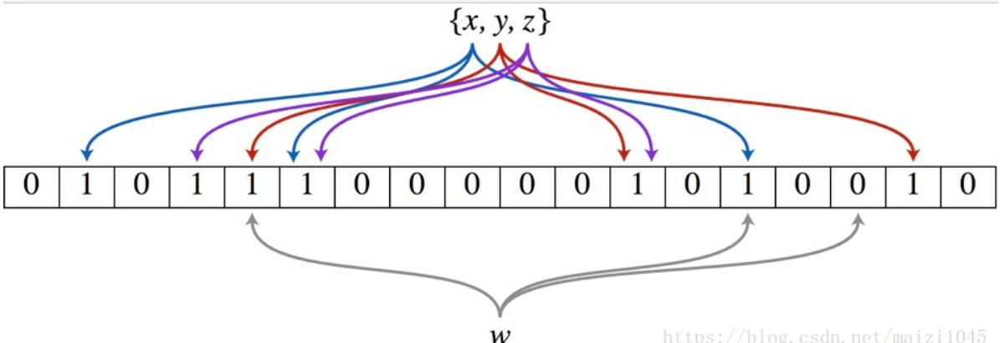
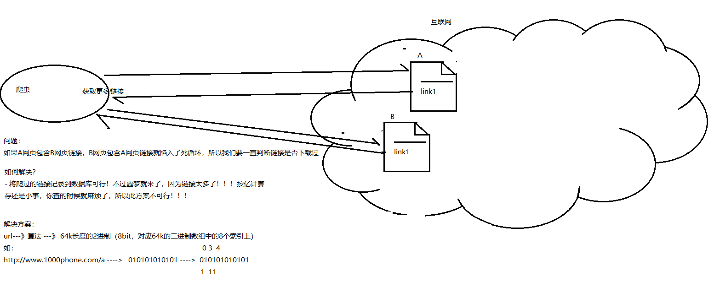
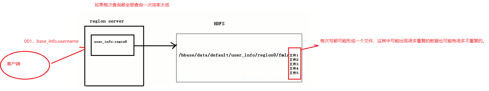
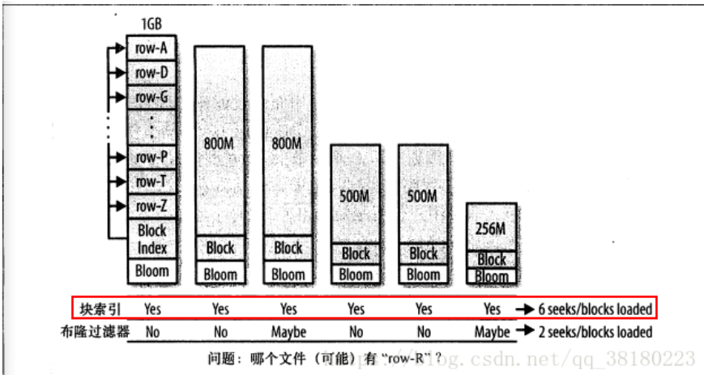
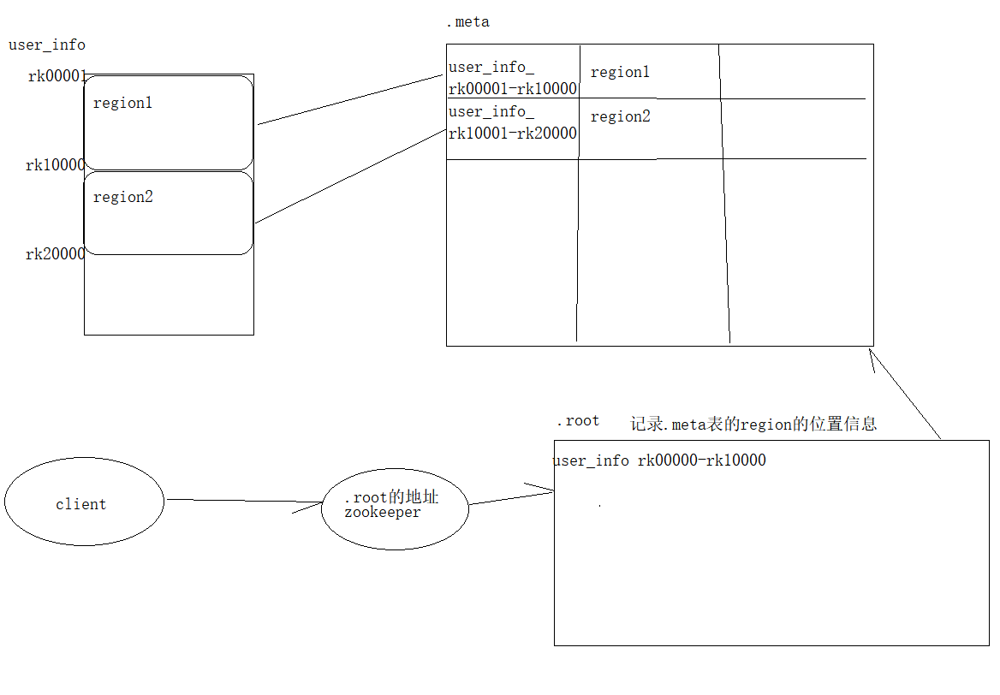
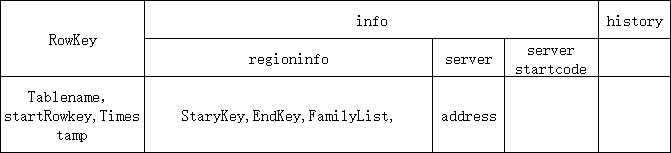
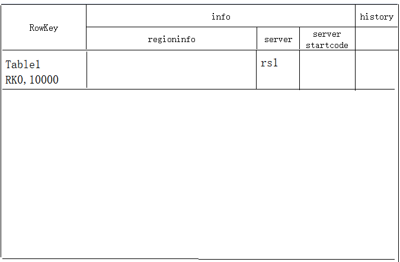
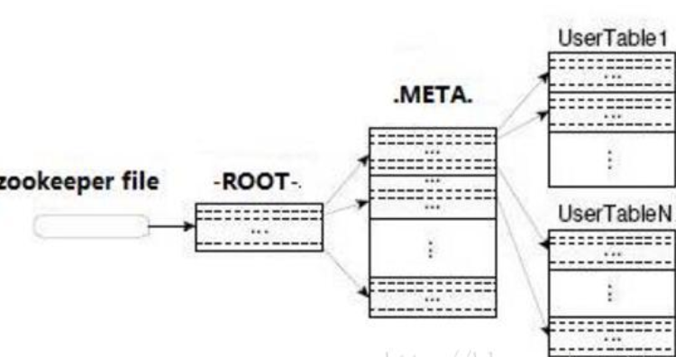

#### 一、 HBase的高级查询

##### 1 过滤器链的值查询 : 

###### 1.1 SingleColumnValueFilter 
SingleColumnValueFilter：select * from ns1_userinfo where age <= 18 and name = narudo

```
/**
 * 高级查询
 * 过滤器链查询
 */
public class Demo6_Filter {
    /**
     * 需求：
     * select * from ns1_userinfo where age <= 18 and name = narudo
     */
    @Test
    public void listFilter() throws IOException {
        /*
         * 1. 创建过滤器链
         * and条件使用MUST_PASS_ALL作为条件
         * or条件使用MUST_PASS_ONE
         */
        FilterList filterList = new FilterList(FilterList.Operator.MUST_PASS_ALL);
        /*
         * 2. 构造查询条件
         * 对于单列值比较器使用SingleColumnValueFilter
         * ColumnFamily, qualifier, 比较过滤器（大于、小于、等于、...）, value
         */
        SingleColumnValueFilter ageFilter = new SingleColumnValueFilter(Bytes.toBytes("base_info"), Bytes.toBytes("age"),
                CompareFilter.CompareOp.LESS_OR_EQUAL, Bytes.toBytes("18"));
        SingleColumnValueFilter nameFilter = new SingleColumnValueFilter(Bytes.toBytes("base_info"), Bytes.toBytes("name"),
                CompareFilter.CompareOp.EQUAL, Bytes.toBytes("narudo"));
        /*
         * 3. 将条件加入到过滤器链中
         */
        filterList.addFilter(ageFilter);
        filterList.addFilter(nameFilter);

        //4.创建扫描器进行扫描
        Scan scan = new Scan();

        //5. 将过滤条件关联到扫描器
        scan.setFilter(filterList);

        //6. 获取表对象
        Table table = HBaseUtils.getTable();

        //7. 扫描表
        ResultScanner scanner = table.getScanner(scan);

        //8. 打印数据
        Iterator<Result> iterator = scanner.iterator();
        while (iterator.hasNext()) {
            Result result = iterator.next();
            HBaseUtils.showResult(result);
        }
    }
}
```

###### 1.2 说明在查询的时候

```
1. 这种查询如果对应的行键，如果都包含了age和name列，就会对比值，如果都不满足就将其过滤，如果满足就获取。
2. 如果包含其中也给值，name或者age，只要其中一个列满足条件就会，就会获取。
3. 如果name和age都没有，那么视为该行满足条件
```

###### 1.3 解决方案

```
1. 在某个单值过滤器总添加
ageFilter.setFilterIfMissing(true);
nameFilter.setFilterIfMissing(true);
```

##### 2 比较器查询

###### 2.1 RegexStringComparator  
RegexStringComparator : select * from ns1_userinfo where name like '%i%'

```
/**
     *
     * 测试正则比较器
     * 需求：select * from ns1_userinfo where name like '%i%'
     */
    @Test
    public void regexStringComparatorTest() throws IOException {
        //1. 创建比较器，正则：以li开头的
        RegexStringComparator regexStringComparator = new RegexStringComparator("[$a-z]i[$a-z]");
        //2. 获取单列值过滤器
        SingleColumnValueFilter nameFilter = new SingleColumnValueFilter(Bytes.toBytes("base_info"), Bytes.toBytes("name"),
                CompareFilter.CompareOp.EQUAL, regexStringComparator);
        //3. 设置缺失
        nameFilter.setFilterIfMissing(true);
        //4.创建扫描器进行扫描
        Scan scan = new Scan();
        //5. 设置过滤器
        scan.setFilter(nameFilter);
        //6. 获取表对象
        Table table = HBaseUtils.getTable();
        //7. 扫描表
        ResultScanner scanner = table.getScanner(scan);
        //8. 打印数据
        Iterator<Result> iterator = scanner.iterator();
        while (iterator.hasNext()) {
            Result result = iterator.next();
            HBaseUtils.showResult(result);
        }
    }
```

###### 2.2 封装HbaseUtils

```
/**
* 显示这个过滤器扫描的对象
*/
public static void showFilterResult(Filter filter) {
    //4.创建扫描器进行扫描
    Scan scan = new Scan();
    //5. 设置过滤器
    scan.setFilter(filter);
    //6. 获取表对象
    Table table = HBaseUtils.getTable();
    //7. 扫描表
    ResultScanner scanner = null;
    try {
        scanner = table.getScanner(scan);
        //8. 打印数据
        Iterator<Result> iterator = scanner.iterator();
        while (iterator.hasNext()) {
            Result result = iterator.next();
            HBaseUtils.showResult(result);
        }
    } catch (IOException e) {
    	logger.warn("获取table的时候异常！", e);
    } finally {
        try {
        	table.close();
        } catch (IOException e) {
        	logger.warn("关闭table的时候异常！", e);
        }
    }
}
```

- 修改之前的方法

```
/**
*
* 测试正则比较器
* 需求：select * from ns1_userinfo where name like '%i%'
*/
@Test
public void regexStringComparatorTest() throws IOException {
    //1. 创建比较器，正则：以li开头的
    RegexStringComparator regexStringComparator = new RegexStringComparator("[$a-z]i[$a-z]");
    //2. 获取单列值过滤器
    SingleColumnValueFilter nameFilter = new SingleColumnValueFilter(Bytes.toBytes("base_info"), Bytes.toBytes("name"),
    CompareFilter.CompareOp.EQUAL, regexStringComparator);
    //3. 设置缺失
    nameFilter.setFilterIfMissing(true);
    //4. 打印
    HBaseUtils.showFilterResult(nameFilter);
}
```

###### 2.3  subStringComparator

```
/**
*
* 测试subString比较器
* 需求：select * from ns1_userinfo where name like '%i%'
*/
@Test
public void subStringComparatorTest() throws IOException {
    //1. 创建比较器，正则：以li开头的
    SubstringComparator substringComparator = new SubstringComparator("i");
    //2. 获取单列值过滤器
    SingleColumnValueFilter nameFilter = new SingleColumnValueFilter(Bytes.toBytes("base_info"), Bytes.toBytes("name"),
    CompareFilter.CompareOp.EQUAL, substringComparator);
    //3. 设置缺失
    nameFilter.setFilterIfMissing(true);
    //4. 打印
    HBaseUtils.showFilterResult(nameFilter);
}
```

###### 2.4 Comparator和CompareOp的关系

```
查看官网的比较器API文档即可
```

###### 2.5 BinaryComparator

```
/**
*
* 测试二进制比较器
* 需求：select * from ns1_userinfo where name = 'lixi'
*/
@Test
public void binaryComparatorTest() throws IOException {
    //1. 创建比较器，正则：以li开头的
    BinaryComparator binaryComparator = new BinaryComparator(Bytes.toBytes("lixi"));
    //2. 获取单列值过滤器
    SingleColumnValueFilter nameFilter = new SingleColumnValueFilter(Bytes.toBytes("base_info"), Bytes.toBytes("name"),
    CompareFilter.CompareOp.EQUAL, binaryComparator);
    //3. 设置缺失
    nameFilter.setFilterIfMissing(true);
    //4. 打印
    HBaseUtils.showFilterResult(nameFilter);
}
```

###### 2.6 BinaryPrefixComparator

```
/**
*
* 测试二进制前缀比较器
* 需求：select * from ns1_userinfo where name like 'li%'
*/
@Test
public void binaryPrefixComparatorTest() throws IOException {
    //1. 创建比较器，正则：以li开头的
    BinaryPrefixComparator binaryPrefixComparator = new BinaryPrefixComparator(Bytes.toBytes("li"));
    //2. 获取单列值过滤器
    SingleColumnValueFilter nameFilter = new SingleColumnValueFilter(Bytes.toBytes("base_info"), Bytes.toBytes("name"),
    CompareFilter.CompareOp.EQUAL, binaryPrefixComparator);
    //3. 设置缺失
    nameFilter.setFilterIfMissing(true);
    //4. 打印
    HBaseUtils.showFilterResult(nameFilter);
}
```

##### 3 KeyValue Metadata

###### 3.1 FamilyFilter1

```
/**
* 查询以base开头的列簇
*/
@Test
public void testColumnFamily1() {
    //1. 创建正则比较器：以base开头的字符串
    RegexStringComparator regexStringComparator = new RegexStringComparator("^base");
    //2. 创建FamilyFilter：结果中只包含满足条件的列簇信息
    FamilyFilter familyFilter = new FamilyFilter(CompareFilter.CompareOp.EQUAL, regexStringComparator);
    //3. 打印
    HBaseUtils.showFilterResult(familyFilter);
} 
```

###### 3.2 FamilyFilter2

```
/**
* 查询包含xtr的列簇
*/
@Test
public void testColumnFamily2() {
    //1. 创建正则比较器：以base开头的字符串
    SubstringComparator substringComparator = new SubstringComparator("xtr");
    //2. 创建FamilyFilter
    FamilyFilter familyFilter = new FamilyFilter(CompareFilter.CompareOp.EQUAL, substringComparator);
    //3. 打印
    HBaseUtils.showFilterResult(familyFilter);
}
```

###### 3.3 QualifierFilter

```
/**
* 查询包含xtr的列簇
*/
@Test
public void testQualifierFilter() {
    //1. 创建正则比较器：以base开头的字符串
    SubstringComparator substringComparator = new SubstringComparator("am");
    //2. 创建FamilyFilter
    QualifierFilter qualifierFilter = new QualifierFilter(CompareFilter.CompareOp.EQUAL, substringComparator);
    //3. 打印
    HBaseUtils.showFilterResult(qualifierFilter);
}
```

###### 3.4 ColumnPrefixFilter

```
/**
* 查询包含xtr的列簇
*/
@Test
public void testColumnPrefixFilter() {
    //1. 创建ColumnPrefixFilter
    ColumnPrefixFilter columnPrefixFilter = new ColumnPrefixFilter(Bytes.toBytes("a"));
    //2. 打印
    HBaseUtils.showFilterResult(columnPrefixFilter);
}
```

###### 3.5  MultipleColumnPrefixFilter

```
/**
* 查找以“a”或“n”开头的行和列族中的所有列
*/
@Test
public void testMultipleColumnPrefixFilter() {
    //1. 创建ColumnPrefixFilter
    byte[][] prefixes = new byte[][] {Bytes.toBytes("a"), Bytes.toBytes("n")};
    MultipleColumnPrefixFilter multipleColumnPrefixFilter = new MultipleColumnPrefixFilter(prefixes);
    //2. 打印
    HBaseUtils.showFilterResult(multipleColumnPrefixFilter);
}
```

###### 3.6 ColumnRangeFilter

```
/**
* 查找以“age”到“name”的列的信息
* minColumnInclusive:true为包含，false为不包含
*/
@Test
public void testColumnRangeFilter() {
    //1. 创建ColumnPrefixFilter
    ColumnRangeFilter columnRangeFilter = new ColumnRangeFilter(Bytes.toBytes("age"), false,
    Bytes.toBytes("name"), true);
    //2. 打印
    HBaseUtils.showFilterResult(columnRangeFilter);
}
```

##### 4 RowKey

###### 4.1 RowFilter

```
/**
* 查找rowkey=002的信息
*/
@Test
public void testRowFilter() {
    //1. 创建RowFilter
    BinaryComparator binaryComparator = new BinaryComparator(Bytes.toBytes("002"));
    RowFilter rowFilter = new RowFilter(CompareFilter.CompareOp.EQUAL, binaryComparator);
    //2. 打印
    HBaseUtils.showFilterResult(rowFilter);
}
```

##### 5 Utility

###### 5.1 FirstKeyOnlyFilter

```
/**
* 查找指定表中的所有的行键的第一个列
*/
@Test
public void testFirstKeyOnlyFilter() {
    //1. 创建RowFilter
    FirstKeyOnlyFilter firstKeyOnlyFilter = new FirstKeyOnlyFilter();
    //2. 打印
    HBaseUtils.showFilterResult(firstKeyOnlyFilter);
}
```

###### 5.2 最后举例

```
/**
* 需求：select * from ns1_userinfo where age <= 18 or name = lixi
*/
@Test
public void listFilter2() {
    //1.
    FilterList filterList = new FilterList(FilterList.Operator.MUST_PASS_ONE);
    SingleColumnValueFilter ageFilter = new SingleColumnValueFilter(Bytes.toBytes("base_info"), Bytes.toBytes("age"),
    CompareFilter.CompareOp.LESS_OR_EQUAL, Bytes.toBytes("18"));
    SingleColumnValueFilter nameFilter = new SingleColumnValueFilter(Bytes.toBytes("base_info"), Bytes.toBytes("name"),
    CompareFilter.CompareOp.EQUAL, Bytes.toBytes("lixi"));
    ageFilter.setFilterIfMissing(true);
    nameFilter.setFilterIfMissing(true);
    filterList.addFilter(ageFilter);
    filterList.addFilter(nameFilter);
    List<Filter> filters = filterList.getFilters();
    for(Filter filter : filters) {
    	HBaseUtils.showFilterResult(filter);
    }
}
```


##### 6 PageFilter

```
/**
 * 需求：每行显示3条记录
 * 将全部的数据分页显示出来
 *
 * 思路：
 * 1. 第一页：
 * select * from user_info where rowkey > \001 limit 3;
 * 2. 其他页
 * select * from user_info where rowkey > 第一页的maxrowkey limit 3;
 * 3. 循环什么时候结束？
 *  while(true) {
 *      select * from user_info where rowkey > 第一页的maxrowkey limit 3;
 *      print 3行数据
 *      结束条件：count<3
 *  }
 */
public class Demo7_PageFilter {

    /**
     * 测试分页显示user_info表中的所有数据，分页显示为3行记录
     */
    @Test
    public void testPageFilter() throws IOException {
        //1. 创建分页过滤器，并设置每页显示3条记录
        PageFilter pageFilter = new PageFilter(3);
        //2. 构造扫描器
        Scan scan = new Scan();
        //3. 给扫描器设置过滤器
        scan.setFilter(pageFilter);
        //4. 获取表的管理器
        Table table = HBaseUtils.getTable();
        //5. 遍历显示
        String maxKey = ""; // 最大key值记录器
        while(true) {
            int count = 0; // 计算器
            //6. 获取结构扫描器
            ResultScanner scanner = table.getScanner(scan);
            //7. 获取迭代器迭代
            Iterator<Result> iterator = scanner.iterator();
            //8. 迭代
            while (iterator.hasNext()) {
                Result result = iterator.next();
                System.out.println(new String(result.getRow()));
                count++;
                maxKey = Bytes.toString(result.getRow());
                //9. 打印
                HBaseUtils.showResult(result);
            }
            System.out.println("------------------------------------");
            //10. 判断是否可以结束
            if (count < 3) break;

            //11. 设置下一次开始查询的行键号
            scan.setStartRow(Bytes.toBytes(maxKey + "\001"));
        }
    }
}
```

#### 二、 再说HBase的存储架构

##### 1 HBase数据存储机制



#### 三、 其他的一些补充

##### 1 布隆过滤器说明

```
	Bloom filter 是由 Howard Bloom 在 1970 年提出的二进制向量数据结构，它具有很好的空间和时间效率，被用来检测一个元素是不是集合中的一个成员。如果检测结果为是，该元素不一定在集合中；但如果检测结果为否，该元素一定不在集合中。因此Bloom filter具有100%的召回率。这样每个检测请求返回有“在集合内（可能错误）”和“不在集合内（绝对不在集合内）”两种情况，可见 Bloom filter 是牺牲了正确率以节省空间。
```

###### 1.0 原理

```
	它的时间复杂度是O(1)，但是空间占用取决其优化的方式。它是布隆过滤器的基础。
	布隆过滤器（Bloom Filter）的核心实现是一个超大的位数组（或者叫位向量）和几个哈希函数。假设位数组的长度为m，哈希函数的个数为k
```



```
以上图为例，具体的插入数据和校验是否存在的流程：

假设集合里面有3个元素{x, y, z}，哈希函数的个数为3。

Step1：将位数组初始化，每位都设置为0。

Step2：对于集合里面的每一个元素，将元素依次通过3个哈希函数进行映射，每次映射都会产生一个哈希值，哈希值对应位数组上面的一个点，将该位置标记为1。

Step3：查询W元素是否存在集合中的时候，同样的方法将W通过哈希映射到位数组上的3个点。

Step4：如果3个点的其中有一个点不为1，则可以判断该元素一定不存在集合中。反之，如果3个点都为1，则该元素可能存在集合中。注意：此处不能判断该元素是否一定存在集合中，可能存在一定的误判率。
	可以从图中可以看到：假设某个元素通过映射对应下标为4，5，6这3个点。虽然这3个点都为1，但是很明显这3个点是不同元素经过哈希得到的位置，因此这种情况说明元素虽然不在集合中，也可能对应的都是1，这是误判率存在的原因。
```

###### 1.1 爬虫遇到的问题(布隆过滤器解决)



###### 1.2 在hbase中布隆过滤器的应用原理



###### 1.3 在hbase中的作用

```
判断rowkey存在于哪些文件之中,缩短get/scan查询的时间
```

###### 1.4 在hbase中布隆过滤器的原理

```
	布隆过滤器是hbase中的高级功能，它能够减少特定访问模式（get/scan）下的查询时间。不过由于这种模式增加了内存和存储的负担，所以被默认为关闭状态。

hbase支持如下类型的布隆过滤器：

1、NONE          不使用布隆过滤器

2、ROW           行键使用布隆过滤器

3、ROWCOL    列键使用布隆过滤器

其中ROWCOL是粒度更细的模式。
```

- 原因

```
	在介绍为什么hbase要引入布隆过滤器之前，我们先来了解一下hbase存储文件HFile的块索引机制
	我们知道hbase的实际存储结构是HFile，它是位于hdfs系统中的，也就是在磁盘中。而加载到内存中的数据存储在MemStore中，当MemStore中的数据达到一定数量时，它会将数据存入HFile中。
	HFIle是由一个个数据块与索引块组成，他们通常默认为64KB。hbase是通过块索引来访问这些数据块的。而索引是由每个数据块的第一行数据的rowkey组成的。当hbase打开一个HFile时，块索引信息会优先加载到内存当中。然后hbase会通过这些块索引来查询数据。
	但是块索引是相当粗粒度的，我们可以简单计算一下。假设一个行占100bytes的空间，所以一个数据块64KB，所包含的行大概有：(64 * 1024)/100 = 655.53 = ~700行。而我们只能从索引给出的一个数据块的起始行开始查询。
	如果用户随机查找一个行键，则这个行键很可能位于两个开始键（即索引）之间的位置。对于hbase来说，它判断这个行键是否真实存在的唯一方法就是加载这个数据块，并且扫描它是否包含这个键。
	同时，还存在很多情况使得这种情况更加复杂。
	对于一个应用来说，用户通常会以一定的速率进行更新数据，这就将导致内存中的数据被刷写到磁盘中，并且之后系统会将他们合并成更大的存储文件。在hbase的合并存储文件的时候，它仅仅会合并最近几个存储文件，直至合并的存储文件到达配置的最大大小。最终系统中会有很多的存储文件，所有的存储文件都是候选文件，其可能包含用户请求行键的单元格。如下图所示：
	我们可以看到，这些不同的文件都来自同一个列族，所以他们的行键分布类似。所以，虽然我们要查询更新的特定行只在某个或者某几个文件中，但是采用块索引方式，还是会覆盖整个行键范围。当块索引确定那些块可能含有某个行键后，regionServer需要加载每一个块来检查该块中是否真的包含该行的单元格。
```



###### 1.5 开启布隆过滤器的作用

```
	当我们随机读get数据时，如果采用hbase的块索引机制，hbase会加载很多块文件。如果采用布隆过滤器后，它能够准确判断该HFile的所有数据块中，是否含有我们查询的数据，从而大大减少不必要的块加载，从而增加hbase集群的吞吐率。这里有几点细节：
	
1. 布隆过滤器的存储在哪?
	对于hbase而言，当我们选择采用布隆过滤器之后，HBase会在生成StoreFile（HFile）时包含一份布隆过滤器结构的数据，称其为MetaBlock；MetaBlock与DataBlock（真实的KeyValue数据）一起由LRUBlockCache维护。所以，开启bloomfilter会有一定的存储及内存cache开销。但是在大多数情况下，这些负担相对于布隆过滤器带来的好处是可以接受的。
	
2. 采用布隆过滤器后，hbase如何get数据？
	在读取数据时，hbase会首先在布隆过滤器中查询，根据布隆过滤器的结果，再在MemStore中查询，最后再在对应的HFile中查询。
	
3. 采用ROW还是ROWCOL布隆过滤器？
	这取决于用户的使用模式。如果用户只做行扫描，使用更加细粒度的行加列布隆过滤器不会有任何的帮助，这种场景就应该使用行级布隆过滤器。当用户不能批量更新特定的一行，并且最后的使用存储文件都含有改行的一部分时，行加列级的布隆过滤器更加有用。

例如：ROW 使用场景假设有2个Hfile文件hf1和hf2， hf1包含kv1（r1 cf:q1 v）、kv2（r2 cf:q1 v） hf2包含kv3（r3 cf:q1 v）、kv4（r4 cf:q1 v） 如果设置了CF属性中的bloomfilter（布隆过滤器）为ROW，那么get(r1)时就会过滤hf2，get(r3)就会过滤hf1 。

ROWCOL使用场景假设有2个Hfile文件hf1和hf2， hf1包含kv1（r1 cf:q1 v）、kv2（r2 cf:q1 v） hf2包含kv3（r1 cf:q2 v）、kv4（r2 cf:q2 v） 如果设置了CF属性中的bloomfilter为ROW，无论get(r1,q1)还是get(r1,q2)，都会读取hf1+hf2；而如果设置了CF属性中的bloomfilter为ROWCOL，那么get(r1,q1)就会过滤hf2，get(r1,q2)就会过滤hf1。

tip:
ROW和ROWCOL只是名字上有联系，但是ROWCOL并不是ROW的扩展，也不能取代ROW
```

##### 2 HBase的寻址机制

###### 2.1 寻址示意图



###### 2.2 .root表结构



###### 2.3 .meta表结构



###### 2.4 寻址流程

```
现在假设我们要从Table2里面查询一条RowKey是RK10000的数据。那么我们应该遵循以下步骤：
1. 从.META.表里面查询哪个Region包含这条数据。
2. 获取管理这个Region的RegionServer地址。
3. 连接这个RegionServer, 查到这条数据。

系统如何找到某个row key (或者某个 row key range)所在的region
bigtable 使用三层类似B+树的结构来保存region位置。
第一层： 保存zookeeper里面的文件，它持有root region的位置。
第二层：root region是.META.表的第一个region其中保存了.META.表其它region的位置。通过root region，我们就可以访问.META.表的数据。
第三层： .META.表它是一个特殊的表，保存了hbase中所有数据表的region 位置信息。

说明：
(1) root region永远不会被split，保证了最需要三次跳转，就能定位到任意region 。
(2).META.表每行保存一个region的位置信息，row key 采用表名+表的最后一行编码而成。
(3) 为了加快访问，.META.表的全部region都保存在内存中。
(4) client会将查询过的位置信息保存缓存起来，缓存不会主动失效，因此如果client上的缓存全部失效，则需要进行最多6次网络来回，才能定位到正确的region(其中三次用来发现缓存失效，另外三次用来获取位置信息)。
```

###### 2.5 总结

- Region定位流程

  

  ```
  寻找RegionServer
  ZooKeeper–> -ROOT-(单Region)–> .META.–> 用户表

  -ROOT-表
  表包含.META.表所在的region列表，该表只会有一个Region；
  Zookeeper中记录了-ROOT-表的location。
  .META.表
  表包含所有的用户空间region列表，以及RegionServer的服务器地址。
  ```

  ​

