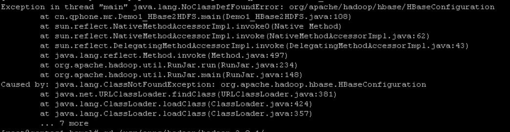
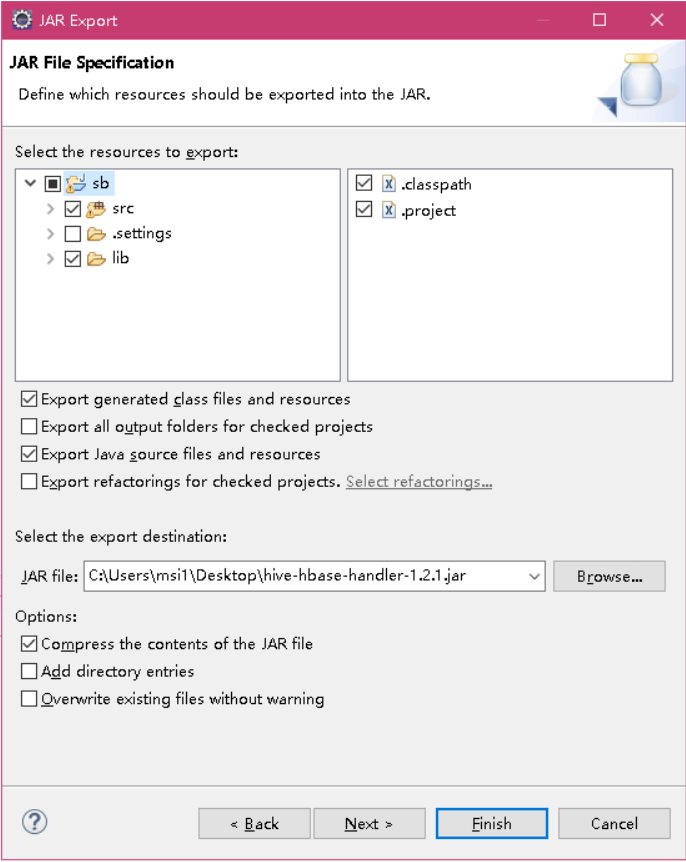

#### 上周回顾

```
1. hive（数据仓库，分析）
1.1 hivedml操作：所有在hive中的修改操作都是新增一个文件到hdfs
1.2 如果使用update操作必须要支持事务ACID的类型的文件格式：orc
1.3 orc不能load data导入数据
1.4 数据类型：
- array
explode ： 将集合展开为行
lateral view ： 虚拟视图
- map
- struct

1.5 函数 - 窗口函数
row_number（）
rank()
dense_rank()

udf ： map
udaf : reduce
udtf

1.6 jdbc连接hive
- 启动hive服务：hive --service hiveserver2 &

1.7 serde
csv/tsv : , \t
json : 
regex :

1.8 自定义InputFormat/OutputFormat

1.9 索引

1.10 视图

1.11 
from t_user
insert into 
select *
insert into

insert overwrite directiory ''

1.12
hive -e "sql statement"
hive -f 'fliename'

1.13
orc
textfile
rcfile
sequencefile

2. hbase（存储）
2.1 hbase是分布式的nosql的数据
2.2 hbase的内部执行图
2.3 hbase环境
2.4 hbase shell
namespace
ddl
dml
2.5 JAVA API
namespace -- HBaseAdmin
ddl  ------ HBaseAdmin
dml  ------ Table

2.6 filter过滤器查询

2.7 布隆过滤器

2.8 寻址机制
```

#### 今日任务

```
1. hbase如何mapreduce结合
2. hbase如何hive结合
```

#### 一 HBase和Mapreduce结合

##### 1 HBase中的数据导入HDFS

###### 1.1 导入依赖

```
<dependencies>
        <dependency>
            <groupId>org.apache.hadoop</groupId>
            <artifactId>hadoop-client</artifactId>
            <version>2.8.1</version>
        </dependency>
        <!-- https://mvnrepository.com/artifact/org.apache.hadoop/hadoop-common -->
        <dependency>
            <groupId>org.apache.hadoop</groupId>
            <artifactId>hadoop-common</artifactId>
            <version>2.8.1</version>
        </dependency>
        <dependency>
            <groupId>org.apache.hadoop</groupId>
            <artifactId>hadoop-hdfs</artifactId>
            <version>2.8.1</version>
        </dependency>
        <dependency>
            <groupId>org.apache.hbase</groupId>
            <artifactId>hbase-client</artifactId>
            <version>1.2.1</version>
        </dependency>
        <!-- https://mvnrepository.com/artifact/org.apache.hbase/hbase-client -->
        <dependency>
            <groupId>org.apache.hbase</groupId>
            <artifactId>hbase-common</artifactId>
            <version>1.2.1</version>
        </dependency>

        <!-- https://mvnrepository.com/artifact/org.apache.hbase/hbase-client -->
        <dependency>
            <groupId>org.apache.hbase</groupId>
            <artifactId>hbase-server</artifactId>
            <version>1.2.1</version>
        </dependency>
    </dependencies>
```

###### 1.2 启动你的hbase/hdfs/yarn

###### 1.3 代码

```
public class Demo1_HBase2HDFS extends ToolRunner implements Tool {

    private Configuration configuration;

    private final String HDFS_KEY = "fs.defaultFS";
    private final String HDFS_VALUE = "hdfs://cdh1:9000";
    private final String MR_KEY = "mapreduce.framework.name";
    private final String MR_VALUE = "yarn";
    private final String HBASE_KEY = "hbase.zookeeper.quorum";
    private final String HBASE_VALUE = "cdh2:2181,cdh3:2181,cdh4:2181";

    private Scan getScan() {
        return new Scan();
    }

    @Override
    public int run(String[] args) throws Exception {
        configuration = getConf();
        //2. 获取到job
        Job job = Job.getInstance(configuration);

        //3. map，reduce(mapper/reducer的class，还要设置mapper/reducer的输出的key/value的class)

        job.setMapperClass(HBase2HDFSMapper.class);
        job.setOutputKeyClass(Text.class);
        job.setOutputValueClass(NullWritable.class);


        //4. 输出和输入的参数（输入的目录和输出的目录）
        TableMapReduceUtil.initTableMapperJob("user_info", getScan(), HBase2HDFSMapper.class, Text.class, NullWritable.class, job);
        FileOutputFormat.setOutputPath(job, new Path(args[0])); // 输出目录

        //5. 设置驱动jar包的路径
        job.setJarByClass(Demo1_HBase2HDFS.class);
        //6. 提交作业（job）
        return job.waitForCompletion(true) ? 0 : 1; // 打印提交过程的日志记录并且提交作业
    }

    static class HBase2HDFSMapper extends TableMapper<Text, NullWritable> {
        private Text k = new Text();

        /**
         *  001                        column=base_info:age, timestamp=1558348072062, value=20
         *  001                        column=base_info:name, timestamp=1558348048716, value=lixi
         *
         *
         *  001 base_info:age   20  base_info:name  lixi
         */
        protected void map(ImmutableBytesWritable key, Result value, Context context) throws IOException, InterruptedException {
            //1. 创建StringBuffer用于拼凑字符串
            StringBuffer sb = new StringBuffer();
            //2. 遍历result中的所有的列簇
            CellScanner cellScanner = value.cellScanner();
            int index = 0;
            while (cellScanner.advance()) {
                //3. 获取到当前的cell，然后决定拼串的方式
                Cell cell = cellScanner.current();
                if(index == 0) {
                    sb.append(new String(CellUtil.cloneRow(cell))).append("\t");
                    index++;
                }
                sb.append(new String(CellUtil.cloneValue(cell))).append("\t");
            }
            //4. 输出
            k.set(sb.toString());
            context.write(k, NullWritable.get());
        }
    }

    @Override
    public void setConf(Configuration configuration) {
        //1. 保证连接hdfs、连接yarn、连接hbase
        configuration.set(HDFS_KEY,HDFS_VALUE);
        configuration.set(MR_KEY,MR_VALUE);
        configuration.set(HBASE_KEY,HBASE_VALUE);
        this.configuration = configuration;
    }

    @Override
    public Configuration getConf() {
        return configuration;
    }

    public static void main(String[] args) throws Exception {
        ToolRunner.run(HBaseConfiguration.create(), new Demo1_HBase2HDFS(), args);
    }
}
```

###### 1.4 将代码打包为jar上传到服务器运行出现如下错误：



```
	我们使用hadoop运行这个jar中的程序，在这个jar中使用了hbase的相关的类，而这些类在打包为jar的时候并没有一起打包到jar包中，所以这里出错，找不到HBaseConfifuration
解决问题：
1. 最暴力的方式：将hbase的lib中的所有的jar包都拷贝到Hadoop的资源库中
2. 在打包的时候，将依赖的jar包一起给打包（打包的jar会特别的大）
3. 使用hadoop的环境变量去引用hbase的资源路径
export HADOOP_CLASSPATH=$HADOOP_CLASSPATH:/usr/apps/hbase/hbase-1.2.1/lib/*
```

##### 2 HDFS2HBSE

```
public class Demo2_HDFS2HBase extends ToolRunner implements Tool {

    private Configuration configuration;

    private final String HDFS_KEY = "fs.defaultFS";
    private final String HDFS_VALUE = "hdfs://cdh1:9000";
    private final String MR_KEY = "mapreduce.framework.name";
    private final String MR_VALUE = "yarn";
    private final String HBASE_KEY = "hbase.zookeeper.quorum";
    private final String HBASE_VALUE = "cdh2:2181,cdh3:2181,cdh4:2181";

    private Scan getScan() {
        return new Scan();
    }

    @Override
    public int run(String[] args) throws Exception {
               configuration = getConf();
        //2. 获取到job
        Job job = Job.getInstance(configuration);

        //3. map，reduce(mapper/reducer的class，还要设置mapper/reducer的输出的key/value的class)

        job.setMapperClass(HDFS2HBaseMapper.class);
        job.setReducerClass(HDFS2HBaseReducer.class);
        job.setMapOutputKeyClass(Text.class);
        job.setMapOutputValueClass(Text.class);
        job.setOutputKeyClass(ImmutableBytesWritable.class);
        job.setOutputValueClass(Put.class);

        String tablename = "t1";
        createTable(tablename);

        //4. 输出和输入的参数（输入的目录和输出的目录）
//        TableMapReduceUtil.initTableMapperJob("user_info", getScan(), Demo1_HBase2HDFS.HBase2HDFSMapper.class, Text.class, NullWritable.class, job);
        FileInputFormat.setInputPaths(job, new Path(args[0]));
        TableMapReduceUtil.initTableReducerJob(tablename, HDFS2HBaseReducer.class, job);

        //5. 设置驱动jar包的路径
        job.setJarByClass(Demo1_HBase2HDFS.class);
//        job.setJar("E:\\codes\\workspaces\\workspace4bigdata1903\\day56-hbase\\target\\day56-hbase-1.0-SNAPSHOT.jar");
        //6. 提交作业（job）
        return job.waitForCompletion(true) ? 0 : 1; // 打印提交过程的日志记录并且提交作业
    }

    public void createTable(String tablename) {
        try {
            //1. 判断表是否存在，如果存在先把之前的表删除，我再创建一个新表
            Admin admin = HBaseUtils.getAdmin();
            boolean exists = admin.tableExists(TableName.valueOf(tablename));
            if(exists) {
                admin.disableTable(TableName.valueOf(tablename));
                admin.deleteTable(TableName.valueOf(tablename));
            }
            //2. 建表
            HTableDescriptor tableDescriptor = new HTableDescriptor(TableName.valueOf(tablename));
            HColumnDescriptor age_info = new HColumnDescriptor("age_info");
            tableDescriptor.addFamily(age_info);
            admin.createTable(tableDescriptor);
        }catch (Exception e) {
            e.printStackTrace();
        }
    }

    static class HDFS2HBaseMapper extends Mapper<LongWritable, Text, Text, Text> {

        private Text k = new Text();
        private Text v = new Text();

        @Override
        protected void map(LongWritable key, Text value, Context context) throws IOException, InterruptedException {
            //1. 读一行数据
            String line = value.toString();
            //2. 为了判断改行有age属性，如果没有就不用进行接下来的操作，直接结束这次maptask
            if(line.contains("age")) {
                //3. 切割
                String[] fields = line.split("\t");
                for(String field : fields) {
                    //4. 找到含有age属性的字段
                    if(field.startsWith("age:")) {
                        //5. 获取到age对应的value
                        String[] kv = field.split(":");
                        k.set(kv[1]);
                        //6. 以age的value作为key输出，以那读取到一行hdfs中的数据作为value输出
                        String vs = fields[0] + "\t" + kv[0] + '\t' + kv[1];
                        v.set(vs);
                        context.write(k, v);
                    }
                }
            }
        }
    }

    /**
     * 要往hbase写东西就要使用hbase操作数据的对象：put/delete/get/scan
     */
    static class HDFS2HBaseReducer extends TableReducer<Text, Text, ImmutableBytesWritable> {

        @Override
        protected void reduce(Text key, Iterable<Text> values, Context context) throws IOException, InterruptedException {
            Put put = null;
            //1. 获取迭代器
            Iterator<Text> iterator = values.iterator();
            //2. 迭代
            while (iterator.hasNext()) {
                //4. 获取到map阶段产生的文本
                String[] fields = iterator.next().toString().split("\t");
                put = new Put(Bytes.toBytes(fields[0]));
                put.addColumn(Bytes.toBytes("age_info"), Bytes.toBytes(fields[1]), Bytes.toBytes(fields[2]));
            }
            //5. 输出
            context.write(new ImmutableBytesWritable(Bytes.toBytes("age")), put);
        }
    }

    @Override
    public void setConf(Configuration configuration) {
        //1. 保证连接hdfs、连接yarn、连接hbase
        configuration.set(HDFS_KEY,HDFS_VALUE);
        configuration.set(MR_KEY,MR_VALUE);
        configuration.set(HBASE_KEY,HBASE_VALUE);
        this.configuration = configuration;
    }

    @Override
    public Configuration getConf() {
        return configuration;
    }

    public static void main(String[] args) throws Exception {
        ToolRunner.run(HBaseConfiguration.create(), new Demo2_HDFS2HBase(), args);
    }
}
```

#### 二 HBase和Hive结合

```
1 hbase存储数据的
2 hive分析数据

作用：
当hive当中创建一张表，在hbase中也能查询到这张表
当在hbase中建一张表，在hive中也能查询
```

##### 1 Hive结合HBase

###### 1.1 导入下来，将这个jar包的源码 下载到本地仓库

```
<dependency>
    <groupId>org.apache.hive</groupId>
    <artifactId>hive-hbase-handler</artifactId>
    <version>1.2.1</version>
</dependency>
```

###### 1.2 建表

```
create external table if not exists hive2hbase(
id int,
age int,
name string
)
stored by 'org.apache.hadoop.hive.hbase.HBaseStorageHandler'  
WITH SERDEPROPERTIES (
"hbase.columns.mapping"=":key,base_info:age,base_info:name"
)
TBLPROPERTIES(
"hbase.table.name"="user_info"
);
```

- 当我们在hive中使用这个建表语句的时候报错

```
Cannot find class 'org.apache.hadoop.hive.hbase.struct.HBaseStorageHandler'

tip:
既要协调使用hive中的jar，也要使用hbase中的jar包。但是hive的hive-hbase-handler-1.2.1.jar中引用的关于hbase的jar包版本过低（0.9x）,所以导致hbase的版本不支持。
```

- 解决方案

```
修改hive-hbase-handler-1.2.1.jar的hbase相关的jar依赖
```

- 修改源码的方式--eclipse

```
1. 打开一个eclipse
2. 在eclipse中随便创建已给java工程
3. 将我们之前下载好的源码导入到eclipse的src目录下，这个时候一会发现一堆错误提示
file ---> import ---> filesystem--->选择你的源码--->finish
4. 创建一个lib目录，把准备好的jar包都拷贝到lib目录中
5. 选中所有的jar包---鼠标右键--->build path
你就会发现不报错
6. 导出
file--->export--->jar file --->
7. 将这个jar包拷贝回hive的lib目目录中，把原来的那个jar包给干掉！！！
```



###### 1.3 结果

```
我们在hive中可以直接查询hbase中的数据
hbase中添加会删除一条数据，在hive中立刻就能体现！！！
在hive中插入一条记录，也能立刻在hbase中体现
```

###### 1.4 建表2

```
create table if not exists hive2hbase2(
id int,
age int,
name string
)
stored by 'org.apache.hadoop.hive.hbase.HBaseStorageHandler'  
WITH SERDEPROPERTIES (
"hbase.columns.mapping"=":key,base_info:age,base_info:name"
)
TBLPROPERTIES(
"hbase.table.name"="t2"
);
```

###### 1.5 导入数据

```
create table temp(
id int,
age int,
name string
)
row format delimited
fields terminated by ','
stored as textfile;

load data local inpath '/home/stu.txt' into table temp;

insert into hive2hbase2
select * from temp;
```


