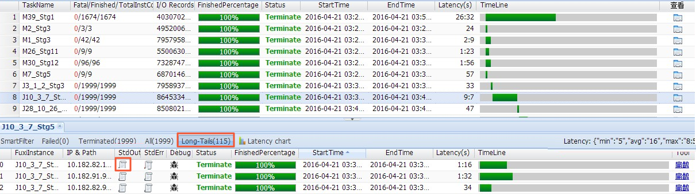

# 长尾优化

[toc]

## JOIN长尾优化
`https://help.aliyun.com/document_detail/143996.html?spm=a2c4g.11186623.6.1050.263d49a0OOhjF1#title-hde-pdc-x9d`

本文为您介绍执行SQL时JOIN阶段常见的数据倾斜场景以及对应的解决办法。

### 背景信息
MaxComputeSQL在JOIN阶段会将JOIN Key相同的数据分发到同一个Instance上执行处理。如果某个Key上的数据量比较多，会导致该Instance执行时间比其他Instance执行时间长。执行日志中该JOIN Task的大部分Instance都已执行完成，但少数几个Instance一直处于执行中，这种现象称之为长尾。

数据量倾斜导致长尾的现象比较普遍，严重影响任务的执行时间，尤其是在双十一等大型活动期间，长尾程度比平时更为严重。例如，某些大型店铺的浏览PV远远超过一般店铺的PV，当用浏览日志数据和卖家维表关联时，会按照卖家ID进行分发，导致某个Instance处理的数据量远远超过其他Instance，而整个任务会因为这个长尾的Instance无法结束。

您**可以从以下四方面进行长尾处理考虑**：

* 若两张表里有一张大表和一张小表，可以考虑使用MAP JOIN，对小表进行缓存。    
* 如果两张表都比较大，就需要先尽量去重。    
* 从业务上考虑，寻找两个大数据量的Key做笛卡尔积的原因，从业务上进行优化。    
* 小表LEFT JOIN大表，直接LEFT JOIN较慢。先将小表和大表进行MAP JOIN，得到小表和大表的交集中间表，且这个中间表一定是不大于大表的（key倾斜程度与表的膨胀大小成正比）。然后小表再和这个中间表进行LEFT JOIN，这样操作的效果等于小表LEFT JOIN大表。  

### 查看JOIN是否发生数据倾斜
执行如下步骤查看JOIN是否发生数据倾斜：

1.打开SQL执行时产生的Log View日志，查看每个Fuxi Task的详细执行信息。Long-Tails(115)表示有115个长尾。


2.单击FuxiInstance后的查看.png图标，查看stdout中Instance读入的数据量。
例如，Read from 0 num:52743413 size:1389941257表示JOIN输入读取的数据量是1389941257行。如果Long-Tails中Instance读取的数据量远超过其它Instance读取的数据量，则表示是因为数据量导致长尾。

### 常见场景及解决方案

#### MAP JOIN方案
MAP JOIN方案：JOIN倾斜时，如果某路输入比较小，可以采用MAP JOIN避免分发引起的长尾。

MAP JOIN的原理是将JOIN操作提前到Map端执行，这样可以避免因为分发Key不均匀导致数据倾斜。MAP JOIN使用限制如下：

* MAP JOIN使用时，JOIN中的从表比较小才可用。所谓从表，即LEFT OUTER JOIN中的右表，或者RIGHT OUTER JOIN中的左表。(似乎和hive相反)    
* MAP JOIN使用时，对小表的大小有限制，默认小表读入内存后的大小不能超过512MB。用户可以通过如下语句加大内存，最大为2048MB。
```sql
set odps.sql.mapjoin.memory.max=2048
```

MAP JOIN的使用方法非常简单，在SQL语句中SELECT后加上 /*+ mapjoin(b) */ 即可，其中b代表小表（或者是子查询）的别名。举例如下。
```sql
select   /*+mapjoin(b)*/       
           a.c2       
          ,b.c3
from        
         (select   c1                 
                  ,c2         
           from     t1         ) a
left outer join        
         (select   c1                 
                  ,c3         
          from     t2         ) b
on       a.c1 = b.c1;
```

#### JOIN因为空值导致长尾
如果是因为空值的聚集导致长尾，并且JOIN的输入比较大无法用MAP JOIN，可以将空值处理成随机值。因为空值是无法关联上，只是分发到了一处，因此给予随机值既不会影响关联也能避免聚集。
```sql
select   ...
from
        (select   *
         from     tbcdm.dim_tb_itm
         where    ds='${bizdate}'
         )son1
left outer join
        (select  *
         from    tbods.s_standard_brand
         where   ds='${bizdate}'
         and     status=3
         )son2
on       coalesce(son1.org_brand_id,rand()*9999)=son2.value_id;
```
ON子句中使用coalesce(son1.org_brand_id,rand()*9999)表示当org_brand_id为空时用随机数替代，避免大量空值聚集引起长尾。

#### JOIN因为热点值导致长尾
如果是因为热点值导致长尾，并且JOIN的输入比较大无法用MAP JOIN，可以先将热点Key取出，对于主表数据用热点Key切分成热点数据和非热点数据两部分分别处理，最后合并。以淘宝的PV日志表关联商品维表取商品属性为例：

* 取出热点Key：将PV大于50000的商品ID取出到临时表。    
* 取出非热点数据。    
* 取出热点数据。    
* 将步骤2和步骤3的数据通过union all合并后即得到完整的日志数据，并且关联了商品的信息。  

* 取出热点Key：将PV大于50000的商品ID取出到临时表。  
```sql
insert   overwrite table topk_item
select   item_id
from
        (select   item_id
                 ,count(1) as cnt
         from     dwd_tb_log_pv_di
         where    ds = '${bizdate}'
         and      url_type = 'ipv'
         and      item_id is not null
         group by item_id
         ) a
where    cnt >= 50000;
```
* 取出非热点数据。    
将主表（sdwd_tb_log_pv_di）和热点key表(topk_item)外关联后通过条件b1.item_id is null，取出关联不到的数据即非热点商品的日志数据，此时需要用MAP JOIN。再用非热点数据关联商品维表，因为已经排除了热点数据，不会存在长尾。
```sql
select   ...
from
        (select   *
         from     dim_tb_itm
         where    ds = '${bizdate}'
         ) a
right outer join
        (select   /*+mapjoin(b1)*/
                  b2.*
         from
                 (select   item_id
                  from     topk_item
                  where    ds = '${bizdate}'
                  ) b1
         right outer join
                 (select   *
                  from     dwd_tb_log_pv_di
                  where    ds = '${bizdate}'
                  and      url_type = 'ipv'
                  ) b2
         on       b1.item_id = coalesce(b2.item_id,concat("tbcdm",rand())
         where    b1.item_id is null
         ) l
on       a.item_id = coalesce(l.item_id,concat("tbcdm",rand());
```
* 取出热点数据。    
将主表（sdwd_tb_log_pv_di）和热点Key表(topk_item)内关联，此时需要用MAP JOIN，取到热点商品的日志数据。同时，需要将商品维表（dim_tb_itm）和热点Key表(topk_item)内关联，取到热点商品的维表数据，然后将第一部分数据外关联第二部分数据，因为第二部分只有热点商品的维表，数据量比较小，可以用MAP JOIN避免长尾。
```sql
select   /*+mapjoin(a)*/
         ...
from
        (select   /*+mapjoin(b1)*/
                  b2.*
         from
                 (select   item_id
                  from     topk_item
                  where    ds = '${bizdate}'
                  )b1
         join
                 (select   *
                  from     dwd_tb_log_pv_di
                  where    ds = '${bizdate}'
                  and      url_type = 'ipv'
                  and      item_id is not null
                  ) b2
         on       (b1.item_id = b2.item_id)
         ) l
left outer join
        (select   /*+mapjoin(a1)*/
                  a2.*
         from
                 (select   item_id
                  from     topk_item
                  where    ds = '${bizdate}'
                  ) a1
         join
                 (select   *
                  from     dim_tb_itm
                  where    ds = '${bizdate}'
                  ) a2
         on       (a1.item_id = a2.item_id)
         ) a
on       a.item_id = l.item_id;
```
* 将步骤2和步骤3的数据通过union all合并后即得到完整的日志数据，并且关联了商品的信息。

## 其它计算长尾调优
`https://help.aliyun.com/document_detail/51020.html?spm=a2c4g.11186623.6.1051.3c57788dedq3pf`

除了Join之外还有其它计算长尾现象产生，本文将为您介绍典型的长尾问题的场景及其解决方案。

长尾问题是分布式计算中最常见的问题之一。造成长尾问题的主要原因是数据分布不均，导致各个节点的工作量不同，整个任务需要等最慢的节点完成才能结束。

为了避免一个Worker单独运行大量的工作，需要把工作分给多个Worker去执行。

### Group By 长尾

#### 问题原因
Group By Key出现长尾，是因为某个Key内的计算量特别大。

#### 解决办法
您可以通过以下两种方法解决：

* 对SQL进行改写，添加随机数，把长Key进行拆分。    
* 通过设置系统参数优化长尾问题。  


##### 添加随机数
对SQL进行改写，添加随机数，把长Key进行拆分。举例如下。
```sql
SELECT Key,COUNT(*) AS Cnt FROM TableName GROUP BY Key;
```
不考虑Combiner，M节点会Shuffle到R上，然后R再做Count操作。对应的执行计划是 M > R。但是如果对长尾的Key再做一次工作再分配，就变成如下语句。
```sql
-- 假设长尾的Key已经找到是KEY001。
SELECT a.Key
  , SUM(a.Cnt) AS Cnt
FROM (
  SELECT Key
    , COUNT(*) AS Cnt
FROM TableName
GROUP BY Key, 
  CASE 
    WHEN Key = 'KEY001' THEN Hash(Random()) % 50
    ELSE 0
   END
) a
GROUP BY a.Key;
```

由上可见，这次的执行计划变成了M>R>R。虽然执行的步骤变长了，但是长尾的Key经过2个步骤的处理，整体的时间消耗可能反而有所减少。


**说明:若数据的长尾并不严重，用这种方法人为地增加一次R的过程，最终的时间消耗可能反而更大**。

我的想法：如果只是某几个key数据较多，应该没必要使用随机数，应为有mao端的Combiner，如果是大部分key都分区到某一个reducer则这种方法是十分有效的。

##### 设置系统参数
通过设置系统参数优化长尾问题。
```sql
set odps.sql.groupby.skewindata=true。
```
此设置为通用性的优化策略，无法针对具体的业务进行分析，得出的结果不一定是最优的。您可以根据实际的数据情况，用更加高效的方法来改写SQL。

### Distinct 长尾
对于Distinct，把长Key进行拆分的策略已经不生效了。对这种场景，您可以考虑通过其它方式解决。

**解决办法**
```sql
--原始SQL，不考虑Uid为空。
SELECT COUNT(uid) AS Pv
    , COUNT(DISTINCT uid) AS Uv
FROM UserLog;
```
可以改写成如下语句。
```sql
SELECT SUM(PV) AS Pv
    , COUNT(*) AS UV
FROM (
    SELECT COUNT(*) AS Pv
      , uid
    FROM UserLog
    GROUP BY uid
) a;
```
该方法是把Distinct改成了普通的Count，这样的计算压力不会落到同一个Reducer上。而且这样改写后，既能支持前面提到的Group By优化，系统又能做Combiner，性能会有较大的提升。

### 动态分区长尾
问题原因

* 动态分区功能为了整理小文件，会在最后启用一个Reduce，对数据进行整理，所以如果使用动态分区写入数据时有倾斜，就会发生长尾。    
* 一般情况下，滥用动态分区的功能也是产生这类长尾的一个常见原因。  

解决办法

若已经确定需要把数据写入某个具体分区，则可以在Insert的时候**指定需要写入的分区，而不是使用动态分区**。

### 通过 Combiner 解决长尾
对于MapRedcuce作业，使用Combine是一种常见的长尾优化策略。通过Combiner，减少Mapper Shuffle往Reducer的数据，可以大大减少网络传输的开销。对于MaxCompute SQL，这种优化会由系统自动完成。

说明:Combiner只是Map端的优化，需要保证执行Combiner的结果是一样的。以WordCount为例，传2个 (KEY,1) 和传1个(KEY,2)  的结果是一样的。但是在做平均值时，便不能直接在Combiner里把 (KEY,1) 和(KEY,2) 合并成(KEY,1.5) 。

### 通过系统优化解决长尾
针对长尾这种场景，除了前面提到的Local Combiner，MaxCompute系统本身还做了一些优化。例如，在运行任务的时候，日志里突然打出如下的内容（+N backups 部分）。
```
M1_Stg1_job0:0/521/521[100%] M2_Stg1_job0:0/1/1[100%] J9_1_2_Stg5_job0:0/523/523[100%] J3_1_2_Stg1_job0:0/523/523[100%] R6_3_9_Stg2_job0:1/1046/1047[100%] 
M1_Stg1_job0:0/521/521[100%] M2_Stg1_job0:0/1/1[100%] J9_1_2_Stg5_job0:0/523/523[100%] J3_1_2_Stg1_job0:0/523/523[100%] R6_3_9_Stg2_job0:1/1046/1047[100%] 
M1_Stg1_job0:0/521/521[100%] M2_Stg1_job0:0/1/1[100%] J9_1_2_Stg5_job0:0/523/523[100%] J3_1_2_Stg1_job0:0/523/523[100%] R6_3_9_Stg2_job0:1/1046/1047(+1 backups)[100%] 
M1_Stg1_job0:0/521/521[100%] M2_Stg1_job0:0/1/1[100%] J9_1_2_Stg5_job0:0/523/523[100%] J3_1_2_Stg1_job0:0/523/523[100%] R6_3_9_Stg2_job0:1/1046/1047(+1 backups)[100%]
```
可以看到1047个Reducer，有1046个已经完成了，但是最后一个一直没完成。系统识别出这种情况后，自动启动了一个新的Reducer，运行一样的数据，然后取运行结束较早的数据归并到最后的结果集里。(类似于hadoop中的推测执行)

### 通过业务优化解决长尾
虽然前面的优化策略有很多，但仍然不能解决所有问题。有时碰到的长尾问题，还需要从业务角度上去考虑是否有更好的解决方法。

* 实际数据可能包含非常多的噪音。例如，需要根据访问者的ID进行计算，看每个用户的访问记录的行为。需要先去掉爬虫的数据（现在的爬虫已越来越难识别），否则爬虫数据很容易在计算时长尾。类似的情况还有根据xxid进行关联的时候，需要考虑这个关联字段是否存在为空的情况。    
* 一些业务特殊情况。例如：ISV的操作记录，在数据量、行为方式上会和普通个人有很大的区别。那么可以考虑针对大客户，使用特殊的分析方式进行单独处理。    
* 数据分布不均匀的情况下，不要使用常量字段做Distribute by字段来实现全排序。  


```sql

```


```sql

```