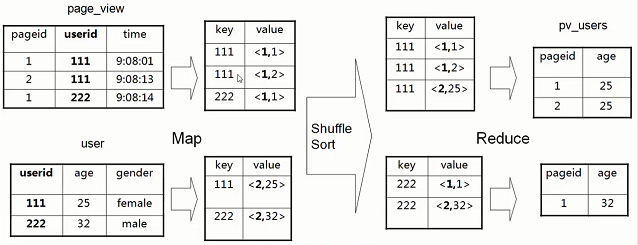
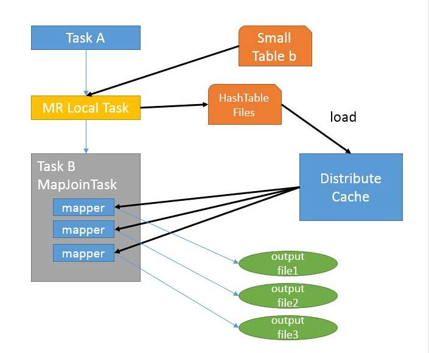

# Hive数据倾斜问题总结

## Hive数据倾斜
`https://github.com/polaris6/BigDataLearning/blob/ab0c3b8b15963250e51ef82158c2a1159048262f/src/hive/data_skew`

```
Hive数据倾斜

一、数据倾斜原因
    数据倾斜就是key分布不均匀，分发到不同的reduce上，个别reduce任务特别重，导致其他reduce都完成，而这些个别的reduce迟迟
不完成的情况。导致数据倾斜的原因有：
1、key分布不均匀
2、map端数据倾斜，输入文件太多且大小不一
3、reduce端数据倾斜，分区器问题
4、业务数据本身的特征


二、解决方案
1、参数调节：
    当出现小文件过多，需要合并小文件。可以通过set hive.merge.mapfiles=true来解决(在map-only job后合并文件，默认true)。
    设置 hive.map.aggr = true，Map端部分聚合，相当于Combiner。
    设置 hive.groupby.skewindata = true，数据倾斜的时候进行负载均衡，查询计划生成两个MR job，第一个job先进行key随机分配
处理，随机分布到Reduce中，每个Reduce做部分聚合操作，先缩小数据量。第二个job再进行真正的group by key处理，根据预处理的
数据结果按照Group By Key分布到Reduce中（这个过程可以保证相同的Key被分布到同一个Reduce中），完成最终的聚合操作。

2、SQL语句优化：
①、大小表Join：
    使用map join让小表（小于1000行）先进内存，在map端完成reduce。
    注：map join就是在map端做join，map join会把小表全部读入内存中，在map阶段直接拿另外一个表的数据和内存中表数据做匹配。

②、大表Join大表：
    大表连接大表时，如果是null值造成数据倾斜，那么把null值变成一个字符串加上随机数（赋予null值新的key值），把这部分倾斜
的数据分发到不同的reduce上，由于这个字符串关联不上，处理后并不影响最终结果。

③、count distinct大量相同特殊值：
    count distinct时，将值为null的情况单独处理，如果是计算count distinct，可以不用处理，直接过滤，在最后结果中加1。
如果还有其他计算，需要进行group by，可以先将值为空的记录单独处理，再和其他计算结果进行union。

④、采用sum() group by的方式来代替count(distinct)完成计算：
    select count(distinct colA) from table1;
    select count(1) from (select colA from table1 group by colA) alias_1;   group by也可以去重

3、特殊情况特殊处理：
    在业务逻辑优化的效果不好的情况下，可以将倾斜的数据单独拿出来处理，最后union回去。
```


## Hive数据倾斜问题总结
`https://cloud.tencent.com/developer/article/1011039`

### MapReduce数据倾斜
Hive查询最终转换为MapReduce操作，所以要先了解MapReduce数据倾斜问题。

MapReduce程序执行时，reduce节点大部分执行完毕，但是有一个或者几个reduce节点运行很慢，导致整个程序的处理时间很长，这是因为某一个key的条数比其他key多很多（有时是百倍或者千倍之多），这条key所在的reduce节点所处理的数据量比其他节点就大很多，从而导致某几个节点迟迟运行不完，此称之为数据倾斜。 

在map端和reduce端都有可能发生数据倾斜。在map端的数据倾斜会让多样化的数据集的处理效率更低。在reduce端的数据倾斜常常来源于MapReduce的默认分区器。Reduce数据倾斜一般是指map的输出数据中存在数据频率倾斜的状况，也就是部分输出键的数据量远远大于其它的输出键。

常见的数据倾斜有以下几类：

* 数据频率倾斜：某一个区域的数据量要远远大于其他区域。    
* 数据大小倾斜：部分记录的大小远远大于平均值。  

解决MapReduce数据倾斜思路有两类：

* 一是reduce 端的隐患在 map 端就解决    
* 二是对 key 的操作，以减缓reduce 的压力  

#### reduce 端的隐患在 map 端就解决
**方法1：Combine**

使用Combine可以大量地减小数据频率倾斜和数据大小倾斜。在可能的情况下，combine的目的就是聚合并精简数据。在加个combiner函数，加上combiner相当于提前进行reduce,就会把一个mapper中的相同key进行了聚合，减少shuffle过程中数据量，以及reduce端的计算量。这种方法可以有效的缓解数据倾斜问题，但是如果导致数据倾斜的key 大量分布在不同的mapper的时候，这种方法就不是很有效了。

**方法2：map端join** 

join 操作中，使用 map join 在 map 端就先进行 join ，免得到reduce 时卡住。

**方法3：group** 

能先进行 group 操作的时候先进行 group 操作，把 key 先进行一次 reduce,之后再进行 count 或者 distinct count 操作。

#### 对 key 的操作，以减缓reduce 的压力
因为map阶段对数据处理方法不当，或者说Key设计不当，导致大量数据聚集到某个key下。这个问题再《数据结构》的hash算法中有详细解决办法（增大数组容量，选择恰当素数）。所以大家很快想到一个解决办法，重新设计key，使得数据均匀分不到每个key下面（通常需要增加reduce数），这样reduce节点收到的数据也相对均匀。

这里提供一个解决办法，自定义Partitioner，可以将key均匀分布。
```java
package cn.hadron.mr.ncdc;
import org.apache.hadoop.io.DoubleWritable;
import org.apache.hadoop.mapreduce.lib.partition.HashPartitioner;

public class MyPartitioner extends HashPartitioner<Weather, DoubleWritable> {
    // 执行时间越短越好
    public int getPartition(Weather key, DoubleWritable value, int numReduceTasks) {
        // 根据年份分区
        return key.getYear() % numReduceTasks;
    }
}
```

### 诊断数据倾斜
在发现了倾斜数据的存在之后，就很有必要诊断造成数据倾斜的那些键。有一个简便方法就是在代码里实现追踪每个键的最大值。为了减少追踪量，可以设置数据量阀值，只追踪那些数据量大于阀值的键，并输出到日志中。
```java
private int MAXVAL=100;
public void reduce(Text key, Iterator<Text> values,OutputCollector<Text, Text> output,
                    Reporter reporter) throws IOException {  
     int i = 0;
     while (values.hasNext()) {
         values.next();
         i++;
     }
     if (i> MAXVAL) {
         log.info("Received " + i + " values for key " + key);
     }
 }
```

### Hive数据倾斜
Hive产生数据倾斜的原因

* key分布不均匀    
* 业务数据本身的特性    
* 建表时考虑不周    
* 某些SQL语句本身就有数据倾斜

解决办法如下

#### 调参
```
hive.map.aggr=true
```
Map端部分聚合，相当于Combiner

```
hive.groupby.skewindata=true
```
有数据倾斜的时候进行负载均衡，当选项设定为 true，生成的查询计划会有两个 MR Job。第一个 MR Job 中，Map 的输出结果集合会随机分布到 Reduce 中，每个 Reduce 做部分聚合操作，并输出结果，这样处理的结果是相同的 Group By Key 有可能被分发到不同的 Reduce 中，从而达到负载均衡的目的；第二个 MR Job 再根据预处理的数据结果按照 Group By Key 分布到 Reduce 中（这个过程可以保证相同的 Group By Key 被分布到同一个 Reduce 中），最后完成最终的聚合操作。

#### SQL调优
* 如何Join：关于驱动表的选取，选用join key分布最均匀的表作为驱动表。做好列裁剪和filter操作，以达到两表做join的时候，数据量相对变小的效果。    
* 大小表Join：使用map join让小的维度表（1000条以下的记录条数） 先进内存。在map端完成reduce.    
* 大表Join大表：把空值的key变成一个字符串加上随机数，把倾斜的数据分到不同的reduce上，由于null值关联不上，处理后并不影响最终结果。    
* count distinct大量相同特殊值：count distinct时，将值为空的情况单独处理，如果是计算count distinct，可以不用处理，直接过滤，在最后结果中加1。如果还有其他计算，需要进行group by，可以先将值为空的记录单独处理，再和其他计算结果进行union。    
* group by维度过小：采用sum() group by的方式来替换count(distinct)完成计算。    
* 特殊情况特殊处理：在业务逻辑优化效果的不大情况下，有些时候是可以将倾斜的数据单独拿出来处理。最后union回去。  


### 小结
使map的输出数据更均匀的分布到reduce中去，是我们的最终目标。由于Hash算法的局限性，按key Hash会或多或少的造成数据倾斜。大量经验表明数据倾斜的原因是人为的建表疏忽或业务逻辑可以规避的。在此给出较为通用的步骤：

* 1、采样log表，哪些user_id比较倾斜，得到一个结果表tmp1。由于对计算框架来说，所有的数据过来，他都是不知道数据分布情况的，所以采样是并不可少的。    
* 2、数据的分布符合社会学统计规则，贫富不均。倾斜的key不会太多，就像一个社会的富人不多，奇特的人不多一样。所以tmp1记录数会很少。把tmp1和users做map join生成tmp2,把tmp2读到distribute file cache。这是一个map过程。    
* 3、map读入users和log，假如记录来自log,则检查user_id是否在tmp2里，如果是，输出到本地文件a,否则生成`<user_id,value>`的key,value对，假如记录来自member,生成`<user_id,value>`的key,value对，进入reduce阶段。    
* 4、最终把a文件，把Stage3 reduce阶段输出的文件合并起写到hdfs。  

如果确认业务需要这样倾斜的逻辑，考虑以下的优化方案：

* 1、对于join，在判断小表不大于1G的情况下，使用map join    
* 2、对于group by或distinct，设定 hive.groupby.skewindata=true    
* 3、尽量使用上述的SQL语句调节进行优化  

## Hive数据倾斜及优化方案
`https://www.cnblogs.com/Maggieli/p/12129083.html`

### 数据倾斜概述
**什么是数据倾斜？**

由于数据分布不均匀，造成数据大量的集中到一点，造成数据热点。主要现象是任务进度长时间维持在99%的附近。

**数据倾斜情况**

查看任务监控页面，发现只有少量 reduce子任务未完成，因为其处理的数据量和其他的reduce差异过大。单一reduce 处理的记录数和平均记录数相差太大，通常达到好几倍之多，最长时间远大于平均时长。常涉及group by、count（distinct）、join等函数，具体情况下面会分析说明。

### 数据倾斜优化
数据倾斜问题一直以来都是行业内的痛点所在，导致数据倾斜因素也多种多样。比如，key分布不均匀，业务数据本身的特性，建表考虑不周全，某些 HQL 语句本身就存在数据倾斜等。所以优化数据是个不可或缺的工作，虽不一定能完全解决，但也很大程序上优化了资源和效率。为了更好的解释问题，特建立两张测试表。
```sql
--用户详单表
create table user_list_detail(
user_id    string,    --用户ID
user_name  string,    --用户名
province   string,    --归属省份
city       string)    --归属城市
row format delimited fields terminated by ',';
--用户信息表
create table user_list_info(
user_id    string,    --用户ID
sex        string,    --性别
age        string,    --年龄
address    string)    --住址
row format delimited fields terminated by ','
```

### 聚合时存在大量null值
如果Null值较多，会导致分到Null值的Reduce处理的数据量过大，产生数据倾斜。**一般会发生在Join的连接字段和Group的分组字段里。**

#### 过滤空值
1、统计业务表各城市的用户数，若city字段存在大量空值，group by时则会产生数据倾斜，可在where条件中提前筛选分组字段非空的行。
```sql
select 
    t.city,
    count(*) as cnt 
from user_list_detail t
where city is not null
group by city;
```

2.若业务表user_list_detail中user_id为空的数据不需要保留，可在where条件中提前筛选左右表关联字段非空的行。
```sql
select 
    a.user_id,
    a.user_name,
    a.province,
    a.city,
    b.sex,
    b.age,
    b.address
from 
    (select * from user_list_detail where user_id is not null) a 
left join
    (select * from user_list_info   where user_id is not null) b 
on a.user_id = b.user_id;
```

#### 保留空值的情况
2.若业务表user_list_detail中user_id为空的数据不需要保留，可在where条件中提前筛选左右表关联字段非空的行。
```sql
select 
    a.user_id,
    a.user_name,
    a.province,
    a.city,
    b.sex,
    b.age,
    b.address
from 
    (select * from user_list_detail where user_id is not null) a 
left join 
    user_list_info b 
on a.user_id = b.user_id
union all
    select * from user_list_detail where user_id is null;
```

4.若业务表user_list_detail中user_id为空的数据需要保留，可以在关联字段上加上随机数，赋予空值新的key值。
```sql
select 
    a.user_id,
    a.user_name,
    a.province,
    a.city,
    b.sex,
    b.age,
    b.address
from 
    user_list_detail a 
left join 
    user_list_info b 
on case when a.user_id is null then concat('hive',rand()) else a.user_id end = b.user_id;
```

### 不同数据类型关联产生数据倾斜
用户详单表user_list_detail中user_id字段类型为string，若此时用户信息表user_list_info中user_id既有string也有int的类型，当按照两个表的user_id 进行join 操作的时候，默认的hash操作会按照int类型的user_id 进行分配，这样就会导致所有的string 类型的user_id就被分到同一个reducer当中,造成数据倾斜。

1.将用户信息表user_list_info中的user_id字段类型转化为string类型，与用户详单表user_list_detail字段中user_id类型保持一致。
```sql
select a.* 
from 
    user_list_detail a 
left join 
    user_list_info b 
on b.user_id = cast(a.user_id as string);
```

### count（distinct）导致数据倾斜
工作中无论是distinct还是count(distinct user_id)的操作，都不建议使用，因为distinct本身会有一个全局排序的过程，导致计算效率很低，通常会以group by的方式替代。
```sql
--错误的打开方式：
select 
    count(distinct city) as cnt
from 
    user_list_detail 
where city is not null;

--正确的打开方式：
select 
    count(*) as cnt
from 
   (select 
        city
    from
        user_list_detail 
    where city is not null
    group by city) t;
```

### 关联查询产生数据倾斜
#### 1.大小表关联查询产生数据倾斜
（1）解决方案一：Hive在进行join时，按照join的key进行分发，而在join左边的表的数据会首先读入内存，如果左边表的key相对分散，读入内存的数据会比较小，join任务执行会比较快。 而如果左边的表key比较集中，而这张表的数据量很大，那么数据倾斜就会比较严重，而如果这张表是小表，则还是应该把这张表放在join左边。**原则即是小表在左，大表在右**。
```sql
--假设左表user_list_detail有10亿行，user_list_info表有10万行，遵循小表在左，大表在右的原则。
select /* +mapjoin(b) */
    b.user_id,
    b.user_name,
    b.province,
    b.city,
    a.sex,
    a.age,
    a.address
from 
    (select * from user_list_info   where user_id is not null) a 
left join
    (select * from user_list_detail where user_id is not null) b 
on a.user_id = b.user_id;
```

（2）解决方案二：**map join**解决小表关联大表造成的数据倾斜问题，其是将其中做连接的小表（全量数据）分发到所有Map端进行Join，从而避免了reduce任务，当小表全量数据很小的时候可进行此操作。
```sql
--假设左表user_list_detail有10亿行，右表有10万行，此时可使用map join关联函数。
select /* +mapjoin(b) */
    a.user_id,
    a.user_name,
    a.province,
    a.city,
    b.sex,
    b.age,
    b.address
from 
    (select * from user_list_detail where user_id is not null) a 
left join
    (select * from user_list_info   where user_id is not null) b 
on a.user_id = b.user_id;
```

#### 2.大大表关联查询导致数据倾斜
（1）现象：两个表都上千万，跑起来很悬，但是实际上根据业务经验发现，其实每天在线用户数是很少的，可以先统计出当天在线的user_id。
```sql
Select /* +mapjoin(b) */ 
    a.user_id,
    a.user_name,
    a.province,
    a.city,
    b.sex,
    b.age,
    b.address
from 
    user_list_detail a
left join 
    (
    select /* +mapjoin(t1) */  a.*
    from (
        select 
            distinct user_id 
        from 
            user_list_detail
         ) t1 
    left join 
        user_list_info t2
    on t1.user_id=t2.user_id
    ) b
on a.user_id=b.user_id;
```

###  数据倾斜之空间换时间
当我们进行group by操作并使用多个分组函数，会导致同一个reduce上进行操作时压力很大。甚至是类似于下面样例语句的小白操作，可以使用到空间换时间的优化技巧。
```sql
--小白操作样例：
select a.city,count(distinct a.user_id),count(distinct user_name) from user_list_detail a group by city;


--空间换时间操作：
select 
    city,
    count(case when type='user_id' then 1 else null end) as id_cnt,
    count(case when type='user_name' then 1 else null end) as name_cnt
from 
    (
    select 
        city,user_id,type
    from (
        select day,user_id,'user_id' as type from user_list_detail a
    union all
        select day user_name,'user_name' as type from user_list_detail b
         ) t1
    group by city,user_id,type
    ) t2
group by city;
```

### Hive中join关键字运行机制及使用

#### join关键字的原理和机制
Hive中的Join可分为Common Join（Reduce阶段完成join）和Map Join（Map阶段完成join）。

##### Hive Common Join
如果不指定MapJoin或者不符合MapJoin的条件，那么Hive解析器会默认把执行Common Join，即在Reduce阶段完成join。整个过程包含Map、Shuffle、Reduce阶段。


Map阶段：读取源表的数据，Map输出的key为关联字段，输出的value以<k,v>形式存在，k代表表的标识，v代表取出的字段值。

Shuffle阶段：根据key的值进行hash分发，将其推送至不同的reduce中，确保两个表中相同的key位于同一个reduce中。

Reduce阶段：根据key的值完成join操作，期间通过value值中参数k来识别不同表中的数据。

##### Hive Map Join
运行原理图：

MapJoin函数适用于大小表关联的场景，小表的大小限制可由参数hive.mapjoin.smalltable.filesize来设定，默认值为25M。如果条件满足，Hive在执行时候会自动转化为MapJoin，或在写sql时就加上/+ mapjoin(table) / 参数。

主要分为以下两步：

1.Task A在客户端本地执行，负责扫描小表b的数据，将其转换成一个HashTable的数据结构，并写入本地的文件中，之后将该文件加载到DistributeCache中。

2.Task B任务是一个没有Reduce的MapReduce，启动MapTasks扫描大表a，在Map阶段，根据a的每一条记录去和DistributeCache中b表对应的HashTable关联，并直接输出结果，因为没有Reduce，所以有多少个Map Task，就有多少个结果文件。

**注意：Map JOIN不适合FULL/RIGHT OUTER JOIN。**

#### join关键字的连接方式
Hive中中连接方式主要是内关联（INNER JOIN）、左关联（LEFT JOIN）、右关联（RIGHT JOIN）、全关联（FULL JOIN）、左半关联（LEFT SEMI JOIN）和笛卡尔积（CROSS JOIN）。

#### join关键字的优化原则
1.优先在where限制条件内过滤后再进行Join操作，最大限度的减少参与关联的数据量。

2.小表关联大表，小表在前，大表在后。或者使用map join函数指定小表。

3.关联的条件相同的话，最好放入同一个job，并且 join 表的排列顺序从小到大。


```sql

```

## Hive数据倾斜总结
`https://www.cnblogs.com/kxdblog/p/4316592.html`

<div id="cnblogs_post_body" class="blogpost-body ">
    <p><strong>倾斜的原因：</strong></p>
<p>　　使map的输出数据更均匀的分布到reduce中去，是我们的最终目标。由于Hash算法的局限性，按key Hash会或多或少的造成数据倾斜。大量经验表明数据倾斜的原因是人为的建表疏忽或业务逻辑可以规避的。</p>
<p><strong>解决思路:</strong></p>
<p>　　Hive的执行是分阶段的，map处理数据量的差异取决于上一个stage的reduce输出，所以如何将数据均匀的分配到各个reduce中，就是解决数据倾斜的根本所在</p>
<p><strong>具体办法：</strong></p>
<p>内存优化和I/O优化:</p>
<p>　　驱动表：使用大表做驱动表，以防止内存溢出；Join最右边的表是驱动表；Mapjoin无视join顺序，用大表做驱动表；StreamTable。</p>
<p><span style="color: #ff0000;"><strong>&nbsp;1.&nbsp;Mapjoin是一种避免避免数据倾斜的手段</strong></span></p>
<p><strong>　　允许在map阶段进行join操作，MapJoin</strong><strong>把小表全部读入内存中，在map阶段直接拿另外一个表的数据和内存中表数据做匹配，由于在map是进行了join操作，省去了reduce运行的效率也会高很多</strong></p>
<p>在《hive：join遇到问题》有具体操作</p>
<p>　<strong>　在对多个表<strong>join</strong>连接操作时，将小表放在<strong>join</strong>的左边，大表放在Jion的右边，</strong></p>
<p><strong>　　在执行这样的<strong>join</strong>连接时小表中的数据会被缓存到内存当中,这样可以有效减少发生内存溢出错误的几率</strong></p>
<p>&nbsp;</p>
<p><strong>　　没有一个表足够小到能够放进内存：用到bucket map join。其方法是两个join表在join key上都做hash bucket，并且把你打算复制的那个（相对）小表的bucket数设置为大表的倍数。这样数据就会按照join key做hash bucket。小表依然复制到所有节点，map join的时候，小表的每一组bucket加载成hashtable，与对应的一个大表bucket做局部join，这样每次只需要加载部分hashtable就可以了。</strong></p>
<p><span style="color: #ff0000;"><strong>&nbsp;2. 设置参数 参考<a href="http://blog.csdn.net/chaoping315/article/details/8500407" target="_blank">这里</a></strong></span></p>
<p><strong>　　hive.map.aggr = true</strong></p>
<p><strong>　　hive.groupby.skewindata=true 还有其他参数&nbsp;</strong></p>
<p><strong>3.<span style="color: #ff0000;">SQL语言调节</span></strong></p>
<p>　　比如：&nbsp;<span style="color: #ff0000;">group by维度过小时：采用sum() group by的方式来替换count(distinct)完成计算</span></p>
<p><span style="color: #ff0000;"><strong>4.StreamTable</strong></span></p>
<p>　　将在reducer中进行join操作时的小table放入内存，而大table通过stream方式读取&nbsp;</p>
<p><strong>5.索引</strong></p>
<p>　　Hive从0.80开始才有，提供了一个Bitmap位图索引，索引可以加快GROUP BY查询语句的执行速度，<span style="color: #ff0000;">用的较少</span>。&nbsp;<br>&nbsp; &nbsp; &nbsp; &nbsp;</p>
<p><span style="color: #ff0000;">set mapreduce.map.memory.mb=1025;</span><br><span style="color: #ff0000;">set mapreduce.reduce.memory.mb=1025;</span></p>
<p><strong>其他优化：</strong></p>
<p>1、&nbsp;列裁剪（Column&nbsp;pruning）：只有需要用到的列才进行输出&nbsp;</p>
<p>2、&nbsp;谓词下推（Predicate&nbsp;pushdown）：尽早进行数据过滤(见图表&nbsp;7中，下面为先处理的逻<br>辑)，减少后续处理的数据量&nbsp;</p>
<p>3、&nbsp;<span style="color: #ff0000;">分区裁剪（Partition&nbsp;pruning）：只读取满足分区条件的文件&nbsp;</span><br>4、&nbsp;map-join：对于join中一些小文件，可以在map阶段进行join操作，见3.2.2节map-join部分&nbsp;<br>5、&nbsp;join-reordering：<span style="color: #ff0000;">将在reducer中进行join操作时的小table放入内存，而大table通过</span><br><span style="color: #ff0000;">stream方式读取&nbsp;</span><br>6、&nbsp;<span style="color: #ff0000;">Group-by优化：&nbsp;进行局部聚合进行优化</span>（包括hash-based和sort-based），对于skew<br>的key（key的row&nbsp;num和size在reduce时非常不均）可以进行两次map-reduce的方式优化&nbsp;</p>
<p>&nbsp;</p>
<p><span style="color: #ff0000;">Hive的配置参数</span>比较保守，所以效率会比较差一点，修改配置会让查询效率有比较大的提升，记录几个对查询效率影响比较重要的参数。</p>
<p>元数据：</p>
<p>嵌套SQL并行执行优化:</p>
<p><span class="Apple-tab-span">set hive.exec.parallel=true;</span></p>
<p><span class="Apple-tab-span">set hive.exec.parallel.thread.number=16;</span></p>
<p>&nbsp;</p>
<p><strong><span style="color: #ff0000;">四、排序优化</span></strong></p>
<p>&nbsp; &nbsp;Order by 实现全局排序，一个reduce实现，效率低</p>
<p>&nbsp; &nbsp;Sort by 实现部分有序，单个reduce输出的结果是有序的，效率高，通常和DISTRIBUTE BY关键字一起使用（DISTRIBUTE BY关键字 可以指定map 到 reduce端的分发key）</p>
<p>&nbsp; &nbsp;CLUSTER BY col1 等价于DISTRIBUTE BY col1 SORT BY col1.</p>
<p>&nbsp;</p>
<p><strong><span style="color: #ff0000;">五、合并小文件</span></strong></p>
<p>&nbsp; &nbsp;文件数目过多，会给 HDFS 带来压力，并且会影响处理效率，可以通过合并 Map 和 Reduce 的结果文件来尽量消除这样的影响</p>
<p>&nbsp; &nbsp;hive.merge.mapfiles = true是否和并 Map 输出文件，默认为 True</p>
<p>&nbsp; &nbsp;hive.merge.mapredfiles = false是否合并 Reduce 输出文件，默认为 False</p>
<p>&nbsp; &nbsp;hive.merge.size.per.task = 256*1000*1000合并文件的大小。</p>
<p>&nbsp; &nbsp;这里的参数没有写到上面的表格里是因为这是可以根据任务不同临时设置的，而不一定非要是全局设置。有时候全局设置了反而对大文件的操作有性能影响。</p>
<p>&nbsp;</p>
<p><strong><span style="color: #ff0000;">六、使用分区，RCFile，lzo，ORCFile等</span></strong></p>
<p>&nbsp; &nbsp;Hive中的每个分区都对应hdfs上的一个目录，分区列也不是表中的一个实际的字段，而是一个或者多个伪列，在表的数据文件中实际上并不保存分区列的信息与数据。Partition关键字中排在前面的为主分区（只有一个），后面的为副分区</p>
<p>&nbsp; &nbsp;静态分区：静态分区在加载数据和使用时都需要在sql语句中指定</p>
<p>&nbsp; &nbsp;例：(stat_date='20120625',province='hunan')</p>
<p>&nbsp; &nbsp;动态分区：使用动态分区需要设置hive.exec.dynamic.partition参数值为true，默认值为false，在默认情况下，hive会假设主分区时静态分区，副分区使用动态分区；如果想都使用动态分区，需要设置set hive.exec.dynamic.partition.mode=nostrick，默认为strick</p>
<p>&nbsp; &nbsp;例：(stat_date='20120625',province)</p>
<p>&nbsp;</p>
</div>


```

```
