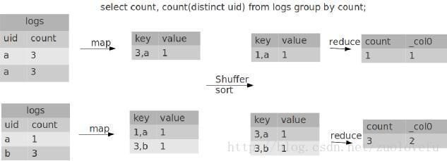
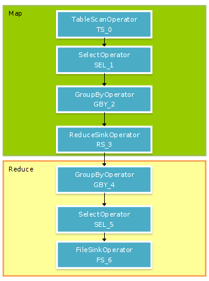
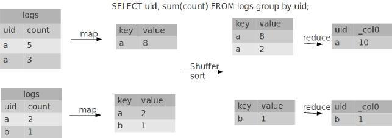
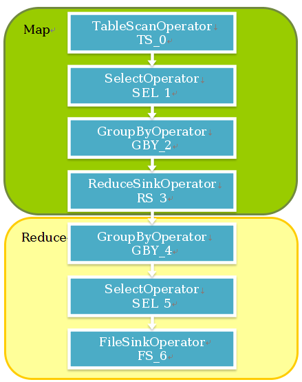
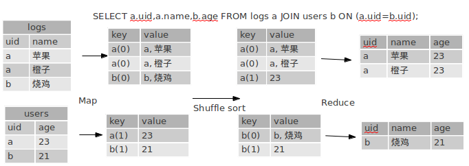
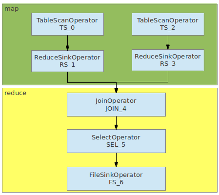

# hive的group by、join、distinct等实现原理
`https://www.cnblogs.com/yyy-blog/p/7077504.html`

## Hive 的 distribute by
Order by 能够预期产生完全排序的结果，但是它是通过只用一个reduce来做到这点的。所以对于大规模的数据集它的效率非常低。在很多情况下，并不需要全局排序，此时可以换成Hive的非标准扩展sort by。Sort by为每个reducer产生一个排序文件。在有些情况下，你需要控制某个特定行应该到哪个reducer，通常是为了进行后续的聚集操作。Hive的distribute by 子句可以做这件事。

```sql
// 根据年份和气温对气象数据进行排序，以确保所有具有相同年份的行最终都在一个reducer分区中  
from record2  
select year, temperature  
distribute by year  
sort by year asc, temperature desc;  
```

## Distinct 的实现

### 准备数据
```sql
create table logs(uid string,name string,count string);
```

```sql
insert into table logs values('a','apple','3'),('a','orange','3'),('a','banana','1'),('b','banana','3');
```

```sql
select * from logs;
OK
a       apple   3
a       orange  3
a       banana  1
b       banana  3
```

### 计算过程
语句
```sql
SELECT COUNT, COUNT(DISTINCT uid) FROM logs GROUP BY COUNT;
```


* 1. 第一步先在mapper计算部分值，会以count和uid作为key，如果是distinct并且之前已经出现过，则忽略这条计算。第一步是以组合为key，第二步是以count为key.    
* 2.	ReduceSink是在mapper.close()时才执行的，在GroupByOperator.close()时，把结果输出。注意这里虽然key是count和uid，但是在reduce时分区是按count来的！    
* 3.	第一步的distinct计算的值没用，要留到reduce计算的才准确。这里只是减少了key组合相同的行。不过如果是普通的count，后面是会合并起来的。    
* 4.	distinct通过比较lastInvoke判断要不要+1（因为在reduce是排序过了的，所以判断distict的字段变了没有，如果没变，则不+1）  

### Operator


### Explain
```sql
hive> explain select count, count(distinct uid) from logs group by count;
OK
ABSTRACT SYNTAX TREE:
  (TOK_QUERY (TOK_FROM (TOK_TABREF (TOK_TABNAME logs))) (TOK_INSERT (TOK_DESTINATION (TOK_DIR TOK_TMP_FILE)) (TOK_SELECT (TOK_SELEXPR (TOK_TABLE_OR_COL count)) (TOK_SELEXPR (TOK_FUNCTIONDI count (TOK_TABLE_OR_COL uid)))) (TOK_GROUPBY (TOK_TABLE_OR_COL count))))
 
STAGE DEPENDENCIES:
  Stage-1 is a root stage
  Stage-0 is a root stage
 
STAGE PLANS:
  Stage: Stage-1
    Map Reduce
      Alias -> Map Operator Tree:
        logs 
          TableScan //表扫描
            alias: logs
            Select Operator//列裁剪，取出uid，count字段就够了
              expressions:
                    expr: count
                    type: int
                    expr: uid
                    type: string
              outputColumnNames: count, uid
              Group By Operator //先来map聚集
                aggregations:
                      expr: count(DISTINCT uid) //聚集表达式
                bucketGroup: false
                keys:
                      expr: count
                      type: int
                      expr: uid
                      type: string
                mode: hash //hash方式
                outputColumnNames: _col0, _col1, _col2
                Reduce Output Operator
                  key expressions: //输出的键
                        expr: _col0 //count
                        type: int
                        expr: _col1 //uid
                        type: string
                  sort order: ++
                  Map-reduce partition columns: //这里是按group by的字段分区的
                        expr: _col0 //这里表示count
                        type: int
                  tag: -1
                  value expressions:
                        expr: _col2
                        type: bigint
      Reduce Operator Tree:
        Group By Operator //第二次聚集
          aggregations:
                expr: count(DISTINCT KEY._col1:0._col0) //uid:count
          bucketGroup: false
          keys:
                expr: KEY._col0 //count
                type: int
          mode: mergepartial //合并
          outputColumnNames: _col0, _col1
          Select Operator //列裁剪
            expressions:
                  expr: _col0
                  type: int
                  expr: _col1
                  type: bigint
            outputColumnNames: _col0, _col1
            File Output Operator //输出结果到文件
              compressed: false
              GlobalTableId: 0
              table:
                  input format: org.apache.hadoop.mapred.TextInputFormat
                  output format: org.apache.hadoop.hive.ql.io.HiveIgnoreKeyTextOutputFormat
 
  Stage: Stage-0
    Fetch Operator
      limit: -1

3.
```

## Group By 的实现

### 数据准备
```sql
hive> SELECT * FROM logs;
a	苹果	5
a	橙子	3
a      苹果   2
b	烧鸡	1
 
hive> SELECT uid, SUM(COUNT) FROM logs GROUP BY uid;
a	10
b	1
```

### 计算过程


默认设置了hive.map.aggr=true，所以会在mapper端先group by一次，最后再把结果merge起来，为了减少reducer处理的数据量。注意看explain的mode是不一样的。mapper是hash，reducer是mergepartial。如果把hive.map.aggr=false，那将groupby放到reducer才做，他的mode是complete.

### Operator


### Explain
```sql
hive> explain SELECT uid, sum(count) FROM logs group by uid;
OK
ABSTRACT SYNTAX TREE:
  (TOK_QUERY (TOK_FROM (TOK_TABREF (TOK_TABNAME logs))) (TOK_INSERT (TOK_DESTINATION (TOK_DIR TOK_TMP_FILE)) (TOK_SELECT (TOK_SELEXPR (TOK_TABLE_OR_COL uid)) (TOK_SELEXPR (TOK_FUNCTION sum (TOK_TABLE_OR_COL count)))) (TOK_GROUPBY (TOK_TABLE_OR_COL uid))))
 
STAGE DEPENDENCIES:
  Stage-1 is a root stage
  Stage-0 is a root stage
 
STAGE PLANS:
  Stage: Stage-1
    Map Reduce
      Alias -> Map Operator Tree:
        logs 
          TableScan // 扫描表
            alias: logs
            Select Operator //选择字段
              expressions:
                    expr: uid
                    type: string
                    expr: count
                    type: int
              outputColumnNames: uid, count
              Group By Operator //这里是因为默认设置了hive.map.aggr=true，会在mapper先做一次聚合，减少reduce需要处理的数据
                aggregations:
                      expr: sum(count) //聚集函数
                bucketGroup: false
                keys: //键
                      expr: uid
                      type: string
                mode: hash //hash方式，processHashAggr()
                outputColumnNames: _col0, _col1
                Reduce Output Operator //输出key，value给reducer
                  key expressions:
                        expr: _col0
                        type: string
                  sort order: +
                  Map-reduce partition columns:
                        expr: _col0
                        type: string
                  tag: -1
                  value expressions:
                        expr: _col1
                        type: bigint
      Reduce Operator Tree:
        Group By Operator
 
          aggregations:
                expr: sum(VALUE._col0)
//聚合
          bucketGroup: false
          keys:
                expr: KEY._col0
                type: string
          mode: mergepartial //合并值
          outputColumnNames: _col0, _col1
          Select Operator //选择字段
            expressions:
                  expr: _col0
                  type: string
                  expr: _col1
                  type: bigint
            outputColumnNames: _col0, _col1
            File Output Operator //输出到文件
              compressed: false
              GlobalTableId: 0
              table:
                  input format: org.apache.hadoop.mapred.TextInputFormat
                  output format: org.apache.hadoop.hive.ql.io.HiveIgnoreKeyTextOutputFormat
 
  Stage: Stage-0
    Fetch Operator
      limit: -1
```

## join原理 

### 准备数据
语句
SELECT a.uid,a.name,b.age FROM logs a JOIN users b ON (a.uid=b.uid);
我们希望的结果是把users表join进来获取age字段。
```sql
hive> SELECT * FROM logs;
OK
a	苹果	5
a	橙子	3
b	烧鸡	1
 
hive> SELECT * FROM users;
OK
a	23
b	21
 
hive> SELECT a.uid,a.name,b.age FROM logs a JOIN users b ON (a.uid=b.uid);
a	苹果	23
a	橙子	23
b	烧鸡	21
```

### 计算过程


* key这里后面的数字是tag，后面在reduce阶段用来区分来自于那个表的数据。tag是附属在key后面的。那为什么会把a(0)和a(1)汇集在一起了呢，是因为对先对a求了hashcode，设在了HiveKey上，所以同一个key还是在一起的。    
* Map阶段只是拆分key和value。    
* reduce阶段主要看它是如何把它合并起来了，从图上可以直观的看到，其实就是把tag=1的内容，都加到tag=0的后面，就是这么简单。    
* 代码实现上，就是先临时用个变量把值存储起来在storage里面, storage(0) = [{a, 苹果}, {a, 橙子}] storage(1) = [{23}]，当key变化（如a变为b）或全部结束时，会调用endGroup()方法，把内容合并起来。变成[{a,苹果,23}, {a, 橙子,23}]  

### Operator


### Explain
```sql
hive> explain SELECT a.uid,a.name,b.age FROM logs a JOIN users b ON (a.uid=b.uid);
OK
 
//语法树
ABSTRACT SYNTAX TREE:
  (TOK_QUERY (TOK_FROM (TOK_JOIN (TOK_TABREF (TOK_TABNAME logs) a) (TOK_TABREF (TOK_TABNAME users) b) (= (. (TOK_TABLE_OR_COL a) uid) (. (TOK_TABLE_OR_COL b) uid)))) (TOK_INSERT (TOK_DESTINATION (TOK_DIR TOK_TMP_FILE)) (TOK_SELECT (TOK_SELEXPR (. (TOK_TABLE_OR_COL a) uid)) (TOK_SELEXPR (. (TOK_TABLE_OR_COL a) name)) (TOK_SELEXPR (. (TOK_TABLE_OR_COL b) age)))))
 
//阶段
STAGE DEPENDENCIES:
  Stage-1 is a root stage
  Stage-0 is a root stage
 
STAGE PLANS:
  Stage: Stage-1
    Map Reduce
      Alias -> Map Operator Tree: //mapper阶段
        a 
          TableScan //扫描表, 就只是一行一行的传递下去而已
            alias: a
            Reduce Output Operator //输出给reduce的内容
              key expressions: // key啦，这里的key是uid，就是我们写在ON子句那个，你可以试试加多几个条件
                    expr: uid
                    type: string
              sort order: + //排序
              Map-reduce partition columns://分区字段，貌似是和key一样的
                    expr: uid
                    type: string
              tag: 0 //用来区分这个key是来自哪个表的
              value expressions: //reduce用到的value字段
                    expr: uid
                    type: string
                    expr: name
                    type: string
        b 
          TableScan //扫描表, 就只是一行一行的传递下去而已
            alias: b
            Reduce Output Operator //输出给reduce的内容
              key expressions: //key
                    expr: uid
                    type: string
              sort order: +
              Map-reduce partition columns: //分区字段
                    expr: uid
                    type: string
              tag: 1 //用来区分这个key是来自哪个表的
              value expressions: //值
                    expr: age
                    type: int
      Reduce Operator Tree: // reduce阶段
        Join Operator // JOIN的Operator
          condition map:
               Inner Join 0 to 1 // 内连接0和1表
          condition expressions: // 第0个表有两个字段，分别是uid和name, 第1个表有一个字段age
 {VALUE._col0} {VALUE._col1}
 {VALUE._col1}
          handleSkewJoin: false //是否处理倾斜join，如果是，会分为两个MR任务
          outputColumnNames: _col0, _col1, _col6 //输出字段
          Select Operator //列裁剪（我们sql写的select字段）
            expressions:
                  expr: _col0
                  type: string
                  expr: _col1
                  type: string
                  expr: _col6
                  type: int
            outputColumnNames: _col0, _col1, _col2
            File Output Operator //把结果输出到文件
              compressed: false
              GlobalTableId: 0
              table:
                  input format: org.apache.hadoop.mapred.TextInputFormat
                  output format: org.apache.hadoop.hive.ql.io.HiveIgnoreKeyTextOutputFormat
 
  Stage: Stage-0
    Fetch Operator
      limit: -1
```


```sql

```

