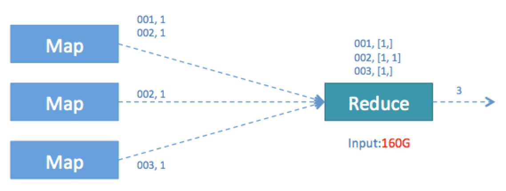

# 选择distinct还是group by

总结：
```sql
//只会走一个reducer，设置reducer个数也没用
SELECT COUNT( DISTINCT id ) FROM TABLE_NAME WHERE ...;

//会走两个mr，但是数据多时比 count(distinct order_no) 快
select count(t.order_no) from (select order_no from order_snap group by order_no) t;

//据说hive会优化成和一样先group by再COUNT(我还没测试)，还是用上面的写法吧，好理解。
SELECT COUNT(*) FROM (SELECT DISTINCT id FROM TABLE_NAME WHERE … ) t;

//据说这个分组COUNT(DISTINCT field)只会走一个mr，确实能实现，按分组字段分区,排序则按照分组字段、DISTINCT字段排序即可，reducer中比较是否与上次相同即可统计。(我还没测试)
SELECT COUNT, COUNT(DISTINCT uid) FROM logs GROUP BY COUNT;
```

## hive group by distinct区别以及性能比较
`https://blog.csdn.net/xiaoshunzi111/article/details/68484426`

### Hive去重统计
相信使用Hive的人平时会经常用到去重统计之类的吧，但是好像平时很少关注这个去重的性能问题，但是当一个表的数据量非常大的时候，会发现一个简单的count(distinct order_no)这种语句跑的特别慢，和直接运行count(order_no)的时间差了很多，于是研究了一下。
先说结论:能使用group by代替distinc就不要使用distinct，例子：

### 实际论证
order_snap为订单的快照表 总记录条数763191489，即将近8亿条记录,总大小:108.877GB,存储的是公司所有的订单信息，表的字段大概有20个,其中订单号是没有重复的,所以在统计总共有多少订单号的时候去重不去重结果都一样，我们来看看:
统计所有的订单有多少条条数，一个count函数就可以搞定的sql性能如何。

**DISTINCT**

```sql
select count(distinct order_no) from order_snap;
Stage-Stage-1: Map: 396 Reduce: 1 Cumulative CPU: 7915.67 sec HDFS Read: 119072894175 HDFS Write: 10 SUCCESS
Total MapReduce CPU Time Spent: 0 days 2 hours 11 minutes 55 seconds 670 msec
OK
_c0
763191489
Time taken: 1818.864 seconds, Fetched: 1 row(s)
```

**GROUP BY**

```sql
select count(t.order_no) from (select order_no from order_snap group by order_no) t;
Stage-Stage-1: Map: 396 Reduce: 457 Cumulative CPU: 10056.7 sec HDFS Read: 119074266583 HDFS Write: 53469 SUCCESS
Stage-Stage-2: Map: 177 Reduce: 1 Cumulative CPU: 280.22 sec HDFS Read: 472596 HDFS Write: 10 SUCCESS
Total MapReduce CPU Time Spent: 0 days 2 hours 52 minutes 16 seconds 920 msec
OK
_c0
763191489
Time taken: 244.192 seconds, Fetched: 1 row(s)
```

**结论**:第二种写法的性能是第一种的7.448499541倍

注意到为什么会有这个差异，Hadoop其实就是处理大数据的，Hive并不怕数据有多大，怕的就是数据倾斜,我们看看两者的输出信息:
```sql
# distinct
Stage-Stage-1: Map: 396 Reduce: 1 Cumulative CPU: 7915.67 sec HDFS Read: 119072894175 HDFS Write: 10 SUCCESS
# group by
Stage-Stage-1: Map: 396 Reduce: 457 Cumulative CPU: 10056.7 sec HDFS Read: 119074266583 HDFS Write: 53469 SUCCESS
```

发现猫腻了没有，**使用distinct会将所有的order_no都shuffle到一个reducer里面**，这就是我们所说的数据倾斜，都倾斜到一个reducer这样性能能不低么？再看第二个，直接按订单号分组，起了457个reducer，将数据分布到多台机器上执行，时间当然快了.

由于没有手动指定Reduce的个数，Hive会根据数据的大小动态的指定Reduce大小，你也可以手动指定
```sql
hive> set mapred.reduce.tasks=100；
```

类似这样,所以如果数据量特别大的情况下，尽量不要使用distinct吧。
但是如果你想在一条语句里看总记录条数以及去重之后的记录条数，那没有办法过滤，所以你有两个选择，要么使用两个sql语句分别跑，然后union all或者就使用普通的distinct。具体来说得看具体情况，**直接使用distinct可读性好，数据量如果不大的话推荐使用，如果数据太大了，性能受到影响了，再考虑优化**

## hive count(distinct) 原理
`https://blog.csdn.net/oracle8090/article/details/80760233`

Hive是Hadoop的子项目，它提供了对数据的结构化管理和类SQL语言的查询功能。SQL的交互方式极大程度地降低了Hadoop生态环境中数据处理的门槛，用户不需要编写程序，通过SQL语句就可以对数据进行分析和处理。目前很多计算需求都可以由Hive来完成，极大程度地降低了开发成本。

目前，Hive底层使用MapReduce作为实际计算框架，SQL的交互方式隐藏了大部分MapReduce的细节。这种细节的隐藏在带来便利性的同时，也对计算作业的调优带来了一定的难度。未经优化的SQL语句转化后的MapReduce作业，它的运行效率可能大大低于用户的预期。本文我们就来分析一个简单语句的优化过程。

日常统计场景中，我们经常会对一段时期内的字段进行消重并统计数量，SQL语句类似于
```sql
SELECT COUNT( DISTINCT id ) FROM TABLE_NAME WHERE ...;
```

这条语句是从一个表的符合WHERE条件的记录中统计不重复的id的总数。
该语句转化为MapReduce作业后执行示意图如下，图中还列出了我们实验作业中Reduce阶段的数据规模：


由于引入了DISTINCT，因此在Map阶段无法利用combine对输出结果消重，必须将id作为Key输出，在Reduce阶段再对来自于不同Map Task、相同Key的结果进行消重，计入最终统计值。

我们看到作业运行时的Reduce Task个数为1，对于统计大数据量时，这会导致最终Map的全部输出由单个的ReduceTask处理。这唯一的Reduce Task需要Shuffle大量的数据，并且进行排序聚合等处理，这使得它成为整个作业的IO和运算瓶颈。

经过上述分析后，我们尝试显式地增大Reduce Task个数来提高Reduce阶段的并发，使每一个Reduce Task的数据处理量控制在2G左右。具体设置如下：
```sql
set mapred.reduce.tasks=100
```

调整后我们发现这一参数并没有影响实际Reduce Task个数，Hive运行时输出“Number of reduce tasks determined at compile time: 1”。原来Hive在处理COUNT这种“全聚合(full aggregates)”计算时，它会忽略用户指定的Reduce Task数，而强制使用1。我们只能采用变通的方法来绕过这一限制。我们利用Hive对嵌套语句的支持，将原来一个MapReduce作业转换为两个作业，在第一阶段选出全部的非重复id，在第二阶段再对这些已消重的id进行计数。这样在第一阶段我们可以通过增大Reduce的并发数，并发处理Map输出。在第二阶段，由于id已经消重，因此COUNT(*)操作在Map阶段不需要输出原id数据，只输出一个合并后的计数即可。这样即使第二阶段Hive强制指定一个Reduce Task，极少量的Map输出数据也不会使单一的Reduce Task成为瓶颈。改进后的SQL语句如下：
```sql
SELECT COUNT(*) FROM (SELECT DISTINCT id FROM TABLE_NAME WHERE … ) t;
```

在实际运行时，我们发现Hive还对这两阶段的作业做了额外的优化。它将第二个MapReduce作业Map中的Count过程移到了第一个作业的Reduce阶段。这样在第一阶Reduce就可以输出计数值，而不是消重的全部id。这一优化大幅地减少了第一个作业的Reduce输出IO以及第二个作业Map的输入数据量。最终在同样的运行环境下优化后的语句执行只需要原语句20%左右的时间。优化后的MapReduce作业流如下：


从上述优化过程我们可以看出，一个简单的统计需求，如果不理解Hive和MapReduce的工作原理，它可能会比优化后的执行过程多四、五倍的时间。我们在利用Hive简化开发的同时，也要尽可能优化SQL语句，提升计算作业的执行效率。

## Hive底层实现 - Distinct 的底层实现
`https://blog.csdn.net/zuolovefu/article/details/79024970`

### 分析语句
```sql
SELECT count, COUNT(DISTINCT uid) FROM logs GROUP BY count;
```
根据count分组，计算独立用户数。
 
业务解释：分析有多少个人有x个物品

### 准备数据
```sql
create table logs(uid string,name string,count string);
```
```sql
insert into table logs values('a','apple','3'),('a','orange','3'),('a','banana','1'),('b','banana','3');
```
```sql
select * from logs;
OK
a       apple   3
a       orange  3
a       banana  1
b       banana  3
```

### 计算过程


* 第一步先在mapper计算部分值，会以count和uid作为key，如果是distinct并且之前已经出现过，则忽略这条计算。第一步是以组合为key，第二步是以count为key.    
* ReduceSink是在mapper.close()时才执行的，在GroupByOperator.close()时，把结果输出。注意这里虽然key是count和uid，但是在reduce时分区是按count来的！    
* 第一步的distinct计算的值没用，要留到reduce计算的才准确。这里只是减少了key组合相同的行。不过如果是普通的count，后面是会合并起来的。    
* distinct通过比较lastInvoke判断要不要+1（因为在reduce是排序过了的，所以判断distict的字段变了没有，如果没变，则不+1）   

### Operator


### Explain
```sql
explain select count, count(distinct uid) from logs group by count;
OK
STAGE DEPENDENCIES:
  Stage-1 is a root stage
  Stage-0 depends on stages: Stage-1

STAGE PLANS:
  Stage: Stage-1
    Map Reduce
      Map Operator Tree:
          TableScan
            alias: logs
            Statistics: Num rows: 4 Data size: 39 Basic stats: COMPLETE Column stats: NONE
            Select Operator
              expressions: count (type: string), uid (type: string)
              outputColumnNames: count, uid
              Statistics: Num rows: 4 Data size: 39 Basic stats: COMPLETE Column stats: NONE
              Group By Operator
                aggregations: count(DISTINCT uid)
                keys: count (type: string), uid (type: string)
                mode: hash
                outputColumnNames: _col0, _col1, _col2
                Statistics: Num rows: 4 Data size: 39 Basic stats: COMPLETE Column stats: NONE
                Reduce Output Operator
                  key expressions: _col0 (type: string), _col1 (type: string)
                  sort order: ++
                  Map-reduce partition columns: _col0 (type: string)
                  Statistics: Num rows: 4 Data size: 39 Basic stats: COMPLETE Column stats: NONE
      Reduce Operator Tree:
        Group By Operator
          aggregations: count(DISTINCT KEY._col1:0._col0)
          keys: KEY._col0 (type: string)
          mode: mergepartial
          outputColumnNames: _col0, _col1
          Statistics: Num rows: 2 Data size: 19 Basic stats: COMPLETE Column stats: NONE
          File Output Operator
            compressed: false
            Statistics: Num rows: 2 Data size: 19 Basic stats: COMPLETE Column stats: NONE
            table:
                input format: org.apache.hadoop.mapred.TextInputFormat
                output format: org.apache.hadoop.hive.ql.io.HiveIgnoreKeyTextOutputFormat
                serde: org.apache.hadoop.hive.serde2.lazy.LazySimpleSerDe

  Stage: Stage-0
    Fetch Operator
      limit: -1
      Processor Tree:
        ListSink
```


```sql

```