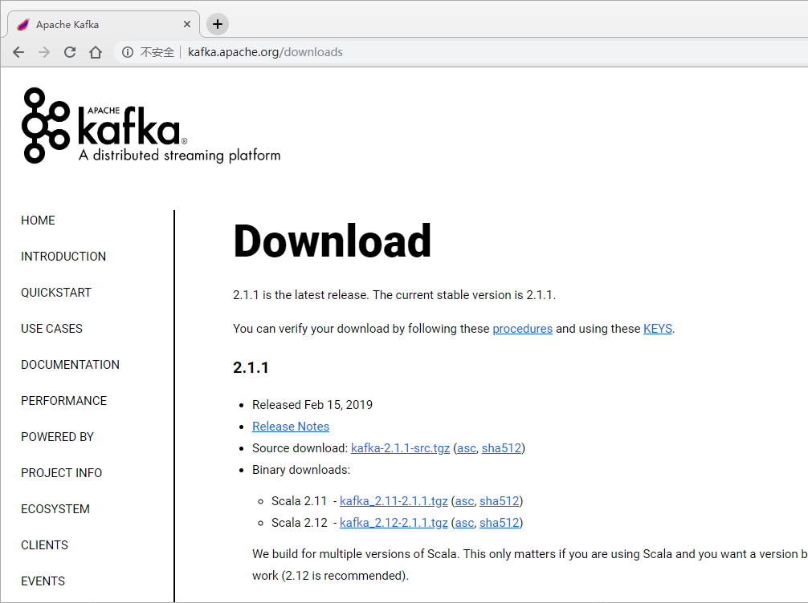
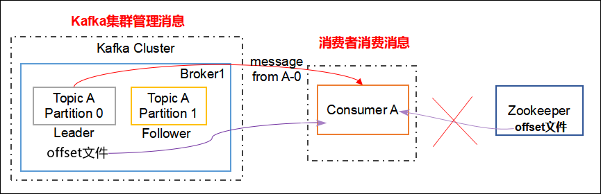

## Kafka集群部署
### 环境准备
#### 集群规划
hadoop01                   hadoop02               hadoop03
zk                            zk                      zk
kafka                        kafka                   kafka

#### jar包下载
http://kafka.apache.org/downloads.html



### Kafka集群部署
1）解压安装包
```shell
tar -zxvf kafka_2.11-0.11.0.2.tgz  -C apps/
```

2）在/opt/module/kafka目录下创建logs文件夹
```shell
[hadoop@hadoop01 kafka_2.11-0.11.0.2]$ mkdir logs
```

3）修改配置文件
```shell
[hadoop@hadoop01 kafka_2.11-0.11.0.2]$ cd config/
[hadoop@hadoop01 kafka_2.11-0.11.0.2]$ vim server.properties
```

输入以下内容：
```python
#broker的全局唯一编号，不能重复
broker.id=0
#删除topic功能使能
delete.topic.enable=true
#处理网络请求的线程数量
num.network.threads=3
#用来处理磁盘IO的现成数量
num.io.threads=8
#发送套接字的缓冲区大小
socket.send.buffer.bytes=102400
#接收套接字的缓冲区大小
socket.receive.buffer.bytes=102400
#请求套接字的缓冲区大小
socket.request.max.bytes=104857600
#kafka运行日志存放的路径	
log.dirs=/home/hadoop/apps/kafka_2.11-0.11.0.2/logs
#topic在当前broker上的分区个数
num.partitions=1
#用来恢复和清理data下数据的线程数量
num.recovery.threads.per.data.dir=1
#segment文件保留的最长时间，超时将被删除
log.retention.hours=168
#配置连接Zookeeper集群地址
zookeeper.connect=hadoop01:2181,hadoop02:2181,hadoop03:2181
```


4）配置环境变量
```shell
export JAVA_HOME=/usr/local/jdk1.7.0_79
#export JAVA_HOME=/usr/local/jdk1.8.0_181
export SCALA_HOME=/usr/local/scala-2.11.8
export HADOOP_HOME=/home/hadoop/apps/hadoop-2.6.4
export HIVE_HOME=/home/hadoop/apps/hive-1.2.1
export FLUME_HOME=/home/hadoop/apps/flume-1.6.0
export SQOOP_HOME=/home/hadoop/apps/sqoop-1.4.6
export ZOOKEEPER_HOME=/home/hadoop/apps/zookeeper-3.4.5
export HBASE_HOME=/home/hadoop/apps/hbase-1.3.1
export KAFKA_HOME=/home/hadoop/apps/kafka_2.11-0.11.0.2
export SPARK_HOME=/home/hadoop/apps/spark-2.1.1-bin-hadoop2.6


export PATH=$PATH:$JAVA_HOME/bin:$SCALA_HOME/bin:$HADOOP_HOME/bin:$HADOOP_HOME/sbin:$HIVE_HOME/bin

export PATH=$PATH:$FLUME_HOME/bin:$SQOOP_HOME/bin:$ZOOKEEPER_HOME/bin:$HBASE_HOME/bin:KAFKA_HOME/bin
```

5）分发安装包
```shell
scp -r kafka_2.11-0.11.0.2/ hadoop02:~/apps/
scp -r kafka_2.11-0.11.0.2/ hadoop03:~/apps/
```
**注意：分发之后记得配置其他机器的环境变量**


6）分别在hadoop02和hadoop03上修改配置文件config/server.properties中的`broker.id=1、broker.id=2`

注：broker.id不得重复


我的server.properties文件：
```python

# The id of the broker. This must be set to a unique integer for each broker.
broker.id=0

# Switch to enable topic deletion or not, default value is false
delete.topic.enable=true

############################# Socket Server Settings #############################

# The number of threads that the server uses for receiving requests from the network and sending responses to the network
num.network.threads=3

# The number of threads that the server uses for processing requests, which may include disk I/O
num.io.threads=8

# The send buffer (SO_SNDBUF) used by the socket server
socket.send.buffer.bytes=102400

# The receive buffer (SO_RCVBUF) used by the socket server
socket.receive.buffer.bytes=102400

# The maximum size of a request that the socket server will accept (protection against OOM)
socket.request.max.bytes=104857600


############################# Log Basics #############################

# A comma seperated list of directories under which to store log files
log.dirs=/home/hadoop/apps/kafka_2.11-0.11.0.2/logs

# The default number of log partitions per topic. More partitions allow greater
# parallelism for consumption, but this will also result in more files across
# the brokers.
num.partitions=1

# The number of threads per data directory to be used for log recovery at startup and flushing at shutdown.
# This value is recommended to be increased for installations with data dirs located in RAID array.
num.recovery.threads.per.data.dir=1

############################# Internal Topic Settings  #############################
# The replication factor for the group metadata internal topics "__consumer_offsets" and "__transaction_state"
# For anything other than development testing, a value greater than 1 is recommended for to ensure availability such as 3.
offsets.topic.replication.factor=1
transaction.state.log.replication.factor=1
transaction.state.log.min.isr=1


# The minimum age of a log file to be eligible for deletion due to age
log.retention.hours=168

# A size-based retention policy for logs. Segments are pruned from the log as long as the remaining
# segments don't drop below log.retention.bytes. Functions independently of log.retention.hours.
#log.retention.bytes=1073741824

# The maximum size of a log segment file. When this size is reached a new log segment will be created.
log.segment.bytes=1073741824

# The interval at which log segments are checked to see if they can be deleted according
# to the retention policies
log.retention.check.interval.ms=300000

############################# Zookeeper #############################

# Zookeeper connection string (see zookeeper docs for details).
# This is a comma separated host:port pairs, each corresponding to a zk
# server. e.g. "127.0.0.1:3000,127.0.0.1:3001,127.0.0.1:3002".
# You can also append an optional chroot string to the urls to specify the
# root directory for all kafka znodes.
zookeeper.connect=hadoop01:2181,hadoop02:2181,hadoop03:2181

# Timeout in ms for connecting to zookeeper
zookeeper.connection.timeout.ms=6000

group.initial.rebalance.delay.ms=0
```

### Kafka集群启动和关闭命令
需要先启动zkServer，zkServer命令：
```
./zkServer.sh start
./zkServer.sh stop
./zkServer.sh restart
./zkServer.sh status
```

依次在三台电脑上启动zookeper：
zkServer.sh start
查看启动状态：
zkServer.sh status

依次在三台电脑上启动kafka：
bin/kafka-server-start.sh config/server.properties

进程查看带全类名：
jps -l


#### 启动Kafka集群
依次在hadoop102、hadoop103、hadoop104节点上启动kafka
```
[atguigu@hadoop102 kafka]$ bin/kafka-server-start.sh config/server.properties &
[atguigu@hadoop103 kafka]$ bin/kafka-server-start.sh config/server.properties &
[atguigu@hadoop104 kafka]$ bin/kafka-server-start.sh config/server.properties &
```
启动Kafka是一个阻塞进程，会打印我们操作kafka的日志，我们可以把窗口放到后台，在命令后面加一个与&符号，将该阻塞进程放到后台。

写群起Kafka集群脚本的时候，需要使用-daemon命令，具体如下：
```
[atguigu@hadoop102 kafka]$ bin/kafka-server-start.sh -daemon config/server.properties
[atguigu@hadoop103 kafka]$ bin/kafka-server-start.sh -daemon config/server.properties
[atguigu@hadoop104 kafka]$ bin/kafka-server-start.sh -daemon config/server.properties
```
-daemon 表示守护进程，会将日志打印在后台。
#### 关闭Kafka集群
```
[atguigu@hadoop102 kafka]$ bin/kafka-server-stop.sh stop
[atguigu@hadoop103 kafka]$ bin/kafka-server-stop.sh stop
[atguigu@hadoop104 kafka]$ bin/kafka-server-stop.sh stop
```

写群起Kafka集群脚本的时候，需要使用-daemon命令，具体如下：
```
[atguigu@hadoop102 kafka]$ bin/kafka-server-stop.sh -daemon
[atguigu@hadoop103 kafka]$ bin/kafka-server-stop.sh -daemon
[atguigu@hadoop104 kafka]$ bin/kafka-server-stop.sh -daemon
```

### Kafka命令行操作
补充知识:
```
jps         查看当前进程
jps -l      查看当前进程所属主类

`注意：`当有很多进程都是同一个名字，我们该如何区分？
`答：`每一次启动一个进程后，我们将该进程与对应的进程ID写入一个文档中。如果某一个进程出现问题或者某一个框架出现问题，便于我们kill掉相应的进程。不至于关闭整个系统。（生产环境下一般不允许关闭或重启整个系统！）
```

#### 查看当前服务器中的所有topic
```
bin/kafka-topics.sh --zookeeper hadoop01:2181 --list

bin/kafka-topics.sh --zookeeper hadoop01:2181,hadoop02:2181 --list
```

#### 创建topic
```
bin/kafka-topics.sh --zookeeper hadoop01:2181 --create --replication-factor 2 --partitions 3 --topic second

bin/kafka-topics.sh --zookeeper hadoop01:2181,hadoop02:2181 --create --replication-factor 1 --partitions 3 --topic first

bin/kafka-topics.sh --zookeeper hadoop01:2181,hadoop02:2181 --create --replication-factor 2 --partitions 3 --topic test
```

选项说明：
  --topic 定义topic名
  --replication-factor 定义副本数（注：副本数不能大于节点数，否则会报错！）
  --partitions 定义分区数

#### 删除topic
```
bin/kafka-topics.sh --zookeeper  hadoop01:2181,hadoop02:2181  --delete --topic first
```
注意：需要server.properties中设置delete.topic.enable=true否则只是标记删除或者直接重启。


#### 发送消息（生产者连接的是kafka集群默认的端口号是：9092）
```
bin/kafka-console-producer.sh --broker-list hadoop01:9092,hadoop02:2181 --topic first
```
注意：生产者连接的是kafka集群。

#### 消费消息
老版本：
```
bin/kafka-console-consumer.sh --zookeeper hadoop01:2181 --from-beginning --topic first
```
新版本：
```
bin/kafka-console-consumer.sh --bootstrap-server hadoop01:9092 --from-beginning --topic first
bin/kafka-console-consumer.sh --bootstrap-server hadoop01:9092,hadoop02:9092 --topic test
```
`注意：`消费者会将自己的 offset 文件保存在 zookeeper(低版本的 kafka)。所以消费者连接的是 zookeeper。

--from-beginning：会把first主题中以往所有的数据都读取出来。根据业务场景选择是否增加该配置。如果不加该配置，那么消费者消费的消息将是最新的消息(不包括以往的所有数据)


#### 查看某个topic的详情
```
bin/kafka-topics.sh --zookeeper hadoop01:2181 --describe --topic first
```
```
Topic:first    PartitionCount:1    ReplicationFactor:3 Configs:
Topic: first    Partition: 0    Leader: 2   Replicas: 2,0,1 Isr: 2,0,1
```
Isr的作用：当 leader 挂掉后，选举新 leader 时使用的。Isr 的排序规则是：与 leader 的相似度，越高越在前，越在前越有可能成为新 leader。

#### 消费消息警告问题解释
```
$ bin/kafka-console-consumer.sh \
> --zookeeper hadoop102:2181 --from-beginning --topic first
Using the ConsoleConsumer with old consumer is deprecated and will be removed in a future major release. Consider using the new consumer by passing [bootstrap-server] instead of [zookeeper].
```
在高版本的kafka中，消费者会将自己的 offset文件 保存在 kafka 集群的本地，不交给 zookeeper 维护了！如下图所示：


**这样做的好处是：提高了效率，减少了网络传输。**

