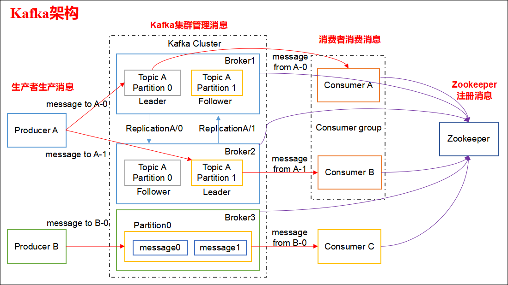
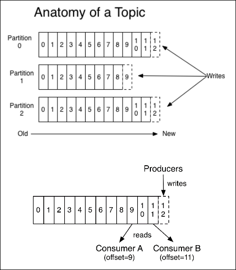
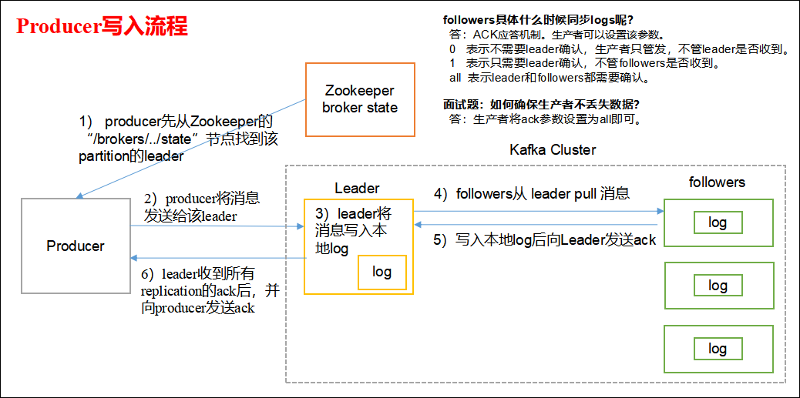
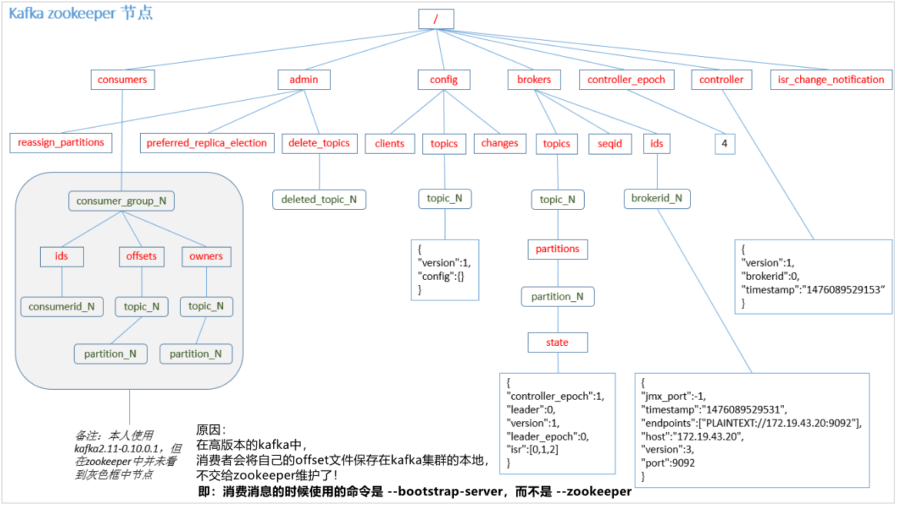
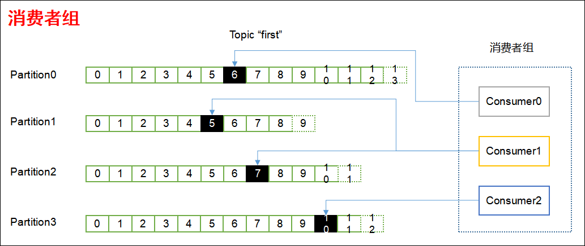

## Kafka工作流程分析


### Kafka 生产过程分析
#### 写入方式
producer 采用推（push）模式将消息发布到 broker，每条消息都被追加（append）到分区（patition）中，属于顺序写磁盘（顺序写磁盘效率比随机写内存要高，保障kafka吞吐率）

#### 分区（Partition）
消息发送时都被发送到一个 topic，其本质就是一个目录，而topic是由一些 Partition Logs(分区日志)组成，其组织结构如下图所示

我们可以看到，每个Partition中的消息都是有序的，生产的消息被不断追加到Partition log上，其中的每一个消息都被赋予了一个唯一的offset值。

##### 分区的原因
（1）方便在集群中扩展，每个 Partition 可以通过调整以适应它所在的机器，而一个topic又可以有多个 Partition 组成，因此整个集群就可以适应任意大小的数据了。  
（2）可以提高并发，因为可以以 Partition 为单位读写了。  

##### 分区的原则
（1）指定了 patition，则直接使用。  
（2）未指定 patition 但指定 key，通过对 key 的 value 进行 hash 出一个 patition。  
（3）patition 和 key 都未指定，使用轮询选出一个 patition。  

DefaultPartitioner类：
```scala
/**
 * The default partitioning strategy:
 * <ul>
 * <li>If a partition is specified in the record, use it
 * <li>If no partition is specified but a key is present choose a partition based on a hash of the key
 * <li>If no partition or key is present choose a partition in a round-robin fashion
 */
public class DefaultPartitioner implements Partitioner {

    private final ConcurrentMap<String, AtomicInteger> topicCounterMap = new ConcurrentHashMap<>();

    public void configure(Map<String, ?> configs) {}

    /**
     * Compute the partition for the given record.
     *
     * @param topic The topic name
     * @param key The key to partition on (or null if no key)
     * @param keyBytes serialized key to partition on (or null if no key)
     * @param value The value to partition on or null
     * @param valueBytes serialized value to partition on or null
     * @param cluster The current cluster metadata
     */
    public int partition(String topic, Object key, byte[] keyBytes, Object value, byte[] valueBytes, Cluster cluster) {
        List<PartitionInfo> partitions = cluster.partitionsForTopic(topic);
        int numPartitions = partitions.size();
        if (keyBytes == null) {
            int nextValue = nextValue(topic);
            List<PartitionInfo> availablePartitions = cluster.availablePartitionsForTopic(topic);
            if (availablePartitions.size() > 0) {
                int part = Utils.toPositive(nextValue) % availablePartitions.size();
                return availablePartitions.get(part).partition();
            } else {
                // no partitions are available, give a non-available partition
                return Utils.toPositive(nextValue) % numPartitions;
            }
        } else {
            // hash the keyBytes to choose a partition
            return Utils.toPositive(Utils.murmur2(keyBytes)) % numPartitions;
        }
    }

    private int nextValue(String topic) {
        AtomicInteger counter = topicCounterMap.get(topic);
        if (null == counter) {
            counter = new AtomicInteger(ThreadLocalRandom.current().nextInt());
            AtomicInteger currentCounter = topicCounterMap.putIfAbsent(topic, counter);
            if (currentCounter != null) {
                counter = currentCounter;
            }
        }
        return counter.getAndIncrement();
    }

    public void close() {}

}
```

#### 副本（Replication）
同一个 partition 可能会有多个 replication（对应 server.properties 配置中的 default.replication.factor=N）。没有 replication 的情况下，一旦b roker 宕机，其上所有 patition 的数据都不可被消费，同时 producer 也不能再将数据存于其上的 partition。引入 replication 之后，同一个 partition 可能会有多个 replication，而这时需要在这些 replication 之间选出一个 leader，producer 和 consumer 只与这个 leader 交互，其它 replication 作为 follower 从leader 中复制数据。

#### 写入流程
producer写入消息流程如下：


1）producer 先从 zookeeper 的 "/brokers/…/state"节点找到该 partition 的 leader  
2）producer 将消息发送给该 leader  
3）leader 将消息写入本地 log  
4）followers 从 leader pull 消息，写入本地 log 后向 leader 发送 ACK  
5）leader 收到所有ISR中的 replication 的 ACK 后，增加 HW（high watermark，最后 commit 的offset）并向 producer 发送 ACK  
注意：要特别注意ACK应答模式！  


### Broker 保存消息
#### 存储方式
物理上把 topic 分成一个或多个 patition（对应 server.properties 中的num.partitions=3配置），每个 patition 物理上对应一个文件夹（该文件夹存储该 patition 的所有消息和索引文件），如下：
```shell
[atguigu@hadoop102 logs]$ ll
drwxrwxr-x. 2 atguigu atguigu  4096 8月   6 14:37 first-0
drwxrwxr-x. 2 atguigu atguigu  4096 8月   6 14:35 first-1
drwxrwxr-x. 2 atguigu atguigu  4096 8月   6 14:37 first-2
[atguigu@hadoop102 logs]$ cd first-0
[atguigu@hadoop102 first-0]$ ll
-rw-rw-r--. 1 atguigu atguigu 10485760 8月   6 14:33 00000000000000000000.index
-rw-rw-r--. 1 atguigu atguigu      219 8月   6 15:07 00000000000000000000.log
-rw-rw-r--. 1 atguigu atguigu 10485756 8月   6 14:33 00000000000000000000.timeindex
-rw-rw-r--. 1 atguigu atguigu        8 8月   6 14:37 leader-epoch-checkpoint
```

#### 存储策略
无论消息是否被消费，kafka 都会保留所有消息。有两种策略可以删除旧数据：  
* 1）基于时间：log.retention.hours=168 （单位是小时，168小时即7天）
* 2）基于大小：log.retention.bytes=1073741824

需要注意的是，因为 Kafka 读取特定消息的时间复杂度为O(1)，即与文件大小无关，所以这里删除过期文件与提高 Kafka 性能无关。


#### Zookeeper存储结构


注意：producer 不在zk中注册，消费者在zk中注册。


### Kafka 消费过程分析
kafka提供了两套 consumer API：高级 Consumer API 和低级 Consumer API。（这些应该是老版本的，新版本低级的api已经被标记为废弃了，高级api也可以控制分区、offset）

#### 高级API
##### 高级API优点
高级 API 写起来简单。  
不需要自行去管理 offset，系统通过 zookeeper 自行管理。  
不需要管理分区、副本等情况，系统自动管理。  
消费者断线会自动根据上一次记录在 zookeeper 中的 offset 去接着获取数据（默认设置1分钟更新一下 zookeeper 中存的 offset）。  
可以使用 group 来区分对同一个 topic 的不同程序的访问分离开来（不同的 group 记录不同的 offset，这样不同程序读取同一个 topic 才不会因为 offset 互相影响）。

##### 高级API缺点
不能自行控制offset（对于某些特殊需求来说）。   
不能细化控制如分区、副本、zk等。   

#### 低级API
##### 低级 API 优点
能够让开发者自己控制 offset，想从哪里读取就从哪里读取。  
自行控制连接分区，对分区自定义进行负载均衡。  
对 zookeeper 的依赖性降低（如：offset 不一定非要靠zk存储，自行存储 offset 即可，比如存在文件或者内存中）。  

##### 低级API缺点
太过复杂，需要自行控制 offset，连接哪个分区，找到分区 leader 等。

#### 消费者组


消费者是以 consumer group 消费者组的方式工作，由一个或者多个消费者组成一个组，共同消费一个 topic。每个分区在同一时间只能由 group 中的一个消费者读取，但是多个 group 可以同时消费这个 partition。在图中，有一个由三个消费者组成的 group，有一个消费者读取主题中的两个分区，另外两个分别读取一个分区。某个消费者读取某个分区，也可以叫做某个消费者是某个分区的拥有者。

在这种情况下，消费者可以通过水平扩展的方式同时读取大量的消息。另外，如果一个消费者失败了，那么其他的 group 成员会自动负载均衡读取之前失败的消费者读取的分区。

#### 消费方式
consumer采用 pull（拉）模式从 broker 中读取数据。

push（推）模式很难适应消费速率不同的消费者，因为消息发送速率是由 broker 决定的。它的目标是尽可能以最快速度传递消息，但是这样很容易造成 consumer 来不及处理消息，典型的表现就是拒绝服务以及网络拥塞。而 pull 模式则可以根据 consumer 的消费能力以适当的速率消费消息。

对于 Kafka 而言，pull 模式更合适，它可简化 broker 的设计，consumer 可自主控制消费消息的速率，同时 consumer 可以自己控制消费方式--即可批量消费也可逐条消费，同时还能选择不同的提交方式从而实现不同的传输语义。

pull 模式不足之处是，如果kafka没有数据，消费者可能会陷入循环中，一直等待数据到达。为了避免这种情况，我们在我们的拉请求中有参数，允许消费者请求在等待数据到达的“长轮询”中进行阻塞（并且可选地等待到给定的字节数，以确保大的传输大小）。

#### 消费者组案例
1）需求：测试同一个消费者组中的消费者，同一时刻只能有一个消费者消费。

2）案例实操：
（1）在hadoop102、hadoop103上修改/opt/module/kafka/config/consumer.properties配置文件中的group.id属性为任意组名。
```
[atguigu@hadoop103 config]$ vim consumer.properties

group.id=atguigu
```
（2）在hadoop102、hadoop103上分别启动消费者
```
[atguigu@hadoop102 kafka]$ bin/kafka-console-consumer.sh \
--zookeeper hadoop102:2181 --topic first --consumer.config config/consumer.properties

[atguigu@hadoop103 kafka]$ bin/kafka-console-consumer.sh \
--zookeeper hadoop102:2181 --topic first --consumer.config config/consumer.properties
```
（3）在hadoop104上启动生产者
```
[atguigu@hadoop104 kafka]$ bin/kafka-console-producer.sh \
--broker-list hadoop102:9092 --topic first
>hello world
```
（4）查看hadoop102和hadoop103的接收者。
 
结论：同一时刻只有一个消费者接收到消息。


