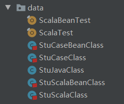
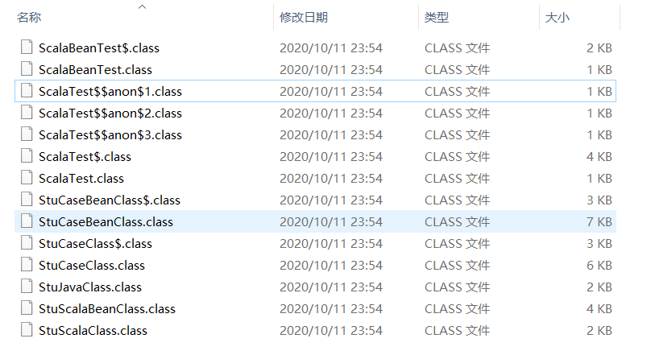

## 普通scala类
StuScalaClass：
```scala
package data

class StuScalaClass {
  var name: String = _
  var age: Int = _
  var score: Double = _
}
```

反编译后生成一个文件，StuScalaClass.class：
```java
package data;

import scala.reflect.*;

@ScalaSignature(bytes = "\u0006\u0001u2A!\u0001\u0002\u0001\u000b\ti1\u000b^;TG\u0006d\u0017m\u00117bgNT\u0011aA\u0001\u0005I\u0006$\u0018m\u0001\u0001\u0014\u0005\u00011\u0001CA\u0004\u000b\u001b\u0005A!\"A\u0005\u0002\u000bM\u001c\u0017\r\\1\n\u0005-A!AB!osJ+g\rC\u0003\u000e\u0001\u0011\u0005a\"\u0001\u0004=S:LGO\u0010\u000b\u0002\u001fA\u0011\u0001\u0003A\u0007\u0002\u0005!I!\u0003\u0001a\u0001\u0002\u0004%\taE\u0001\u0005]\u0006lW-F\u0001\u0015!\t)\u0002D\u0004\u0002\b-%\u0011q\u0003C\u0001\u0007!J,G-\u001a4\n\u0005eQ\"AB*ue&twM\u0003\u0002\u0018\u0011!IA\u0004\u0001a\u0001\u0002\u0004%\t!H\u0001\t]\u0006lWm\u0018\u0013fcR\u0011a$\t\t\u0003\u000f}I!\u0001\t\u0005\u0003\tUs\u0017\u000e\u001e\u0005\bEm\t\t\u00111\u0001\u0015\u0003\rAH%\r\u0005\u0007I\u0001\u0001\u000b\u0015\u0002\u000b\u0002\u000b9\fW.\u001a\u0011\t\u0013\u0019\u0002\u0001\u0019!a\u0001\n\u00039\u0013aA1hKV\t\u0001\u0006\u0005\u0002\bS%\u0011!\u0006\u0003\u0002\u0004\u0013:$\b\"\u0003\u0017\u0001\u0001\u0004\u0005\r\u0011\"\u0001.\u0003\u001d\tw-Z0%KF$\"A\b\u0018\t\u000f\tZ\u0013\u0011!a\u0001Q!1\u0001\u0007\u0001Q!\n!\nA!Y4fA!I!\u0007\u0001a\u0001\u0002\u0004%\taM\u0001\u0006g\u000e|'/Z\u000b\u0002iA\u0011q!N\u0005\u0003m!\u0011a\u0001R8vE2,\u0007\"\u0003\u001d\u0001\u0001\u0004\u0005\r\u0011\"\u0001:\u0003%\u00198m\u001c:f?\u0012*\u0017\u000f\u0006\u0002\u001fu!9!eNA\u0001\u0002\u0004!\u0004B\u0002\u001f\u0001A\u0003&A'\u0001\u0004tG>\u0014X\r\t")
public class StuScalaClass
{
    private String name;
    private int age;
    private double score;
    
    public String name() {
        return this.name;
    }
    
    public void name_$eq(final String x$1) {
        this.name = x$1;
    }
    
    public int age() {
        return this.age;
    }
    
    public void age_$eq(final int x$1) {
        this.age = x$1;
    }
    
    public double score() {
        return this.score;
    }
    
    public void score_$eq(final double x$1) {
        this.score = x$1;
    }
}

```

## case类
StuCaseClass：
```scala
package data

case class StuCaseClass
(
  name: String,
  age: Int,
  score: Double
){
  override def toString: String = "StuCaseClass{" + "name='" + name + '\'' + ", age=" + age + ", score=" + score + '}'
}

```

样例类生成两个文件
StuCaseClass$.class：
```java
package data;

import scala.runtime.*;
import scala.*;

public final class StuCaseClass$ extends AbstractFunction3<String, Object, Object, StuCaseClass> implements Serializable
{
    public static final StuCaseClass$ MODULE$;
    
    static {
        new StuCaseClass$();
    }
    
    public final String toString() {
        return "StuCaseClass";
    }
    
    public StuCaseClass apply(final String name, final int age, final double score) {
        return new StuCaseClass(name, age, score);
    }
    
    public Option<Tuple3<String, Object, Object>> unapply(final StuCaseClass x$0) {
        return (Option<Tuple3<String, Object, Object>>)((x$0 == null) ? None$.MODULE$ : new Some((Object)new Tuple3((Object)x$0.name(), (Object)BoxesRunTime.boxToInteger(x$0.age()), (Object)BoxesRunTime.boxToDouble(x$0.score()))));
    }
    
    private Object readResolve() {
        return StuCaseClass$.MODULE$;
    }
    
    private StuCaseClass$() {
        MODULE$ = this;
    }
}

```

StuCaseClass.class：
```java
package data;

import scala.reflect.*;
import scala.collection.mutable.*;
import scala.collection.*;
import scala.runtime.*;
import scala.*;

@ScalaSignature(bytes = "\u0006\u0001\u0005-c\u0001B\u0001\u0003\u0001\u0016\u0011Ab\u0015;v\u0007\u0006\u001cXm\u00117bgNT\u0011aA\u0001\u0005I\u0006$\u0018m\u0001\u0001\u0014\t\u00011Ab\u0004\t\u0003\u000f)i\u0011\u0001\u0003\u0006\u0002\u0013\u0005)1oY1mC&\u00111\u0002\u0003\u0002\u0007\u0003:L(+\u001a4\u0011\u0005\u001di\u0011B\u0001\b\t\u0005\u001d\u0001&o\u001c3vGR\u0004\"a\u0002\t\n\u0005EA!\u0001D*fe&\fG.\u001b>bE2,\u0007\u0002C\n\u0001\u0005+\u0007I\u0011\u0001\u000b\u0002\t9\fW.Z\u000b\u0002+A\u0011a#\u0007\b\u0003\u000f]I!\u0001\u0007\u0005\u0002\rA\u0013X\rZ3g\u0013\tQ2D\u0001\u0004TiJLgn\u001a\u0006\u00031!A\u0001\"\b\u0001\u0003\u0012\u0003\u0006I!F\u0001\u0006]\u0006lW\r\t\u0005\t?\u0001\u0011)\u001a!C\u0001A\u0005\u0019\u0011mZ3\u0016\u0003\u0005\u0002\"a\u0002\u0012\n\u0005\rB!aA%oi\"AQ\u0005\u0001B\tB\u0003%\u0011%\u0001\u0003bO\u0016\u0004\u0003\u0002C\u0014\u0001\u0005+\u0007I\u0011\u0001\u0015\u0002\u000bM\u001cwN]3\u0016\u0003%\u0002\"a\u0002\u0016\n\u0005-B!A\u0002#pk\ndW\r\u0003\u0005.\u0001\tE\t\u0015!\u0003*\u0003\u0019\u00198m\u001c:fA!)q\u0006\u0001C\u0001a\u00051A(\u001b8jiz\"B!M\u001a5kA\u0011!\u0007A\u0007\u0002\u0005!)1C\fa\u0001+!)qD\fa\u0001C!)qE\fa\u0001S!)q\u0007\u0001C!q\u0005AAo\\*ue&tw\rF\u0001\u0016\u0011\u001dQ\u0004!!A\u0005\u0002m\nAaY8qsR!\u0011\u0007P\u001f?\u0011\u001d\u0019\u0012\b%AA\u0002UAqaH\u001d\u0011\u0002\u0003\u0007\u0011\u0005C\u0004(sA\u0005\t\u0019A\u0015\t\u000f\u0001\u0003\u0011\u0013!C\u0001\u0003\u0006q1m\u001c9zI\u0011,g-Y;mi\u0012\nT#\u0001\"+\u0005U\u00195&\u0001#\u0011\u0005\u0015SU\"\u0001$\u000b\u0005\u001dC\u0015!C;oG\",7m[3e\u0015\tI\u0005\"\u0001\u0006b]:|G/\u0019;j_:L!a\u0013$\u0003#Ut7\r[3dW\u0016$g+\u0019:jC:\u001cW\rC\u0004N\u0001E\u0005I\u0011\u0001(\u0002\u001d\r|\u0007/\u001f\u0013eK\u001a\fW\u000f\u001c;%eU\tqJ\u000b\u0002\"\u0007\"9\u0011\u000bAI\u0001\n\u0003\u0011\u0016AD2paf$C-\u001a4bk2$HeM\u000b\u0002'*\u0012\u0011f\u0011\u0005\b+\u0002\t\t\u0011\"\u0011W\u00035\u0001(o\u001c3vGR\u0004&/\u001a4jqV\tq\u000b\u0005\u0002Y;6\t\u0011L\u0003\u0002[7\u0006!A.\u00198h\u0015\u0005a\u0016\u0001\u00026bm\u0006L!AG-\t\u000f}\u0003\u0011\u0011!C\u0001A\u0005a\u0001O]8ek\u000e$\u0018I]5us\"9\u0011\rAA\u0001\n\u0003\u0011\u0017A\u00049s_\u0012,8\r^#mK6,g\u000e\u001e\u000b\u0003G\u001a\u0004\"a\u00023\n\u0005\u0015D!aA!os\"9q\rYA\u0001\u0002\u0004\t\u0013a\u0001=%c!9\u0011\u000eAA\u0001\n\u0003R\u0017a\u00049s_\u0012,8\r^%uKJ\fGo\u001c:\u0016\u0003-\u00042\u0001\\8d\u001b\u0005i'B\u00018\t\u0003)\u0019w\u000e\u001c7fGRLwN\\\u0005\u0003a6\u0014\u0001\"\u0013;fe\u0006$xN\u001d\u0005\be\u0002\t\t\u0011\"\u0001t\u0003!\u0019\u0017M\\#rk\u0006dGC\u0001;x!\t9Q/\u0003\u0002w\u0011\t9!i\\8mK\u0006t\u0007bB4r\u0003\u0003\u0005\ra\u0019\u0005\bs\u0002\t\t\u0011\"\u0011{\u0003!A\u0017m\u001d5D_\u0012,G#A\u0011\t\u000fq\u0004\u0011\u0011!C!{\u00061Q-];bYN$\"\u0001\u001e@\t\u000f\u001d\\\u0018\u0011!a\u0001G\u001eI\u0011\u0011\u0001\u0002\u0002\u0002#\u0005\u00111A\u0001\r'R,8)Y:f\u00072\f7o\u001d\t\u0004e\u0005\u0015a\u0001C\u0001\u0003\u0003\u0003E\t!a\u0002\u0014\u000b\u0005\u0015\u0011\u0011B\b\u0011\u0011\u0005-\u0011\u0011C\u000b\"SEj!!!\u0004\u000b\u0007\u0005=\u0001\"A\u0004sk:$\u0018.\\3\n\t\u0005M\u0011Q\u0002\u0002\u0012\u0003\n\u001cHO]1di\u001a+hn\u0019;j_:\u001c\u0004bB\u0018\u0002\u0006\u0011\u0005\u0011q\u0003\u000b\u0003\u0003\u0007A\u0011bNA\u0003\u0003\u0003%)%a\u0007\u0015\u0003]C!\"a\b\u0002\u0006\u0005\u0005I\u0011QA\u0011\u0003\u0015\t\u0007\u000f\u001d7z)\u001d\t\u00141EA\u0013\u0003OAaaEA\u000f\u0001\u0004)\u0002BB\u0010\u0002\u001e\u0001\u0007\u0011\u0005\u0003\u0004(\u0003;\u0001\r!\u000b\u0005\u000b\u0003W\t)!!A\u0005\u0002\u00065\u0012aB;oCB\u0004H.\u001f\u000b\u0005\u0003_\tY\u0004E\u0003\b\u0003c\t)$C\u0002\u00024!\u0011aa\u00149uS>t\u0007CB\u0004\u00028U\t\u0013&C\u0002\u0002:!\u0011a\u0001V;qY\u0016\u001c\u0004\"CA\u001f\u0003S\t\t\u00111\u00012\u0003\rAH\u0005\r\u0005\u000b\u0003\u0003\n)!!A\u0005\n\u0005\r\u0013a\u0003:fC\u0012\u0014Vm]8mm\u0016$\"!!\u0012\u0011\u0007a\u000b9%C\u0002\u0002Je\u0013aa\u00142kK\u000e$\b")
public class StuCaseClass implements Product, Serializable
{
    private final String name;
    private final int age;
    private final double score;
    
    public static Option<Tuple3<String, Object, Object>> unapply(final StuCaseClass x$0) {
        return StuCaseClass$.MODULE$.unapply(x$0);
    }
    
    public static StuCaseClass apply(final String name, final int age, final double score) {
        return StuCaseClass$.MODULE$.apply(name, age, score);
    }
    
    public static Function1<Tuple3<String, Object, Object>, StuCaseClass> tupled() {
        return (Function1<Tuple3<String, Object, Object>, StuCaseClass>)StuCaseClass$.MODULE$.tupled();
    }
    
    public static Function1<String, Function1<Object, Function1<Object, StuCaseClass>>> curried() {
        return (Function1<String, Function1<Object, Function1<Object, StuCaseClass>>>)StuCaseClass$.MODULE$.curried();
    }
    
    public String name() {
        return this.name;
    }
    
    public int age() {
        return this.age;
    }
    
    public double score() {
        return this.score;
    }
    
    @Override
    public String toString() {
        return new StringBuilder().append((Object)"StuCaseClass{name='").append((Object)this.name()).append((Object)BoxesRunTime.boxToCharacter('\'')).append((Object)", age=").append((Object)BoxesRunTime.boxToInteger(this.age())).append((Object)", score=").append((Object)BoxesRunTime.boxToDouble(this.score())).append((Object)BoxesRunTime.boxToCharacter('}')).toString();
    }
    
    public StuCaseClass copy(final String name, final int age, final double score) {
        return new StuCaseClass(name, age, score);
    }
    
    public String copy$default$1() {
        return this.name();
    }
    
    public int copy$default$2() {
        return this.age();
    }
    
    public double copy$default$3() {
        return this.score();
    }
    
    public String productPrefix() {
        return "StuCaseClass";
    }
    
    public int productArity() {
        return 3;
    }
    
    public Object productElement(final int x$1) {
        java.io.Serializable s = null;
        switch (x$1) {
            default: {
                throw new IndexOutOfBoundsException(BoxesRunTime.boxToInteger(x$1).toString());
            }
            case 2: {
                s = BoxesRunTime.boxToDouble(this.score());
                break;
            }
            case 1: {
                s = BoxesRunTime.boxToInteger(this.age());
                break;
            }
            case 0: {
                s = this.name();
                break;
            }
        }
        return s;
    }
    
    public Iterator<Object> productIterator() {
        return (Iterator<Object>)ScalaRunTime$.MODULE$.typedProductIterator((Product)this);
    }
    
    public boolean canEqual(final Object x$1) {
        return x$1 instanceof StuCaseClass;
    }
    
    @Override
    public int hashCode() {
        return Statics.finalizeHash(Statics.mix(Statics.mix(Statics.mix(-889275714, Statics.anyHash((Object)this.name())), this.age()), Statics.doubleHash(this.score())), 3);
    }
    
    @Override
    public boolean equals(final Object x$1) {
        if (this != x$1) {
            if (x$1 instanceof StuCaseClass) {
                final StuCaseClass stuCaseClass = (StuCaseClass)x$1;
                final String name = this.name();
                final String name2 = stuCaseClass.name();
                boolean b = false;
                Label_0102: {
                    Label_0101: {
                        if (name == null) {
                            if (name2 != null) {
                                break Label_0101;
                            }
                        }
                        else if (!name.equals(name2)) {
                            break Label_0101;
                        }
                        if (this.age() == stuCaseClass.age() && this.score() == stuCaseClass.score() && stuCaseClass.canEqual(this)) {
                            b = true;
                            break Label_0102;
                        }
                    }
                    b = false;
                }
                if (b) {
                    return true;
                }
            }
            return false;
        }
        return true;
    }
    
    public StuCaseClass(final String name, final int age, final double score) {
        this.name = name;
        this.age = age;
        this.score = score;
        Product$class.$init$((Product)this);
    }
}

```

## BeanProperty注解的scala类
StuScalaBeanClass：
```scala
package data

import scala.beans.BeanProperty

class StuScalaBeanClass {
  @BeanProperty
  var name: String = _
  @BeanProperty
  var age: Int = _
  @BeanProperty
  var score: Double = _

  def this(name: String) {
    this()
    this.name = name
  }

  override def toString = s"StuScalaBeanClass($name, $age, $score)"
}
```

StuScalaBeanClass.class:
```java
package data;

import scala.reflect.*;
import scala.*;
import scala.collection.*;
import scala.runtime.*;

@ScalaSignature(bytes = "\u0006\u0001\u00014A!\u0001\u0002\u0001\u000b\t\t2\u000b^;TG\u0006d\u0017MQ3b]\u000ec\u0017m]:\u000b\u0003\r\tA\u0001Z1uC\u000e\u00011C\u0001\u0001\u0007!\t9!\"D\u0001\t\u0015\u0005I\u0011!B:dC2\f\u0017BA\u0006\t\u0005\u0019\te.\u001f*fM\")Q\u0002\u0001C\u0001\u001d\u00051A(\u001b8jiz\"\u0012a\u0004\t\u0003!\u0001i\u0011A\u0001\u0005\n%\u0001\u0001\r\u00111A\u0005\u0002M\tAA\\1nKV\tA\u0003\u0005\u0002\u001619\u0011qAF\u0005\u0003/!\ta\u0001\u0015:fI\u00164\u0017BA\r\u001b\u0005\u0019\u0019FO]5oO*\u0011q\u0003\u0003\u0005\n9\u0001\u0001\r\u00111A\u0005\u0002u\t\u0001B\\1nK~#S-\u001d\u000b\u0003=\u0005\u0002\"aB\u0010\n\u0005\u0001B!\u0001B+oSRDqAI\u000e\u0002\u0002\u0003\u0007A#A\u0002yIEBa\u0001\n\u0001!B\u0013!\u0012!\u00028b[\u0016\u0004\u0003FA\u0012'!\t9#&D\u0001)\u0015\tI\u0003\"A\u0003cK\u0006t7/\u0003\u0002,Q\ta!)Z1o!J|\u0007/\u001a:us\")Q\u0006\u0001C\u0001]\u00059q-\u001a;OC6,G#\u0001\u000b\t\u000bA\u0002A\u0011A\u0019\u0002\u000fM,GOT1nKR\u0011aD\r\u0005\bE=\n\t\u00111\u0001\u0015\u0011%!\u0004\u00011AA\u0002\u0013\u0005Q'A\u0002bO\u0016,\u0012A\u000e\t\u0003\u000f]J!\u0001\u000f\u0005\u0003\u0007%sG\u000fC\u0005;\u0001\u0001\u0007\t\u0019!C\u0001w\u00059\u0011mZ3`I\u0015\fHC\u0001\u0010=\u0011\u001d\u0011\u0013(!AA\u0002YBaA\u0010\u0001!B\u00131\u0014\u0001B1hK\u0002B#!\u0010\u0014\t\u000b\u0005\u0003A\u0011\u0001\"\u0002\r\u001d,G/Q4f)\u00051\u0004\"\u0002#\u0001\t\u0003)\u0015AB:fi\u0006;W\r\u0006\u0002\u001f\r\"9!eQA\u0001\u0002\u00041\u0004\"\u0003%\u0001\u0001\u0004\u0005\r\u0011\"\u0001J\u0003\u0015\u00198m\u001c:f+\u0005Q\u0005CA\u0004L\u0013\ta\u0005B\u0001\u0004E_V\u0014G.\u001a\u0005\n\u001d\u0002\u0001\r\u00111A\u0005\u0002=\u000b\u0011b]2pe\u0016|F%Z9\u0015\u0005y\u0001\u0006b\u0002\u0012N\u0003\u0003\u0005\rA\u0013\u0005\u0007%\u0002\u0001\u000b\u0015\u0002&\u0002\rM\u001cwN]3!Q\t\tf\u0005C\u0003V\u0001\u0011\u0005a+\u0001\u0005hKR\u001c6m\u001c:f)\u0005Q\u0005\"\u0002-\u0001\t\u0003I\u0016\u0001C:fiN\u001bwN]3\u0015\u0005yQ\u0006b\u0002\u0012X\u0003\u0003\u0005\rA\u0013\u0005\u0006\u001b\u0001!\t\u0001\u0018\u000b\u0003\u001fuCQAE.A\u0002QAQa\u0018\u0001\u0005B9\n\u0001\u0002^8TiJLgn\u001a")
public class StuScalaBeanClass
{
    private String name;
    private int age;
    private double score;
    
    public String name() {
        return this.name;
    }
    
    public void name_$eq(final String x$1) {
        this.name = x$1;
    }
    
    public void setName(final String x$1) {
        this.name = x$1;
    }
    
    public int age() {
        return this.age;
    }
    
    public void age_$eq(final int x$1) {
        this.age = x$1;
    }
    
    public void setAge(final int x$1) {
        this.age = x$1;
    }
    
    public double score() {
        return this.score;
    }
    
    public void score_$eq(final double x$1) {
        this.score = x$1;
    }
    
    public void setScore(final double x$1) {
        this.score = x$1;
    }
    
    @Override
    public String toString() {
        return new StringContext((Seq)Predef$.MODULE$.wrapRefArray((Object[])new String[] { "StuScalaBeanClass(", ", ", ", ", ")" })).s((Seq)Predef$.MODULE$.genericWrapArray((Object)new Object[] { this.name(), BoxesRunTime.boxToInteger(this.age()), BoxesRunTime.boxToDouble(this.score()) }));
    }
    
    public String getName() {
        return this.name();
    }
    
    public int getAge() {
        return this.age();
    }
    
    public double getScore() {
        return this.score();
    }
    
    public StuScalaBeanClass() {
    }
    
    public StuScalaBeanClass(final String name) {
        this();
        this.name_$eq(name);
    }
}

```

## BeanProperty注解的case类
StuCaseBeanClass：
```scala
package data

import scala.beans.BeanProperty

case class StuCaseBeanClass
(
  @BeanProperty
  var name: String,
  @BeanProperty
  var age: Int,
  @BeanProperty
  var score: Double
) {

  def this() {
    this(null, 0, 0D)
  }

  override def toString: String = "StuCaseBeanClass{" + "name='" + name + '\'' + ", age=" + age + ", score=" + score + '}'
}

```

StuCaseBeanClass$.class：
```java
package data;

import scala.runtime.*;
import scala.*;

public final class StuCaseBeanClass$ extends AbstractFunction3<String, Object, Object, StuCaseBeanClass> implements Serializable
{
    public static final StuCaseBeanClass$ MODULE$;
    
    static {
        new StuCaseBeanClass$();
    }
    
    public final String toString() {
        return "StuCaseBeanClass";
    }
    
    public StuCaseBeanClass apply(final String name, final int age, final double score) {
        return new StuCaseBeanClass(name, age, score);
    }
    
    public Option<Tuple3<String, Object, Object>> unapply(final StuCaseBeanClass x$0) {
        return (Option<Tuple3<String, Object, Object>>)((x$0 == null) ? None$.MODULE$ : new Some((Object)new Tuple3((Object)x$0.name(), (Object)BoxesRunTime.boxToInteger(x$0.age()), (Object)BoxesRunTime.boxToDouble(x$0.score()))));
    }
    
    private Object readResolve() {
        return StuCaseBeanClass$.MODULE$;
    }
    
    private StuCaseBeanClass$() {
        MODULE$ = this;
    }
}

```

StuCaseBeanClass.class：
```java
package data;

import scala.reflect.*;
import scala.collection.mutable.*;
import scala.collection.*;
import scala.runtime.*;
import scala.*;

@ScalaSignature(bytes = "\u0006\u0001\u0005-f\u0001B\u0001\u0003\u0001\u0016\u0011\u0001c\u0015;v\u0007\u0006\u001cXMQ3b]\u000ec\u0017m]:\u000b\u0003\r\tA\u0001Z1uC\u000e\u00011\u0003\u0002\u0001\u0007\u0019=\u0001\"a\u0002\u0006\u000e\u0003!Q\u0011!C\u0001\u0006g\u000e\fG.Y\u0005\u0003\u0017!\u0011a!\u00118z%\u00164\u0007CA\u0004\u000e\u0013\tq\u0001BA\u0004Qe>$Wo\u0019;\u0011\u0005\u001d\u0001\u0012BA\t\t\u00051\u0019VM]5bY&T\u0018M\u00197f\u0011!\u0019\u0002A!e\u0001\n\u0003!\u0012\u0001\u00028b[\u0016,\u0012!\u0006\t\u0003-eq!aB\f\n\u0005aA\u0011A\u0002)sK\u0012,g-\u0003\u0002\u001b7\t11\u000b\u001e:j]\u001eT!\u0001\u0007\u0005\t\u0011u\u0001!\u00111A\u0005\u0002y\t\u0001B\\1nK~#S-\u001d\u000b\u0003?\t\u0002\"a\u0002\u0011\n\u0005\u0005B!\u0001B+oSRDqa\t\u000f\u0002\u0002\u0003\u0007Q#A\u0002yIEB\u0001\"\n\u0001\u0003\u0012\u0003\u0006K!F\u0001\u0006]\u0006lW\r\t\u0015\u0003I\u001d\u0002\"\u0001K\u0016\u000e\u0003%R!A\u000b\u0005\u0002\u000b\t,\u0017M\\:\n\u00051J#\u0001\u0004\"fC:\u0004&o\u001c9feRL\b\"\u0002\u0018\u0001\t\u0003y\u0013aB4fi:\u000bW.\u001a\u000b\u0002+!)\u0011\u0007\u0001C\u0001e\u000591/\u001a;OC6,GCA\u00104\u0011\u001d\u0019\u0003'!AA\u0002UA\u0001\"\u000e\u0001\u0003\u0012\u0004%\tAN\u0001\u0004C\u001e,W#A\u001c\u0011\u0005\u001dA\u0014BA\u001d\t\u0005\rIe\u000e\u001e\u0005\tw\u0001\u0011\t\u0019!C\u0001y\u00059\u0011mZ3`I\u0015\fHCA\u0010>\u0011\u001d\u0019#(!AA\u0002]B\u0001b\u0010\u0001\u0003\u0012\u0003\u0006KaN\u0001\u0005C\u001e,\u0007\u0005\u000b\u0002?O!)!\t\u0001C\u0001\u0007\u00061q-\u001a;BO\u0016$\u0012a\u000e\u0005\u0006\u000b\u0002!\tAR\u0001\u0007g\u0016$\u0018iZ3\u0015\u0005}9\u0005bB\u0012E\u0003\u0003\u0005\ra\u000e\u0005\t\u0013\u0002\u0011\t\u001a!C\u0001\u0015\u0006)1oY8sKV\t1\n\u0005\u0002\b\u0019&\u0011Q\n\u0003\u0002\u0007\t>,(\r\\3\t\u0011=\u0003!\u00111A\u0005\u0002A\u000b\u0011b]2pe\u0016|F%Z9\u0015\u0005}\t\u0006bB\u0012O\u0003\u0003\u0005\ra\u0013\u0005\t'\u0002\u0011\t\u0012)Q\u0005\u0017\u000611oY8sK\u0002B#AU\u0014\t\u000bY\u0003A\u0011A,\u0002\u0011\u001d,GoU2pe\u0016$\u0012a\u0013\u0005\u00063\u0002!\tAW\u0001\tg\u0016$8kY8sKR\u0011qd\u0017\u0005\bGa\u000b\t\u00111\u0001L\u0011\u0015i\u0006\u0001\"\u0001_\u0003\u0019a\u0014N\\5u}Q!q,\u00192d!\t\u0001\u0007!D\u0001\u0003\u0011\u0015\u0019B\f1\u0001\u0016\u0011\u0015)D\f1\u00018\u0011\u0015IE\f1\u0001L\u0011\u0015i\u0006\u0001\"\u0001f)\u0005y\u0006\"B4\u0001\t\u0003z\u0013\u0001\u0003;p'R\u0014\u0018N\\4\t\u000f%\u0004\u0011\u0011!C\u0001U\u0006!1m\u001c9z)\u0011y6\u000e\\7\t\u000fMA\u0007\u0013!a\u0001+!9Q\u0007\u001bI\u0001\u0002\u00049\u0004bB%i!\u0003\u0005\ra\u0013\u0005\b_\u0002\t\n\u0011\"\u0001q\u00039\u0019w\u000e]=%I\u00164\u0017-\u001e7uIE*\u0012!\u001d\u0016\u0003+I\\\u0013a\u001d\t\u0003ifl\u0011!\u001e\u0006\u0003m^\f\u0011\"\u001e8dQ\u0016\u001c7.\u001a3\u000b\u0005aD\u0011AC1o]>$\u0018\r^5p]&\u0011!0\u001e\u0002\u0012k:\u001c\u0007.Z2lK\u00124\u0016M]5b]\u000e,\u0007b\u0002?\u0001#\u0003%\t!`\u0001\u000fG>\u0004\u0018\u0010\n3fM\u0006,H\u000e\u001e\u00133+\u0005q(FA\u001cs\u0011%\t\t\u0001AI\u0001\n\u0003\t\u0019!\u0001\bd_BLH\u0005Z3gCVdG\u000fJ\u001a\u0016\u0005\u0005\u0015!FA&s\u0011%\tI\u0001AA\u0001\n\u0003\nY!A\u0007qe>$Wo\u0019;Qe\u00164\u0017\u000e_\u000b\u0003\u0003\u001b\u0001B!a\u0004\u0002\u001a5\u0011\u0011\u0011\u0003\u0006\u0005\u0003'\t)\"\u0001\u0003mC:<'BAA\f\u0003\u0011Q\u0017M^1\n\u0007i\t\t\u0002\u0003\u0005\u0002\u001e\u0001\t\t\u0011\"\u00017\u00031\u0001(o\u001c3vGR\f%/\u001b;z\u0011%\t\t\u0003AA\u0001\n\u0003\t\u0019#\u0001\bqe>$Wo\u0019;FY\u0016lWM\u001c;\u0015\t\u0005\u0015\u00121\u0006\t\u0004\u000f\u0005\u001d\u0012bAA\u0015\u0011\t\u0019\u0011I\\=\t\u0011\r\ny\"!AA\u0002]B\u0011\"a\f\u0001\u0003\u0003%\t%!\r\u0002\u001fA\u0014x\u000eZ;di&#XM]1u_J,\"!a\r\u0011\r\u0005U\u00121HA\u0013\u001b\t\t9DC\u0002\u0002:!\t!bY8mY\u0016\u001cG/[8o\u0013\u0011\ti$a\u000e\u0003\u0011%#XM]1u_JD\u0011\"!\u0011\u0001\u0003\u0003%\t!a\u0011\u0002\u0011\r\fg.R9vC2$B!!\u0012\u0002LA\u0019q!a\u0012\n\u0007\u0005%\u0003BA\u0004C_>dW-\u00198\t\u0013\r\ny$!AA\u0002\u0005\u0015\u0002\u0002CA(\u0001\u0005\u0005I\u0011I\"\u0002\u0011!\f7\u000f[\"pI\u0016D\u0011\"a\u0015\u0001\u0003\u0003%\t%!\u0016\u0002\r\u0015\fX/\u00197t)\u0011\t)%a\u0016\t\u0013\r\n\t&!AA\u0002\u0005\u0015r!CA.\u0005\u0005\u0005\t\u0012AA/\u0003A\u0019F/^\"bg\u0016\u0014U-\u00198DY\u0006\u001c8\u000fE\u0002a\u0003?2\u0001\"\u0001\u0002\u0002\u0002#\u0005\u0011\u0011M\n\u0006\u0003?\n\u0019g\u0004\t\t\u0003K\nY'F\u001cL?6\u0011\u0011q\r\u0006\u0004\u0003SB\u0011a\u0002:v]RLW.Z\u0005\u0005\u0003[\n9GA\tBEN$(/Y2u\rVt7\r^5p]NBq!XA0\t\u0003\t\t\b\u0006\u0002\u0002^!Iq-a\u0018\u0002\u0002\u0013\u0015\u0013Q\u000f\u000b\u0003\u0003\u001bA!\"!\u001f\u0002`\u0005\u0005I\u0011QA>\u0003\u0015\t\u0007\u000f\u001d7z)\u001dy\u0016QPAA\u0003\u000bCaaEA<\u0001\u0004)\u0002fAA?O!1Q'a\u001eA\u0002]B3!!!(\u0011\u0019I\u0015q\u000fa\u0001\u0017\"\u001a\u0011QQ\u0014\t\u0015\u0005-\u0015qLA\u0001\n\u0003\u000bi)A\u0004v]\u0006\u0004\b\u000f\\=\u0015\t\u0005=\u00151\u0014\t\u0006\u000f\u0005E\u0015QS\u0005\u0004\u0003'C!AB(qi&|g\u000e\u0005\u0004\b\u0003/+rgS\u0005\u0004\u00033C!A\u0002+va2,7\u0007C\u0005\u0002\u001e\u0006%\u0015\u0011!a\u0001?\u0006\u0019\u0001\u0010\n\u0019\t\u0015\u0005\u0005\u0016qLA\u0001\n\u0013\t\u0019+A\u0006sK\u0006$'+Z:pYZ,GCAAS!\u0011\ty!a*\n\t\u0005%\u0016\u0011\u0003\u0002\u0007\u001f\nTWm\u0019;")
public class StuCaseBeanClass implements Product, Serializable
{
    private String name;
    private int age;
    private double score;
    
    public static Option<Tuple3<String, Object, Object>> unapply(final StuCaseBeanClass x$0) {
        return StuCaseBeanClass$.MODULE$.unapply(x$0);
    }
    
    public static StuCaseBeanClass apply(final String name, final int age, final double score) {
        return StuCaseBeanClass$.MODULE$.apply(name, age, score);
    }
    
    public static Function1<Tuple3<String, Object, Object>, StuCaseBeanClass> tupled() {
        return (Function1<Tuple3<String, Object, Object>, StuCaseBeanClass>)StuCaseBeanClass$.MODULE$.tupled();
    }
    
    public static Function1<String, Function1<Object, Function1<Object, StuCaseBeanClass>>> curried() {
        return (Function1<String, Function1<Object, Function1<Object, StuCaseBeanClass>>>)StuCaseBeanClass$.MODULE$.curried();
    }
    
    public String name() {
        return this.name;
    }
    
    public void name_$eq(final String x$1) {
        this.name = x$1;
    }
    
    public void setName(final String x$1) {
        this.name = x$1;
    }
    
    public int age() {
        return this.age;
    }
    
    public void age_$eq(final int x$1) {
        this.age = x$1;
    }
    
    public void setAge(final int x$1) {
        this.age = x$1;
    }
    
    public double score() {
        return this.score;
    }
    
    public void score_$eq(final double x$1) {
        this.score = x$1;
    }
    
    public void setScore(final double x$1) {
        this.score = x$1;
    }
    
    @Override
    public String toString() {
        return new StringBuilder().append((Object)"StuCaseBeanClass{name='").append((Object)this.name()).append((Object)BoxesRunTime.boxToCharacter('\'')).append((Object)", age=").append((Object)BoxesRunTime.boxToInteger(this.age())).append((Object)", score=").append((Object)BoxesRunTime.boxToDouble(this.score())).append((Object)BoxesRunTime.boxToCharacter('}')).toString();
    }
    
    public String getName() {
        return this.name();
    }
    
    public int getAge() {
        return this.age();
    }
    
    public double getScore() {
        return this.score();
    }
    
    public StuCaseBeanClass copy(final String name, final int age, final double score) {
        return new StuCaseBeanClass(name, age, score);
    }
    
    public String copy$default$1() {
        return this.name();
    }
    
    public int copy$default$2() {
        return this.age();
    }
    
    public double copy$default$3() {
        return this.score();
    }
    
    public String productPrefix() {
        return "StuCaseBeanClass";
    }
    
    public int productArity() {
        return 3;
    }
    
    public Object productElement(final int x$1) {
        java.io.Serializable s = null;
        switch (x$1) {
            default: {
                throw new IndexOutOfBoundsException(BoxesRunTime.boxToInteger(x$1).toString());
            }
            case 2: {
                s = BoxesRunTime.boxToDouble(this.score());
                break;
            }
            case 1: {
                s = BoxesRunTime.boxToInteger(this.age());
                break;
            }
            case 0: {
                s = this.name();
                break;
            }
        }
        return s;
    }
    
    public Iterator<Object> productIterator() {
        return (Iterator<Object>)ScalaRunTime$.MODULE$.typedProductIterator((Product)this);
    }
    
    public boolean canEqual(final Object x$1) {
        return x$1 instanceof StuCaseBeanClass;
    }
    
    @Override
    public int hashCode() {
        return Statics.finalizeHash(Statics.mix(Statics.mix(Statics.mix(-889275714, Statics.anyHash((Object)this.name())), this.age()), Statics.doubleHash(this.score())), 3);
    }
    
    @Override
    public boolean equals(final Object x$1) {
        if (this != x$1) {
            if (x$1 instanceof StuCaseBeanClass) {
                final StuCaseBeanClass stuCaseBeanClass = (StuCaseBeanClass)x$1;
                final String name = this.name();
                final String name2 = stuCaseBeanClass.name();
                boolean b = false;
                Label_0102: {
                    Label_0101: {
                        if (name == null) {
                            if (name2 != null) {
                                break Label_0101;
                            }
                        }
                        else if (!name.equals(name2)) {
                            break Label_0101;
                        }
                        if (this.age() == stuCaseBeanClass.age() && this.score() == stuCaseBeanClass.score() && stuCaseBeanClass.canEqual(this)) {
                            b = true;
                            break Label_0102;
                        }
                    }
                    b = false;
                }
                if (b) {
                    return true;
                }
            }
            return false;
        }
        return true;
    }
    
    public StuCaseBeanClass(final String name, final int age, final double score) {
        this.name = name;
        this.age = age;
        this.score = score;
        Product$class.$init$((Product)this);
    }
    
    public StuCaseBeanClass() {
        this(null, 0, 0.0);
    }
}

```

## scala object
来看两个

### ScalaBeanTest
```scala
package data

import com.fasterxml.jackson.databind.ObjectMapper

object ScalaBeanTest {
  def main(args: Array[String]): Unit = {
    val stuScalaBean = new StuScalaBeanClass("小花")
    println(stuScalaBean)
    stuScalaBean.setName("小明")

    println(stuScalaBean)

    val mapper = new ObjectMapper // create once, reuse
    val json = mapper.writeValueAsString(stuScalaBean)
    println(json)
    val stuScalaBean2 = mapper.readValue(json, classOf[StuScalaBeanClass])
    println(stuScalaBean2)

    val stuCaseBean = StuCaseBeanClass("小明", 20, 90D)
    stuCaseBean.setName("小玉")
    val json2 = mapper.writeValueAsString(stuCaseBean)
    println(json2)
    // case必须提供无参构造器
    val stuCaseBean2 = mapper.readValue(json, classOf[StuCaseBeanClass])
    println(stuCaseBean2)
  }
}

```

生成两个文件
ScalaBeanTest$.class：
```java
package data;

import scala.*;
import com.fasterxml.jackson.databind.*;

public final class ScalaBeanTest$
{
    public static final ScalaBeanTest$ MODULE$;
    
    static {
        new ScalaBeanTest$();
    }
    
    public void main(final String[] args) {
        final StuScalaBeanClass stuScalaBean = new StuScalaBeanClass("\u5c0f\u82b1");
        Predef$.MODULE$.println((Object)stuScalaBean);
        stuScalaBean.setName("\u5c0f\u660e");
        Predef$.MODULE$.println((Object)stuScalaBean);
        final ObjectMapper mapper = new ObjectMapper();
        final String json = mapper.writeValueAsString((Object)stuScalaBean);
        Predef$.MODULE$.println((Object)json);
        final StuScalaBeanClass stuScalaBean2 = (StuScalaBeanClass)mapper.readValue(json, (Class)StuScalaBeanClass.class);
        Predef$.MODULE$.println((Object)stuScalaBean2);
        final StuCaseBeanClass stuCaseBean = new StuCaseBeanClass("\u5c0f\u660e", 20, 90.0);
        stuCaseBean.setName("\u5c0f\u7389");
        final String json2 = mapper.writeValueAsString((Object)stuCaseBean);
        Predef$.MODULE$.println((Object)json2);
        final StuCaseBeanClass stuCaseBean2 = (StuCaseBeanClass)mapper.readValue(json, (Class)StuCaseBeanClass.class);
        Predef$.MODULE$.println((Object)stuCaseBean2);
    }
    
    private ScalaBeanTest$() {
        MODULE$ = this;
    }
}

```

ScalaBeanTest.class：
```java
package data;

import scala.reflect.*;

@ScalaSignature(bytes = "\u0006\u0001\u0015:Q!\u0001\u0002\t\u0002\u0015\tQbU2bY\u0006\u0014U-\u00198UKN$(\"A\u0002\u0002\t\u0011\fG/Y\u0002\u0001!\t1q!D\u0001\u0003\r\u0015A!\u0001#\u0001\n\u00055\u00196-\u00197b\u0005\u0016\fg\u000eV3tiN\u0011qA\u0003\t\u0003\u00179i\u0011\u0001\u0004\u0006\u0002\u001b\u0005)1oY1mC&\u0011q\u0002\u0004\u0002\u0007\u0003:L(+\u001a4\t\u000bE9A\u0011\u0001\n\u0002\rqJg.\u001b;?)\u0005)\u0001\"\u0002\u000b\b\t\u0003)\u0012\u0001B7bS:$\"AF\r\u0011\u0005-9\u0012B\u0001\r\r\u0005\u0011)f.\u001b;\t\u000bi\u0019\u0002\u0019A\u000e\u0002\t\u0005\u0014xm\u001d\t\u0004\u0017qq\u0012BA\u000f\r\u0005\u0015\t%O]1z!\ty\"E\u0004\u0002\fA%\u0011\u0011\u0005D\u0001\u0007!J,G-\u001a4\n\u0005\r\"#AB*ue&twM\u0003\u0002\"\u0019\u0001")
public final class ScalaBeanTest
{
    public static void main(final String[] args) {
        ScalaBeanTest$.MODULE$.main(args);
    }
}

```

### ScalaTest
```scala
package data

import java.{util => ju}

import com.fasterxml.jackson.core.`type`.TypeReference
import com.fasterxml.jackson.databind.ObjectMapper
import com.fasterxml.jackson.module.scala.DefaultScalaModule

import scala.collection.mutable

object ScalaTest {

  def test(): Unit ={
    /**
     * DefaultScalaModule照样可以转换java类
     */
    val mapper = new ObjectMapper // create once, reuse
    mapper.registerModule(DefaultScalaModule)

    val stuJavaClass = new StuJavaClass
    stuJavaClass.setName("小明")
    stuJavaClass.setAge(20)
    stuJavaClass.setScore(80D)

    val json = mapper.writeValueAsString(stuJavaClass)
    println(json)
    val stuJavaClass1 = mapper.readValue(json, classOf[StuJavaClass])
    println(stuJavaClass1)
  }

  def main(args: Array[String]): Unit = {
    test()

    val stuCaseClass: StuCaseClass = StuCaseClass("小明", 20, 90D)
    // 默认的tostring：StuCaseClass(小明,20,90.0)
    // case 类的方法可以重写
    println(stuCaseClass)
    println(stuCaseClass == StuCaseClass("小明", 20, 90D))

    println("----------------------------")

    val stuScalaClass = new StuScalaClass
    stuScalaClass.name = "小花"
    stuScalaClass.age = 20
    stuScalaClass.score = 92D
    println(stuScalaClass)

    println("----------------------------")

    val mapper = new ObjectMapper // create once, reuse
    mapper.registerModule(DefaultScalaModule)
    val json = mapper.writeValueAsString(stuCaseClass)
    println(json)
    println(mapper.writeValueAsString(stuScalaClass))

    val stuCaseClass1 = mapper.readValue(json, classOf[StuCaseClass])
    val stuScalaClass1 = mapper.readValue(json, classOf[StuScalaClass])
    println(stuCaseClass1)
    println(stuScalaClass1)

    println("--------------scala list json--------------")
    val list: List[StuCaseClass] = List(StuCaseClass("小明", 20, 90D),
      StuCaseClass("小红", 20, 90D),
      StuCaseClass("小花", 20, 90D),
      StuCaseClass(null, 20, 90D)
    )
    val listJson = mapper.writeValueAsString(list)
    println(listJson)

    val list1: ju.List[StuCaseClass] = mapper.readValue(listJson, new TypeReference[ju.List[StuCaseClass]]() {})
    println(list1)
    val list2: List[StuCaseClass] = mapper.readValue(listJson, new TypeReference[List[StuCaseClass]]() {})
    println(list2)
    val list3: mutable.ArrayBuffer[StuCaseClass] = mapper.readValue(listJson, new TypeReference[mutable.ArrayBuffer[StuCaseClass]]() {})
    println(list3)
  }
}

```

主要生成两个文件，还有几个类似于匿名内部类的

ScalaTest$.class：
```java
package data;

import com.fasterxml.jackson.module.scala.*;
import com.fasterxml.jackson.databind.*;
import scala.*;
import scala.runtime.*;
import scala.collection.immutable.*;
import scala.collection.*;
import java.util.*;
import com.fasterxml.jackson.core.type.*;
import scala.collection.mutable.*;

public final class ScalaTest$
{
    public static final ScalaTest$ MODULE$;
    
    static {
        new ScalaTest$();
    }
    
    public void test() {
        final ObjectMapper mapper = new ObjectMapper();
        mapper.registerModule((Module)DefaultScalaModule$.MODULE$);
        final StuJavaClass stuJavaClass = new StuJavaClass();
        stuJavaClass.setName("\u5c0f\u660e");
        stuJavaClass.setAge(20);
        stuJavaClass.setScore(80.0);
        final String json = mapper.writeValueAsString((Object)stuJavaClass);
        Predef$.MODULE$.println((Object)json);
        final StuJavaClass stuJavaClass2 = (StuJavaClass)mapper.readValue(json, (Class)StuJavaClass.class);
        Predef$.MODULE$.println((Object)stuJavaClass2);
    }
    
    public void main(final String[] args) {
        this.test();
        final StuCaseClass stuCaseClass = new StuCaseClass("\u5c0f\u660e", 20, 90.0);
        Predef$.MODULE$.println((Object)stuCaseClass);
        final Predef$ module$ = Predef$.MODULE$;
        final StuCaseClass stuCaseClass3 = stuCaseClass;
        final StuCaseClass stuCaseClass4 = new StuCaseClass("\u5c0f\u660e", 20, 90.0);
        boolean b = false;
        Label_0069: {
            Label_0068: {
                if (stuCaseClass3 == null) {
                    if (stuCaseClass4 != null) {
                        break Label_0068;
                    }
                }
                else if (!stuCaseClass3.equals(stuCaseClass4)) {
                    break Label_0068;
                }
                b = true;
                break Label_0069;
            }
            b = false;
        }
        module$.println((Object)BoxesRunTime.boxToBoolean(b));
        Predef$.MODULE$.println((Object)"----------------------------");
        final StuScalaClass stuScalaClass = new StuScalaClass();
        stuScalaClass.name_$eq("\u5c0f\u82b1");
        stuScalaClass.age_$eq(20);
        stuScalaClass.score_$eq(92.0);
        Predef$.MODULE$.println((Object)stuScalaClass);
        Predef$.MODULE$.println((Object)"----------------------------");
        final ObjectMapper mapper = new ObjectMapper();
        mapper.registerModule((Module)DefaultScalaModule$.MODULE$);
        final String json = mapper.writeValueAsString((Object)stuCaseClass);
        Predef$.MODULE$.println((Object)json);
        Predef$.MODULE$.println((Object)mapper.writeValueAsString((Object)stuScalaClass));
        final StuCaseClass stuCaseClass2 = (StuCaseClass)mapper.readValue(json, (Class)StuCaseClass.class);
        final StuScalaClass stuScalaClass2 = (StuScalaClass)mapper.readValue(json, (Class)StuScalaClass.class);
        Predef$.MODULE$.println((Object)stuCaseClass2);
        Predef$.MODULE$.println((Object)stuScalaClass2);
        Predef$.MODULE$.println((Object)"--------------scala list json--------------");
        final scala.collection.immutable.List list = List$.MODULE$.apply((Seq)Predef$.MODULE$.wrapRefArray((Object[])new StuCaseClass[] { new StuCaseClass("\u5c0f\u660e", 20, 90.0), new StuCaseClass("\u5c0f\u7ea2", 20, 90.0), new StuCaseClass("\u5c0f\u82b1", 20, 90.0), new StuCaseClass(null, 20, 90.0) }));
        final String listJson = mapper.writeValueAsString((Object)list);
        Predef$.MODULE$.println((Object)listJson);
        final List list2 = (List)mapper.readValue(listJson, (TypeReference)new ScalaTest$$anon.ScalaTest$$anon$1());
        Predef$.MODULE$.println((Object)list2);
        final scala.collection.immutable.List list3 = (scala.collection.immutable.List)mapper.readValue(listJson, (TypeReference)new ScalaTest$$anon.ScalaTest$$anon$2());
        Predef$.MODULE$.println((Object)list3);
        final ArrayBuffer list4 = (ArrayBuffer)mapper.readValue(listJson, (TypeReference)new ScalaTest$$anon.ScalaTest$$anon$3());
        Predef$.MODULE$.println((Object)list4);
    }
    
    private ScalaTest$() {
        MODULE$ = this;
    }
}

```

ScalaTest.class：
```java
package data;

import scala.reflect.*;

@ScalaSignature(bytes = "\u0006\u0001!:Q!\u0001\u0002\t\u0002\u0015\t\u0011bU2bY\u0006$Vm\u001d;\u000b\u0003\r\tA\u0001Z1uC\u000e\u0001\u0001C\u0001\u0004\b\u001b\u0005\u0011a!\u0002\u0005\u0003\u0011\u0003I!!C*dC2\fG+Z:u'\t9!\u0002\u0005\u0002\f\u001d5\tABC\u0001\u000e\u0003\u0015\u00198-\u00197b\u0013\tyAB\u0001\u0004B]f\u0014VM\u001a\u0005\u0006#\u001d!\tAE\u0001\u0007y%t\u0017\u000e\u001e \u0015\u0003\u0015AQ\u0001F\u0004\u0005\u0002U\tA\u0001^3tiR\ta\u0003\u0005\u0002\f/%\u0011\u0001\u0004\u0004\u0002\u0005+:LG\u000fC\u0003\u001b\u000f\u0011\u00051$\u0001\u0003nC&tGC\u0001\f\u001d\u0011\u0015i\u0012\u00041\u0001\u001f\u0003\u0011\t'oZ:\u0011\u0007-y\u0012%\u0003\u0002!\u0019\t)\u0011I\u001d:bsB\u0011!%\n\b\u0003\u0017\rJ!\u0001\n\u0007\u0002\rA\u0013X\rZ3g\u0013\t1sE\u0001\u0004TiJLgn\u001a\u0006\u0003I1\u0001")
public final class ScalaTest
{
    public static void main(final String[] args) {
        ScalaTest$.MODULE$.main(args);
    }
    
    public static void test() {
        ScalaTest$.MODULE$.test();
    }
}

```

ScalaTest$$anon$1.class：
```java
package data;

import com.fasterxml.jackson.core.type.*;
import java.util.*;

public final class ScalaTest$$anon$1 extends TypeReference<List<StuCaseClass>> {}
```

## 总览





```scala

```