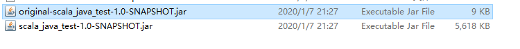

带有scala程序编译的jar，java命令要想运行必须引入scala的jar。打包的时候要加入scala的打包插件。

scala标准库的可以不加入maven的坐标，不过java 命令要想运行必须把scala的jar加到classpath。

## scala与java相互调用测试并用scala、java命令运行jar
在实际中没必要在java中调用scala，有限制(伴生方法无法调用、scala中基本数据的泛型变成了object)，语法不简便。

```scala
package com

object ScalaObject {
  def main(args: Array[String]): Unit = {
    println("scala main")
    println(getMap)

    println(java.util.Arrays.asList(1,2,3,4))
  }

  def getString:String = "getString" + getString("1", "2")

  //加上这个注解，java中就不得不处理这个异常了
  @throws[Exception]("params can not null")
  def getString(a:String, b:String) = {
    if(a == null || b == null)
      throw new Exception("can not null")
    a + b
  }

  def getMap:Map[Int, String] = Map(1 -> "a", 2 -> "b", 3 -> "c")

}
```

```scala
package com

case class ScalaClass(name:String, age:Int)
```

```java
package com;

import scala.collection.immutable.Map;

public class JavaClass {
    public static void main(String[] args) {
        System.out.println("java main");

        String str = ScalaObject.getString();
        System.out.println(str);

        try {
            str = ScalaObject.getString("1", "2");
            System.out.println(str);

            str = ScalaObject.getString("1", null);
            System.out.println(str);
        } catch (Exception e) {
            //.printStackTrace();
            System.out.println("catch exception");
        }

        //Map[Int, String]这里必须用Object
        Map<Object, String> map = ScalaObject.getMap();
        System.out.println(map);

        ScalaClass scalaClass = new ScalaClass("小花", 20);
        System.out.println(scalaClass);
        System.out.println(scalaClass.name());
    }
}
```

pom文件:
```xml
<?xml version="1.0" encoding="UTF-8"?>
<project xmlns="http://maven.apache.org/POM/4.0.0"
         xmlns:xsi="http://www.w3.org/2001/XMLSchema-instance"
         xsi:schemaLocation="http://maven.apache.org/POM/4.0.0 http://maven.apache.org/xsd/maven-4.0.0.xsd">
    <modelVersion>4.0.0</modelVersion>

    <groupId>com.scala.java</groupId>
    <artifactId>scala_java_test</artifactId>
    <version>1.0-SNAPSHOT</version>

    <!-- 定义一下常量 -->
    <properties>
        <encoding>UTF-8</encoding>
        <maven.compiler.source>1.8</maven.compiler.source>
        <maven.compiler.target>1.8</maven.compiler.target>
        <scala.version>2.11.8</scala.version>
        <scala.compat.version>2.11</scala.compat.version>
    </properties>

    <dependencies>
        <!-- 添加scala的依赖 -->
        <dependency>
            <groupId>org.scala-lang</groupId>
            <artifactId>scala-library</artifactId>
            <version>${scala.version}</version>
        </dependency>

    </dependencies>

    <build>
        <plugins>
            <!-- 该插件用于在marven中编译scala程序 -->
            <plugin>
                <!-- see http://davidb.github.com/scala-maven-plugin -->
                <groupId>net.alchim31.maven</groupId>
                <artifactId>scala-maven-plugin</artifactId>
                <version>3.2.2</version>
                <executions>
                    <execution>
                        <goals>
                            <goal>compile</goal>
                        </goals>
                    </execution>
                </executions>
            </plugin>

            <!-- 该插件用于打包 -->
            <plugin>
                <groupId>org.apache.maven.plugins</groupId>
                <artifactId>maven-shade-plugin</artifactId>
                <version>2.4.1</version>
                <executions>
                    <execution>
                        <phase>package</phase>
                        <goals>
                            <goal>shade</goal>
                        </goals>
                        <configuration>
                            <transformers>
                                <!-- 指定main方法 -->
                                <transformer implementation="org.apache.maven.plugins.shade.resource.ManifestResourceTransformer">
                                    <mainClass>com.JavaClass</mainClass>
                                </transformer>
                            </transformers>
                        </configuration>
                    </execution>
                </executions>
            </plugin>

        </plugins>
    </build>

</project>
```

打出的jar包：


一个带scala-library的jar，一个不带，用java命令运行不带scala-library的jar时必须把scala-library的jar加到classpath。

测试：
```sh
PS D:\IdeaWorkspace\scala_java_test\target> scala -classpath scala_java_test-1.0-SNAPSHOT.jar com.JavaClass
java main
getString12
12
catch exception
Map(1 -> a, 2 -> b, 3 -> c)
ScalaClass(小花,20)
小花

PS D:\IdeaWorkspace\scala_java_test\target> scala -classpath scala_java_test-1.0-SNAPSHOT.jar com.ScalaObject
scala main
Map(1 -> a, 2 -> b, 3 -> c)
[1, 2, 3, 4]

PS D:\IdeaWorkspace\scala_java_test\target> java -jar scala_java_test-1.0-SNAPSHOT.jar
java main
getString12
12
catch exception
Map(1 -> a, 2 -> b, 3 -> c)
ScalaClass(小花,20)
小花

PS D:\IdeaWorkspace\scala_java_test\target> java -classpath scala_java_test-1.0-SNAPSHOT.jar com.ScalaObject
scala main
Map(1 -> a, 2 -> b, 3 -> c)
[1, 2, 3, 4]

PS D:\IdeaWorkspace\scala_java_test\target> java -classpath "D:\Program Files\scala-2.11.8\lib\scala-library.jar;original-scala_java_test-1.0-SNAPSHOT.jar" com.ScalaObject
scala main
Map(1 -> a, 2 -> b, 3 -> c)
[1, 2, 3, 4]

PS D:\IdeaWorkspace\scala_java_test\target> java -classpath original-scala_java_test-1.0-SNAPSHOT.jar com.ScalaObject
Error: A JNI error has occurred, please check your installation and try again
Exception in thread "main" java.lang.NoClassDefFoundError: scala/collection/immutable/Map
        at java.lang.Class.getDeclaredMethods0(Native Method)
        at java.lang.Class.privateGetDeclaredMethods(Unknown Source)
        at java.lang.Class.privateGetMethodRecursive(Unknown Source)
        at java.lang.Class.getMethod0(Unknown Source)
        at java.lang.Class.getMethod(Unknown Source)
        at sun.launcher.LauncherHelper.validateMainClass(Unknown Source)
        at sun.launcher.LauncherHelper.checkAndLoadMain(Unknown Source)
Caused by: java.lang.ClassNotFoundException: scala.collection.immutable.Map
        at java.net.URLClassLoader.findClass(Unknown Source)
        at java.lang.ClassLoader.loadClass(Unknown Source)
        at sun.misc.Launcher$AppClassLoader.loadClass(Unknown Source)
        at java.lang.ClassLoader.loadClass(Unknown Source)
        ... 7 more

PS D:\IdeaWorkspace\scala_java_test\target> scala -classpath original-scala_java_test-1.0-SNAPSHOT.jar com.ScalaObject
scala main
Map(1 -> a, 2 -> b, 3 -> c)
[1, 2, 3, 4]
```

## 几个打包的插件
似乎有好几种打包的插件，都行。这里列举一下。

```xml
<build>
    <plugins>
        <!-- 该插件用于在marven中编译scala程序 -->
        <plugin>
            <!-- see http://davidb.github.com/scala-maven-plugin -->
            <groupId>net.alchim31.maven</groupId>
            <artifactId>scala-maven-plugin</artifactId>
            <version>3.2.2</version>
            <executions>
                <execution>
                    <goals>
                        <goal>compile</goal>
                    </goals>
                </execution>
            </executions>
        </plugin>

        <!-- 该插件用于打包 -->
        <plugin>
            <groupId>org.apache.maven.plugins</groupId>
            <artifactId>maven-shade-plugin</artifactId>
            <version>2.4.1</version>
            <executions>
                <execution>
                    <phase>package</phase>
                    <goals>
                        <goal>shade</goal>
                    </goals>
                    <configuration>
                        <transformers>
                            <!-- 指定main方法 -->
                            <transformer implementation="org.apache.maven.plugins.shade.resource.ManifestResourceTransformer">
                                <mainClass>com.JavaClass</mainClass>
                            </transformer>
                        </transformers>
                    </configuration>
                </execution>
            </executions>
        </plugin>

    </plugins>
</build>
```

```xml
<build>
    <plugins>
        <plugin>
            <groupId>org.scala-tools</groupId>
            <artifactId>maven-scala-plugin</artifactId>
            <version>2.15.2</version>
            <executions>
                <execution>
                    <goals>
                        <goal>compile</goal>
                        <goal>testCompile</goal>
                    </goals>
                </execution>
            </executions>
        </plugin>

        <plugin>
            <artifactId>maven-compiler-plugin</artifactId>
            <version>3.6.0</version>
            <configuration>
                <source>1.7</source>
                <target>1.7</target>
            </configuration>
        </plugin>
        <plugin>
            <groupId>org.apache.maven.plugins</groupId>
            <artifactId>maven-assembly-plugin</artifactId>
            <version>2.3</version>
            <configuration>
                <descriptorRefs>
                    <descriptorRef>jar-with-dependencies</descriptorRef>
                </descriptorRefs>
            </configuration>
        </plugin>

        <plugin>
            <groupId>org.apache.maven.plugins</groupId>
            <artifactId>maven-surefire-plugin</artifactId>
            <version>2.19</version>
            <configuration>
                <skip>true</skip>
            </configuration>
        </plugin>

    </plugins>
    <defaultGoal>compile</defaultGoal>
</build>
```

下面这个只用于打java：
```xml
<build>
    <plugins>
        <plugin>
            <artifactId>maven-compiler-plugin</artifactId>
            <version>2.3.2</version>
            <configuration>
                <source>1.7</source>
                <target>1.7</target>
            </configuration>
        </plugin>
        <plugin>
            <artifactId>maven-assembly-plugin</artifactId>
            <configuration>
                <descriptorRefs>
                    <descriptorRef>jar-with-dependencies</descriptorRef>
                </descriptorRefs>
            </configuration>
            <executions>
                <execution>
                    <id>make-assembly</id>
                    <phase>package</phase>
                    <goals>
                        <goal>single</goal>
                    </goals>
                </execution>
            </executions>
        </plugin>
    </plugins>
</build>
```


