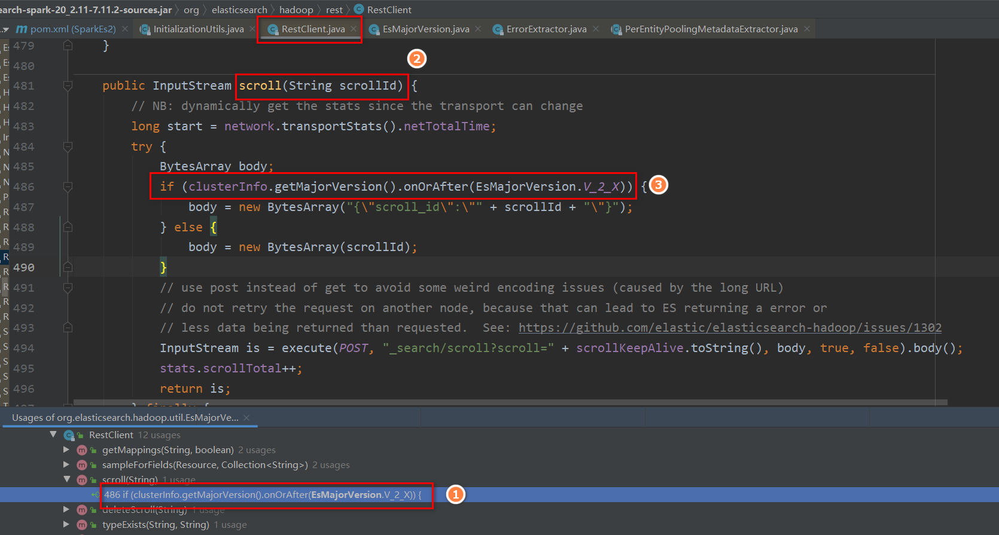

## 官网
```
https://www.elastic.co/guide/en/elasticsearch/hadoop/7.13/spark.html#spark-sql-write-scala
https://www.elastic.co/guide/en/elasticsearch/hadoop/7.13/configuration.html#configuration 
https://www.elastic.co/guide/en/elasticsearch/reference/7.13/docs-bulk.html 
```

## elasticsearch-spark版本
elasticsearch-spark_2.11对应spark1.x的版本，支持es1.x的版本
elasticsearch-spark-20_2.11对应spark2.x的版本，支持es的版本比较多，高版本的兼容低版本的es
elasticsearch-spark-30_2.12对应spark3.x的版本，支持es的版本比较多，高版本的兼容低版本的es


elasticsearch-spark兼容es版本说明：
因为elasticsearch-spark是基于rest接口访问es的并没有引入es的jar，通过源码查看发现，高版本的也会兼容低版本的es。

### 各版本discoverEsVersion/discoverClusterInfo方法
InitializationUtils.discoverEsVersion 方法(7.x已废弃)
InitializationUtils.discoverClusterInfo 方法(7.x之后的)
#### 2.1.2
```xml
<dependency>
    <groupId>org.elasticsearch</groupId>
    <artifactId>elasticsearch-spark_2.11</artifactId>
    <version>2.1.2</version>
</dependency>
```

可看到只支持0.90x和1.x版本
```java
public static String discoverEsVersion(Settings settings, Log log) {
    String version = settings.getProperty(InternalConfigurationOptions.INTERNAL_ES_VERSION);
    if (StringUtils.hasText(version)) {
        if (log.isDebugEnabled()) {
            log.debug(String.format("Elasticsearch version [%s] already present in configuration; skipping discovery", version));
        }

        return version;
    }

    RestClient bootstrap = new RestClient(settings);
    // first get ES version
    try {
        String esVersion = bootstrap.esVersion();
        if (log.isDebugEnabled()) {
            log.debug(String.format("Discovered Elasticsearch version [%s]", esVersion));
        }
        // validate version (make sure it's running against ES 0.9x or 1.x)

        if (!(esVersion.startsWith("0.90") || esVersion.startsWith("1."))) {
            throw new EsHadoopIllegalArgumentException("Unsupported/Unknown Elasticsearch version " + esVersion);
        }
        settings.setProperty(InternalConfigurationOptions.INTERNAL_ES_VERSION, esVersion);
        return esVersion;
    } finally {
        bootstrap.close();
    }
}
```

#### 5.0.2
```xml
<dependency>
    <groupId>org.elasticsearch</groupId>
    <artifactId>elasticsearch-spark-20_2.11</artifactId>
    <version>5.0.2</version>
</dependency>
```

可看到支持5.x以下版本
```java
//EsMajorVersion.parse
public static EsMajorVersion parse(String version) {
    if (version.startsWith("0.")) {
        return new EsMajorVersion((byte) 0, version);
    }
    if (version.startsWith("1.")) {
        return new EsMajorVersion((byte) 1, version);
    }
    if (version.startsWith("2.")) {
        return new EsMajorVersion((byte) 2, version);
    }
    if (version.startsWith("5.")) {
        return new EsMajorVersion((byte) 5, version);
    }
    throw new EsHadoopIllegalArgumentException("Unsupported/Unknown Elasticsearch version " + version);
}

//RestClient.remoteEsVersion
public EsMajorVersion remoteEsVersion() {
    Map<String, String> result = get("", "version");
    if (result == null || !StringUtils.hasText(result.get("number"))) {
        throw new EsHadoopIllegalStateException("Unable to retrieve elasticsearch version.");
    }
    return EsMajorVersion.parse(result.get("number"));
}

//InitializationUtils.discoverEsVersion
public static EsMajorVersion discoverEsVersion(Settings settings, Log log) {
    String version = settings.getProperty(InternalConfigurationOptions.INTERNAL_ES_VERSION);
    if (StringUtils.hasText(version)) {
        if (log.isDebugEnabled()) {
            log.debug(String.format("Elasticsearch version [%s] already present in configuration; skipping discovery", version));
        }

        return EsMajorVersion.parse(version);
    }

    RestClient bootstrap = new RestClient(settings);
    // first get ES version
    try {
        EsMajorVersion esVersion = bootstrap.remoteEsVersion();
        if (log.isDebugEnabled()) {
            log.debug(String.format("Discovered Elasticsearch version [%s]", esVersion));
        }
        settings.setInternalVersion(esVersion);
        return esVersion;
    } catch (EsHadoopException ex) {
        throw new EsHadoopIllegalArgumentException(String.format("Cannot detect ES version - "
                + "typically this happens if the network/Elasticsearch cluster is not accessible or when targeting "
                + "a WAN/Cloud instance without the proper setting '%s'", ConfigurationOptions.ES_NODES_WAN_ONLY), ex);
    } finally {
        bootstrap.close();
    }
}
```

#### 7.11.2
```xml
<dependency>
    <groupId>org.elasticsearch</groupId>
    <artifactId>elasticsearch-spark-20_2.11</artifactId>
    <version>7.11.2</version>
</dependency>
```

可看到支持7.x以下版本
```java
//EsMajorVersion.parse
public static EsMajorVersion parse(String version) {
    if (version.startsWith("0.")) {
        return new EsMajorVersion((byte) 0, version);
    }
    if (version.startsWith("1.")) {
        return new EsMajorVersion((byte) 1, version);
    }
    if (version.startsWith("2.")) {
        return new EsMajorVersion((byte) 2, version);
    }
    if (version.startsWith("5.")) {
        return new EsMajorVersion((byte) 5, version);
    }
    if (version.startsWith("6.")) {
        return new EsMajorVersion((byte) 6, version);
    }
    if (version.startsWith("7.")) {
        return new EsMajorVersion((byte) 7, version);
    }
    throw new EsHadoopIllegalArgumentException("Unsupported/Unknown Elasticsearch version [" + version + "]." +
            "Highest supported version is [" + LATEST.version + "]. You may need to upgrade ES-Hadoop.");
}

//RestClient.mainInfo
public ClusterInfo mainInfo() {
    Map<String, Object> result = get("", null);
    if (result == null) {
        throw new EsHadoopIllegalStateException("Unable to retrieve elasticsearch main cluster info.");
    }
    String clusterName = result.get("cluster_name").toString();
    String clusterUUID = (String)result.get("cluster_uuid");
    @SuppressWarnings("unchecked")
    Map<String, String> versionBody = (Map<String, String>) result.get("version");
    if (versionBody == null || !StringUtils.hasText(versionBody.get("number"))) {
        throw new EsHadoopIllegalStateException("Unable to retrieve elasticsearch version.");
    }
    return new ClusterInfo(new ClusterName(clusterName, clusterUUID), EsMajorVersion.parse(versionBody.get("number")));
}

//InitializationUtils.discoverClusterInfo
public static ClusterInfo discoverClusterInfo(Settings settings, Log log) {
    ClusterName remoteClusterName = null;
    EsMajorVersion remoteVersion = null;
    String clusterName = settings.getProperty(InternalConfigurationOptions.INTERNAL_ES_CLUSTER_NAME);
    String clusterUUID = settings.getProperty(InternalConfigurationOptions.INTERNAL_ES_CLUSTER_UUID);
    String version = settings.getProperty(InternalConfigurationOptions.INTERNAL_ES_VERSION);
    if (StringUtils.hasText(clusterName) && StringUtils.hasText(version)) { // UUID is optional for now
        if (log.isDebugEnabled()) {
            log.debug(String.format("Elasticsearch cluster [NAME:%s][UUID:%s][VERSION:%s] already present in configuration; skipping discovery",
                    clusterName, clusterUUID, version));
        }
        remoteClusterName = new ClusterName(clusterName, clusterUUID);
        remoteVersion = EsMajorVersion.parse(version);
        return new ClusterInfo(remoteClusterName, remoteVersion);
    }

    RestClient bootstrap = new RestClient(settings);
    // first get ES main action info
    try {
        ClusterInfo mainInfo = bootstrap.mainInfo();
        if (log.isDebugEnabled()) {
            log.debug(String.format("Discovered Elasticsearch cluster [%s/%s], version [%s]",
                    mainInfo.getClusterName().getName(),
                    mainInfo.getClusterName().getUUID(),
                    mainInfo.getMajorVersion()));
        }
        settings.setInternalClusterInfo(mainInfo);
        return mainInfo;
    } catch (EsHadoopException ex) {
        throw new EsHadoopIllegalArgumentException(String.format("Cannot detect ES version - "
                + "typically this happens if the network/Elasticsearch cluster is not accessible or when targeting "
                + "a WAN/Cloud instance without the proper setting '%s'", ConfigurationOptions.ES_NODES_WAN_ONLY), ex);
    } finally {
        bootstrap.close();
    }
}
```

### EsMajorVersion类
elasticsearch-spark应该是通过这个类显示rest api的兼容性的



源码查看的版本：
```xml
<dependency>
    <groupId>org.elasticsearch</groupId>
    <artifactId>elasticsearch-spark-20_2.11</artifactId>
    <version>7.11.2</version>
</dependency>
```

EsMajorVersion类源码(可以看到里面只保存了es的版本信息)：
```java
/**
 * Elasticsearch major version information, useful to check client's query compatibility with the Rest API.
 */
public class EsMajorVersion implements Serializable {

    private static final long serialVersionUID = 1L;

    public static final EsMajorVersion V_0_X = new EsMajorVersion((byte) 0, "0.x");
    public static final EsMajorVersion V_1_X = new EsMajorVersion((byte) 1, "1.x");
    public static final EsMajorVersion V_2_X = new EsMajorVersion((byte) 2, "2.x");
    public static final EsMajorVersion V_5_X = new EsMajorVersion((byte) 5, "5.x");
    public static final EsMajorVersion V_6_X = new EsMajorVersion((byte) 6, "6.x");
    public static final EsMajorVersion V_7_X = new EsMajorVersion((byte) 7, "7.x");
    public static final EsMajorVersion LATEST = V_7_X;

    public final byte major;
    private final String version;

    private EsMajorVersion(byte major, String version) {
        this.major = major;
        this.version = version;
    }

    public boolean after(EsMajorVersion version) {
        return version.major < major;
    }

    public boolean on(EsMajorVersion version) {
        return version.major == major;
    }

    public boolean notOn(EsMajorVersion version) {
        return !on(version);
    }

    public boolean onOrAfter(EsMajorVersion version) {
        return version.major <= major;
    }

    public boolean before(EsMajorVersion version) {
        return version.major > major;
    }

    public boolean onOrBefore(EsMajorVersion version) {
        return version.major >= major;
    }

    public static EsMajorVersion parse(String version) {
        if (version.startsWith("0.")) {
            return new EsMajorVersion((byte) 0, version);
        }
        if (version.startsWith("1.")) {
            return new EsMajorVersion((byte) 1, version);
        }
        if (version.startsWith("2.")) {
            return new EsMajorVersion((byte) 2, version);
        }
        if (version.startsWith("5.")) {
            return new EsMajorVersion((byte) 5, version);
        }
        if (version.startsWith("6.")) {
            return new EsMajorVersion((byte) 6, version);
        }
        if (version.startsWith("7.")) {
            return new EsMajorVersion((byte) 7, version);
        }
        throw new EsHadoopIllegalArgumentException("Unsupported/Unknown Elasticsearch version [" + version + "]." +
                "Highest supported version is [" + LATEST.version + "]. You may need to upgrade ES-Hadoop.");
    }

    @Override
    public boolean equals(Object o) {
        if (this == o) {
            return true;
        }
        if (o == null || getClass() != o.getClass()) {
            return false;
        }

        EsMajorVersion version = (EsMajorVersion) o;

        return major == version.major &&
                this.version.equals(version.version);
    }

    @Override
    public int hashCode() {
        return major;
    }

    @Override
    public String toString() {
        return version;
    }
}
```


```xml

```


```java

```