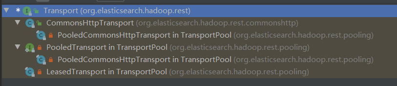
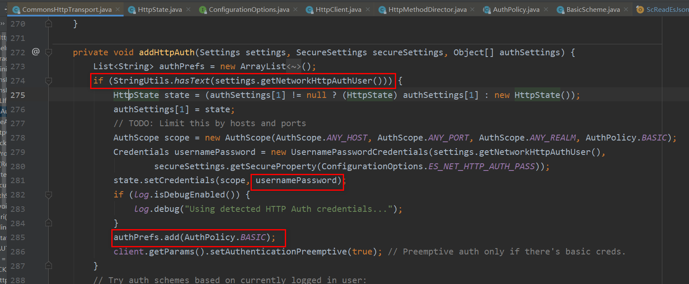

# rest接口访问

rest接口访问主要是通过三个类实现的

* Transport:执行http访问的对象
* NetworkClient：执行http访问的对象实现了集群地址的容错，NetworkClient持有Transport的引用。
* RestClient：对外提供的访问es rest 接口的对象，RestClient持有NetworkClient的引用。

## Transport
org.elasticsearch.hadoop.rest.Transport
```java
public interface Transport extends Closeable, StatsAware {

    Response execute(Request request) throws IOException;

    void close();
}
```



主要的实现类就是CommonsHttpTransport了


### CommonsHttpTransport
用户名密码的认证是httpclient支持的

配置：
```
String ES_NET_HTTP_AUTH_USER = "es.net.http.auth.user";
String ES_NET_HTTP_AUTH_PASS = "es.net.http.auth.pass";
```
这种认证我们自己可以通过设置headers认证。




org.apache.commons.httpclient.auth.BasicScheme
```java
/**
 * Returns a basic <tt>Authorization</tt> header value for the given 
 * {@link UsernamePasswordCredentials} and charset.
 * 
 * @param credentials The credentials to encode.
 * @param charset The charset to use for encoding the credentials
 * 
 * @return a basic authorization string
 * 
 * @since 3.0
 */
public static String authenticate(UsernamePasswordCredentials credentials, String charset) {

    LOG.trace("enter BasicScheme.authenticate(UsernamePasswordCredentials, String)");

    if (credentials == null) {
        throw new IllegalArgumentException("Credentials may not be null"); 
    }
    if (charset == null || charset.length() == 0) {
        throw new IllegalArgumentException("charset may not be null or empty");
    }
    StringBuffer buffer = new StringBuffer();
    buffer.append(credentials.getUserName());
    buffer.append(":");
    buffer.append(credentials.getPassword());
    
    return "Basic " + EncodingUtil.getAsciiString(
            Base64.encodeBase64(EncodingUtil.getBytes(buffer.toString(), charset)));
}
```


```java

```
