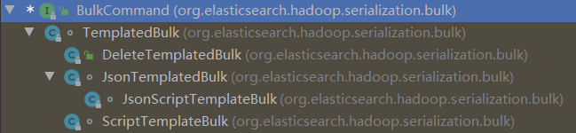
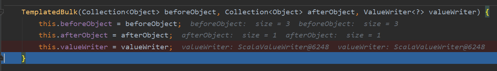
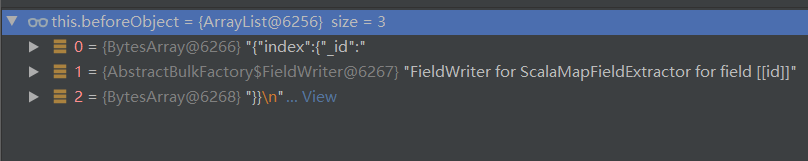
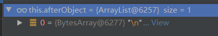
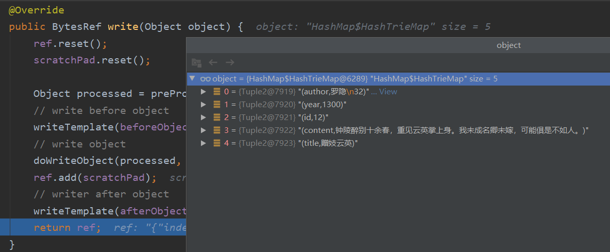
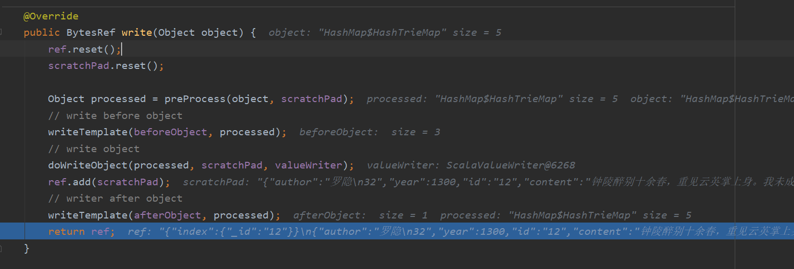
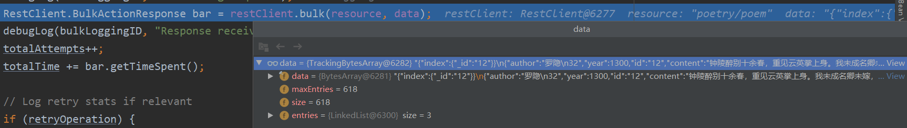
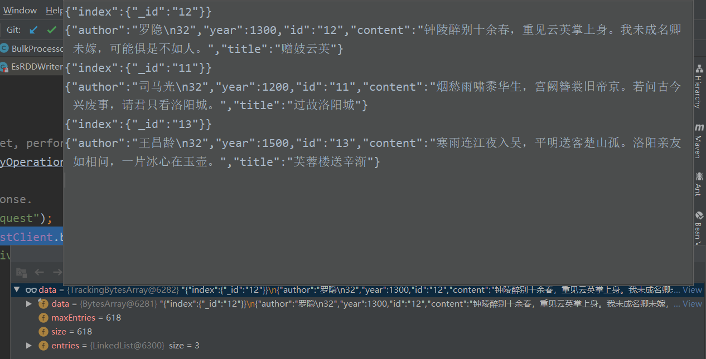
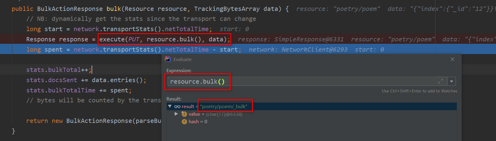

# write rdd实现

map和json字符串的rdd都可以写入es
```java
val datas = Seq(
  Map("id" -> "12", "title" -> "赠妓云英", "author" -> "罗隐\n32", "year" -> 1300, "content" -> "钟陵醉别十余春，重见云英掌上身。我未成名卿未嫁，可能俱是不如人。"),
  Map("id" -> "11", "title" -> "过故洛阳城", "author" -> "司马光\n32", "year" -> 1200, "content" -> "烟愁雨啸黍华生，宫阙簪裳旧帝京。若问古今兴废事，请君只看洛阳城。"),
  Map("id" -> "13", "title" -> "芙蓉楼送辛渐", "author" -> "王昌龄\n32", "year" -> 1500, "content" -> "寒雨连江夜入吴，平明送客楚山孤。洛阳亲友如相问，一片冰心在玉壶。")
)

sc.makeRDD(datas, 1).saveToEs("poetry/poem",
  Map(ES_MAPPING_ID -> "id", ES_WRITE_OPERATION -> "index")
)
```

```java
// 隐式转换
implicit def sparkRDDFunctions[T : ClassTag](rdd: RDD[T]) = new SparkRDDFunctions[T](rdd)

class SparkRDDFunctions[T : ClassTag](rdd: RDD[T]) extends Serializable {
  def saveToEs(resource: String): Unit = { EsSpark.saveToEs(rdd, resource) }
  def saveToEs(resource: String, cfg: scala.collection.Map[String, String]): Unit = { EsSpark.saveToEs(rdd, resource, cfg) }
  def saveToEs(cfg: scala.collection.Map[String, String]): Unit = { EsSpark.saveToEs(rdd, cfg)    }
}
```

object EsSpark：
```java
def saveToEs(rdd: RDD[_], resource: String): Unit = { saveToEs(rdd, Map(ES_RESOURCE_WRITE -> resource)) }
def saveToEs(rdd: RDD[_], resource: String, cfg: Map[String, String]): Unit = {
  // 合并配置
  saveToEs(rdd, collection.mutable.Map(cfg.toSeq: _*) += (ES_RESOURCE_WRITE -> resource))
}
def saveToEs(rdd: RDD[_], cfg: Map[String, String]): Unit =  {
  doSaveToEs(rdd, cfg, false)
}

// 最终调用的方法
private[spark] def doSaveToEs(rdd: RDD[_], cfg: Map[String, String], hasMeta: Boolean): Unit = {
  CompatUtils.warnSchemaRDD(rdd, LogFactory.getLog("org.elasticsearch.spark.rdd.EsSpark"))

  if (rdd == null || rdd.partitions.length == 0) {
    return
  }
  
  val sparkCfg = new SparkSettingsManager().load(rdd.sparkContext.getConf)
  val config = new PropertiesSettings().load(sparkCfg.save())
  config.merge(cfg.asJava)

  // 检查配置
  // Need to discover the EsVersion here before checking if the index exists
  InitializationUtils.setUserProviderIfNotSet(config, classOf[HadoopUserProvider], LOG)
  InitializationUtils.discoverClusterInfo(config, LOG)
  InitializationUtils.checkIdForOperation(config)
  InitializationUtils.checkIndexExistence(config)

  // 这个实现和foreachPartition类似，每个分区写入方法是EsRDDWriter的write方法
  rdd.sparkContext.runJob(rdd, new EsRDDWriter(config.save(), hasMeta).write _)
}
```

## EsRDDWriter的write(foreachPartition)
sparkContext.runJob和foreachPartition类似，每个分区写入方法是EsRDDWriter的write方法

```java
def write(taskContext: TaskContext, data: Iterator[T]): Unit = {
  val writer = RestService.createWriter(settings, taskContext.partitionId.toLong, -1, log)

  taskContext.addTaskCompletionListener((TaskContext) => writer.close())

  if (runtimeMetadata) {
    writer.repository.addRuntimeFieldExtractor(metaExtractor)
  }

  while (data.hasNext) {
    writer.repository.writeToIndex(processData(data))
  }
}
```

EsRDDWriter需要序列化，使用lazy属性可以实现序列化的对象使用属性时调用初始化方法
```java
private[spark] class EsRDDWriter[T: ClassTag](val serializedSettings: String,
                                              val runtimeMetadata: Boolean = false)
  extends Serializable {

  @transient protected lazy val log: Log = LogFactory.getLog(this.getClass)

  lazy val settings: Settings = {
    // ...
    settings
  }

  lazy val metaExtractor = ObjectUtils.instantiate[MetadataExtractor](settings.getMappingMetadataExtractorClassName, settings)

  def write(taskContext: TaskContext, data: Iterator[T]): Unit = {
    // ...
  }

  protected def valueWriter: Class[_ <: ValueWriter[_]] = classOf[ScalaValueWriter]
  protected def bytesConverter: Class[_ <: BytesConverter] = classOf[JdkBytesConverter]
  protected def fieldExtractor: Class[_ <: FieldExtractor] = classOf[ScalaMapFieldExtractor]
  protected def metadataExtractor: Class[_ <: MetadataExtractor] = classOf[ScalaMetadataExtractor]
  protected def userProvider: Class[_ <: UserProvider] = classOf[HadoopUserProvider]

  protected def processData(data: Iterator[T]): Any = {
    // ...
  }
}
```

## RestRepository(写入的实现类)
这里使用字节数组来缓存批量提交的数据，是为了效率，我们自己实现时完全没这个必要，除非到了要优化性能的时候。


总的处理流程：
```java
    // 单个请求的Bytes
    BytesRef serialized = bulkEntryWriter.writeBulkEntry(object);

    // 批量处理
    doWriteToIndex(serialized)

private void doWriteToIndex(BytesRef payload) {
    // 缓存字节达到设置的字节数或者缓存条数达到设置的batchSize，flush提交
    bulkProcessor.add(payload);
    payload.reset();
}
```


```java
/**
 * Rest client performing high-level operations using buffers to improve performance. Stateful in that once created, it
 * is used to perform updates against the same index.
 */
public class RestRepository implements Closeable, StatsAware {

    private static Log log = LogFactory.getLog(RestRepository.class);

    // wrapper around existing BA (for cases where the serialization already occurred)
    private BytesRef trivialBytesRef;
    // 是否已经初始化
    private boolean writeInitialized = false;

    // rest api实现类
    private RestClient client;
    // optional extractor passed lazily to BulkCommand
    private MetadataExtractor metaExtractor;

    // 把单个请求处理成字节数组
    private BulkEntryWriter bulkEntryWriter;
    // 请求批量提交
    private BulkProcessor bulkProcessor;

    private final Settings settings;
    private Resources resources;
    private final Stats stats = new Stats();

    public RestRepository(Settings settings) {
        this.settings = settings;
        this.resources = new Resources(settings);

        // Check if we have a read resource first, and if not, THEN check the write resource
        // The write resource has more strict parsing rules, and if the process is only reading
        // with a resource that isn't good for writing, then eagerly parsing the resource as a
        // write resource can erroneously throw an error. Instead, we should just get the write
        // resource lazily as needed.
        Assert.isTrue(resources.getResourceRead() != null || resources.getResourceWrite() != null, "Invalid configuration - No read or write resource specified");

        this.client = new RestClient(settings);
    }

    /** postpone writing initialization since we can do only reading so there's no need to allocate buffers */
    private void lazyInitWriting() {
        if (!writeInitialized) {
            this.writeInitialized = true;
            this.bulkProcessor = new BulkProcessor(client, resources.getResourceWrite(), settings);
            this.trivialBytesRef = new BytesRef();
            this.bulkEntryWriter = new BulkEntryWriter(settings, BulkCommands.create(settings, metaExtractor, client.clusterInfo.getMajorVersion()));
        }
    }

    ScrollQuery scanAll(String query, BytesArray body, ScrollReader reader) {
        return scanLimit(query, body, -1, reader);
    }

    /**
     * Returns a pageable (scan based) result to the given query.
     *
     * @param query scan query
     * @param reader scroll reader
     * @return a scroll query
     */
    ScrollQuery scanLimit(String query, BytesArray body, long limit, ScrollReader reader) {
        return new ScrollQuery(this, query, body, limit, reader);
    }

    public void addRuntimeFieldExtractor(MetadataExtractor metaExtractor) {
        this.metaExtractor = metaExtractor;
    }

    /**
     * Writes the objects to index.
     *
     * @param object object to add to the index
     */
    public void writeToIndex(Object object) {
        Assert.notNull(object, "no object data given");

        lazyInitWriting();
        BytesRef serialized = bulkEntryWriter.writeBulkEntry(object);
        if (serialized != null) {
            doWriteToIndex(serialized);
        }
    }

    /**
     * Writes the objects to index.
     *
     * @param ba The data as a bytes array
     */
    public void writeProcessedToIndex(BytesArray ba) {
        Assert.notNull(ba, "no data given");
        Assert.isTrue(ba.length() > 0, "no data given");

        lazyInitWriting();
        trivialBytesRef.reset();
        trivialBytesRef.add(ba);
        doWriteToIndex(trivialBytesRef);
    }

    private void doWriteToIndex(BytesRef payload) {
        bulkProcessor.add(payload);
        payload.reset();
    }

    @Override
    public void close() {
        // ...
    }

    // ...
}
```

## 单个记录的序列化(BulkEntryWriter/BulkCommand)
BulkEntryWriter的实现是由BulkCommand实现的：
```java
/**
 * Bulk command to execute.
 */
public interface BulkCommand {

    /**
     * Serialized the given object as a {@link BytesRef}.
     * Note that the {@link BytesRef} is not guaranteed to be unique - in fact,
     * expect the same instance to be reused by multiple calls.
     * In other words, make a copy if you need to hang on to this object.
     *
     * @param object
     * @return
     */
    BytesRef write(Object object);
}
```

BulkCommand的实现类：


具体每种命令每种对象BulkCommand是怎么实现序列化的，在write方法打断点查看即可，这样就知道Bulk命令的实现的了。






```java
TemplatedBulk(Collection<Object> beforeObject, Collection<Object> afterObject, ValueWriter<?> valueWriter) {
    // value之前的处理
    this.beforeObject = beforeObject;
    // value之后的处理
    this.afterObject = afterObject;
    // value的处理，例如rdd中元素是map时，会序列化map为json字符串字节数组
    this.valueWriter = valueWriter;
}
```

```java
/** Operation types */
String ES_WRITE_OPERATION = "es.write.operation";
String ES_OPERATION_INDEX = "index";
String ES_OPERATION_CREATE = "create";
String ES_OPERATION_UPDATE = "update";
String ES_OPERATION_UPSERT = "upsert";
String ES_OPERATION_DELETE = "delete";
String ES_WRITE_OPERATION_DEFAULT = ES_OPERATION_INDEX;
```
各种选项的输出：
```j
{"update":{"_id":"12"}}
{"doc":{"author":"罗隐1","year":1300,"id":"12","content":"钟陵醉别十余春，重见云英掌上身。我未成名卿未嫁，可能俱是不如人。","title":"赠妓云英"}}
{"update":{"_id":"11"}}
{"doc":{"author":"司马光1","year":1200,"id":"11","content":"烟愁雨啸黍华生，宫阙簪裳旧帝京。若问古今兴废事，请君只看洛阳城。","title":"过故洛阳城"}}
{"update":{"_id":"13"}}
{"doc":{"author":"王昌龄1","year":1500,"id":"13","content":"寒雨连江夜入吴，平明送客楚山孤。洛阳亲友如相问，一片冰心在玉壶。","title":"芙蓉楼送辛渐"}}


{"update":{"_id":"12"}}
{"doc_as_upsert":true,"doc":{"author":"罗隐2","year":1300,"id":"12","content":"钟陵醉别十余春，重见云英掌上身。我未成名卿未嫁，可能俱是不如人。","title":"赠妓云英"}}
{"update":{"_id":"11"}}
{"doc_as_upsert":true,"doc":{"author":"司马光2","year":1200,"id":"11","content":"烟愁雨啸黍华生，宫阙簪裳旧帝京。若问古今兴废事，请君只看洛阳城。","title":"过故洛阳城"}}
{"update":{"_id":"13"}}
{"doc_as_upsert":true,"doc":{"author":"王昌龄2","year":1500,"id":"13","content":"寒雨连江夜入吴，平明送客楚山孤。洛阳亲友如相问，一片冰心在玉壶。","title":"芙蓉楼送辛渐"}}

{"index":{"_id":"12"}}
{"author":"罗隐3","year":1300,"id":"12","content":"钟陵醉别十余春，重见云英掌上身。我未成名卿未嫁，可能俱是不如人。","title":"赠妓云英"}
{"index":{"_id":"11"}}
{"author":"司马光3","year":1200,"id":"11","content":"烟愁雨啸黍华生，宫阙簪裳旧帝京。若问古今兴废事，请君只看洛阳城。","title":"过故洛阳城"}
{"index":{"_id":"13"}}
{"author":"王昌龄3","year":1500,"id":"13","content":"寒雨连江夜入吴，平明送客楚山孤。洛阳亲友如相问，一片冰心在玉壶。","title":"芙蓉楼送辛渐"}

{"index":{"_id":"12"}}
{"author":"罗隐\n32","year":1300,"id":"12","content":"钟陵醉别十余春，重见云英掌上身。我未成名卿未嫁，可能俱是不如人。","title":"赠妓云英"}
{"index":{"_id":"11"}}
{"author":"司马光\n32","year":1200,"id":"11","content":"烟愁雨啸黍华生，宫阙簪裳旧帝京。若问古今兴废事，请君只看洛阳城。","title":"过故洛阳城"}
{"index":{"_id":"13"}}
{"author":"王昌龄\n32","year":1500,"id":"13","content":"寒雨连江夜入吴，平明送客楚山孤。洛阳亲友如相问，一片冰心在玉壶。","title":"芙蓉楼送辛渐"}
```


## 批量提交(BulkProcessor)

### add
设置的内存达到设置阈值，flush
设置的batchSize达到设置阈值，flush
```java
/**
 * Adds an entry to the bulk request, potentially flushing if the request reaches capacity.
 * @param payload the entire bulk entry in JSON format, including the header and payload.
 */
public void add(BytesRef payload) {
    // check space first
    // ba is the backing array for data
    // 设置的内存达到设置阈值，flush
    if (payload.length() > ba.available()) {
        if (autoFlush) {
            flush();
        }
        else {
            throw new EsHadoopIllegalStateException(
                    String.format("Auto-flush disabled and bulk buffer full; disable manual flush or increase " +
                            "capacity [current size %s]; bailing out", ba.capacity()));
        }
    }

    data.copyFrom(payload);

    dataEntries++;
    // 设置的batchSize达到设置阈值，flush
    if (bufferEntriesThreshold > 0 && dataEntries >= bufferEntriesThreshold) {
        if (autoFlush) {
            flush();
        }
        else {
            // handle the corner case of manual flush that occurs only after the buffer is completely full (think size of 1)
            if (dataEntries > bufferEntriesThreshold) {
                throw new EsHadoopIllegalStateException(
                        String.format(
                                "Auto-flush disabled and maximum number of entries surpassed; disable manual " +
                                        "flush or increase capacity [current size %s]; bailing out",
                                bufferEntriesThreshold));
            }
        }
    }
}
```

### flush
```java
public void flush() {
    BulkResponse bulk = tryFlush();
    if (!bulk.getDocumentErrors().isEmpty()) {
        int maxErrors = 5;
        // ...
        message.append("Bailing out...");
        throw new EsHadoopException(message.toString());
    }
}
```

```java
// 提交并且容错，失败的会重试
public BulkResponse tryFlush() {
    // ...
    // resource:url, data:提交的字节
    RestClient.BulkActionResponse bar = restClient.bulk(resource, data);
    // ...
}
```





```java

```
