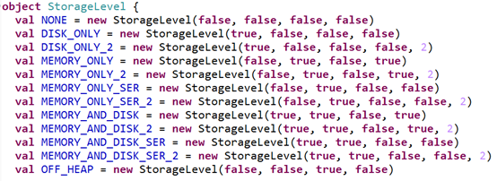

[toc]

# Spark-RDD持久化
摘抄自：`https://cloud.tencent.com/developer/article/1336632`

## (1) persist算子

* 使用方法：

```scala
var rdd = sc.textFile("test")
rdd = rdd.persist(StorageLevel.MEMORY_ONLY)
val count = rdd.count() //或者其他操作
```

* StorageLevel说明：

StorageLevel的构造函数：

```scala
class StorageLevel private(
    private var _useDisk: Boolean, # 是否存入磁盘
    private var _useMemory: Boolean, # 是否存入内存
    private var _useOffHeap: Boolean, # 是否使用堆外内存
    private var _deserialized: Boolean, # 是否不进行序列化
    private var _replication: Int = 1 # 副本数（默认为1）)
```

StorageLevel object中已经定义了几种代表RDD持久化的级别：



使用不同参数的组合构造的实例被预先定义为一些值，比如MEMORY_ONLY代表着不存入磁盘，存入内存，不使用堆外内存，不进行序列化，副本数为1，使用persisit()方法时把这些持久化的级别作为参数传入即可。

## (2) cache算子

**cache() = persist(StorageLevel.MEMORY_ONLY)**

## (3) checkpoint算子：可以把RDD持久化到HDFS

使用方法：

```scala
使用方法：
sc.setCheckpointDir("hdfs://...")
var rdd = sc.textFile("test")
rdd.checkpoint()
val count = rdd.count() //或者其他操作
```

checkpoint()执行原理：

* 当RDD的job执行完毕后，会从finalRDD从后往前回溯    
* 当回溯到调用了checkpoint()方法的RDD后，会给这个RDD做一个标记    
* Spark框架自动启动一个新的job，计算这个RDD的数据，然后把数据持久化到HDFS上    
* **优化：对某个RDD执行checkpoint()之前，对该RDD执行cache()，这样的话，新启动的job只需要把内存中的数据上传到HDFS中即可，不需要重新计算**。

## (4) 关于这3个算子的几点说明

* **这3个算子都是Transformations类算子，需要Actions类算子触发才能执行**    
* cache 和 persist 算子的返回执行必须赋值给一个变量(似乎不赋值也可以)，在接下来的job中直接使用这个变量，那么就是使用了持久化的数据了，如果application中只有一个job，没有必要使用RDD持久化    
* cache 和 persist 算子后不能立即紧跟action类算子，比如count算子，但是在下一行可以有action类算子

```scala
error : 
    cache().count()  
right : 
    rdd = rdd.cache()   
    rdd.count()
```

* **checkpoint()算子执行后就切断了RDD之间的依赖**
 当业务逻辑很复杂时，RDD之间频繁转换，RDD的血统很长，如果中间某个RDD的数据丢失，还需要重新从头计算，如果对中间某个RDD调用了checkpoint()方法，把这个RDD上传到HDFS，同时让后面的RDD不再依赖于这个RDD，而是依赖于HDFS上的数据，那么下次计算会方便很多。    


**checkpoint持久化到磁盘和persist持久化到磁盘的区别**：

* persist()把RDD持久化到磁盘，这个RDD的持久化数据保存在Worker的工作目录下，且当整个application执行结束后，就会自动删除持久化的数据    
* checkpoint()持久化到指定的目录，可以是HDFS，而且永久保存


