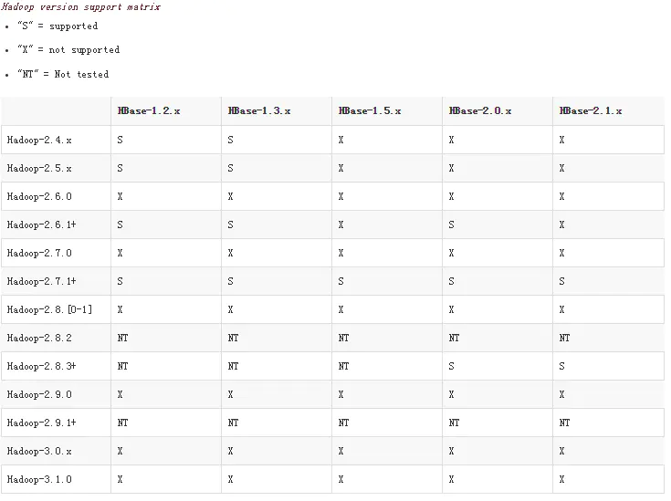

# spark读写HBase之使用hortonworks的开源框架shc（一）：源码编译以及测试工程创建
摘抄自：`https://www.jianshu.com/p/cddadb8b59c5`

软件准备


* shc源码包下载地址：[https://github.com/hortonworks-spark/shc/releases](https://github.com/hortonworks-spark/shc/releases "https://github.com/hortonworks-spark/shc/releases")


## 1. 编译源码包


### (1) 解压源码包，修改项目根目录下的pom文件


根据自己使用的版本修改各组件的版本号，以下是我修改后的pom文件：


```xml
<groupId>com.hortonworks</groupId>
<artifactId>shc</artifactId>
<version>spark-2.3.0-hbase-1.2.6</version>
<packaging>pom</packaging>

<properties>
    <spark.version>2.3.0</spark.version>
    <hbase.version>1.2.6</hbase.version>
    <phoenix.version>4.14.0-HBase-1.2</phoenix.version>
    <java.version>1.8</java.version>
</properties>

```


说明：


* 以上内容只是我修改的部分，没有修改的我没有贴出来    
* 我修改了version，那么在子模块的pom中，也要修改为一样的version


以下是我修改后的两个子模块core和examples中的pom文件，只修改了version


```xml
<parent>
    <groupId>com.hortonworks</groupId>
    <artifactId>shc</artifactId>
    <version>spark-2.3.0-hbase-1.2.6</version>
    <relativePath>../pom.xml</relativePath>
</parent>

<artifactId>shc-core</artifactId>
<version>spark-2.3.0-hbase-1.2.6</version>
<packaging>jar</packaging>
<name>HBase Spark Connector Project Core</name>

<parent>
    <groupId>com.hortonworks</groupId>
    <artifactId>shc</artifactId>
    <version>spark-2.3.0-hbase-1.2.6</version>
    <relativePath>../pom.xml</relativePath>
</parent>

<artifactId>shc-examples</artifactId>
<version>spark-2.3.0-hbase-1.2.6</version>
<packaging>jar</packaging>
<name>HBase Spark Connector Project Examples</name>

```


### (2) 编译源码


在源码包根目录下执行mvn命令：


```undefined
mvn install -DskipTests

```


执行成功后，你的本地maven仓库中已经有了这个项目的jar包


## 2. 创建测试shc的maven工程


### (1) 新建maven工程，在pom中引入我们编译好的shc-core的依赖


注意，我们只需要shc-core的依赖


```xml
<dependency>
    <groupId>com.hortonworks</groupId>
    <artifactId>shc-core</artifactId>
    <version>spark-2.3.0-hbase-1.2.6</version>
</dependency>

```


### (2) 导入spark相关的依赖，并解决依赖冲突


```xml
# 以下spark的依赖包排除了hadoop-client包，因为与shc-core中的hadoop-client有版本冲突

<dependency>
    <groupId>org.apache.spark</groupId>
    <artifactId>spark-core_2.11</artifactId>
    <version>2.3.0</version>
    <exclusions>
        <exclusion>
            <groupId>org.apache.hadoop</groupId>
            <artifactId>hadoop-client</artifactId>
        </exclusion>
    </exclusions>
</dependency>

<dependency>
    <groupId>org.apache.spark</groupId>
    <artifactId>spark-sql_2.11</artifactId>
    <version>2.3.0</version>
    <exclusions>
        <exclusion>
            <groupId>org.apache.hadoop</groupId>
            <artifactId>hadoop-client</artifactId>
        </exclusion>
    </exclusions>
</dependency>

<dependency>
    <groupId>org.apache.spark</groupId>
    <artifactId>spark-streaming_2.11</artifactId>
    <version>2.3.0</version>
    <exclusions>
        <exclusion>
            <groupId>org.apache.hadoop</groupId>
            <artifactId>hadoop-client</artifactId>
        </exclusion>
    </exclusions>
</dependency>

<dependency>
    <groupId>org.apache.spark</groupId>
    <artifactId>spark-streaming-kafka-0-10_2.11</artifactId>
    <version>2.3.0</version>
</dependency>

# 手动引入hadoop-client的依赖
<dependency>
    <groupId>org.apache.hadoop</groupId>
    <artifactId>hadoop-client</artifactId>
    <version>2.7.6</version>
</dependency>

```


这里选择引入hadoop2.7.6版本的hadoop-client是因为2.7版本的hadoop可以兼容全部版本的hbase，下图为hbase官网的hadoop与hbase各版本的兼容性对照表：





### (3) 引入hbase相关的依赖并解决依赖冲突


这里只需要排除掉冲突的依赖就可以了


```xml
<dependency>
    <groupId>org.apache.hbase</groupId>
    <artifactId>hbase-client</artifactId>
    <version>1.2.6</version>
    <exclusions>
        <exclusion>
            <groupId>org.apache.hadoop</groupId>
            <artifactId>hadoop-auth</artifactId>
        </exclusion>
        <exclusion>
            <groupId>org.apache.hadoop</groupId>
            <artifactId>hadoop-common</artifactId>
        </exclusion>
        <exclusion>
            <groupId>org.apache.hadoop</groupId>
            <artifactId>hadoop-mapreduce-client-core</artifactId>
        </exclusion>
        <exclusion>
            <groupId>io.netty</groupId>
            <artifactId>netty-all</artifactId>
        </exclusion>
    </exclusions>
</dependency>

<dependency>
    <groupId>org.apache.hbase</groupId>
    <artifactId>hbase-server</artifactId>
    <version>1.2.6</version>
    <exclusions>
        <exclusion>
            <groupId>io.netty</groupId>
            <artifactId>netty-all</artifactId>
        </exclusion>
    </exclusions>
</dependency>

```


### (4) 把hdfs-site.xml、core-site.xml和hbase-site.xml放到项目的resources目录下


### (5) 其他


* 我在ideal中创建的这个maven工程，加入了scala-sdk，不再赘述    
* 修改了项目架构，加入了scala主程序文件夹和测试文件夹    
* 配置了maven相关的插件，加入了scala编译插件


```xml
<build>
    <plugins>

        <plugin>
            <groupId>net.alchim31.maven</groupId>
            <artifactId>scala-maven-plugin</artifactId>
            <version>3.4.2</version>
            <executions>
                <execution>
                    <id>scala-compile-first</id>
                    <phase>process-resources</phase>
                    <goals>
                        <goal>add-source</goal>
                        <goal>compile</goal>
                    </goals>
                </execution>
            </executions>
            <configuration>
                <scalaVersion>2.11.8</scalaVersion>
                <recompileMode>incremental</recompileMode>
                <useZincServer>true</useZincServer>
                <args>
                    <arg>-unchecked</arg>
                    <arg>-deprecation</arg>
                    <arg>-feature</arg>
                </args>
                <javacArgs>
                    <javacArg>-source</javacArg>
                    <javacArg>1.8</javacArg>
                    <javacArg>-target</javacArg>
                    <javacArg>1.8</javacArg>
                </javacArgs>
            </configuration>
        </plugin>

        <plugin>
            <groupId>org.apache.maven.plugins</groupId>
            <artifactId>maven-compiler-plugin</artifactId>
            <version>3.8.0</version>
            <executions>
                <execution>
                    <phase>compile</phase>
                    <goals>
                        <goal>compile</goal>
                    </goals>
                </execution>
            </executions>
            <configuration>
                <skip>true</skip>
                <source>1.8</source>
                <target>1.8</target>
                <encoding>UTF-8</encoding>
            </configuration>
        </plugin>

        <plugin>
            <groupId>org.apache.maven.plugins</groupId>
            <artifactId>maven-resources-plugin</artifactId>
            <version>3.1.0</version>
            <configuration>
                <encoding>UTF-8</encoding>
            </configuration>
        </plugin>

        <plugin>
            <groupId>org.apache.maven.plugins</groupId>
            <artifactId>maven-shade-plugin</artifactId>
            <version>3.1.1</version>
            <executions>
                <execution>
                    <phase>package</phase>
                    <goals>
                        <goal>shade</goal>
                    </goals>
                    <configuration>
                        <!-- 设置jar包的主类 -->
                        <!--
                        <transformers>
                            <transformer implementation="org.apache.maven.plugins.shade.resource.ManifestResourceTransformer">
                                <mainClass>com.bonc.rdpe.spark.hbase.SparkToHBase</mainClass>
                            </transformer>
                        </transformers>
                        -->
                        <filters>
                            <filter>
                                <artifact>*:*</artifact>
                                <excludes>
                                    <exclude>META-INF/*.SF</exclude>
                                    <exclude>META-INF/*.DSA</exclude>
                                    <exclude>META-INF/*.RSA</exclude>
                                </excludes>
                            </filter>
                        </filters>
                    </configuration>
                </execution>
            </executions>
        </plugin>

    </plugins>
</build>

```


至此，开始测试shc之前的全部准备工作就做好了！


