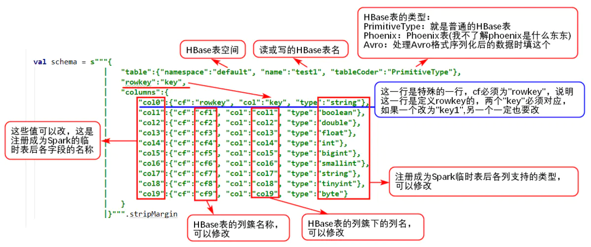

# spark读写HBase之使用hortonworks的开源框架shc（二）：入门案例
摘抄自：`https://www.jianshu.com/p/ab09eb36b32a`

shc测试环境的搭建参考：

[spark读写HBase之使用hortonworks的开源框架shc（一）：源码编译以及测试工程创建](https://www.jianshu.com/p/cddadb8b59c5 "spark读写HBase之使用hortonworks的开源框架shc（一）：源码编译以及测试工程创建")


读写HBase需要两个核心的元素：


* 用户描述数据结构的schema字符串    
* 与schema字符串相对应的实体类


## 1. 定义schema字符串


```bash
object Catalog {

  val schema = s"""{
                  |   "table":{"namespace":"default", "name":"test1", "tableCoder":"PrimitiveType"},
                  |   "rowkey":"key",
                  |   "columns":{
                  |       "col0":{"cf":"rowkey", "col":"key", "type":"string"},
                  |       "col1":{"cf":"cf1", "col":"col1", "type":"boolean"},
                  |       "col2":{"cf":"cf2", "col":"col2", "type":"double"},
                  |       "col3":{"cf":"cf3", "col":"col3", "type":"float"},
                  |       "col4":{"cf":"cf4", "col":"col4", "type":"int"},
                  |       "col5":{"cf":"cf5", "col":"col5", "type":"bigint"},
                  |       "col6":{"cf":"cf6", "col":"col6", "type":"smallint"},
                  |       "col7":{"cf":"cf7", "col":"col7", "type":"tinyint"},
                  |       "col8":{"cf":"cf8", "col":"col8", "type":"byte"}
                  |   }
                  |}""".stripMargin

}

```


schema字符串说明：





### 2. 定义与schema字符串对应的实体类


```kotlin
case class HBaseRecord(
      col0: String,  // sql: string
      col1: Boolean, // sql: boolean
      col2: Double, // sql: double
      col3: Float, // sql: float
      col4: Int, // sql: int
      col5: Long, // sql: bigint
      col6: Short, // sql: smallint
      col7: Byte, // sql: tinyint
      col8: Array[Byte]) // sql: byte

  object HBaseRecord {
    def apply(i: Int): HBaseRecord = {
      HBaseRecord(i + "",
        i % 2 == 0,
        i.toDouble,
        i.toFloat,
        i,
        i.toLong,
        i.toShort,
        i.toByte,
        (i + "").getBytes("UTF-8"))
    }
  }

```


### 3. 写数据到HBase表完整代码


```kotlin
import org.apache.spark.sql.SparkSession
import org.apache.spark.sql.execution.datasources.hbase.HBaseTableCatalog

/**
  * Author: YangYunhe
  * Description:
  * Create: 2018/8/17 12:54
  */
object WriteHBase {

  def main(args: Array[String]): Unit = {

    val spark = SparkSession.builder().appName("WriteHBase").getOrCreate()
    val sc = spark.sparkContext
    val sqlContext = spark.sqlContext
    import sqlContext.implicits._

    // 模拟一批数据
    val data = (0 to 9).map(HBaseRecord(_))

    // 写数据
    sc.parallelize(data)
      .toDF
      .write
      .options(Map(HBaseTableCatalog.tableCatalog -> Catalog.schema, HBaseTableCatalog.newTable -> "5"))
      .format("org.apache.spark.sql.execution.datasources.hbase")
      .save()

    spark.stop()

  }

}

```


说明：


```css
Map(HBaseTableCatalog.tableCatalog -> Catalog.schema, HBaseTableCatalog.newTable -> "5")

```


这个代码意味着HBase表是不存在的，也就是我们在schema字符串中定义的"test1"这个表不存在，程序帮我们自动创建，5是region的个数，如果你提前创建好了表，那么这里的代码是这样的：


```css
Map(HBaseTableCatalog.tableCatalog -> Catalog.schema)

```


当表存在的时候，数据会追加进去。


执行完以上程序后，检查一下hbase表中的内容：


```csharp
hbase(main):003:0> scan 'test1'
ROW                                         COLUMN+CELL
 0                                          column=cf1:col1, timestamp=1534732543615, value=\xFF
 0                                          column=cf2:col2, timestamp=1534732543615, value=\x00\x00\x00\x00\x00\x00\x00\x00
 0                                          column=cf3:col3, timestamp=1534732543615, value=\x00\x00\x00\x00
 0                                          column=cf4:col4, timestamp=1534732543615, value=\x00\x00\x00\x00
 0                                          column=cf5:col5, timestamp=1534732543615, value=\x00\x00\x00\x00\x00\x00\x00\x00
 0                                          column=cf6:col6, timestamp=1534732543615, value=\x00\x00
 0                                          column=cf7:col7, timestamp=1534732543615, value=\x00
 0                                          column=cf8:col8, timestamp=1534732543615, value=0
 1                                          column=cf1:col1, timestamp=1534732543615, value=\x00
 1                                          column=cf2:col2, timestamp=1534732543615, value=?\xF0\x00\x00\x00\x00\x00\x00
 ......

```


说明：程序本地执行会报以下错误


```jsx
java.lang.IllegalArgumentException: Pathname /C:/Users/bonc/AppData/Local/Temp/spark-9fa1e56c-ce87-43e8-a936-f947b62e1af5/outputDataset/.spark-staging-5
from C:/Users/bonc/AppData/Local/Temp/spark-9fa1e56c-ce87-43e8-a936-f947b62e1af5/outputDataset/.spark-staging-5 is not a valid DFS filename.

```


这是因为本地运行把临时文件夹创建在本地，而删除临时文件夹时认为这个文件夹是一个HDFS的路径，所以报错，这个错误不影响读写数据，当在集群上跑这个程序就不会报错


## 4. 从HBase表读数据完整代码


```dart
import org.apache.spark.sql.{DataFrame, SparkSession}
import org.apache.spark.sql.execution.datasources.hbase.HBaseTableCatalog

/**
  * Author: YangYunhe
  * Description:
  * Create: 2018/8/20 10:41
  */
object ReadHBase {

  def main(args: Array[String]): Unit = {

    val spark = SparkSession.builder().appName("ReadHBase").master("local").getOrCreate()
    val sc = spark.sparkContext
    val sqlContext = spark.sqlContext
    import sqlContext.implicits._

    val df: DataFrame = sqlContext
      .read
      .options(Map(HBaseTableCatalog.tableCatalog -> Catalog.schema))
      .format("org.apache.spark.sql.execution.datasources.hbase")
      .load()

    df.createOrReplaceTempView("test1")

    spark.sql("select * from test1").show()

    spark.stop()

  }

}


```


执行结果如下：


```ruby
+----+-----+----+----+----+----+----+----+----+
|col0| col1|col2|col3|col4|col5|col6|col7|col8|
+----+-----+----+----+----+----+----+----+----+
|   0| true| 0.0| 0.0|   0|   0|   0|   0|  48|
|   1|false| 1.0| 1.0|   1|   1|   1|   1|  49|
|   2| true| 2.0| 2.0|   2|   2|   2|   2|  50|
|   3|false| 3.0| 3.0|   3|   3|   3|   3|  51|
|   4| true| 4.0| 4.0|   4|   4|   4|   4|  52|
|   5|false| 5.0| 5.0|   5|   5|   5|   5|  53|
|   6| true| 6.0| 6.0|   6|   6|   6|   6|  54|
|   7|false| 7.0| 7.0|   7|   7|   7|   7|  55|
|   8| true| 8.0| 8.0|   8|   8|   8|   8|  56|
|   9|false| 9.0| 9.0|   9|   9|   9|   9|  57|
+----+-----+----+----+----+----+----+----+----+

```


我的博客即将搬运同步至腾讯云+社区，邀请大家一同入驻：[https://cloud.tencent.com/developer/support-plan?invite_code=1l56pocon0wmn](https://cloud.tencent.com/developer/support-plan?invite_code=1l56pocon0wmn "https://cloud.tencent.com/developer/support-plan?invite_code=1l56pocon0wmn")
