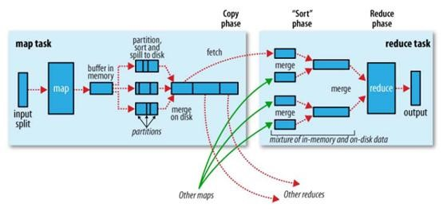
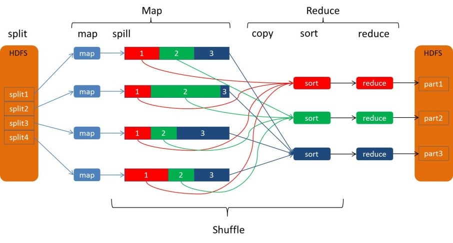
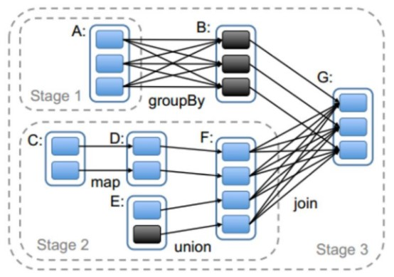
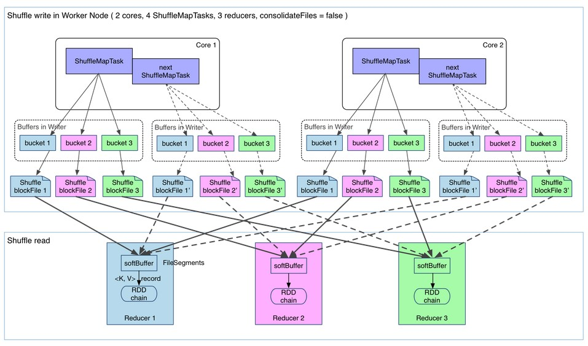
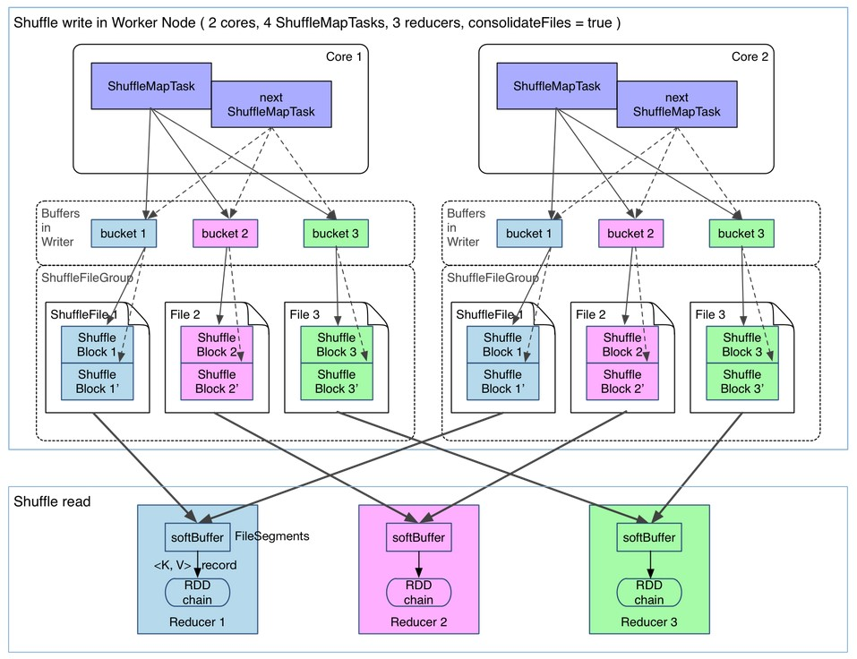
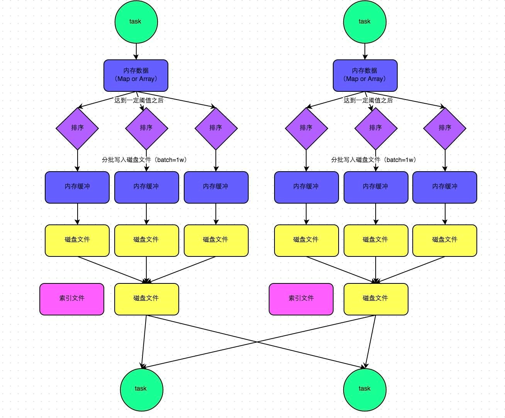
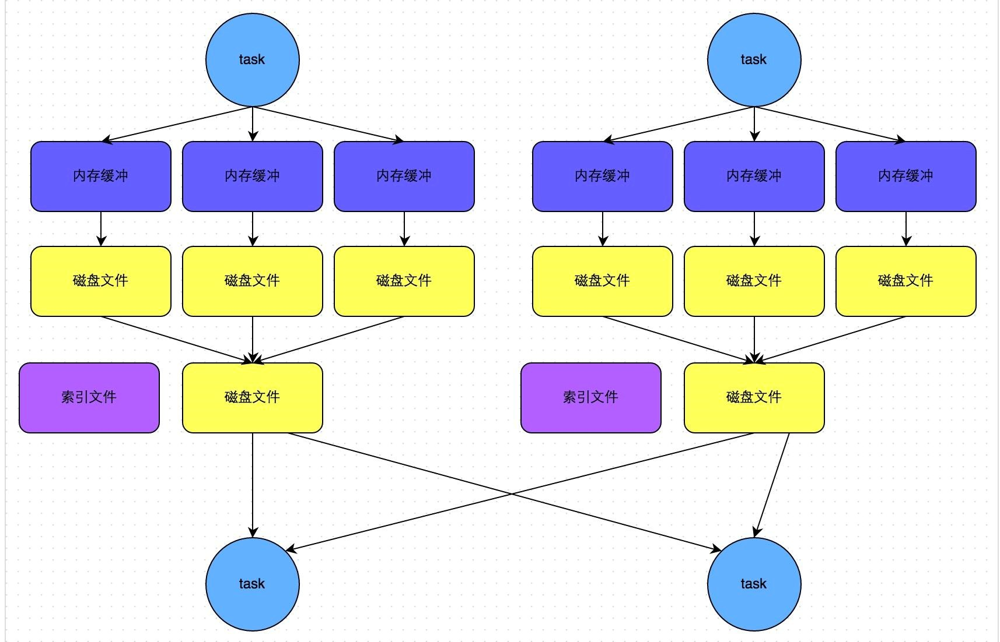

# MapReduce Shuffle 和 Spark Shuffle 原理概述
`https://www.cnblogs.com/xiaodf/p/10650921.html`

[toc]

## Shuffle简介
Shuffle的本意是洗牌、混洗的意思，把一组有规则的数据尽量打乱成无规则的数据。而在MapReduce中，Shuffle更像是洗牌的逆过程，指的是将map端的无规则输出按指定的规则“打乱”成具有一定规则的数据，以便reduce端接收处理。其在MapReduce中所处的工作阶段是map输出后到reduce接收前，具体可以分为map端和reduce端前后两个部分。

在shuffle之前，也就是在map阶段，MapReduce会对要处理的数据进行分片（split）操作，为每一个分片分配一个MapTask任务。接下来map会对每一个分片中的每一行数据进行处理得到键值对（key,value）此时得到的键值对又叫做“中间结果”。此后便进入reduce阶段，由此可以看出Shuffle阶段的作用是处理“中间结果”。

由于Shuffle涉及到了磁盘的读写和网络的传输，因此Shuffle性能的高低直接影响到了整个程序的运行效率。

## MapReduce Shuffle
Hadoop的核心思想是MapReduce，但shuffle又是MapReduce的核心。shuffle的主要工作是从Map结束到Reduce开始之间的过程。shuffle阶段又可以分为Map端的shuffle和Reduce端的shuffle。

### Map端的shuffle
下图是MapReduce Shuffle的官方流程：

因为频繁的磁盘I/O操作会严重的降低效率，因此“中间结果”不会立马写入磁盘，而是优先存储到map节点的“环形内存缓冲区”，在写入的过程中进行分区（partition），也就是对于每个键值对来说，都增加了一个partition属性值，然后连同键值对一起序列化成字节数组写入到缓冲区（缓冲区采用的就是字节数组，默认大小为100M）。

当写入的数据量达到预先设置的阙值后便会启动溢写出线程将缓冲区中的那部分数据溢出写（spill）到磁盘的临时文件中，并在写入前根据key进行排序（sort）和合并（combine，可选操作）。

溢出写过程按轮询方式将缓冲区中的内容写到mapreduce.cluster.local.dir属性指定的本地目录中。当整个map任务完成溢出写后，会对磁盘中这个map任务产生的所有临时文件（spill文件）进行归并（merge）操作生成最终的正式输出文件，此时的归并是将所有spill文件中的相同partition合并到一起，并对各个partition中的数据再进行一次排序（sort），生成key和对应的value-list，文件归并时，如果溢写文件数量超过参数min.num.spills.for.combine的值（默认为3）时，可以再次进行合并。

至此map端的工作已经全部结束，最终生成的文件也会存储在TaskTracker能够访问的位置。每个reduce task不间断的通过RPC从JobTracker那里获取map task是否完成的信息，如果得到的信息是map task已经完成，那么Shuffle的后半段开始启动。

### Reduce端的shuffle
当mapreduce任务提交后，reduce task就不断通过RPC从JobTracker那里获取map task是否完成的信息，如果获知某台TaskTracker上的map task执行完成，Shuffle的后半段过程就开始启动。Reduce端的shuffle主要包括三个阶段，copy、merge和reduce。

每个reduce task负责处理一个分区的文件，以下是reduce task的处理流程：

* reduce task从每个map task的结果文件中拉取对应分区的数据。因为数据在map阶段已经是分好区了，并且会有一个额外的索引文件记录每个分区的起始偏移量。所以reduce task取数的时候直接根据偏移量去拉取数据就ok。    
* reduce task从每个map task拉取分区数据的时候会进行再次合并，排序，按照自定义的reducer的逻辑代码去处理。    
* 最后就是Reduce过程了，在这个过程中产生了最终的输出结果，并将其写到HDFS上。  

### 为什么要排序
* key存在combine操作，排序之后相同的key放到一块显然方便做合并操作。    
* reduce task是按key去处理数据的。 如果没有排序那必须从所有数据中把当前相同key的所有value数据拿出来，然后进行reduce逻辑处理。显然每个key到这个逻辑都需要做一次全量数据扫描，影响性能，有了排序很方便的得到一个key对于的value集合。    
* reduce task按key去处理数据时，如果key按顺序排序，那么reduce task就按key顺序去读取，显然当读到的key是文件末尾的key那么就标志数据处理完毕。如果没有排序那还得有其他逻辑来记录哪些key处理完了，哪些key没有处理完。   

虽有千万种理由需要这么做，但是很耗资源，并且像排序其实我们有些业务并不需要排序。

### 为什么要文件合并
* 因为内存放不下就会溢写文件，就会发生多次溢写，形成很多小文件，如果不合并，显然会小文件泛滥，集群需要资源开销去管理这些小文件数据。    
* 任务去读取文件的数增多，打开的文件句柄数也会增多。    
* mapreduce是全局有序。单个文件有序，不代表全局有序，只有把小文件合并一起排序才会全局有序。  

## Spark的Shuffle
Spark的Shuffle是在MapReduce Shuffle基础上进行的调优。其实就是对排序、合并逻辑做了一些优化。在Spark中Shuffle write相当于MapReduce 的map，Shuffle read相当于MapReduce 的reduce。

Spark丰富了任务类型，有些任务之间数据流转不需要通过Shuffle，但是有些任务之间还是需要通过Shuffle来传递数据，比如宽依赖的group by key以及各种by key算子。宽依赖之间会划分stage，而Stage之间就是Shuffle，如下图中的stage1，stage2和stage3之间就会产生Shuffle。

在Spark的中，负责shuffle过程的执行、计算和处理的组件主要就是ShuffleManager，也即shuffle管理器。ShuffleManager随着Spark的发展有两种实现的方式，分别为HashShuffleManager和SortShuffleManager，因此spark的Shuffle有Hash Shuffle和Sort Shuffle两种。

### Spark Shuffle发展史
* Spark 0.8及以前 Hash Based Shuffle    
* Spark 0.8.1 为Hash Based Shuffle引入File Consolidation机制    
* Spark 0.9 引入ExternalAppendOnlyMap    
* Spark 1.1 引入Sort Based Shuffle，但默认仍为Hash Based Shuffle    
* Spark 1.2 默认的Shuffle方式改为Sort Based Shuffle    
* Spark 1.4 引入Tungsten-Sort Based Shuffle    
* Spark 1.6 Tungsten-sort并入Sort Based Shuffle    
* Spark 2.0 Hash Based Shuffle退出历史舞台  

在Spark的版本的发展，ShuffleManager在不断迭代，变得越来越先进。

在Spark 1.2以前，默认的shuffle计算引擎是HashShuffleManager。该ShuffleManager而HashShuffleManager有着一个非常严重的弊端，就是会产生大量的中间磁盘文件，进而由大量的磁盘IO操作影响了性能。因此在Spark 1.2以后的版本中，默认的ShuffleManager改成了SortShuffleManager。

SortShuffleManager相较于HashShuffleManager来说，有了一定的改进。主要就在于，每个Task在进行shuffle操作时，虽然也会产生较多的临时磁盘文件，但是最后会将所有的临时文件合并(merge)成一个磁盘文件，因此每个Task就只有一个磁盘文件。在下一个stage的shuffle read task拉取自己的数据时，只要根据索引读取每个磁盘文件中的部分数据即可。

ShuffleMapTask 如何决定数据被写到哪个缓冲区呢？这个就是跟partition算法有关系，这个分区算法可以是hash的，也可以是range的 ，也可以自定义。

### Hash Shuffle
HashShuffleManager的运行机制主要分成两种，一种是普通运行机制，另一种是合并的运行机制。合并机制主要是通过复用buffer来优化Shuffle过程中产生的小文件的数量。Hash shuffle是不具有排序的Shuffle。

#### 普通机制的Hash Shuffle
最开始使用的Hash Based Shuffle，每个Mapper会根据Reducer的数量创建对应的bucket，bucket的数量是M * R，M是map的数量，R是Reduce的数量。

如下图所示：2个core 4个map task 3 个reduce task，会产生4*3=12个小文件。

#### 优化后的Hash Shuffle
普通机制Hash Shuffle会产生大量的小文件(M * R），对文件系统的压力也很大，也不利于IO的吞吐量，后来做了优化（设置spark.shuffle.consolidateFiles=true开启，默认false），把在同一个core上的多个Mapper输出到同一个文件，这样文件数就变成core * R 个了。

如下图所示：2个core 4个map task 3 个reduce task，会产生2*3=6个小文件。

Hash shuffle合并机制的问题：

如果 Reducer 端的并行任务或者是数据分片过多的话则 Core * Reducer Task 依旧过大，也会产生很多小文件。进而引出了更优化的sort shuffle。

在Spark 1.2以后的版本中，默认的ShuffleManager改成了SortShuffleManager。

### Sort Shuffle
SortShuffleManager的运行机制主要分成两种，一种是普通运行机制，另一种是bypass运行机制。当shuffle read task(map task)的数量小于等于spark.shuffle.sort.bypassMergeThreshold参数的值时(默认为200)，就会启用bypass机制。

#### 普通机制的Sort Shuffle
这种机制和mapreduce差不多，在该模式下，数据会先写入一个内存数据结构中，此时根据不同的shuffle算子，可能选用不同的数据结构。如果是reduceByKey这种聚合类的shuffle算子，那么会选用Map数据结构，一边通过Map进行聚合，一边写入内存；如果是join这种普通的shuffle算子，那么会选用Array数据结构，直接写入内存。接着，每写一条数据进入内存数据结构之后，就会判断一下，是否达到了某个临界阈值。如果达到临界阈值的话，那么就会尝试将内存数据结构中的数据溢写到磁盘，然后清空内存数据结构。

在溢写到磁盘文件之前，会先根据key对内存数据结构中已有的数据进行排序。排序过后，会分批将数据写入磁盘文件。默认的batch数量是10000条，也就是说，排序好的数据，会以每批1万条数据的形式分批写入磁盘文件。

一个task将所有数据写入内存数据结构的过程中，会发生多次磁盘溢写操作，也会产生多个临时文件。最后会将之前所有的临时磁盘文件都进行合并，由于一个task就只对应一个磁盘文件因此还会单独写一份索引文件，其中标识了下游各个task的数据在文件中的start offset与end offset。

SortShuffleManager由于有一个磁盘文件merge的过程，因此大大减少了文件数量，由于每个task最终只有一个磁盘文件所以文件个数等于上游shuffle write个数。

#### bypass机制的Sort Shuffle

bypass运行机制的触发条件如下：

* 1)shuffle map task数量小于spark.shuffle.sort.bypassMergeThreshold参数的值，默认值200。    
* 2)不是聚合类的shuffle算子(比如reduceByKey)。  

此时task会为每个reduce端的task都创建一个临时磁盘文件，并将数据按key进行hash然后根据key的hash值，将key写入对应的磁盘文件之中。当然，写入磁盘文件时也是先写入内存缓冲，缓冲写满之后再溢写到磁盘文件的。最后，同样会将所有临时磁盘文件都合并成一个磁盘文件，并创建一个单独的索引文件。

该过程的磁盘写机制其实跟未经优化的HashShuffleManager是一模一样的，因为都要创建数量惊人的磁盘文件，只是在最后会做一个磁盘文件的合并而已。因此少量的最终磁盘文件，也让该机制相对未经优化的HashShuffleManager来说，shuffle read的性能会更好。

而该机制与普通SortShuffleManager运行机制的不同在于：

* 第一，磁盘写机制不同;    
* 第二，不会进行排序。也就是说，启用该机制的最大好处在于，shuffle write过程中，不需要进行数据的排序操作，也就节省掉了这部分的性能开销。  

### fetch与aggregate

#### 什么时候开始fetch数据?
当 parent stage 的所有ShuffleMapTasks结束后再fetch(**这里和MapReduce不同**). 理论上讲, 一个ShuffleMapTask结束后就可以fetch, 但是为了迎合 stage 的概念(即一个stage如果其parent stages没有执行完，自己是不能被提交执行的)，还是选择全部ShuffleMapTasks执行完再去 etch.因为fetch来的 FileSegments要先在内存做缓冲(默认48MB缓冲界限), 所以一次fetch的 FileSegments总大小不能太大. 一个 softBuffer里面一般包含多个 FileSegment,但如果某个FileSegment特别大的话, 这一个就可以填满甚至超过 softBuffer 的界限.

#### 边 fetch 边处理还是一次性 fetch 完再处理？
边 fetch 边处理.本质上,MapReduce shuffle阶段就是边fetch边使用 combine()进行处理,只是combine()处理的是部分数据. MapReduce为了让进入 reduce()的records有序, 必须等到全部数据都shuffle-sort后再开始 reduce(). 因为Spark不要求shuffle后的数据全局有序，因此没必要等到全部数据 shuffle完成后再处理. 

那么如何实现边shuffle边处理, 而且流入的records是无序的？答案是使用可以 aggregate 的数据结构, 比如 HashMap. 每从shuffle得到（从缓冲的 FileSegment中deserialize出来）一个 record, 直接将其放进 HashMap 里面.如果该HashMap已经存在相应的 Key. 那么直接进行 aggregate 也就是 func(hashMap.get(Key), Value).

#### Shuffle aggregate
shuffle read task拿到多个map产生的相同的key的数据后,需要对数据进行聚合,把相同key的数据放到一起,这个过程叫做aggregate.

task把读来的 records 被逐个 aggreagte 到 HashMap 中，等到所有 records 都进入 HashMap，就得到最后的处理结果。

### Spark Shuffle总结
Shuffle 过程本质上都是将 Map 端获得的数据使用分区器进行划分，并将数据发送给对应的 Reducer 的过程。

Shuffle作为处理连接map端和reduce端的枢纽，其shuffle的性能高低直接影响了整个程序的性能和吞吐量。map端的shuffle一般为shuffle的Write阶段，reduce端的shuffle一般为shuffle的read阶段。Hadoop和spark的shuffle在实现上面存在很大的不同，spark的shuffle分为两种实现，分别为HashShuffle和SortShuffle。

HashShuffle又分为普通机制和合并机制，普通机制因为其会产生MR个数的巨量磁盘小文件而产生大量性能低下的Io操作，从而性能较低，因为其巨量的磁盘小文件还可能导致OOM，HashShuffle的合并机制通过重复利用buffer从而将磁盘小文件的数量降低到CoreR个，但是当Reducer 端的并行任务或者是数据分片过多的时候，依然会产生大量的磁盘小文件。

SortShuffle也分为普通机制和bypass机制，普通机制在内存数据结构(默认为5M)完成排序，会产生2M个磁盘小文件。而当shuffle map task数量小于spark.shuffle.sort.bypassMergeThreshold参数的值。或者算子不是聚合类的shuffle算子(比如reduceByKey)的时候会触发SortShuffle的bypass机制，SortShuffle的bypass机制不会进行排序，极大的提高了其性能。

在Spark 1.2以前，默认的shuffle计算引擎是HashShuffleManager，因为HashShuffleManager会产生大量的磁盘小文件而性能低下，在Spark 1.2以后的版本中，默认的ShuffleManager改成了SortShuffleManager。

SortShuffleManager相较于HashShuffleManager来说，有了一定的改进。主要就在于，每个Task在进行shuffle操作时，虽然也会产生较多的临时磁盘文件，但是最后会将所有的临时文件合并(merge)成一个磁盘文件，因此每个Task就只有一个磁盘文件。在下一个stage的shuffle read task拉取自己的数据时，只要根据索引读取每个磁盘文件中的部分数据即可。

## Spark与MapReduce Shuffle的异同
* 从整体功能上看，两者并没有大的差别。 都是将 mapper（Spark 里是 ShuffleMapTask）的输出进行 partition，不同的 partition 送到不同的 reducer（Spark 里 reducer 可能是下一个 stage 里的 ShuffleMapTask，也可能是 ResultTask）。Reducer 以内存作缓冲区，边 shuffle 边 aggregate 数据，等到数据 aggregate 好以后进行 reduce（Spark 里可能是后续的一系列操作）。    
* 从流程的上看，两者差别不小。 Hadoop MapReduce 是 sort-based，进入 combine和 reduce的 records 必须先 sort。这样的好处在于 combine/reduce可以处理大规模的数据，因为其输入数据可以通过外排得到（mapper 对每段数据先做排序，reducer 的 shuffle 对排好序的每段数据做归并）。以前 Spark 默认选择的是 hash-based，通常使用 HashMap 来对 shuffle 来的数据进行合并，不会对数据进行提前排序。如果用户需要经过排序的数据，那么需要自己调用类似 sortByKey的操作。在Spark 1.2之后，sort-based变为默认的Shuffle实现。    
* 从流程实现角度来看，两者也有不少差别。 Hadoop MapReduce 将处理流程划分出明显的几个阶段：map, spill, merge, shuffle, sort, reduce等。每个阶段各司其职，可以按照过程式的编程思想来逐一实现每个阶段的功能。在 Spark 中，没有这样功能明确的阶段，只有不同的 stage 和一系列的 transformation，所以 spill, merge, aggregate 等操作需要蕴含在 transformation中。  

